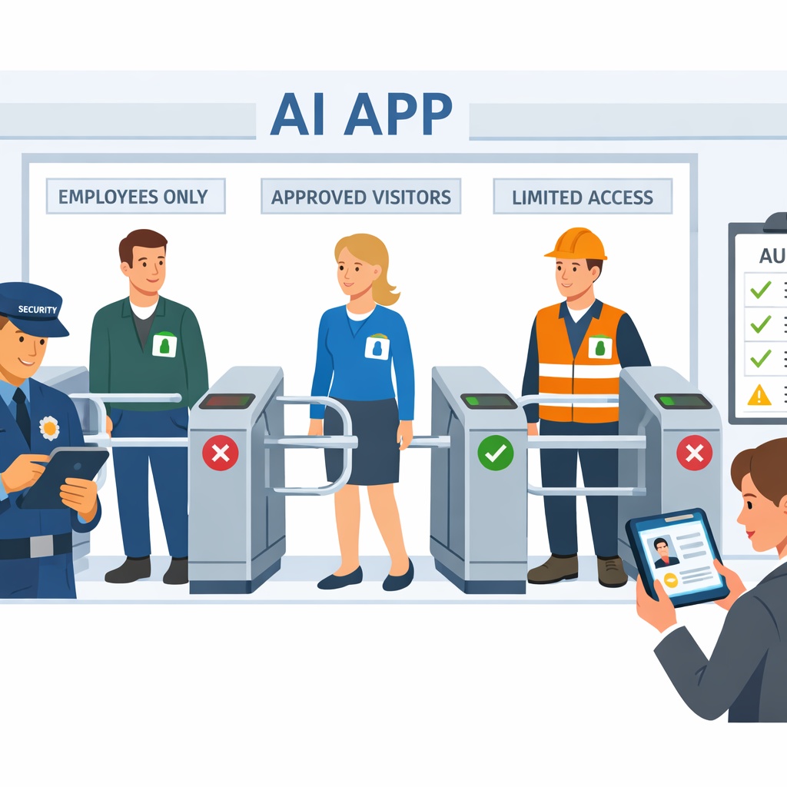
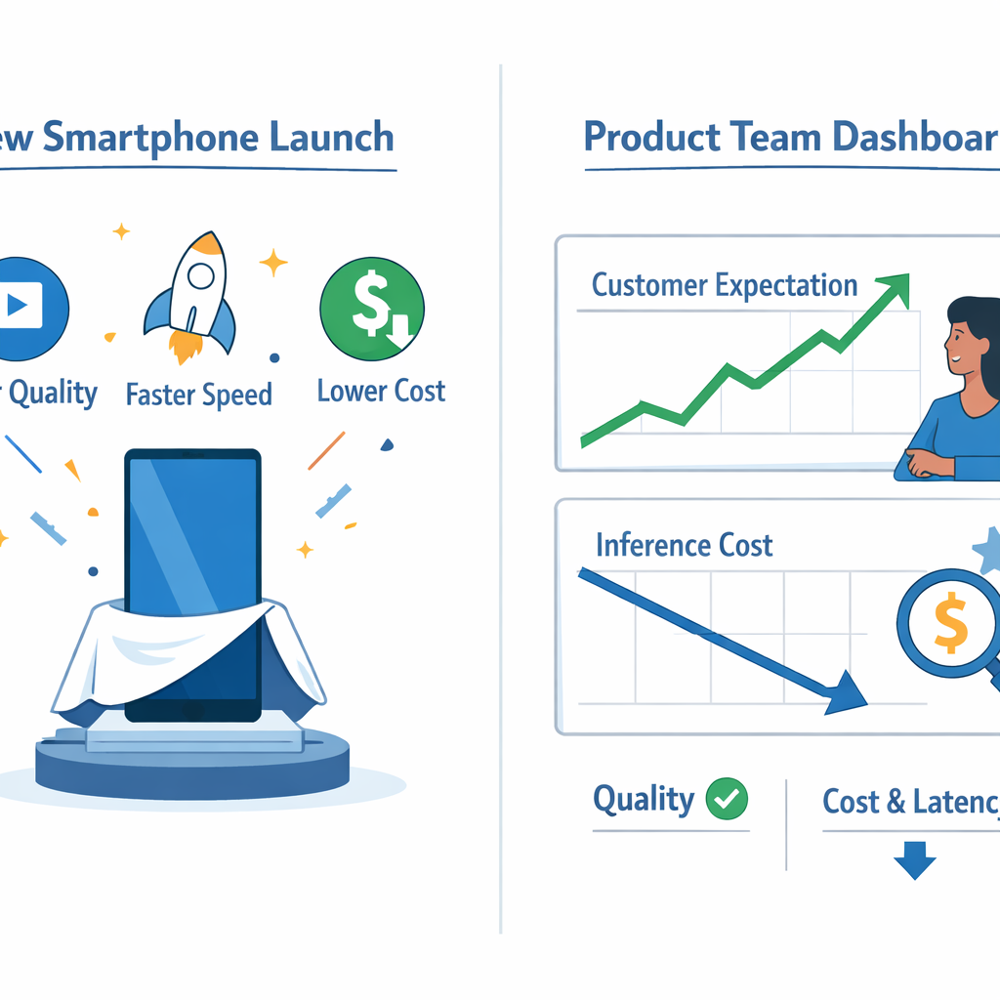
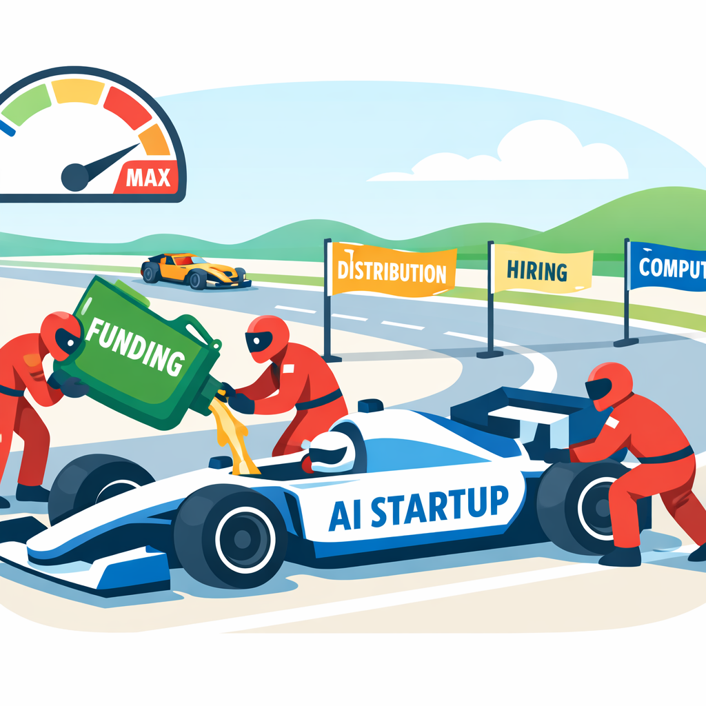

# AI in the Last 7 Days: What Product Managers Should Actually Pay Attention To

## What changed in AI this week and why PMs should care

Think of this week like a city where **new roads, new toll booths, and new startups** all opened at once. For PMs, the useful question is not “what launched?” but “what changes who can ship faster, safer, or cheaper?”

**The clearest signal is enterprise AI governance (rules for using AI safely inside companies).** Microsoft’s “Zero Trust for AI” push shows that security-conscious enterprises are treating AI access, data, and model usage as a product risk, not just an IT issue ([Source](https://www.microsoft.com/en-us/security/blog/2026/03/19/new-tools-and-guidance-announcing-zero-trust-for-ai/)). This affects your roadmap because buyer trust, procurement, and security review can now decide whether an AI feature ships on time.

**A second bucket is model and product momentum (new AI capabilities packaged for users).** The week’s briefings and launch chatter suggest the market is still crowded with “AI wrapper” noise, but the real product-enabling shifts are the ones that reduce setup time or remove workflow friction ([Source](https://radicaldatascience.wordpress.com/2026/03/19/ai-news-briefs-bulletin-board-for-march-2026/)). Think of AI-native launches like Userflow’s FlowAI Adoption Agent or Product Hunt listings such as Blitz and AONMeetings: these are best read as signals that teams want AI embedded into onboarding, content creation, and monetization flows ([Source](https://www.producthunt.com/products/userflow-2?utm_campaign=producthunt-api&utm_medium=api-v2&utm_source=Application%3A+Claude+MCP+Server+%28ID%3A+234160%29), [Source](https://www.producthunt.com/products/blitz-by-neuralway-ai?utm_campaign=producthunt-api&utm_medium=api-v2&utm_source=Application%3A+Claude+MCP+Server+%28ID%3A+234160%29), [Source](https://www.producthunt.com/products/aonmeetings?utm_campaign=producthunt-api&utm_medium=api-v2&utm_source=Application%3A+Claude+MCP+Server+%28ID%3A+234160%29)).

**The third signal is funding and M&A momentum (capital moving toward winners).** Crunchbase’s weekly funding roundup points to continued investor attention in AI-heavy categories, which often means faster competitor shipping and higher customer expectations ([Source](https://news.crunchbase.com/venture/biggest-funding-rounds-ai-robotics-ecommerce-quince/)). For product-led SaaS teams, that means the business trade-off is simple: wait and risk falling behind, or invest now in the AI feature set customers will soon consider standard.

> **💡 What this means for you as a PM**
> The biggest value here is knowing which AI changes should alter your roadmap this quarter, not just your reading list. Security-heavy buyers will push hardest on governance, AI platform teams will feel pressure to standardize and scale, and product-led SaaS companies will need to decide where AI is a core differentiator versus a nice-to-have. The rest of this roundup is best read through three lenses: adoption, differentiation, and risk.

## Microsoft’s Zero Trust for AI: what enterprise buyers will now expect

*Enterprise AI governance is becoming a buying criterion, not just an IT concern.*

Think of this like a **corporate visitor badge system**: even if someone can walk into the lobby, they still need the right badge, the right floor access, and a record of where they went. Microsoft’s **Zero Trust for AI** guidance (the idea that AI should be treated like any other high-risk enterprise system) adds a new AI pillar, a reference architecture (a blueprint for how to build it), and assessment tooling (checks that show whether controls are in place) ([Source](https://www.microsoft.com/en-us/security/blog/2026/03/19/new-tools-and-guidance-announcing-zero-trust-for-ai/)). That is a strong signal that **AI governance is becoming a standard buying criterion**, not a nice-to-have.

> **💡 What this means for you as a PM**
> If your AI product can’t pass security review, it may never reach the revenue it was built to generate. This affects your roadmap because enterprise-ready AI now needs access control (who can use it), auditability (what happened and when), data handling (how customer data is stored and used), and policy enforcement (rules that prevent unsafe behavior) as first-class features. The business trade-off is clear: shipping a flashy AI experience fast may win demos, but investing in controls is what unlocks larger customers, shorter procurement cycles, and higher ACV (annual contract value, or deal size).

For PMs, the **practical bar is rising**. A chatbot inside a CRM like Salesforce, a support copilot in Zendesk, or an internal knowledge assistant in Microsoft 365 will now be judged on whether it can prove data isolation, role-based access (different permissions for different users), logging, and admin controls. When this goes wrong, you’ll see it as stalled deals, endless security questionnaires, and legal redlines that drag launch timelines.

The move also changes **cross-functional planning**. PMs should coordinate early with security, legal, and platform teams so enterprise requirements land before sales promises do. This means your team can turn compliance work into a product advantage: package “security-ready AI” in messaging, use it in enterprise sales conversations, and position it as the reason a buyer can safely roll out at scale rather than run a pilot forever.

## Model and capability updates: what to watch in the March AI briefings

*Model updates matter when they change what customers expect, what you can ship, or what it costs.*

Think of model announcements like a **new smartphone launch**: even if you don’t buy it, customers immediately expect better cameras, longer battery life, and lower prices from everyone else. The March AI briefings flagged **OpenAI Sora changes, NVIDIA Nemotron 3 Super, MiniMax M2.7, and Olmo Hybrid** as the kind of updates that can reset those expectations ([AI News Briefs BULLETIN BOARD for March 2026](https://radicaldatascience.wordpress.com/2026/03/19/ai-news-briefs-bulletin-board-for-march-2026/)). In PM terms, **model news matters when it changes what you can ship, what it costs, or what customers now expect for free**.

**OpenAI Sora changes** matter if your roadmap touches video, creative generation, onboarding explainers, or ad workflows ([AI News Briefs BULLETIN BOARD for March 2026](https://radicaldatascience.wordpress.com/2026/03/19/ai-news-briefs-bulletin-board-for-march-2026/)). If the output quality jumps, your team can revisit whether a “good enough” draft feature becomes a customer-facing differentiator. If it doesn’t, don’t chase the headline—re-benchmark only when the new capability would remove a real product constraint.

**NVIDIA Nemotron 3 Super** signals a possible shift in the economics of running AI at scale ([AI News Briefs BULLETIN BOARD for March 2026](https://radicaldatascience.wordpress.com/2026/03/19/ai-news-briefs-bulletin-board-for-march-2026/)). This affects your roadmap because a lower infrastructure cost (the money spent to keep the service running) can make previously marginal features viable, like always-on assistants or heavier personalization. The business trade-off is simple: cheaper models can unlock more usage, but only if quality and latency (response speed) stay good enough for the customer experience.

**MiniMax M2.7 and Olmo Hybrid** are worth watching because they expand the menu of open-model options (models you can adapt or host with more control) and deployment trade-offs (choices about where and how the model runs) ([AI News Briefs BULLETIN BOARD for March 2026](https://radicaldatascience.wordpress.com/2026/03/19/ai-news-briefs-bulletin-board-for-march-2026/)). That matters for teams balancing speed, vendor lock-in, privacy, and cost. When this goes wrong, you’ll see it as a surprise bill, a blocked launch, or a competitor shipping the same feature with better economics.

> **💡 What this means for you as a PM**
> Model news matters when it changes what you can ship, what it costs, or what your customers now expect for free. Use it as a trigger to re-benchmark the features that matter most, not to rewrite the whole roadmap every week. If a new model improves your core customer outcome, it may justify reprioritizing use cases or re-evaluating vendors; if not, treat it as background noise.

## Funding and M&A: capital is a product signal

*Funding is a signal of where competitors may get faster and harder to beat.*

Think of funding like **fuel being poured into a race car**: the car doesn’t just go faster, it can hire a bigger pit crew, buy better parts, and stay on the track longer. In the Crunchbase recap of the week’s biggest funding rounds, the signal for PMs is that capital is clustering around the parts of AI where investors expect the next breakout products to live ([Source](https://news.crunchbase.com/venture/biggest-funding-rounds-ai-robotics-ecommerce-quince/)). That means **money is a map of where the market believes user demand, distribution, and defensibility are concentrating**.

Fresh capital changes product competition fast. A well-funded AI rival can **hire faster, spend more on compute (the expensive processing power behind AI features), and push into new channels and geographies** before your team’s next quarterly review. This affects your roadmap because a “watch list” competitor can turn into a launch risk overnight, especially in crowded categories like SEO automation or product adoption tools, where the bar is low to enter and high to retain.

> **💡 What this means for you as a PM**
> Following the money helps you anticipate which AI competitors will get faster, louder, and harder to beat. Use funding and M&A headlines to decide whether your team should build, buy, integrate, or differentiate around a space before it gets expensive. If capital is flowing into a category, ask whether it reflects real customer pain or just a crowded narrative; when those two don’t match, the business trade-off is wasted roadmap time.

The better PM move is to **separate hype from durable advantage**. Look for whether funding is tied to customer demand, distribution partnerships, or a clear wedge into existing workflows, not just “AI” branding. When money is flowing into products that already fit inside tools like Google Search, WhatsApp, or Salesforce-style workflows, the question is not “Should we copy this?” but “Where can we win with a sharper use case, better integration, or lower cost?”

## AI-native launches on Product Hunt: what early adopters are rewarding right now

Think of these launches like **a self-checkout lane, a seat reservation, and a store associate**, not a futuristic robot store. On Product Hunt, **AONMeetings**, **Blitz**, and **FlowAI Adoption Agent** are all packaging AI around a familiar job users already understand: run a webinar, publish pages that rank, or help customers finish a task. That matters because Product Hunt rewards products that feel immediately useful, not just technically impressive. ([AONMeetings](https://www.producthunt.com/products/aonmeetings?utm_campaign=producthunt-api&utm_medium=api-v2&utm_source=Application%3A+Claude+MCP+Server+%28ID%3A+234160%29), [Blitz](https://www.producthunt.com/products/blitz-by-neuralway-ai?utm_campaign=producthunt-api&utm_medium=api-v2&utm_source=Application%3A+Claude+MCP+Server+%28ID%3A+234160%29), [FlowAI Adoption Agent](https://www.producthunt.com/products/userflow-2?utm_campaign=producthunt-api&utm_medium=api-v2&utm_source=Application%3A+Claude+MCP+Server+%28ID%3A+234160%29))

The common winning pattern is **faster outcomes with less manual work**. AONMeetings positions itself around “unlimited webinars” with “zero surprise fees,” which signals pricing clarity as part of the product promise. Blitz sells “generate SEO pages that actually rank” in one click, which turns AI into a direct output machine instead of a chatbot. FlowAI Adoption Agent frames the value as converting “How do I?” questions into guided completion, which is a strong example of moving from assistance to action. ([AONMeetings](https://www.producthunt.com/products/aonmeetings?utm_campaign=producthunt-api&utm_medium=api-v2&utm_source=Application%3A+Claude+MCP+Server+%28ID%3A+234160%29), [Blitz](https://www.producthunt.com/products/blitz-by-neuralway-ai?utm_campaign=producthunt-api&utm_medium=api-v2&utm_source=Application%3A+Claude+MCP+Server+%28ID%3A+234160%29), [FlowAI Adoption Agent](https://www.producthunt.com/products/userflow-2?utm_campaign=producthunt-api&utm_medium=api-v2&utm_source=Application%3A+Claude+MCP+Server+%28ID%3A+234160%29))

The business models implied are **usage-led value, workflow expansion, and conversion uplift**. This means your team can test AI in a thin layer first: one high-friction workflow, one measurable outcome, one pricing hypothesis. For example, a ticketing product might add AI to draft event pages, not rebuild the whole platform. The business trade-off is that generic “assistant” features are easy to demo but hard to monetize; a painful, visible job-to-be-done is easier to sell and easier to measure. When this goes wrong, you’ll see it as weak activation, low repeat use, and customers treating AI as a novelty instead of a reason to buy.

## What PMs should do next: a 7-day AI response checklist

Think of this like **a fire drill for product decisions**: you’re not trying to rebuild the building, you’re checking exits, alarms, and who’s holding the keys. In a week where AI news can range from security guidance to new launchy tools like guided onboarding and SEO automation ([Microsoft](https://www.microsoft.com/en-us/security/blog/2026/03/19/new-tools-and-guidance-announcing-zero-trust-for-ai/), [Product Hunt](https://www.producthunt.com/products/userflow-2?utm_campaign=producthunt-api&utm_medium=api-v2&utm_source=Application%3A+Claude+MCP+Server+%28ID%3A+234160%29), [Product Hunt](https://www.producthunt.com/products/blitz-by-neuralway-ai?utm_campaign=producthunt-api&utm_medium=api-v2&utm_source=Application%3A+Claude+MCP+Server+%28ID%3A+234160%29)), the business trade-off is speed versus noise.

Start with a **15-minute triage**: does this matter to your customers, revenue, security, or cost? If the answer is “yes” on at least one of those, assign an owner and decide whether to **build, buy, or watch**. This means your team can avoid roadmapping every shiny capability while still moving fast on the ones that affect retention or enterprise trust.

> **💡 What this means for you as a PM**
> A good PM response to AI news is a disciplined decision process, not a reaction spiral. Brief leadership in one slide: what happened, who it affects, what you recommend, and what you are not doing yet. Pull in **security** for trust or data-handling changes, **legal** for policy or claims risk, **sales** for customer-facing pressure, **design** for workflow changes, and **platform** when adoption could touch core product infrastructure.

Run a **lightweight experiment** before you fund a roadmap item: test with a small customer cohort, compare conversion or time-saved against the current flow, and set a clear stop/go threshold. When this goes wrong, you’ll see it as wasted build time, surprise support load, or a feature that demos well but doesn’t change behavior.

Use one simple rule: **change strategy only when the news shifts customer expectations, competitive position, or risk posture**. If it does not move one of those three, monitor it, document it, and keep shipping.

---

## 📚 Further Reading

The following sources were retrieved and used during research for this blog. All links are verified — none are invented.

1. **[New tools and guidance: Announcing Zero Trust for AI](https://www.microsoft.com/en-us/security/blog/2026/03/19/new-tools-and-guidance-announcing-zero-trust-for-ai/)** · *Microsoft Security Blog* · 2026-03-19
   > Microsoft introduces Zero Trust for AI, with a new AI pillar, updated reference architecture, guidance, and assessment tool....

2. **[AI News Briefs BULLETIN BOARD for March 2026](https://radicaldatascience.wordpress.com/2026/03/19/ai-news-briefs-bulletin-board-for-march-2026/)** · *Radical Data Science* · 2026-03-19
   > March AI briefs include OpenAI Sora changes, NVIDIA Nemotron 3 Super, MiniMax M2.7, and Olmo Hybrid....

3. **[The Week's 10 Biggest Funding Rounds: AI, Robotics And E ...](https://news.crunchbase.com/venture/biggest-funding-rounds-ai-robotics-ecommerce-quince/)** · *Crunchbase News* · 2026-03-25
   > Crunchbase recap includes OpenAI M&A activity and other major funding rounds from March 2026....

4. **[[Product Hunt] AONMeetings - Unlimited webinars, zero surprise fees](https://www.producthunt.com/products/aonmeetings?utm_campaign=producthunt-api&utm_medium=api-v2&utm_source=Application%3A+Claude+MCP+Server+%28ID%3A+234160%29)** · *Product Hunt* · 2026-03-26
   > Product Hunt launch featuring AI summaries, HD video, and HIPAA-grade security in a webinar platform....

5. **[[Product Hunt] Blitz by neuralway.ai - Generate SEO pages that actually rank. One click.](https://www.producthunt.com/products/blitz-by-neuralway-ai?utm_campaign=producthunt-api&utm_medium=api-v2&utm_source=Application%3A+Claude+MCP+Server+%28ID%3A+234160%29)** · *Product Hunt* · 2026-03-26
   > Product Hunt launch for programmatic SEO infrastructure that generates and hosts ranking pages....

6. **[[Product Hunt] FlowAI Adoption Agent by Userflow - Turn "How do I?" questions into guided product completion](https://www.producthunt.com/products/userflow-2?utm_campaign=producthunt-api&utm_medium=api-v2&utm_source=Application%3A+Claude+MCP+Server+%28ID%3A+234160%29)** · *Product Hunt* · 2026-03-26
   > Product Hunt launch for an in-product AI adoption agent that guides users to task completion....

