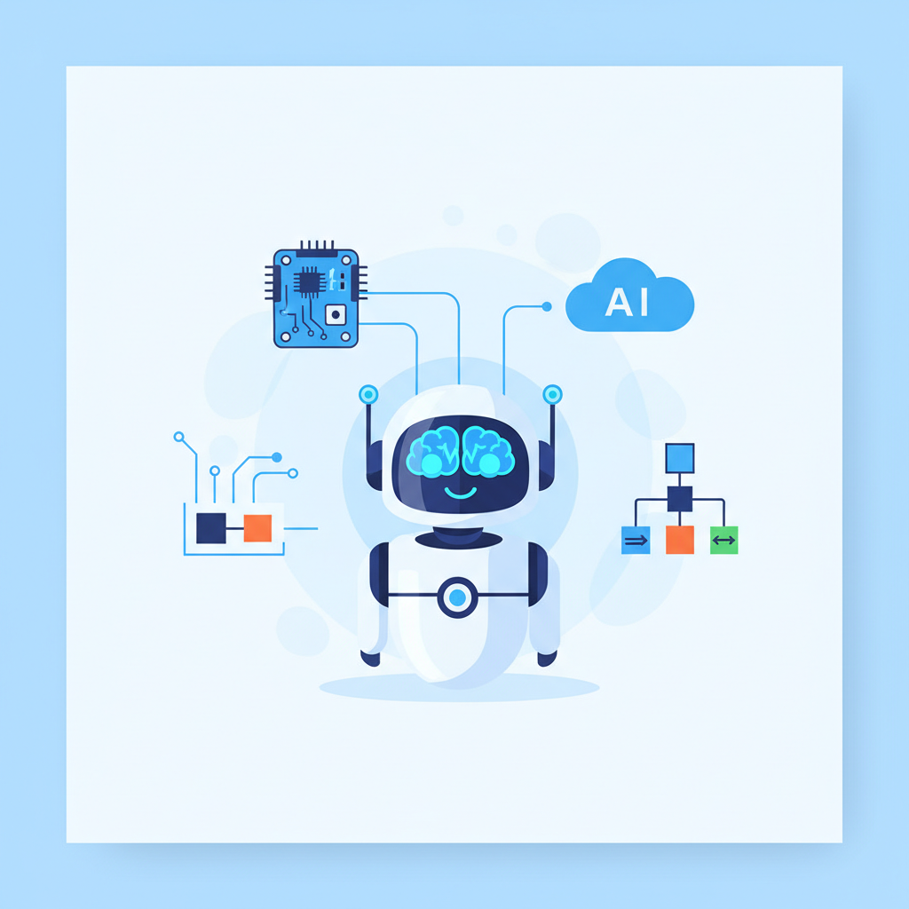
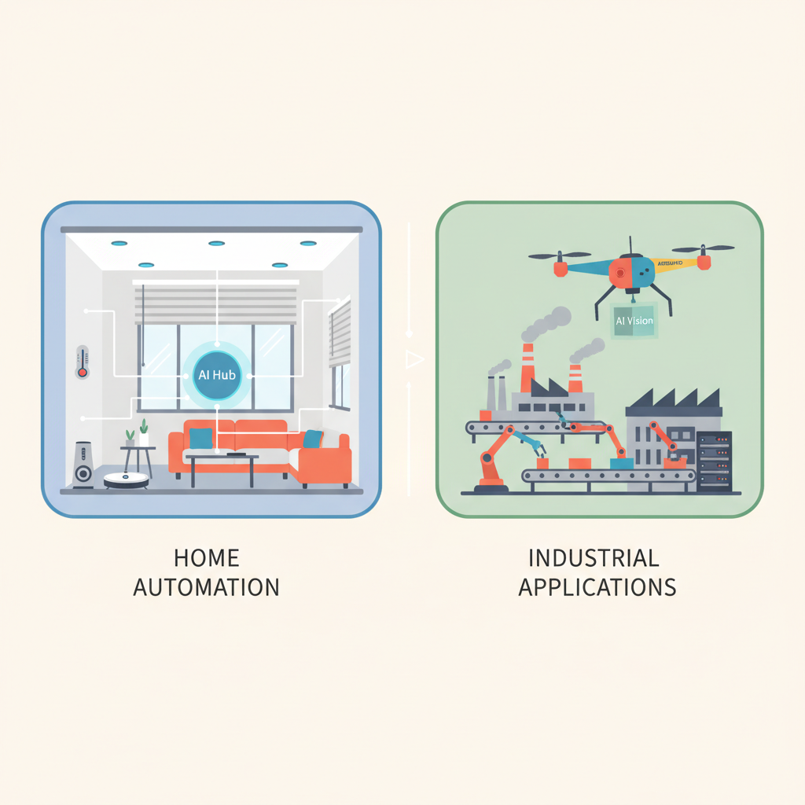
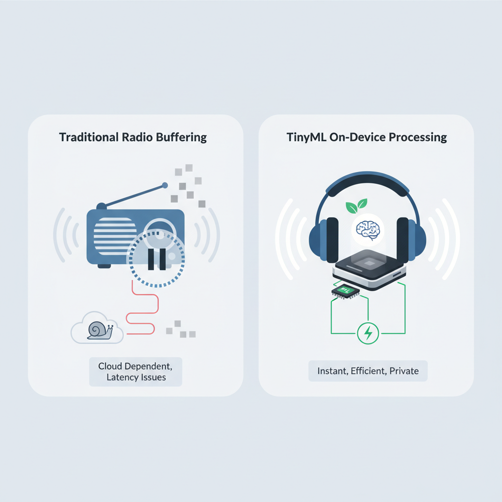

# Bridging the Gap: How AI is Making Arduino and ESP32 Robotics Intelligent

## Introduction to AI in Robotics

*An illustration showing a robot with a brain, symbolizing the concept of AI empowering robotics for intelligence and autonomy.*

**Imagine giving your robot a brain**—that's the essence of AI (artificial intelligence) in robotics. Just like a person who learns from experience to make better decisions, AI empowers robots to analyze data and adapt their actions accordingly, enhancing their overall intelligence.

Microcontrollers like Arduino and ESP32 serve as the **nervous system for these smart robots**. They provide the necessary framework to implement AI algorithms, enabling developers to create applications that can recognize patterns, interpret voice commands, or avoid obstacles. For instance, projects showcasing the ESP32 have integrated AI technologies to craft intelligent home automation systems and responsive drones, illustrating a tremendous leap in what hardware can achieve.

**Integrating AI with hardware opens the door to improved functionality and efficiency.** As these platforms get smarter, your product offerings can incorporate advanced features that meet evolving customer demands. This means cutting-edge solutions that aren't just responsive, but capable of autonomous decision-making. 

> **💡 What this means for you as a PM**
> Understanding AI's role in hardware helps you identify new product opportunities for smarter solutions. This integration affects your roadmap by positioning your offerings at the forefront of innovation, presenting a chance to differentiate your product in a competitive space.

## Real-World Applications of AI and Robotics

*Illustration of smart home automation devices and Arduino drones in a landscape, visualizing the use of AI in everyday applications.*

Imagine having a smart home that knows when to turn on the lights or alter the thermostat based on your habits. **This is the power of AI (Artificial Intelligence) in robotics**, specifically using platforms like ESP32 (a low-cost microcontroller with built-in Wi-Fi capabilities). One standout application includes AI-powered sensors that automate home environments, learning from user behavior to optimize energy consumption and enhance comfort ([Source](https://www.dfrobot.com/blog-13902.html?srsltid=AfmBOorCZBUjF6sVOiTWxy6cWrerueXxjcFf27_62o_0Adkkc3wycjFE)). 

Meanwhile, Arduino, another robust platform, is being harnessed for various robotic tasks, such as surveillance and inventory management. For instance, companies are deploying Arduino-based drones to monitor factory floors, offering substantial productivity gains through real-time data collection and analysis. By effectively managing inventory through automated stock tracking, businesses can reduce human error and improve efficiency ([Source](https://keyirobot.com/blogs/buying-guide/ai-in-robotics-applications-10-real-world-examples-changing-industries-today?srsltid=AfmBOor_OCSVCIcDpm3WM5orGKTDUc2LCLyZRTHnERVXgfRacxKaQ3Xq)).

**Integrating AI algorithms enhances the intelligence of these devices**, allowing them to adapt dynamically to their environments. For example, an ESP32 can utilize machine learning models to predict and respond to user preferences, creating a truly responsive home automation system ([Source](https://thinkrobotics.com/blogs/learn/ai-and-robotics-integration-technologies-driving-the-future?srsltid=AfmBOooOGedHqFlSIWvNLIqnCfZr_wM9Ua_-tFt4IbCmskFRet-Fa9OG)). Such advancements not only streamline operations but also unlock new revenue streams by creating compelling, user-centric experiences.

> **💡 What this means for you as a PM**
> These real-world applications reveal how integrating AI can lead to increased efficiency and new revenue streams. As you consider product roadmap decisions, think about the potential for utilizing AI in existing projects or exploring new avenues like smart home devices or automated systems that can improve operational performance.

## The Role of TinyML in Making Hardware Intelligent

*Illustration of a device processing data locally with TinyML, highlighting speed and privacy.*

Imagine trying to listen to music on a radio, but it’s stuck buffering every few seconds. **TinyML** (Tiny Machine Learning) is like giving that radio a small, powerful set of headphones that allow it to process tunes locally without interruptions. This means that devices, particularly low-power microcontrollers like the **ESP32**, can run machine learning models directly on the hardware, making decisions without needing to rely on a distant server.

Utilizing TinyML enables **data to be processed onsite**. By keeping data local, it reduces latency, allowing devices to respond more quickly to real-time inputs. For instance, smart home sensors equipped with TinyML can analyze movements and adjust temperatures instantly, enhancing the user experience significantly. This capability also translates into improved **privacy**, as personal data doesn’t have to be sent to the cloud for processing.

The **business cost implications** are noteworthy. By adopting TinyML, your company can save on server costs due to decreased reliance on external computing resources. On-device decision-making means lower energy costs and a potentially longer lifespan for devices. This could also allow you to offer innovative features with lower overhead, directly impacting your roadmap and budget planning.

> **💡 What this means for you as a PM**  
> Utilizing TinyML allows your products to be more efficient, potentially cutting costs and improving data security. When your devices can process data locally, you can further decrease the risk of data breaches while enhancing user experience.

For example, companies using the ESP32 with TinyML are already leading the charge in creating smart agricultural devices that respond immediately to changing environmental conditions, utilizing fewer resources while maximizing yield ([Source](https://www.dfrobot.com/blog-13902.html?srsltid=AfmBOorCZBUjF6sVOiTWxy6cWrerueXxjcFf27_62o_0Adkkc3wycjFE)).

## Challenges in Implementing AI with Arduino and ESP32

Think of integrating AI with Arduino and ESP32 like trying to fit a gourmet meal into a food truck kitchen — the space is limited, and you need to manage your resources wisely to deliver a satisfying dish. **The limitations of hardware capabilities** (the processing power and memory of devices like Arduino and ESP32) can greatly impact AI model performance. Product managers must **set realistic expectations** for what these platforms can achieve, as overly ambitious goals can lead to frustration and project delays.

Another significant challenge is the **skills gap** in many product teams regarding AI understanding. Not every team member has the necessary expertise in AI integrations, meaning PMs might have to invest in **training or hiring specialists**. This additional resource allocation can influence timelines and budgets, so it’s crucial to evaluate your team's current skill levels and identify any necessary training programs early.

Lastly, there's a delicate balance between **computational efficiency and model complexity**. Simpler models may execute faster but could lack the accuracy needed for certain tasks, while complex models might require more computing power than what the Arduino or ESP32 can handle. This trade-off means decision-making is vital to ensure the models chosen fit the **optimal use cases** for your product’s goals.

> **💡 What this means for you as a PM**  
> Recognizing these challenges empowers product managers to plan for resource allocation and team training effectively. Understanding the hardware limitations helps shape realistic project timelines, while recognizing the skills gap informs hiring and training decisions. Ultimately, being aware of these factors can enhance project outcomes and team efficiency.

## The Future of AI in Robotics and Hardware Development

**Imagine AI as a trainer for robotics, pushing them to become more capable and responsive with every interaction.** Just like athletes improve with better gear and coaching, robotics will evolve with advancements in sensor technologies and faster processors. Emerging technologies are set to amplify AI capabilities, enabling robots to interpret their environments more accurately and react in real-time.

**Market demands will dictate a shift towards smarter hardware solutions.** As businesses seek more efficient automation and enhanced user experiences, products that integrate AI with robotics will become essential. Companies like Amazon and Tesla are leading the charge, using AI to revolutionize fulfillment and manufacturing, thus raising customer expectations.

**It’s crucial for product managers to stay informed about AI advancements.** This knowledge equips you to make strategic decisions for product roadmaps and investment opportunities. By keeping an eye on trends like TinyML or advanced robotics applications, you position your product line as innovative and competitive.

> **💡 What this means for you as a PM**
> Staying ahead of future trends in AI and robotics will position your product line as innovative and competitive. Understanding these developments allows for informed decisions on resource allocation and market positioning, reducing risk and enhancing customer satisfaction.

---

## 📚 Further Reading

The following sources were retrieved and used during research for this blog. All links are verified — none are invented.

1. **[6 Popular ESP32 AI Applications Using TinyML in 2024](https://www.dfrobot.com/blog-13902.html?srsltid=AfmBOorCZBUjF6sVOiTWxy6cWrerueXxjcFf27_62o_0Adkkc3wycjFE)** · *DFRobot*
   > Explore popular TinyML applications powered by the ESP32, showcasing practical implementations that demonstrate the transformative potential of these technologies....

2. **[Top 10 ESP32 IoT Projects You Can Build in 2026](https://iotbeat.com/blog/top-10-esp32-iot-projects-you-can-build-in-2026)** · *IoT Beat*
   > Step-by-step projects with ESP32 covering various IoT applications from home automation to game controllers....

3. **[AI and Robotics Integration: Technologies Driving the Future](https://thinkrobotics.com/blogs/learn/ai-and-robotics-integration-technologies-driving-the-future?srsltid=AfmBOooOGedHqFlSIWvNLIqnCfZr_wM9Ua_-tFt4IbCmskFRet-Fa9OG)** · *Think Robotics*
   > The article highlights how AI is transforming the capabilities of robotics, making systems adaptive and enhancing operational efficiency....

4. **[AI in Robotics Applications: 10 Industry Examples](https://keyirobot.com/blogs/buying-guide/ai-in-robotics-applications-10-real-world-examples-changing-industries-today?srsltid=AfmBOor_OCSVCIcDpm3WM5orGKTDUc2LCLyZRTHnERVXgfRacxKaQ3Xq)** · *KeyIrobot*
   > Examines various real-world applications of AI-powered robotics that enhance productivity and efficiency across industries....

5. **[Best Robotics AI Libraries in 2026: Top 10 Picks](https://brightdata.com/blog/ai/best-robotics-ai-libraries)** · *Bright Data*
   > A review of the top AI libraries for robotics development focusing on tools that support simulation, learning, and deployment....

6. **[AI and Robotics Integration: Technologies Driving the Future](https://thinkrobotics.com/blogs/learn/ai-in-robotics-integration-technologies-driving-the-future?srsltid=AfmBOooOGedHqFlSIWvNLIqnCfZr_wM9Ua_-tFt4IbCmskFRet-Fa9OG)** · *Think Robotics*
   > Explores how AI technologies are revolutionizing the robotics field by enhancing capabilities, adaptability, and efficiency....

7. **[AI in Robotics: 6 Groundbreaking Applications](https://www.v7labs.com/blog/ai-in-robotics)** · *V7 Labs*
   > Discusses key applications of AI in robotics, showcasing innovative solutions and industry impacts....

8. **[The Role of Robotics & AI in Automating Production Processes.](https://rapidpro.com/the-role-of-robotics-and-ai-in-automating-production-processes/)** · *RapidPro*
   > Discusses the impact of AI in automating production, improving quality control, and enhancing product customization....

