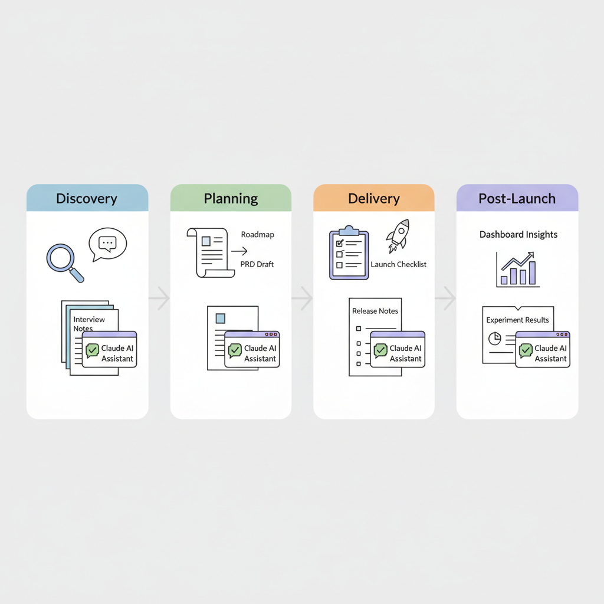
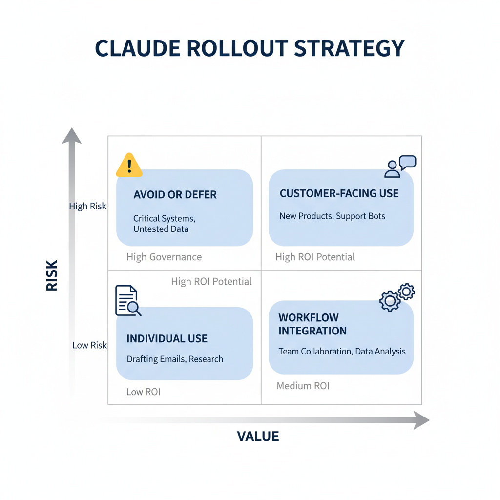

# Claude and Its Use Cases: What Product Managers Need to Know

## What Claude is and where it fits in a PM’s toolkit

Think of **Claude like a very fast product analyst and writing partner** sitting next to you during the workday. It can help turn messy inputs into cleaner outputs: a rough meeting transcript into notes, a pile of customer feedback into themes, or a scattered set of ideas into a first-draft PRD (product requirements document, or a written plan for what to build and why).

In practical PM terms, **Claude is strongest in drafting, synthesis, analysis, and decision support**. That means your team can use it to draft release notes, summarize user research, rewrite exec updates, compare options, or turn a brainstorming session into a sharper recommendation. It maps well to common PM artifacts (the documents and outputs PMs create), including PRDs, meeting notes, research summaries, launch plans, and status updates.

The important boundary is **speed, not authority**. Claude can accelerate repetitive knowledge work, but it should not replace product judgment, stakeholder alignment, or strategy decisions that depend on context, politics, or trade-offs. When the work is high-risk — like pricing changes, launch messaging, or a roadmap decision with major revenue impact — use Claude to prepare the thinking, then have humans make the call.

**The business trade-off is simple:** use Claude when you want faster first drafts, better synthesis, and less time spent on routine writing; stay human-first when accuracy, nuance, or accountability matters most. This means your team can ship faster on the “paperwork” of product management, while keeping core product thinking where it belongs: with the people responsible for outcomes.

## High-Value PM Use Cases Across the Product Lifecycle

Think of Claude like **a very fast product analyst and writer on your team**: it can read a pile of notes, spot patterns, and turn them into something a PM can use. For product teams, that matters because the bottleneck is often not data collection — it’s turning messy inputs into decisions.

*Claude can support different PM stages, from customer feedback synthesis to launch comms and post-launch analysis.*

**In discovery, Claude can turn raw customer signal into themes.** A PM can drop in interview notes, support tickets, or survey comments and ask for clustering into recurring pain points, feature requests, and opportunity areas. Instead of spending half a day building a spreadsheet of quotes, your team can move faster on “what problem are we actually solving?” and get to sharper prioritization.

**In planning, it helps compress the ugly middle of product thinking.** Claude can draft a PRD (product requirements doc, or the written plan for what a product should do), outline edge cases (unusual but important situations that can break a flow), and generate assumptions and risks (the things that could make the plan fail). It can also produce stakeholder memos (decision summaries for leaders) that make trade-offs clearer, which is useful when you need alignment from design, engineering, sales, and support.

**In delivery, Claude is strongest as a translation layer.** It can convert product intent into acceptance criteria (clear conditions that define “done”), release notes (customer-facing updates), FAQ drafts (frequently asked questions), and internal launch comms (team updates about what is shipping and why). This means your team can spend less time rewriting the same message for different audiences and more time checking whether the experience is actually ready.

**After launch, Claude can help close the loop faster.** It can summarize experiment readouts (results from A/B tests or other product experiments), pull insights from support conversations, and turn recurring issues into roadmap inputs (signals that should influence future priorities). For example, a team like Uber or Spotify could use this to quickly convert customer complaints and usage patterns into a clearer next-step plan.

> **💡 What this means for you as a PM**
> Claude creates the biggest value when it removes analysis bottlenecks that slow down product decisions. The business trade-off is that you can move faster on synthesis and communication, but you still need human judgment for prioritization and strategy. If your team spends too much time rewriting, summarizing, or reconciling inputs, Claude can free PMs to focus on the decisions only they can make.

## How PMs at Anthropic use Claude in real work

Think of Claude like a **very fast analyst sitting next to the PM team**—one that can pull together data, draft evaluations, and help spot patterns without waiting on a long ops queue. In a reported Anthropic product management workflow, PMs use Claude to query product data and build evaluations in minutes, instead of spending much of that time coordinating across tools and people ([How Anthropic uses Claude in Product Management](https://www.youtube.com/watch?v=91AJ0cpgLlQ)). **The business value is speed to decision**: less time moving between dashboards, docs, and Slack, and more time on interpretation, prioritization, and action.

*Internal dogfooding shows how Claude can reduce coordination overhead and speed up decisions.*

This matters because **the first wins from AI inside a product org are often not flashy customer features**. They show up as faster analysis, lighter coordination, and better operational throughput, which is especially valuable when a team is shipping quickly and needs tighter feedback loops. When this goes wrong, you'll see it as stalled launches, slow experiment readouts, and PMs spending too much time on manual coordination instead of product judgment.

> **💡 What this means for you as a PM**
> Seeing Anthropic use Claude internally shows PMs where AI can cut coordination overhead and speed up product iteration. If your team is still moving data through spreadsheets, ad hoc analysis, and repeated status checks, Claude may be more valuable as an internal decision-support layer than as a customer-facing feature at first. This affects your roadmap because the fastest ROI may come from analytics, research synthesis, or launch operations before you invest in broader user-facing rollout.

A useful product lesson is that **dogfooding (using your own product internally)** helps you find both the opportunity and the limits before customers do ([Anthropic Academy: Claude API Development Guide](https://www.anthropic.com/learn/build-with-claude?use_case=ea)). Internal use can expose trust requirements, quality gaps, and workflow friction in a lower-risk setting. **That makes adoption safer**: teams can learn where Claude is strong enough to accelerate work and where it still needs guardrails.

For other product teams, the likely first use cases look similar: **analytics, research synthesis, and launch operations**. A consumer PM at Spotify might use Claude to summarize user feedback themes; a marketplace PM at Uber might use it to draft experiment readouts; a growth PM at Amazon might use it to turn campaign results into next-step recommendations. The common pattern is not replacing product thinking—it is **removing the manual work that slows product thinking down**.

## Where Claude’s technical strengths matter to product decisions

Think of Claude like **a very capable executive assistant who can read a whole project brief, remember the details, and draft the next three follow-ups without losing the thread**. For PMs, that matters most in document-heavy work like PRDs, customer feedback synthesis, support analysis, and cross-functional planning, where the real cost is not writing a paragraph but keeping context across many steps and many stakeholders. In practice, **long context (the amount of information the model can consider at once) and strong synthesis quality (the ability to turn messy input into a clear summary or recommendation)** are what make Claude feel useful in product workflows rather than just “chatty.”  

> **💡 What this means for you as a PM**  
> Understanding Claude’s capabilities helps you choose the right AI workflow before you commit roadmap, budget, and team time. If your team spends hours reconciling docs, meeting notes, and Slack threads, Claude can reduce handoff friction and speed up decisions. If the task is narrow and repetitive, a simpler workflow or smaller model may be cheaper and easier to govern.

**The biggest business benefit is end-to-end task completion.** Claude’s agent-style behavior (the ability to take a goal, use tools, and keep working through steps) and tool use (connecting the model to external systems like docs, tickets, or databases) can turn a “human glue” process into something more automated. A PM might use this to move from manually copying feedback into a spreadsheet, to having an internal assistant summarize themes, draft an issue brief, and create a Jira ticket for review. That means your team can spend less time on coordination and more time on judgment, but it also means **you need clear guardrails** so the model does not take action where a human decision is still required.

Claude’s API (the programmatic way to call the model from your product), MCP (a standard for connecting models to external tools and data), and Claude Code (a coding-oriented assistant) expand the kinds of products and prototypes PM teams can imagine. For example, you could prototype an internal assistant for customer support triage, a workflow that turns sales calls into product insights, or a lightweight automation that drafts release notes from merged tickets. **This affects your roadmap because it lowers the effort to test “AI in the workflow” ideas before a full build**, but it also raises the bar for prompt design (how you instruct the model), evaluation (how you check quality), and rollout complexity (how you introduce it safely).

The trade-off is **capability versus governance**. The more Claude is asked to reason across long documents, call tools, or trigger actions, the more you need review steps, permissions, and success metrics tied to business outcomes like cycle time, deflection rate, or analyst hours saved. Claude is most differentiated when the user value depends on deep context, strong writing, or multi-step completion; a simpler workflow or smaller model is often enough for FAQ chat, basic text rewriting, or one-off summaries where speed and cost matter more than depth.

## Business impact, cost, and ROI: when Claude is worth it

Think of Claude like **adding a very fast junior analyst to the team**—not to replace judgment, but to clear repetitive work that slows everyone down. The ROI question is simple: **does the time it saves cost less than the subscription, usage, and change-management burden?** If the answer is yes, Claude is not a “nice to have”; it is an operating leverage decision.

*PM leaders should weigh ROI, risk, and rollout scope before scaling Claude.*

For PM teams, the **ROI equation** usually has four parts: time saved on writing, summarizing, and research; faster cycle times for briefs, specs, and stakeholder updates; reduced outsourced work for copy, analysis, or customer support drafting; and fewer bottlenecks in ops-heavy workflows like triage or internal knowledge lookup. Claude’s business value is strongest when the work is repeatable and high-volume, especially in internal operations and product teams with clear ownership of the output. Anthropic also positions Claude for product management and other knowledge-work use cases, which supports this kind of leverage framing ([Source](https://www.youtube.com/watch?v=91AJ0cpgLlQ)).

The **cost drivers** are usually seats, API usage (paying per amount of work the model does), and the capacity trade-off of how widely you deploy it. A seat-based rollout is easier to budget, while API-based usage can scale faster but is harder to predict if usage spikes across teams. Anthropic’s own build guidance emphasizes choosing the right deployment pattern for your use case, which is why finance will care about whether you are buying fixed access or variable consumption ([Source](https://www.anthropic.com/learn/build-with-claude?use_case=ea)).

A simple way to estimate value is to compare **hours saved per week** against license or usage costs, then add the cost of process change. For example, if a PM saves 3 hours a week on meeting notes, PRD drafts, and support synthesis, multiply that by fully loaded hourly cost and compare it to the Claude spend plus training time. **This affects your roadmap because** the real expense is often not the model itself, but the workflow redesign needed to make usage consistent and safe.

**💡 What this means for you as a PM**  
If you can quantify time saved and operational leverage, Claude becomes a budget decision instead of a novelty purchase. The strongest case is when one team owns the workflow, uses Claude often, and can measure output quality and turnaround time before and after adoption. The biggest ROI risk is low usage: if people try it once and stop, the license becomes shelfware and finance will rightly question the spend.

The **business trade-off** is that speed gains can disappear if prompt hygiene (clear instructions and reusable templates), evals (simple checks that output quality is acceptable), and accountability for outputs are weak. When that goes wrong, you’ll see it as inconsistent work, duplicated review effort, and hidden rework that eats the promised savings. For PM leaders, that means the adoption plan should include usage ownership, success metrics, and a narrow first workflow—before scaling to more seats or API volume.

## How to roll Claude out safely in a product organization

Think of rolling out Claude like **adding a new junior team member** who is fast, useful, and occasionally overconfident. You would not let that person answer customers on day one; you would start with bounded tasks, clear review rules, and a manager watching the output. The same principle applies here: **start where mistakes are cheap and visible**, like drafting internal docs, summarizing meeting notes, or generating first-pass marketing copy.

**The safest first use cases are high-frequency, low-risk tasks** where humans can quickly catch errors. For example, a PM team at a company like Uber or Spotify can use Claude for ticket summaries, release-note drafts, or research synthesis, then have a human approve before anything ships. This means your team can build confidence without putting customer trust, compliance, or revenue at risk.

> **💡 What this means for you as a PM**  
> A safe rollout turns Claude from a productivity experiment into a repeatable product capability. It helps you prove value in a narrow workflow before you ask for broader budget, legal review, or customer-facing expansion. It also reduces the chance that one bad AI output becomes a brand problem or a support escalation.

The **operating model matters more than the prompt**. You need clear ownership for prompt templates, review standards, escalation paths, and quality checks for AI-assisted outputs. In practice, that means naming one product owner, one approver, and one fallback process for when Claude gets something wrong. The business trade-off is simple: more control usually means slower rollout, but less control means higher risk of inconsistent quality.

A good decision rule is to ask whether Claude should be used by **individuals, embedded in workflows, or exposed as a customer-facing feature**. Individual use is best for experimentation and personal productivity. Workflow integration makes sense when Claude can remove repetitive steps, like triaging support requests or drafting CRM follow-ups. Customer-facing use is the highest bar, because now **brand trust, data privacy, and accuracy** become part of your product promise.

This affects your roadmap because **data handling and privacy review** may determine which use cases are even possible. If Claude will see customer messages, pricing data, or internal plans, you need a clear policy on what can be sent, retained, and reviewed. When this goes wrong, you'll see it as slower legal approval, blocked launches, or a trust issue with enterprise buyers.

A practical rollout plan is **pilot, measure, refine, then expand**. Start with one team, one use case, and a few quality metrics such as edit rate, time saved, error rate, and user adoption. If the pilot shows real business impact, expand into adjacent workflows; if it does not, tighten the scope or stop. **This means your team can treat Claude like any other product investment**: prove value first, then scale only when the risk-reward balance is clear.

## What PM leaders should watch next as Claude evolves

Think of Claude’s roadmap like a **new operating system for knowledge work**: the more it can do across tasks, tools, and internal documents, the more it changes what “good product management” looks like. As Claude gets better at **autonomous workflows** (tasks it can complete with less human hand-holding), **tool integration** (connecting to other apps and systems), and **internal knowledge use cases** (using company docs, policies, and project history), product teams will feel pressure to move faster and automate more.

**This means your team can** spend less time on repetitive coordination and more time on judgment calls. But it also raises the bar: faster iteration, more experiments, and quicker synthesis may become table stakes (the expected baseline) in categories like support, ops, and research-heavy workflows. The business trade-off is simple: teams that adopt too early may overbuild around immature capabilities, while teams that wait too long may fall behind on speed and cost efficiency.

**Competitive advantage will shift upward, not disappear.** If Claude can handle more of the “do the work” layer, then product design (how useful and reliable the experience feels) and trust (whether users believe the output) become the real differentiators. For example, a fintech app using Claude for internal policy lookup will still need strong guardrails, auditability, and approval flows, even if the underlying AI is excellent.

**The strategic question is buy, build, or wait.** Build a custom workflow (a tailored process inside your product) when the workflow is core to your moat; buy a platform capability (a ready-made feature) when speed matters more than uniqueness; wait when the ecosystem is still changing quickly and switching costs are high. Before expanding investment, leaders should watch for these signals:

- **Automation depth:** Can Claude reliably complete multi-step work without frequent human correction?
- **Integration maturity:** Does it connect cleanly to your tools, data, and permissions model?
- **Knowledge quality:** Does it handle internal docs accurately enough for real decisions?
- **Cost-to-value:** Are usage costs low enough to support scale?
- **Trust signals:** Can you explain, review, and audit the output when things go wrong?

---

## 📚 Further Reading

The following sources were retrieved and used during research for this blog. All links are verified — none are invented.

1. **[How Anthropic uses Claude in Product Management](https://www.youtube.com/watch?v=91AJ0cpgLlQ)** · *YouTube* · 2026-03-26
   > Anthropic PMs use Claude to query product data and build evals in minutes, with less time on coordination and operations....

2. **[Anthropic Academy: Claude API Development Guide](https://www.anthropic.com/learn/build-with-claude?use_case=ea)** · *Anthropic*
   > Anthropic Academy guide to building with Claude, including agents, MCP, Skills, Claude Code, and API documentation....

3. **[Claude Code for Product Managers](https://www.sachinrekhi.com/p/claude-code-for-product-managers)** · *Sachin Rekhi*
   > Claude Code can create product specs, reports, analyses, interview scripts, NPS analyses, dashboards, and release notes....

4. **[How to Use Claude Code as a Product Manager [2026]](https://www.prodmgmt.world/blog/how-to-use-claude-code)** · *ProdMgmt.World*
   > Guide shows Claude Code reducing PM analysis time from hours to minutes for research and codebase exploration....

5. **[Claude Enterprise Pricing 2026: Seats, API, Bedrock](https://redresscompliance.com/anthropic-claude-enterprise-licensing-guide-2026)** · *Redress Compliance*
   > Explains Claude's commercial portfolio across seat subscriptions, API consumption, and dedicated capacity for enterprise customers....

6. **[Claude Pricing in 2026 for Individuals, Organizations, and Developers](https://www.finout.io/blog/claude-pricing-in-2026-for-individuals-organizations-and-developers)** · *Finout*
   > Breaks down Claude pricing tiers, context windows, and recommended models for April 2026....

7. **[Claude AI for Marketing: Proven Use Cases, Prompts and Tips](https://useme.com/en/blog/claude-ai-for-marketing)** · *useme.com*
   > Covers Claude use cases for campaign planning, CRM insights, content generation, and multilingual marketing workflows....

