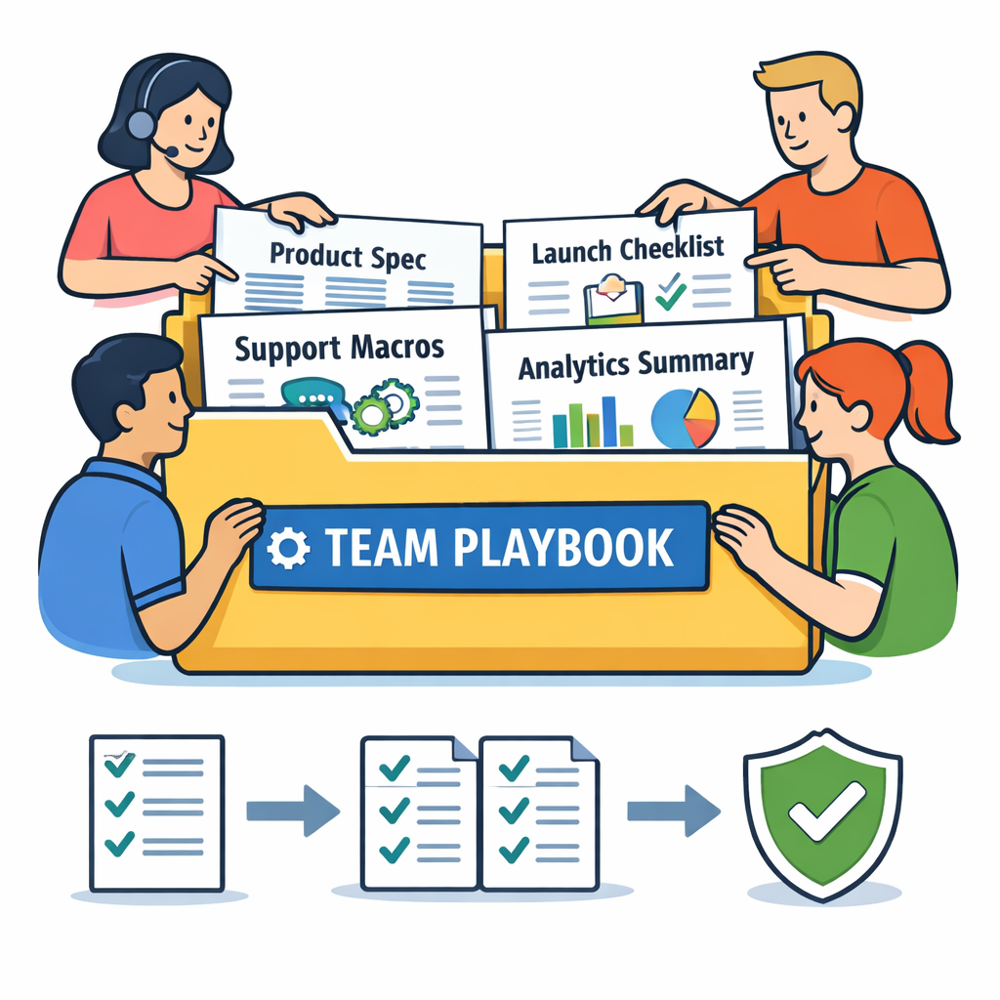
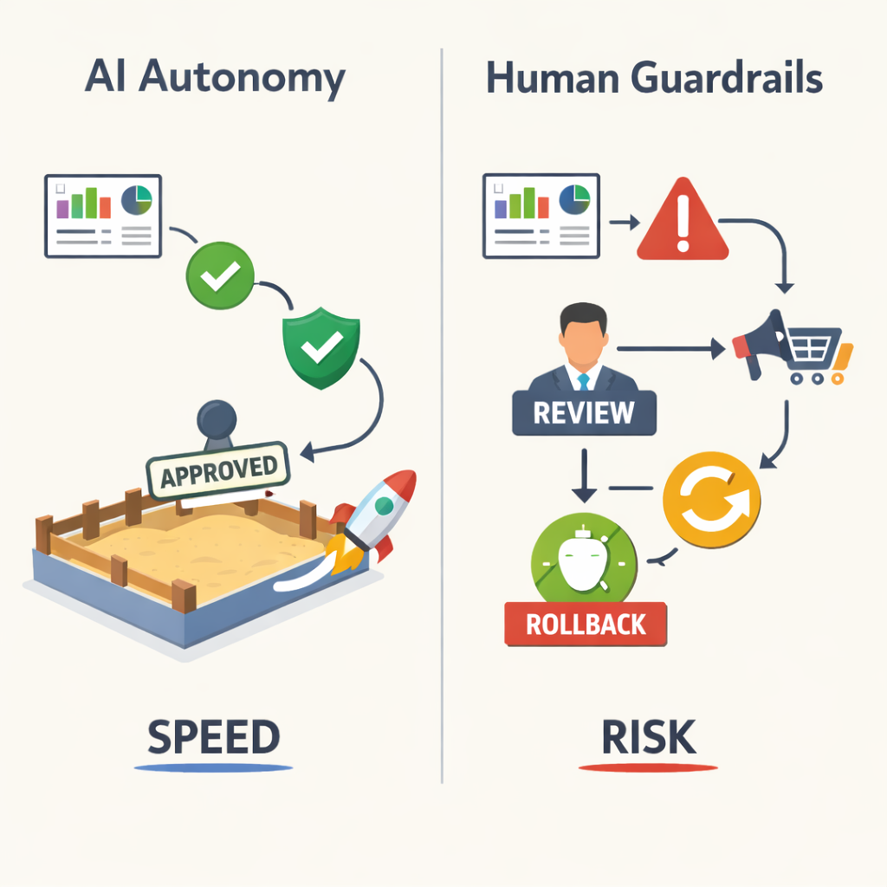
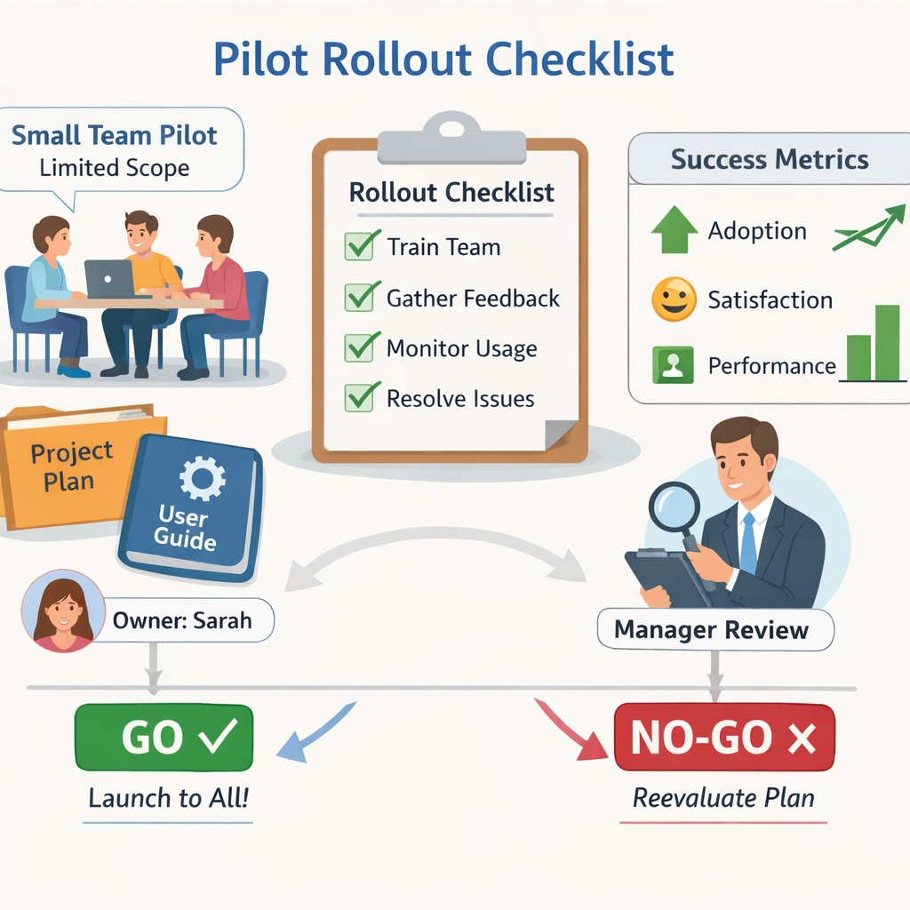

# Claude.md, folder-aware workflows, and the newest Claude release: what PMs need to know

## What changed in Claude’s latest release and why it matters now

Think of this update like **giving a skilled assistant a master key, but only after they’ve checked in at every locked door**. Anthropic’s latest Claude Code release gives the tool more control for real work, while still keeping it inside approval and safety boundaries, according to TechCrunch ([Source](https://techcrunch.com/2026/03/24/anthropic-hands-claude-code-more-control-but-keeps-it-on-a-leash/)). In plain English, that means Claude can do more hands-on tasks, but it still isn’t a free-roaming agent (an AI that acts on its own without human review).

**This matters because it changes what teams can ship, and when.** Early access appears to matter most for Claude Code users, with enterprise and API rollout planning especially important for larger teams ([Source](https://techcrunch.com/2026/03/24/anthropic-hands-claude-code-more-control-but-keeps-it-on-a-leash/)). The first workflows likely to move are prototyping, internal tools, support automation, and agent-like task execution (AI that completes multi-step work across tools). This means your team can test faster, but you need tighter guardrails on where the AI can act without review.

> **💡 What this means for you as a PM**  
> This release can change your roadmap timing because more capable AI features may be shippable sooner than your old rollout assumptions. But the business trade-off is that speed comes with new risk: if Claude is allowed into customer-facing or operational flows too early, mistakes can scale just as fast as productivity. The immediate question to ask is where AI can save time now without creating unacceptable approval, compliance, or brand risk.

## Claude.md and folder-aware context: the small feature with big workflow implications

Think of **Claude.md like a team playbook taped to the inside of a shared cabinet**: anyone opening the cabinet sees the same instructions, so the work starts from the same baseline. In Claude, a **folder-aware instruction layer (rules stored with the project so the AI follows them in that folder)** can standardize how the assistant responds across a whole workspace, not just one chat. That matters because **inconsistent prompting (asking the AI differently each time)** creates rework, and **knowledge leakage (important context being repeated or forgotten across teammates)** makes outputs drift.

This means your team can use Claude for **product specs, support macros, analytics summaries, launch checklists, and experiment writeups** without re-explaining tone, structure, or decision criteria every time. **The business trade-off is consistency versus flexibility**: tighter instructions make outputs more repeatable, but they can also make exploratory work feel boxed in. When this goes wrong, you’ll see it as teams either ignoring the folder rules or over-trusting them when the product strategy has changed.

> **💡 What this means for you as a PM**
> Folder-level instructions can turn AI from a one-off helper into a repeatable team workflow that saves time and reduces output drift. This affects your roadmap because you can standardize high-volume workflows without building custom tooling for each team. It also creates a governance question: someone has to own the instructions, review them when strategy changes, and decide when local exceptions are allowed.

*Claude.md can act like a shared team playbook that keeps AI-assisted work consistent across a folder.*

For PMs, the best use case is **operational consistency, not creativity replacement**. Think of how a **Spotify launch brief (a shared template for release planning)** or **an Uber support response guide (approved wording for customer issues)** keeps teams aligned; Claude.md can do the same for AI-assisted work. **The key decision is ownership**: if no one maintains the folder rules, they become stale fast and start encoding last quarter’s priorities instead of this quarter’s.

## Auto mode, Sonnet 4.6, Opus 4.6, and the safety leash: the control/velocity trade-off

Think of this like giving a junior ops analyst the keys to a dashboard, but not to the whole company network. **“Auto mode” means the AI can take more steps on its own** (make progress without asking at every turn), while the product still needs **boundaries** (limits on what it can touch), **approvals** (human sign-off), and **failure recovery** (ways to undo mistakes). TechCrunch reported that Anthropic is giving Claude Code more control while keeping it “on a leash,” and also referenced Claude Sonnet 4.6 and Opus 4.6 in the release context ([Source](https://techcrunch.com/2026/03/24/anthropic-hands-claude-code-more-control-but-keeps-it-on-a-leash/)).

> **💡 What this means for you as a PM**
> More autonomy can unlock bigger efficiency gains, but it only pays off if you have strong guardrails and clear fallback paths.  
> This affects your roadmap because you need to decide where speed matters more than risk: for example, isolated internal workflows may tolerate more AI control than customer-facing actions like refunds, pricing, or account changes. If you ship similar features, you should plan for logging (a record of what happened), auditability (the ability to review decisions later), human review, and rollback paths before launch.  
> The business trade-off is simple: higher task completion speed versus a higher blast radius if the AI makes a bad action.

That’s why the reported recommendation for **isolated environments** (closed, low-risk sandboxes) matters. In a product like **GitHub Copilot** or an internal support tool, autonomy may be acceptable inside a test repo or a draft ticket queue; in **Uber**-style dispatch, **Swiggy**-style order changes, or **Paytm**-style financial actions, the same freedom could become a liability fast. **Model-specific behavior** also matters here: if Sonnet 4.6 and Opus 4.6 differ in reliability or aggressiveness, your team may need separate launch criteria, QA checks, and fallback routing by model version ([Source](https://techcrunch.com/2026/03/24/anthropic-hands-claude-code-more-control-but-keeps-it-on-a-leash/)).

*More autonomous AI workflows need clear boundaries, approvals, and rollback paths.*

## ROI, cost, and operating-model implications for product teams

Think of **folder-aware instructions** like putting a laminated cheat sheet in every team room instead of repeating the same briefing in every meeting. In Claude Code’s latest update, Anthropic gave the tool more control while still keeping guardrails in place ([TechCrunch](https://techcrunch.com/2026/03/24/anthropic-hands-claude-code-more-control-but-keeps-it-on-a-leash/)), which matters because the business value shows up in **less repetition and fewer hand-holding costs**.

The cost categories PMs should watch are **compute usage** (what you pay to run the model), **support burden** (how much internal help people need), **review time** (how long humans spend checking outputs), **onboarding effort** (how long new users take to become productive), and **governance overhead** (the work needed to keep usage safe and consistent). The best metrics are **time saved per workflow**, **deflection rate** (how often users self-serve instead of asking for help), **conversion uplift** (more users completing a desired action), **cycle time** (how long work takes end to end), and reduction in manual QA (human checking) or support effort. **When this goes wrong, you’ll see it as** more Slack questions, more exceptions, and a growing pile of “special cases” that make the tool feel expensive.

This means your team can get to **ROI-positive adoption** faster when Claude is used in high-volume, repeatable workflows like PM spec drafting, support response drafting, or release-note generation. It also tends to pay off when teams need **cross-functional standardization** (everyone using the same playbook) or when the alternative is expensive manual review, like compliance or customer-facing content. A real-world analogy is **Netflix-style content ops**: if every team member is prompting from scratch, costs stay hidden; if the workflow is standardized, the savings become visible in faster throughput and fewer errors.

The hidden cost is **ownership sprawl**: if no one owns the folder-level guidance, teams will create inconsistent instructions, outputs will drift, and internal AI support requests will climb. The business trade-off is simple: **a little upfront governance** can prevent a lot of downstream cleanup.

## Real-world product examples: where Claude-style workflows are already changing outcomes

Think of this like a **shared playbook in a restaurant kitchen**: when every cook follows the same prep notes, the food comes out more consistently and faster. In Anthropic’s latest Claude Code rollout, the tool is now available to **enterprise customers and API users** (teams that access the model through company plans or software interfaces), with a strong recommendation to keep it in **isolated environments** (separate spaces that limit blast radius if something goes wrong). That combination signals a product pattern PMs should notice: **more capability, but with clearer guardrails** ([Source](https://techcrunch.com/2026/03/24/anthropic-hands-claude-code-more-control-but-keeps-it-on-a-leash/)).

> **💡 What this means for you as a PM**
> Real adoption wins come from repeatable team systems, not from isolated power-user tricks.  
> If your team standardizes shared instruction files for specs, release notes, or QA prompts, you can expect **lower variance** (less inconsistency), **faster execution**, and **fewer review cycles** because everyone starts from the same template. The business trade-off is that you need to treat those files like product assets, with owners, review cadence, and clear “done” criteria.

A practical second example is product teams using **shared prompt files** (reusable written instructions for AI tools) to draft PRDs, launch notes, or support replies. Think of this like how Netflix or Uber teams use templates for launch communication: the goal is not creativity for its own sake, but **cross-team consistency** (same structure and standards across people). When this works, you should see **shorter turnaround time**, fewer edits from stakeholders, and less drift between product, design, and engineering.

The key lesson is **adoption, not hype**: the best teams treat instructions as a workflow layer, not a personal shortcut. PMs can validate this internally by tracking turnaround time, edit counts, and quality variance across writers or squads. When those metrics improve, you are seeing a real operating advantage—not just a shiny demo.

## What PMs should do next: evaluation checklist, rollout plan, and decision points

Think of this like giving a new hire a narrow desk, a handbook, and a manager review before they touch anything customer-facing. **The right move is not “turn it on everywhere,” but “prove it in one contained workflow first.”** Anthropic’s latest Claude Code direction gives the model more control while still keeping it on a leash ([Source](https://techcrunch.com/2026/03/24/anthropic-hands-claude-code-more-control-but-keeps-it-on-a-leash/)), which is exactly why PMs need a disciplined rollout.

> **💡 What this means for you as a PM**
> A disciplined pilot can capture upside quickly while preventing AI from becoming an ungoverned productivity experiment. Start with one bounded folder, one accountable owner, and one success metric, then decide whether the value is real enough to expand.

**Use this checklist before you pilot:**
- Which workflows are repetitive enough to benefit?
- Which steps still require human approval?
- Where would failure be most costly to the business or customer?

**Run the pilot like a product experiment, not a tool demo.** Pick one folder or team, assign one owner, and define one clear metric such as cycle time saved, tickets resolved, or content produced. **This affects your roadmap because** you need a stop/go decision up front, not an open-ended AI trial that quietly expands into higher-risk work.

*PMs should pilot Claude in one contained workflow, with one owner and one success metric.*

**Insist on operating rules from day one:** versioned instructions (saved, traceable guidance), access control (who can use what), audit logs (a record of actions), and review responsibility (a named human who signs off). **When this goes wrong, you'll see it as** inconsistent outputs, compliance gaps, or a blame gap when something slips through.

**Communicate the rollout clearly:** explain the benefit, the limits, and the acceptable-use boundaries in plain language. Use examples from real work like drafting release notes,整理ing support macros, or triaging internal requests, and be explicit about what is off-limits, such as customer-facing decisions without review.

**Decision rubric:** **adopt now** for low-risk productivity gains, **pilot** for higher-autonomy use cases, or **wait** if governance is not ready. The business trade-off is simple: speed and efficiency today versus control and reputational risk tomorrow.

---

## 📚 Further Reading

The following sources were retrieved and used during research for this blog. All links are verified — none are invented.

1. **[Anthropic hands Claude Code more control, but keeps it on a leash](https://techcrunch.com/2026/03/24/anthropic-hands-claude-code-more-control-but-keeps-it-on-a-leash/)** · *TechCrunch* · 2026-03-24
   > Auto mode will roll out to Enterprise and API users; Anthropic says it works with Sonnet 4.6 and Opus 4.6 and recommends isolated environments....

