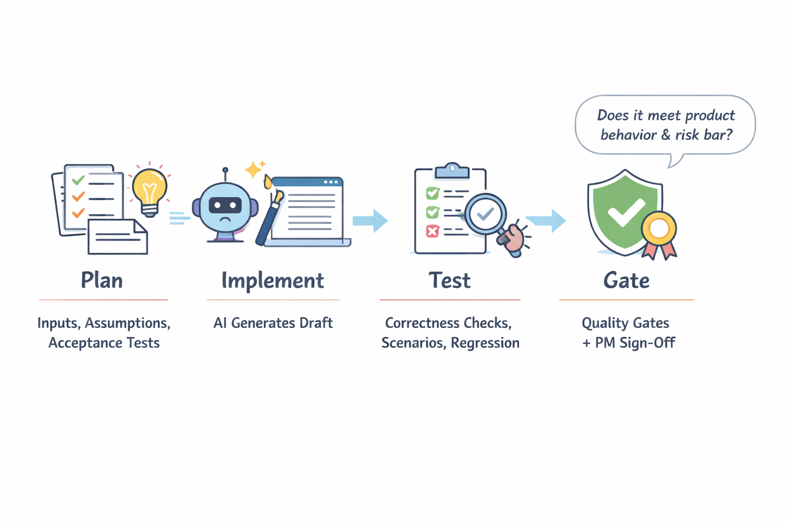
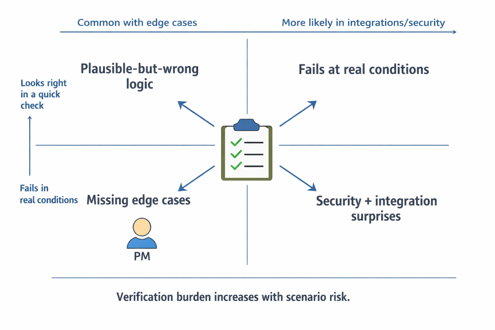
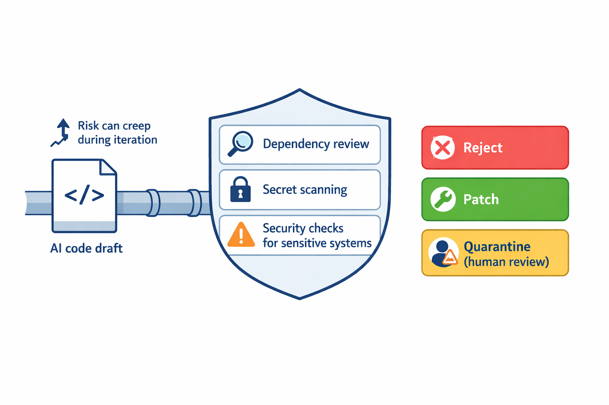

# Coding for PMs in the era of AI: From Faster Prototypes to Safer Shipping

## Why PMs need coding fluency now (and what “good” looks like)

Think of AI-assisted coding like using **GPS while driving**: it can get you moving fast, but you still need to **choose the route, watch the road, and know when the directions are wrong**. In product terms, that means coding fluency is less about writing perfect code and more about steering the *learning loop* safely.

In “AI coding literacy,” your goal is to manage the trade-off between **speed-to-learning (how fast we can validate)**, **correctness (how reliably it works)**, and **maintainability (how safely we can evolve it)**. Evidence from empirical studies on Copilot/CodeWhisperer/ChatGPT shows performance varies by task and correctness expectations ([Source](http://arxiv.org/abs/2304.10778v2)). Meanwhile, iterative AI code generation can introduce or worsen security issues if you don’t add quality gates ([Source](http://arxiv.org/abs/2506.11022v2)). This affects how you structure discovery vs production.

### What “good” looks like for PMs on AI-enabled teams
- **Clarify what you’re optimizing for in each sprint:** pick one primary outcome (e.g., demo speed or correctness) rather than trying to get everything at once.
- **Decide your role in the workflow:** determine how much you personally need to code vs how much you must “drive” requirements (specs, acceptance criteria, test plans, guardrails).
- **Define “working software” for prototypes:** measure **demo fidelity**, **data realism**, and **measurable user/task outcomes**, not just UI completeness.
- **Set stakeholder expectations on where AI helps vs fails:** AI is great for scaffolds; it’s weaker on edge cases, security, and integration nuance.
- **Use an explicit promotion path:** prototype-first for discovery, engineer-led for productionization, with clear criteria for moving code to a release branch.

> **💡 What this means for you as a PM**  
> Coding fluency for PMs is really about choosing the right level of prototype quality and risk tolerance to speed learning without breaking trust. This affects your roadmap because you’ll plan “discovery prototypes” differently from “production commitments” (timelines, QA depth, and security checks). It also changes team dynamics: you’ll spend more time on acceptance criteria and decision gates, not just artifacts.  

**Bottom line:** **PM coding fluency is a risk-managed acceleration skill**—you’re not replacing engineers; you’re upgrading how quickly you can learn while keeping the business safe.

## The AI coding workflow you should demand: plan → implement → test → gate

Think of AI-generated code like **a new hire’s first draft of customer support macros**: fast and promising, but it still needs a checklist, test cases, and a manager sign-off before it touches real customers. If you don’t control that flow, “it ran once” turns into production surprises.

*A PM-controlled workflow that turns AI code from “it runs” into a gated, shippable delivery asset.*

Here’s the **plan → implement → test → gate** workflow you should require every time AI produces code you plan to ship:

- **Plan artifact first (before generation):** decide the **inputs** (what data/files?), the **assumptions** (what’s known vs unknown), **acceptance tests** (what must be true), and the **“known unknowns”** (what could break).
- **Translate prototype success into tests:** convert “users liked it” into **correctness checks** (it does the right thing), **user/task scenarios** (does it match the job-to-done), and **regression expectations** (what must not change).
- **Quality gates you can reason about:** use **linting/static analysis** (basic issues), **dependency review** (supply-chain risk), and **minimum security checks** (fast safety bar before merge).
- **Decide partial edits vs rewrites:** the business trade-off is **iteration speed** vs **compounding errors** and **technical debt** (when to refactor now vs later).
- **PM-owned sign-off moment:** require “does this meet product behavior and risk bar for the next milestone?”—not “does the code run?”

When this goes wrong, you’ll see it as **silent correctness bugs, growing review costs, and security regressions**—which studies have shown can worsen over iterative AI-assisted coding if you don’t add guardrails (e.g., [Evaluating the Code Quality of AI-Assisted Code Generation Tools](http://arxiv.org/abs/2304.10778v2), [Security Degradation in Iterative AI Code Generation](http://arxiv.org/abs/2506.11022v2)).

> **💡 What this means for you as a PM**
> This workflow turns AI code from a **demo artifact** into a **controlled delivery asset**. You’ll be able to negotiate faster iteration **without sacrificing predictability**, because success is defined in tests and gated on risk—not on first-run behavior. It also clarifies when engineering should refactor vs “keep tweaking,” protecting future velocity.

## Mechanism matters: how AI code generation changes failure modes

**Think of AI-generated code like a new junior mechanic who’s fast at assembling parts, but doesn’t fully understand the engine’s “why.”** It can produce a result quickly, yet still fail in subtle ways—especially when the real driving conditions are different from the quick test ride. In AI-assisted coding (AI suggesting or writing code), the *kind* of mistakes shifts, which changes how you should plan verification and risk.

*AI shifts the *type* of mistakes—so PMs must budget verification by scenario risk.*

**Key failure modes to plan for** (based on empirical evaluations of AI-assisted code tools and analyses of iterative AI code generation):
- **Plausible-but-wrong logic**: code that “looks right” in a basic run but misbehaves in real scenarios. (This shows up in correctness comparison work for AI coding tools.) ([Evaluating the Code Quality…](http://arxiv.org/abs/2304.10778v2), [Evaluating correctness comparison…](http://arxiv.org/abs/2401.02404v4))
- **Missing edge cases**: gaps in unusual inputs, rare state transitions, or boundary conditions. ([Evaluating the Code Quality…](http://arxiv.org/abs/2304.10778v2))
- **Fragile integrations**: code that compiles locally but fails under real dependencies/permissions/latency—risk that only emerges with end-to-end tests.
- **Security vulnerabilities that don’t surface early**: a systematic risk in iterative workflows, where repeated prompting can degrade safety over time (“paradox” dynamics). ([Security Degradation in Iterative AI Code Generation](http://arxiv.org/abs/2506.11022v2), plus practical guardrail guidance from industry) ([How Symbiotic Security Validates AI Guardrails…](https://www.symbioticsec.ai/blog/engineering-trust-how-symbiotic-security-validates-ai-guardrails-at-scale), [AI Code Guardrails…](https://codescene.com/use-cases/ai-code-quality))

### The business trade-off: faster edits, higher verification burden
The business trade-off is **you may move faster on drafting**, but you pay more to **prove correctness, safety, and compatibility** before launch. This affects your roadmap because **review and verification time scales with change volume**, not just “time to generate code.” A practical “stop and re-architect” threshold protects you when AI keeps producing *increasingly risky* iterations. ([Security Degradation in Iterative AI Code Generation](http://arxiv.org/abs/2506.11022v2))

### Define “correct enough” by scenario (don’t treat all features equally)
This affects your launch readiness because different surfaces have different blast radii:
- **Internal tools**: accept lower bars temporarily with monitoring.
- **Low-risk UX experiments**: set correctness thresholds around user impact (e.g., “no data loss”).
- **Customer-critical flows** (payments, identity, shipping guarantees): require stricter validation and security gates before release.

> **💡 What this means for you as a PM**  
> Understanding AI coding’s failure modes helps you set realistic quality gates so “faster prototyping” doesn’t become slower incident response. You’ll want to align launch timelines to verification effort (tests, security checks, observability), and define different acceptance bars by feature criticality—so you don’t over-invest in low-risk areas or under-invest where outages hurt revenue and trust.

### Align timeline models with verification—not model speed
When this goes wrong, you'll see it as **production bugs that basic checks miss**, or late-breaking failures from integrations and edge cases. Update your timeline model by budgeting for:
- **Review + test creation** time (not just implementation speed).
- **Security and quality-gating** (guardrails/validation) before broader rollout. ([AI Code Guardrails…](https://codescene.com/use-cases/ai-code-quality), [Five Best Practices…](https://cloud.google.com/blog/topics/developers-practitioners/five-best-practices-for-using-ai-coding-assistants))
- **Post-release measurement**: instrumentation so you can learn real failure rates and tighten gates. (Also consistent with DevOps measurement emphasis in AI-era dev metrics.) ([DORA Report 2025 Key Takeaways: AI Impact on Dev Metrics](https://www.faros.ai/blog/key-takeaways-from-the-dora-report-2025))

### Real-world product example (illustrative): “agentic” prototypes in user funnels
Imagine an app team building a new onboarding funnel using AI-assisted code generation and rapid iteration (common in AI prototype workflows). The first version might “work,” but production can reveal missing edge cases (e.g., unusual phone number formats), permission issues, or security gaps—exactly the failure patterns you need gates for. Teams that skip scenario-based acceptance criteria often end up treating every release as an incident triage exercise instead of a managed rollout. ([A guide to AI prototyping for product managers](https://www.lennysnewsletter.com/p/a-guide-to-ai-prototyping-for-product))

---

**Goal:** Equip PMs to anticipate where AI-generated code tends to break and how that impacts product risk and timelines.  
**PM Takeaway:** Understanding AI coding’s failure modes helps you set realistic quality gates so “faster prototyping” doesn’t become slower incident response.

**Target words:** 260  
**Tags:** ['risk management', 'failure modes', 'launch readiness', 'verification planning']

## ROI and cost: when AI coding is worth it (and when it isn’t)

Think of **AI-assisted coding like a “fast draft” in a design review**: it can get you to a usable version sooner, but you still pay for **edits, QA, and rework** if the draft has gaps. In other words, **speed alone isn’t the ROI metric**—**quality and risk costs** determine whether it actually pays off.

When you model ROI, start with **(prototype speed + learning value) − (review + test + rework) − (expected incident/security cost)**. This matters because empirical studies have found AI code assistance can vary in quality and that security/quality can degrade under iterative generation—so your savings can disappear if you don’t account for downstream work ([Source](http://arxiv.org/abs/2304.10778v2), [Source](http://arxiv.org/abs/2506.11022v2)). The business trade-off is straightforward: **AI reduces early friction**, but **governance and verification** can increase later.

**If you want AI coding to be a controllable bet, treat it like a feature with stage-based KPIs**, not a blanket tool.

### What to decide (PM lens)

- **Build a simple ROI model** using time deltas you can observe: *(time saved in prototyping + learning value) − (review time + test time + rework) − (risk/incident expected value)*.
- **Separate “prototype velocity” vs “production throughput”**: AI often helps earlier stages first, so align KPIs to *stage gates* (e.g., “approved for next phase,” not “lines of code”).
- **Choose automation boundaries**: prioritize **boilerplate, scaffolds, test scaffolding, docs, and UI wiring**—and be cautious with **complex domain logic** where correctness is expensive.
- **Track an AI-specific KPI set**: **defect escape rate**, **security findings per batch**, and **cycle time to approval** (so you can catch hidden rework).
- **Set procurement + governance constraints upfront**: tool cost, usage limits, data handling, and approval workflows—otherwise “AI coding” becomes an unbudgeted risk multiplier.

**Targets and guardrails prevent cost creep.** For example, if security degradation is a real risk in iterative AI generation, your mitigation cost must be part of ROI—not an afterthought ([Source](http://arxiv.org/abs/2506.11022v2)).  

**Recommendation:** run a 4–6 week pilot with explicit measurement around **rework and risk**, then scale only if approved-for-next-phase time improves without increasing incident/defect rates.

### Deliverable checklist
- Baseline: current prototype cycle time, review/test time, rework rate, defect escape rate
- Pilot: define automated work types and prohibited work types
- KPIs: approval-to-next-phase, defect escape, security findings, and total cycle time
- Decision rule: scale / cap / stop based on ROI threshold you pre-agree on

## Security & trust for PMs: guardrails, not hand-waving

Think of AI-generated code like **a new contractor writing parts for your factory line**. Speed helps—until one small change quietly introduces a dangerous new failure mode that only shows up after you’ve ramped volume. That’s the real issue for PMs: **iteration can change risk over time**, not just speed up delivery.

*Treat AI-generated code like untrusted input: validate before touching sensitive systems and manage risk drift over time.*

**Security degradation** means the chance of critical vulnerabilities can **creep up during iterative AI-assisted coding** unless you actively counter it ([Source](http://arxiv.org/abs/2506.11022v2)). In practice, your workflow must treat AI code like **untrusted input** until proven safe—especially around **sensitive data paths** (personal data, payments, auth/session handling, customer support access).

- **Goal:** Adopt a policy that AI-generated code must pass security checks before it touches sensitive systems (define “sensitive” in product terms).
- **Goal:** Require guardrails for iterative generation: dependency pinning (reduce surprise upgrades), secret scanning (stop credentials from leaking), egress/network restrictions (limit outbound data flow), and mandatory human review for risky changes.
- **Goal:** Use evidence-informed caution—controlled research indicates iterative AI code generation can increase critical vulnerabilities, so the process must explicitly prevent “risk drift” ([Source](http://arxiv.org/abs/2506.11022v2)).
- **Goal:** Define escalation paths: when a security flag appears, decide **reject vs. patch vs. quarantine**, and name an owner for the final release decision.
- **Goal:** Turn security into acceptance criteria: e.g., “zero critical findings” for customer-facing releases, not “best effort” reviews.

> **💡 What this means for you as a PM**  
> Treat security as a **gating product requirement**, because AI iteration can quietly raise the probability of critical vulnerabilities. This affects your roadmap because you’ll need time for automated checks, review policies, and clear release criteria—not just faster prototyping. The business trade-off is modest schedule cost to prevent high-severity incidents (breach, fraud exposure, compliance failures).

This ties directly to ROI: **fewer security regressions** reduces rework, incident response time, and audit friction—while maintaining the speed advantages you want from AI coding support ([Source](http://arxiv.org/abs/2304.10778v2); [Source](http://arxiv.org/abs/2506.11022v2)).

## Reality check from evaluations: choosing tools and setting expectations

Think of AI coding tools like **weather apps**: you don’t pick one based on a catchy forecast banner—you check **what they predict correctly for your city**, then decide **how much risk you’ll tolerate**. In practice, that means using evaluation studies (how well tools do real coding tasks) to guide tool selection and rollout sequencing, rather than relying on marketing claims. For example, empirical work comparing Copilot, CodeWhisperer, and ChatGPT finds **task-dependent quality differences** rather than one clear “winner” across all situations ([Source](http://arxiv.org/abs/2304.10778v2)).

When you’re evaluating tools, use evidence to choose by **task type** (correctness, reliability, security), because studies show performance varies with the job and setup ([Source](http://arxiv.org/abs/2304.10778v2); [Source](http://arxiv.org/abs/2401.02404v4)). Also plan for **degradation in iterative workflows**—a “works on the first pass” tool can worsen across repeated edit cycles, which affects how you structure review and acceptance gates ([Source](http://arxiv.org/abs/2506.11022v2)).

### Decisions your PM team should make from evaluations
- **Match tools to task risk:** Start with the lowest-stakes tasks for broad experimentation, but reserve the most trusted tools for security-sensitive or user-impacting code.
- **Choose using error budgets:** Define acceptable failure ranges (prototype vs production) based on observed correctness/reliability patterns in studies, not vibes ([Source](http://arxiv.org/abs/2304.10778v2)).
- **Stage rollout by confidence:** Begin with **scaffolding and tests**, then expand to **domain logic** only after internal acceptance tests show stable quality.
- **Run pilots against your domain:** Translate benchmarks into your real product constraints with your own acceptance suite; external results won’t fully transfer ([Source](http://arxiv.org/abs/2304.10778v2)).
- **Design for “iteration risk”:** Because repeated generation/edit cycles can degrade, require stronger review/quality gates when workflows become multi-step ([Source](http://arxiv.org/abs/2506.11022v2)).

> **💡 What this means for you as a PM**  
> Evidence-based expectations prevent “tool roulette” and reduce the chance your team ships wrong code with confidence. This affects your roadmap because you’ll pace “AI-assisted development” behind measurable acceptance criteria, especially for security and core user journeys. It also changes team operating rhythm: pilots need clear go/no-go thresholds, plus tighter review when the workflow involves many iterative edits.

**Goal:** Interpret comparative evaluation evidence into tool selection and rollout plans (tool-by-task, prototype-by-stage).  
**Bullets (PM actions/trade-offs):**
- Use evaluation evidence to pick tools by task type (correctness vs security vs reliability), not marketing.
- Expect variability across tools; pick highest-stakes tasks first, then expand after internal confidence.
- Set expectation ranges using error budgets for prototypes vs production.
- Validate external benchmarks with internal acceptance tests on your domain and data constraints.
- Roll out in stages: scaffolding/tests first, then domain logic once quality stabilizes.  

**Target words:** 240  
**Tags:** ['tool selection', 'evaluation', 'pilot planning', 'quality expectations']  
**pm_takeaway:** Evidence-based expectations prevent “tool roulette” and reduce the chance your team ships wrong code with confidence.

## Case patterns from the market: from PRDs to pixel-perfect prototypes

Think of an AI-assisted prototype like a **travel itinerary drafted by a smart concierge**: it gets you to “plausible options” fast, but you still need confirmations (tickets, hotel addresses, safety notes) before you book. In product teams, AI coding is turning that first draft into **working demos** earlier than traditional PRD-to-build loops—so you can test value with users sooner.

AI-assisted code generation can also introduce **quality and security surprises**. Empirical work on Copilot/CodeWhisperer/ChatGPT finds measurable differences in code quality (and therefore risk) across tools and tasks ([Source](http://arxiv.org/abs/2304.10778v2)). Meanwhile, a systematic analysis highlights a “paradox” where iterative AI coding can degrade security over time—meaning your review gates can’t be optional ([Source](http://arxiv.org/abs/2506.11022v2)).  

**Adopt a prototype-first loop where product requirements become working demos faster**—but still grounded in acceptance criteria, user/task scenarios, and measurable “done” conditions. **Compress spec-to-demo time** by using agent-like workflows for tight iteration; market examples explicitly frame the shift from PRDs to pixel-perfect prototypes ([Source](https://alloy.app/library/product-agents-prds-to-prototypes)). **Build PM-to-tool templates** so stakeholders get consistent outputs (data assumptions, constraints, success metrics), not “mystery demos” (practitioner guidance on AI prototyping for PMs supports this framing) ([Source](https://www.lennysnewsletter.com/p/a-guide-to-ai-prototyping-for-product)).  
**Define when PRDs stay primary vs when prototypes can lead**: regulated domains and high-cost changes should keep PRDs as the decision record, because prototypes can mislead if limitations aren’t documented ([Source](https://www.lennysnewsletter.com/p/a-guide-to-ai-prototyping-for-product)). Finally, **treat prototypes as decision tools with explicit known limits**, not production commitments—ethical/risk guidance reinforces the need for clear boundaries and governance ([Source](http://arxiv.org/abs/2401.15284v6); [Source](http://arxiv.org/abs/2601.16513v1)).

- **Prototype-first loop:** Decide what must be “testable” in a demo (user flows, key calculations, failure modes) to avoid building consensus on visuals alone.  
- **Agent workflow inspiration:** Choose where iteration speed matters most (discovery) vs where it must slow down (correctness/security).  
- **PM-to-tool communication templates:** Standardize “what good looks like” so reviews are fast and consistent.  
- **PRD vs prototype governance:** Set rules for when prototypes can replace PRDs, and when they must only inform them.  
- **Stakeholder trust plan:** Require a limitations/verification checklist in every prototype review to prevent “demo-driven overcommitment.”

- **Business impact / ROI lens:** This approach typically **improves cycle time** (more learning per sprint) but shifts cost into governance (reviews, test coverage, security validation). If you move too quickly, security degradation risk can become a recurring cost center during rework—so the **business trade-off is speed vs verification** ([Source](http://arxiv.org/abs/2506.11022v2)).  

> **💡 What this means for you as a PM**  
> AI prototypes can get you to stakeholder-aligned decisions faster, but you need explicit **limitations, review gates, and verification artifacts** so teams don’t confuse “looks right” with “safe and correct.” This affects roadmap planning because more decisions happen earlier in discovery—while high-risk areas should keep PRDs as the primary control point. You’ll also likely need a lightweight governance checklist baked into prototype reviews to protect trust and reduce downstream rework.

**Tags:** discovery, prototype-to-PRD, product agents, stakeholder trust  
**Goal:** Show how AI-assisted coding changes product discovery and what governance you need to keep it credible.

---

## 📚 Further Reading

The following sources were retrieved and used during research for this blog. All links are verified — none are invented.

1. **[Evaluating the Code Quality of AI-Assisted Code Generation Tools: An Empirical Study on GitHub Copilot, Amazon CodeWhisperer, and ChatGPT](http://arxiv.org/abs/2304.10778v2)** · *Arxiv* · 2023-04-21
   > Empirical study comparing code validity/correctness/security/reliability of Copilot, CodeWhisperer, and ChatGPT....

2. **[Security Degradation in Iterative AI Code Generation -- A Systematic Analysis of the Paradox](http://arxiv.org/abs/2506.11022v2)** · *Arxiv* · 2025-05-19
   > Controlled experiment finds critical vulnerabilities increase after iterative LLM “improvements” (reported 37.6%)....

3. **[Beyond principlism: Practical strategies for ethical AI use in research practices](http://arxiv.org/abs/2401.15284v6)** · *Arxiv* · 2024-01-27
   > Discusses practical ethical strategies for generative AI adoption in research, highlighting over-abstraction risks....

4. **[Competing Visions of Ethical AI: A Case Study of OpenAI](http://arxiv.org/abs/2601.16513v1)** · *Arxiv* · 2026-01-23
   > Case study analyzing how OpenAI’s public discourse uses “ethics,” “safety,” and related framing over time....

5. **[Evaluating correctness comparison of ChatGPT-4, Gemini, Claude-3, and Copilot for Spatial Tasks](http://arxiv.org/abs/2401.02404v4)** · *Arxiv* · 2024-01-04
   > Research compares multiple LLMs and Copilot on spatial task performance....

6. **[How Symbiotic Security Validates AI Guardrails at Scale](https://www.symbioticsec.ai/blog/engineering-trust-how-symbiotic-security-validates-ai-guardrails-at-scale)**
   > Post argues secure-by-design guardrails for AI code generation, with evaluation harness for outputs....

7. **[Cursor Security: How to Secure AI-Generated Code in 2026 | Blog](https://www.endorlabs.com/learn/cursor-security)**
   > Security guardrails for Cursor usage: repo trust, mandatory review, dependency pinning, egress filtering, secret scanning....

8. **[AI Code Guardrails: Validate & quality-gate GenAI code - CodeScene](https://codescene.com/use-cases/ai-code-quality)**
   > Quality-gating approach for AI-written code, including technical-debt detection and monitoring AI code health KPIs....

9. **[Five Best Practices for Using AI Coding Assistants](https://cloud.google.com/blog/topics/developers-practitioners/five-best-practices-for-using-ai-coding-assistants)**
   > Google engineers share best practices: choose tool by use case, ask for plan.md, break work into batches, require approvals....

10. **[A guide to AI prototyping for product managers - Lenny's Newsletter](https://www.lennysnewsletter.com/p/a-guide-to-ai-prototyping-for-product)**
   > Covers AI tools for PM prototyping; notes local dev assistants (Cursor/Copilot) apply prompt-driven changes in codebases....

11. **[How we replaced PRDs with AI prototypes (with our prompts)](https://stories.logrocket.com/p/thought-leadership-how-we-replaced-prds-ai-prototypes)**
   > Prototyping workflow using AI coding/dev tools (Replit v0, Lovable, Copilot, Cursor) to replace specs with working demos....

12. **[Meet Your New Product Agent: How AI Is Moving from PRDs to Pixel-Perfect Prototypes (February 2026)](https://alloy.app/library/product-agents-prds-to-prototypes)**
   > Claims product agents can autonomously create interactive prototypes, compressing requirements/design into hours....

13. **[[Product Hunt] Agentplace AI Agents - Create specialized AI agents for real tasks and workflows](https://www.producthunt.com/products/agentplace?utm_campaign=producthunt-api&utm_medium=api-v2&utm_source=Application%3A+Claude+MCP+Server+%28ID%3A+234160%29)** · *Product Hunt* · 2026-03-25
   > Create specialized AI agents for real workflows (lead routing, research, doc analysis, scheduling, internal support)....

14. **[[Product Hunt] Auto Mode by Claude Code - Let Claude make permission decisions on your behalf](https://www.producthunt.com/products/claude?utm_campaign=producthunt-api&utm_medium=api-v2&utm_source=Application%3A+Claude+MCP+Server+%28ID%3A+234160%29)** · *Product Hunt* · 2026-03-25
   > Claude Code’s auto mode approves safe actions automatically; risky actions are blocked and handled differently....

15. **[ChatPRD - The #1 AI Platform for Product Managers](https://chatprd.ai/)**
   > AI product-management platform for PRDs/user stories; claims templates, gap analysis, and exports to common docs tools....

16. **[The Projected Impact of Generative AI on Future Productivity Growth](https://budgetmodel.wharton.upenn.edu/p/2025-09-08-the-projected-impact-of-generative-ai-on-future-productivity-growth/)**
   > Wharton Budget Model post estimates generative AI boosts productivity/GDP over time using an adoption-timeline framework....

17. **[DORA Report 2025 Key Takeaways: AI Impact on Dev Metrics](https://www.faros.ai/blog/key-takeaways-from-the-dora-report-2025)** · *Faros AI*
   > Summarizes DORA Report 2025 takeaways: developers using AI, AI as an “amplifier,” and capabilities for scaling gains....

18. **[Predictions 2025: GenAI Reality Bites Back For Software Developers](https://www.forrester.com/blogs/predictions-2025-software-development/)** · *Forrester*
   > Forrester prediction post citing survey data that 49% expect/use genAI assistants in coding phases....

19. **[AI Coding Agents 2026: GitHub Copilot, ChatGPT, and Why ...](https://www.programming-helper.com/tech/ai-coding-assistants-2026-github-copilot-chatgpt-developer-productivity-python)**
   > Article claims adoption/prod-impact stats for Copilot/ChatGPT and notes security/review needs for AI-generated code....

20. **[AI Coding Tools in 2026 - A Complete List and Comparison Guide](https://blogs.emorphis.com/ai-coding-tools-comparison-guide/)**
   > Comparison guide listing multiple AI coding tools and adoption/positioning (e.g., Copilot, Cursor, Lovable, Codex)....

21. **[AI Coding Tools 2026: 7 Best Tested - Tech Insider](https://tech-insider.org/ai-coding-tools-2026-transforming-software-development/)**
   > Overview of AI coding tools with claimed market share and active developer numbers across vendors....

22. **[Best AI Coding Agents for 2026: Real-World Developer Reviews](https://www.faros.ai/blog/best-ai-coding-agents-2026)** · *Faros AI*
   > Developer-review roundup of coding agents; discusses Cursor, Copilot agent mode, and trade-offs....

23. **[The PM's Field Guide to AI Coding Tools in 2026 - Bagel AI](https://bagel.ai/blog/the-pms-field-guide-to-ai-coding-tools-in-2026/)** · *Bagel AI*
   > PM-focused guardrails for AI agents: avoid production data/credentials, check enterprise tiers, secure previews....

24. **[The ICASSP 2026 HumDial Challenge: Benchmarking Human-like Spoken Dialogue Systems in the LLM Era](http://arxiv.org/abs/2601.05564v2)** · *Arxiv* · 2026-01-09
   > Describes the HumDial Challenge for benchmarking human-like spoken dialogue systems in the LLM era....

25. **[Optimizing LLM Coding Workflow for 2026 | Addy Osmani posted on ...](https://www.linkedin.com/posts/addyosmani_ai-programming-softwareengineering-activity-7407683628396298240-G0hd)**
   > Linked post snippet about collaborating in an iterative AI-assisted workflow for software engineering tasks....

