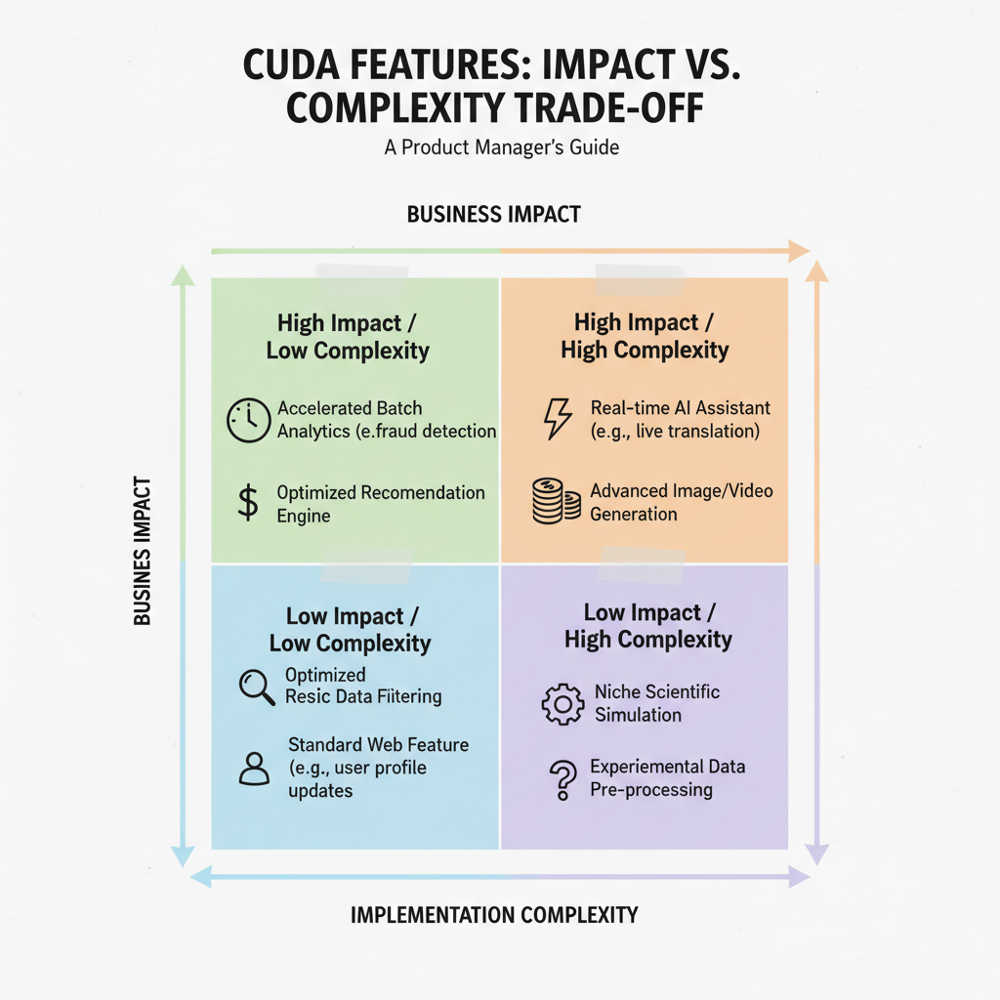
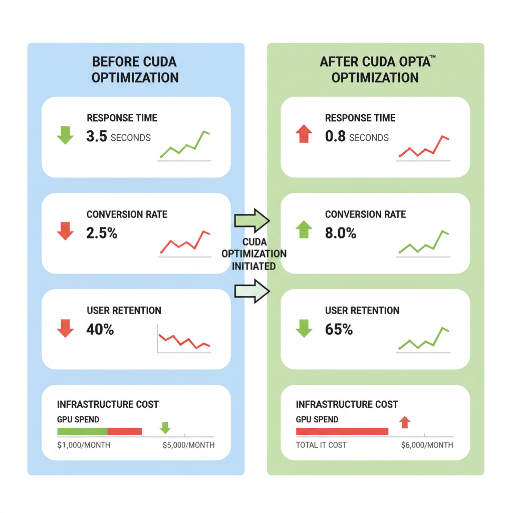
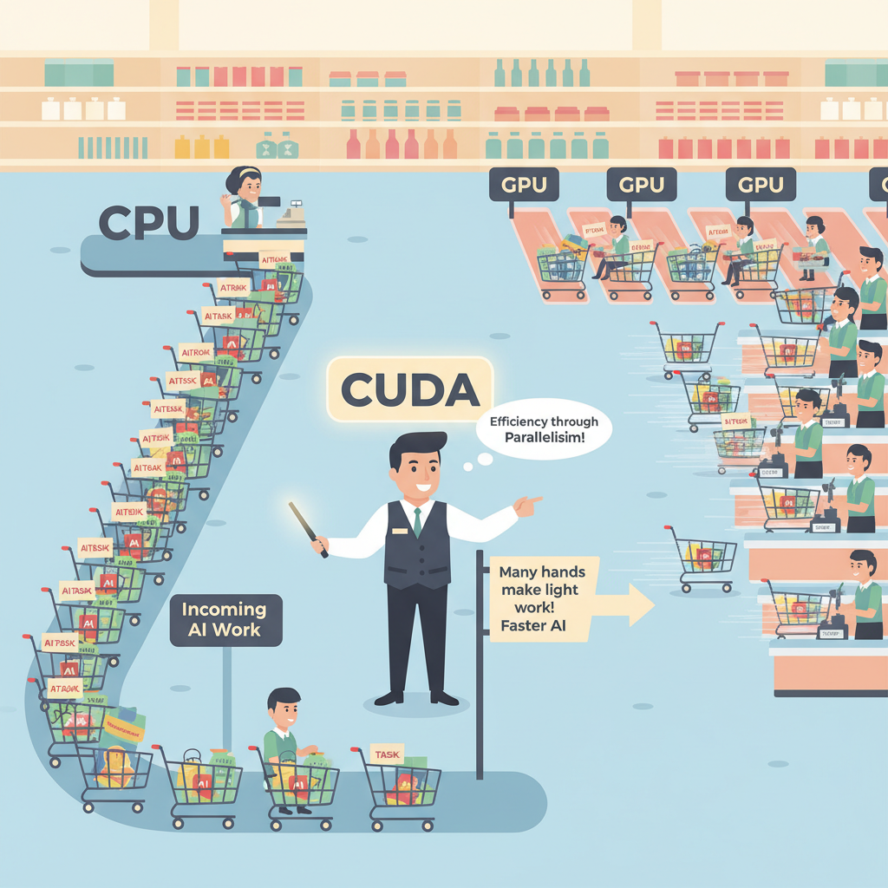

# CUDA for Product Managers: Why a Developer Tool Now Shapes Product Strategy

## What CUDA is and why PMs keep hearing about it

Think of **CUDA like a special highway on-ramp for NVIDIA chips**: it lets software use those GPUs for many tasks at once instead of one by one. CUDA (a software layer that lets applications use NVIDIA graphics processors for massively parallel work) matters because it turns raw hardware into something developers can actually use for AI training, inference, and other compute-heavy jobs.

This matters to PMs because **it affects what your product can do, how fast it feels, and how expensive it is to run**. If you’re building AI features (capabilities like recommendations, chat, or classification), analytics (large-scale data crunching), simulation (testing many scenarios), media processing (editing or generating images/video), or latency-sensitive products (systems where every millisecond matters), CUDA can become a gating factor. In practice, this means your team may ship faster on NVIDIA-based infrastructure, but you also inherit vendor dependence (reliance on one supplier’s ecosystem) and potential cost pressure.

**CUDA is not just a developer detail; it’s a platform dependency (a foundational external system your product relies on).** Think of it like choosing iOS versus Android, or AWS versus another cloud provider: once your product leans on it, roadmap, pricing, and partnership decisions all change. The business trade-off is simple: **better performance and speed now, versus less flexibility later**.

> **💡 What this means for you as a PM**
> If your roadmap depends on GPU-heavy workloads, CUDA can shape what you can ship, how fast, and on whose hardware. That affects launch timing, gross margins, and whether you can support multiple infrastructure options without extra engineering work. It also means vendor strategy matters earlier than many teams expect, especially if you want negotiating leverage or portability later.

## Where CUDA affects product decisions

Think of CUDA like a **special delivery lane for heavy trucks**: it lets AI workloads move fast, but only if your roads, vehicles, and drivers are built for that lane. CUDA (a GPU programming platform that helps software run efficiently on NVIDIA chips) matters to PMs because it shapes what your team can promise, when you can ship, and how much each feature will cost to run.

The biggest product trade-off is **richer AI features versus higher delivery complexity**. If you want something like real-time recommendations in Spotify or instant image generation in a design tool, you may need GPU-based processing (using graphics chips to do many calculations at once), which can raise cloud bills, narrow hardware compatibility, and increase operational risk. This means your team can ship more impressive experiences, but the business trade-off is that margins, reliability, and support burden often get worse if you don’t plan for those constraints early.

*CUDA decisions often come down to impact versus complexity.*

CUDA also affects **launch timelines and acceptance criteria**. When engineering has to tune for GPU compatibility (making sure the software works well on the right chips), optimize inference speed (how quickly a model produces an answer), or handle memory limits (how much data can fit at once), delivery can take longer than a normal web feature. This affects your roadmap because a “simple AI assistant” may need extra milestones for performance testing, fallback behavior, and environment support before it is truly ready.

> **💡 What this means for you as a PM**
> Knowing CUDA’s constraints helps you set realistic launch plans instead of promising AI performance your team can’t economically deliver. It also helps you rewrite requirements around **cost ceilings, response-time targets, and supported customer environments** instead of vague goals like “make it fast.” In vendor decisions, it helps you compare **build vs. buy**: a third-party AI service may ship faster, while in-house GPU capabilities may create more control but also more cost and operational complexity.

## The business impact: cost, ROI, and margin implications

Think of CUDA like a **turbocharger for a delivery fleet**: it can help you move far more packages in the same amount of time, but it also requires a special engine, premium fuel, and a maintenance budget. CUDA (a way to help software run on NVIDIA GPUs, or graphics chips repurposed for heavy computing) can reduce time-to-result (how long a user waits for an answer) or increase throughput (how many requests your system can handle), which is why it matters for products like AI search, video generation, fraud detection, and real-time recommendations.

**The business trade-off is simple:** faster experiences can lift conversion, retention, and enterprise win rates, but only if the customer value is bigger than the compute cost. If a customer-facing feature goes from 5 seconds to 500 milliseconds, you may see more completed checkouts, more daily active use, or higher sales-team success in demos. But if each request becomes expensive on GPU infrastructure (specialized servers that are costlier than standard ones), your margin can shrink fast.

*Faster performance can improve conversion, but GPU costs can erase the gains.*

> **💡 What this means for you as a PM**
> CUDA matters when it changes the economics of a feature enough to make it a growth lever or a margin problem.
> That means you should treat performance gains as a product investment, not just an engineering win. If a faster model helps close more enterprise deals or unlocks a premium tier, it may justify higher cloud spend; if it does not, it can quietly destroy unit economics (revenue minus direct cost per customer).

When you evaluate a CUDA-dependent feature, ask:
- **Will it increase revenue enough to pay for itself?** For example, will faster inference (model response time) improve conversion enough to cover GPU cost?
- **Can we price it separately?** Premium tiers, usage-based pricing, or enterprise add-ons can protect margins.
- **Does it narrow the market?** If customers need expensive hardware or strong technical setup, your addressable market (the set of buyers you can realistically reach) may shrink.
- **What happens at scale?** A feature that is profitable at 1,000 users can become a margin problem at 1 million.

**For PMs, the key question is packaging.** CUDA-backed performance can become a clear differentiator for a paid Pro tier, a high-touch enterprise SKU (a packaged version of the product), or a partner-led solution. But if the hardware requirement is too steep, you may end up with a great demo and a weak business.

## How CUDA influences AI product architecture in plain English

Think of a GPU like a **supermarket with dozens of checkout lanes** instead of one. A CPU (central processing unit, the general-purpose computer chip) is great at handling a few complicated tasks one by one, while a GPU (graphics processing unit, a chip built to do many similar tasks at the same time) is built to run thousands of small, repeated calculations in parallel (at once). CUDA (a software layer from NVIDIA that lets developers direct work onto NVIDIA GPUs) is the traffic controller that helps AI workloads use those lanes efficiently.

For AI training (teaching a model from data) and inference (using a trained model to make predictions), this matters because the work is highly repetitive. **That means your team can process more requests at once, respond faster, and train models in less time.** In a product like ChatGPT-style support, or real-time recommendations in Spotify or Netflix, lower latency (shorter wait time) can be the difference between “feels instant” and “feels broken.”

*GPU parallelism is like a supermarket with many checkout lanes.*

**Compatibility and optimization are the hidden product risks.** The same feature can be fast on one GPU setup and sluggish on another if the software is not tuned for that hardware. This affects your roadmap because a promising AI feature may be technically possible, but not cost-effective or reliable at your expected scale.

> **💡 What this means for you as a PM**  
> Understanding the GPU execution model helps you ask better questions about whether a feature will scale before customers feel the pain. It changes how you think about launch readiness, because “works in a demo” is not the same as “holds up for 1 million users.” It also affects partner and procurement decisions: choosing hardware too early, or too narrowly, can lock in cost and limit future flexibility.

## Real-world product examples: where CUDA-shaped decisions show up

Think of CUDA like **choosing the express lane on a highway**: you get faster trips, but only if your car fits that lane. CUDA (NVIDIA’s software layer for using GPUs, or specialized chips for heavy computing) often shows up when a product needs speed so much that “fast enough” becomes a feature, not just an engineering detail.

An AI SaaS product like **ChatGPT-style writing assistants or customer support copilots** can use CUDA-optimized inference (running the AI model to produce an answer) to keep response times low enough for a premium, interactive experience. **This means your team can charge more for “instant” help, higher usage tiers, or real-time workflows** instead of feeling like a slow batch tool. **💡 What this means for you as a PM**  
The right CUDA strategy can be a differentiator, but the wrong one can quietly limit your market and deployment options. If speed is part of the promise, you may need to budget for higher infrastructure cost in exchange for better retention, conversion, and willingness to pay.

A **video editor, game, or design tool** can use GPU acceleration (offloading heavy work to the graphics chip) to make rendering or generation feel instant instead of batch-like. Think of **Canva-style image generation, Figma previews, or a cloud gaming experience** where waiting breaks the product. **The business trade-off is** that faster experiences can justify premium pricing and stronger product reviews, but they can also increase dependence on specific hardware.

A **data platform** can use CUDA-enabled processing (using GPUs to crunch large datasets faster) to support more queries or larger datasets without linearly increasing server count. In plain English, **you get more throughput (more work done per minute) without hiring a matching fleet of servers**. This affects your roadmap because it can unlock bigger customers, but it also changes your cost model and partner strategy.

Not every team should lean hard into CUDA. If your product cares more about **portability (working across many environments), cloud flexibility, or broad hardware support**, you may choose a less specialized path even if peak performance is lower. When this goes wrong, you’ll see it as **slower launches, higher migration risk, or customers blocked by unsupported infrastructure**.

## What PMs should ask engineering before committing to CUDA-dependent features

Think of **CUDA like choosing a custom delivery fleet** instead of using standard couriers: it can move the right packages faster, but it also ties you to specific vehicles, routes, and maintenance. Before you put it on the roadmap, ask whether the customer-facing outcome truly needs that specialized fleet, or whether a simpler path gets you there with less risk.

**First, separate the feature outcome from the technical choice.** Ask which user-visible results depend on CUDA (the GPU programming layer that lets software use specialized graphics processors) and which parts could be delivered with more portable alternatives (options that run on more kinds of hardware). This means your team can avoid overcommitting to a high-cost implementation when the real product win is faster search, better recommendations, or smoother AI responses.

- **Clarify the dependency chain:** What absolutely requires CUDA, and what could ship without it?
- **Make the environment explicit:** Which GPUs (specialized chips for parallel work), cloud providers, and customer setups are assumed?
- **Pressure-test failure modes:** What happens if GPU capacity is tight, drivers (the software that lets hardware and apps work together) change, or a customer’s environment is incompatible?
- **Define business metrics:** Will success be measured by latency (response time), conversion, retention, support reduction, or revenue—not just raw speed?

> **💡 What this means for you as a PM**
> The best PMs treat CUDA as a portfolio decision: invest in it when it unlocks value, and avoid it when it adds cost without clear upside. This affects your roadmap because CUDA can turn a feature into a platform commitment, not just a one-off build. The business trade-off is speed and performance versus portability, support burden, and cloud spend. When this goes wrong, you'll see it as delayed launches, narrower customer compatibility, or expensive infrastructure that doesn’t move the business metric.

**Use the answers to classify CUDA correctly.** If CUDA is a strategic advantage (something that meaningfully differentiates your product, like real-time AI or heavy media processing), it may be worth the complexity. If it is only a necessary dependency (required to make the feature work), plan for it like a hard constraint. If it is an avoidable constraint, push for a simpler path so your team can ship faster, support more customers, and keep future options open.

---

## 📚 Further Reading

*This blog was written from the model's training knowledge. No external sources were retrieved during generation. For further reading, search for the topic on [Lenny's Newsletter](https://www.lennysnewsletter.com), [Reforge](https://www.reforge.com/blog), or [Mind the Product](https://www.mindtheproduct.com).*
