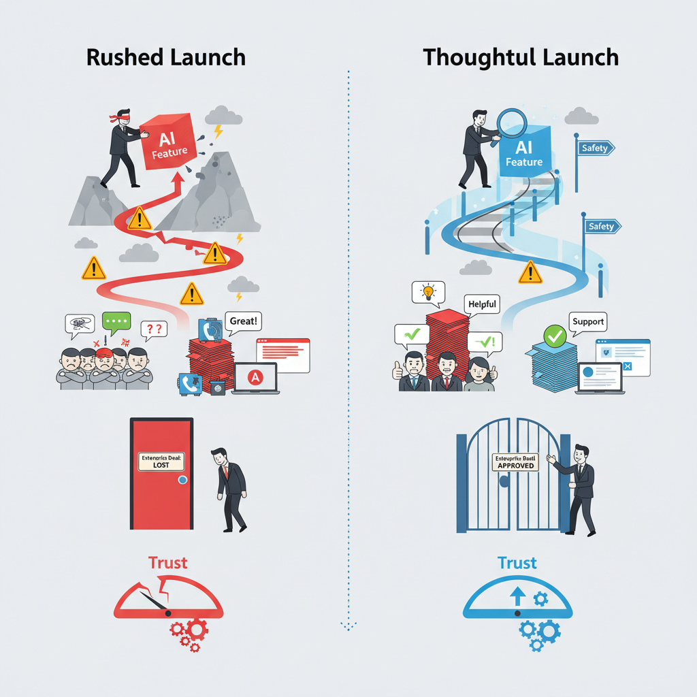
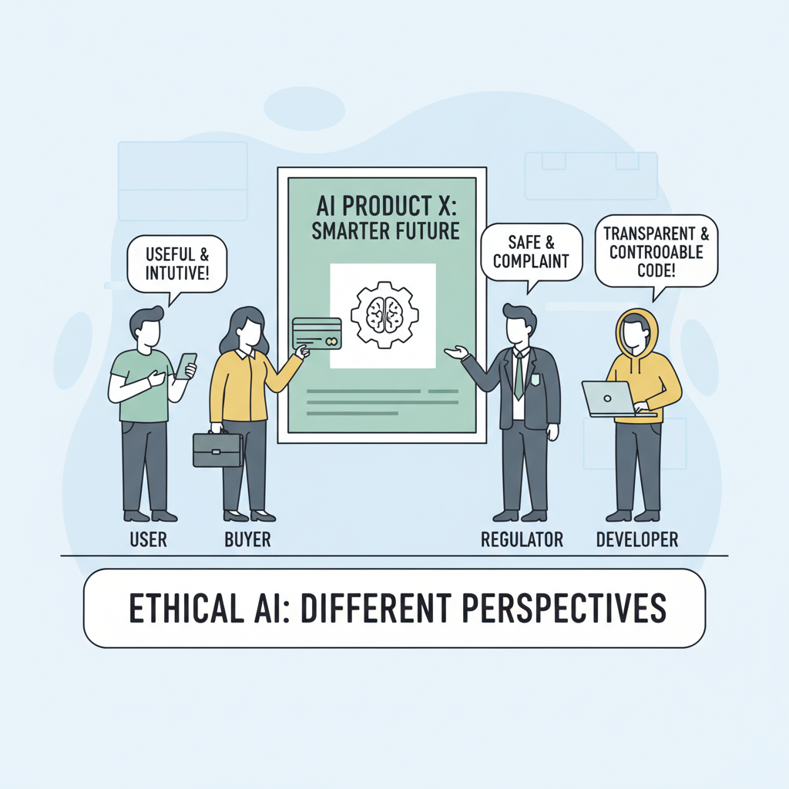
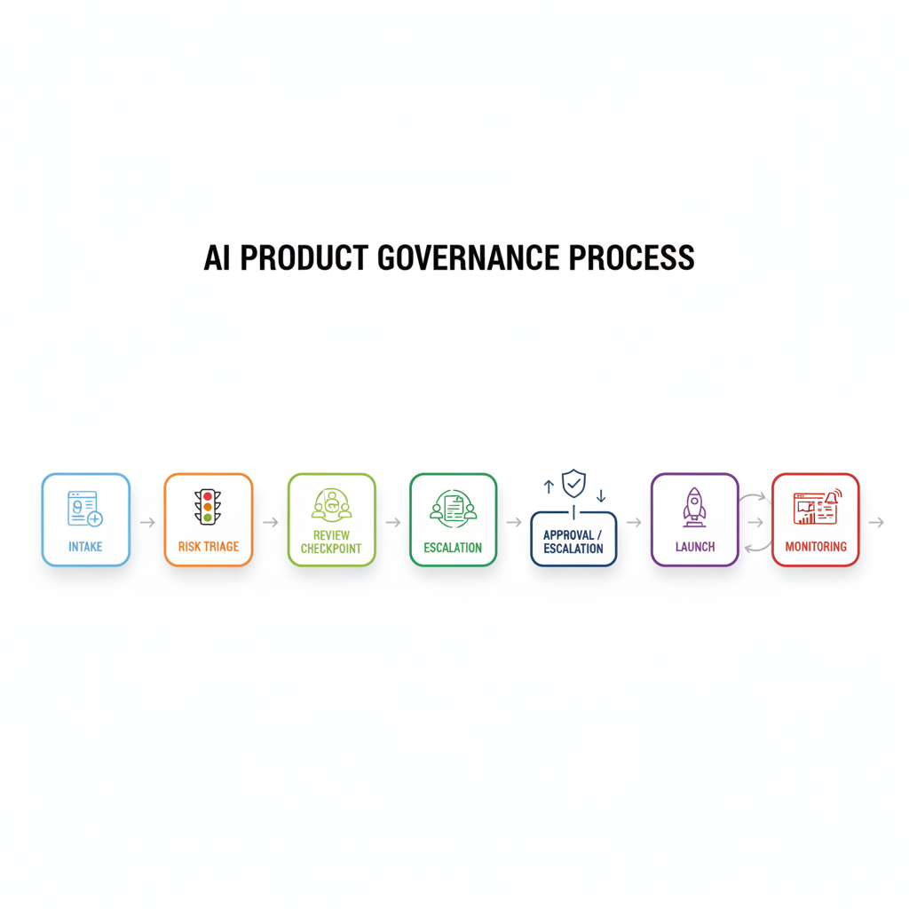

# Ethical AI for Product Managers: A Case Study-Driven Guide to Shipping Responsibly

## Why ethical AI is now a product decision, not just a legal one

Think of ethical AI like a **restaurant kitchen with a health inspector, a head chef, and diners all judging the same meal**. Users want the meal to feel useful and safe, buyers want it to protect their brand, regulators want it to avoid harm, and internal teams want it to be supportable and measurable. In product terms, **ethical AI means shipping a model that people can trust enough to use again**—not just one that technically works.

The business risks show up quickly when that trust breaks. A feature that produces harmful outputs, makes unfair decisions, or feels unpredictable can drive **churn (customers leaving)**, block **enterprise deals (large sales approvals)**, and trigger **regulatory scrutiny (formal attention from oversight bodies)**. Recent AI ethics and policy discussions also point to growing pressure on governance (decision rules for how AI is built and used) and accountability (who owns mistakes), which makes this a roadmap issue, not a side note. ([Source](https://aihub.org/2026/03/04/top-ai-ethics-and-policy-issues-of-2025-and-what-to-expect-in-2026/))

**This means your team can’t treat “responsible AI” as a post-launch cleanup task.** PMs own the decision surface: feature scoping (what you include or exclude), launch criteria (what must be true before release), guardrails (limits that reduce harmful behavior), escalation paths (who handles bad outcomes), and messaging (how you explain the product). If you miss those choices, the cost shows up as support burden, customer distrust, and slower adoption.

The trade-off is **speed versus safety**, and the right call is not always “ship now.” A feature delay can be the best product decision when the downside of harm is larger than the upside of launch, especially in products like hiring tools, credit, healthcare, or customer-facing assistants where mistakes are expensive and visible. In those cases, **shipping safely protects revenue by protecting trust**.

*Ethical AI is a product trade-off: speed can help, but safety protects trust and revenue.*

## Case Study Lens: OpenAI and the Competing Meanings of “Ethical AI”

Think of **ethical AI like a restaurant menu with different audiences**: diners care about taste, health inspectors care about safety, and investors care about repeat business. The OpenAI case study shows that **“ethical AI” is not one promise but several competing expectations**—for users, developers, policymakers, and the public. That framing matters because each group judges the company on different signals: usefulness, control, transparency, and social impact ([Source](http://arxiv.org/abs/2601.16513v1)).

For PMs, the lesson is that **product positioning is a trust contract**. If your launch story says “safe,” users may expect fewer surprises; if it says “transparent,” policymakers may expect clear disclosures and auditability; if it says “helpful,” developers may expect broad capability with fewer restrictions. When those promises diverge from actual product behavior, you don’t just get confusion—you get trust erosion, support burden, and a harder roadmap because every future change is interpreted through a credibility lens ([Source](http://arxiv.org/abs/2601.16513v1)).

**Safety, alignment, and transparency can strengthen trust, but they also raise the bar.** Safety (reducing harmful outputs) can make a product feel more dependable, alignment (making behavior match intended goals) can reduce misuse, and transparency (explaining limits and decisions) can improve confidence. But these same signals can create expectations that are hard to satisfy consistently across use cases—for example, a chatbot that feels reliable in customer support may still disappoint in a high-stakes finance workflow, where “mostly right” is not good enough ([Source](http://arxiv.org/abs/2601.16513v1); [Source](https://aihub.org/2026/03/04/top-ai-ethics-and-policy-issues-of-2025-and-what-to-expect-in-2026/)).

**The business trade-off is clear: ethics positioning must match shipped behavior, not just marketing language.** If your product says it is responsible, but users experience hidden failures, uneven safeguards, or unclear limits, the market will treat that as a gap in integrity. PMs should therefore align launch narratives, in-product disclosures, and escalation paths so the ethics story survives contact with real usage—because **trust is built in the product experience, not the press release** ([Source](http://arxiv.org/abs/2601.16513v1); [Source](https://www.mitsloan.mit.edu/ideas-made-to-matter/how-organizations-build-a-culture-ai-ethics)).

*Different audiences expect different things from “ethical AI,” so positioning must match the shipped experience.*

## What an AI ethics governance framework means for product teams

Think of an **AI ethics governance framework** (a repeatable set of rules for deciding whether an AI feature is safe to ship) like a company’s restaurant health inspection process: it doesn’t stop every new dish, but it makes sure the risky ones get checked before customers are served. In practice, this means your team can answer three launch questions up front: **who approves, who owns incidents, and what counts as unacceptable risk**. IBM describes governance as connecting principles to decisions, not just writing values down, and MIT Sloan emphasizes that culture and accountability only work when they are built into everyday operating routines ([IBM](https://www.ibm.com/think/insights/ai-governance-framework-ethics), [MIT Sloan](https://mitsloan.mit.edu/ideas-made-to-matter/how-organizations-build-a-culture-ai-ethics)).

> **💡 What this means for you as a PM**
> A clear governance process helps you launch faster by making risk decisions repeatable instead of political.
> It gives you a pre-agreed path for escalations, so the team isn’t reinventing approval every time a new AI feature appears. The business trade-off is that you add a review step up front, but you reduce last-minute scrambles, rework, and trust-damaging launches later.

The practical move is to **triage use cases by harm level, customer segment, and data sensitivity** (how bad the downside could be, who is affected, and how personal the data is). A Netflix-style recommendation tweak is not the same as an AI tool that influences hiring, credit, or health advice, so the review should not slow every feature equally. Recent policy coverage keeps pointing to the same pattern: companies are moving toward risk-based governance because high-impact use cases need stronger controls than low-risk ones ([AIHub](https://aihub.org/2026/03/04/top-ai-ethics-and-policy-issues-of-2025-and-what-to-expect-in-2026/), [Forbes](https://www.forbes.com/sites/dianaspehar/2025/01/09/ai-governance-in-2025--expert-predictions-on-ethics-tech-and-law/)).

For PMs, the governance machinery should feel like part of the product workflow, not a side committee. **Ethics boards** (cross-functional review groups), **policy advisories** (written guidance on what is allowed), and **release gates** (approval checkpoints before launch) should be connected to intake, escalation, and launch decisions. The minimum artifact set you should expect is a **use-case description** (what the feature does), a **user impact assessment** (who might be helped or harmed), **data provenance** (where the data came from and whether it is allowed), and a **fallback plan** (what happens if the AI fails).

When this goes wrong, you’ll see it as **unclear ownership, slow launches, or a feature that ships before anyone has agreed on the failure mode**. That’s why governance is not just compliance; it is a product decision system that protects roadmap speed, customer trust, and the cost of fixing mistakes after launch.

*A governance framework turns ethical AI into a repeatable launch process, not a one-off review.*

## The business case: cost, ROI, and the price of getting ethics wrong

Think of ethical AI like food safety in a restaurant: **customers only notice it when something goes wrong, but the cost shows up in complaints, refunds, and lost repeat business**. For PMs, that means ethical AI is not just a values statement—it is a profit-and-loss decision. Recent industry guidance on 2025–2026 AI ethics and governance keeps pointing to the same business theme: organizations are treating responsible AI as a way to reduce risk while protecting adoption and trust ([Source](https://aihub.org/2026/03/04/top-ai-ethics-and-policy-issues-of-2025-and-what-to-expect-in-2026/), [Source](https://www.forbes.com/sites/dianaspehar/2025/01/09/ai-governance-in-2025--expert-predictions-on-ethics-tech-and-law/), [Source](https://www.ibm.com/think/insights/ai-governance-framework-ethics)).

A practical ROI view starts with the upside: **higher trust, smoother enterprise sales, fewer escalations, and better retention**. If you are shipping AI into a product like Salesforce, Microsoft Copilot, or a B2B analytics tool, buyers will ask harder questions about safety, explainability, and governance before they sign. Case studies from responsible AI programs show that ethics work can support broader adoption by making customers more comfortable using the product in high-stakes workflows ([Source](https://www.industry.gov.au/news/case-studies-our-ai-ethics-principles-pilot), [Source](https://www.accenture.com/us-en/case-studies/data-ai/blueprint-responsible-ai)).

The cost side is real too: **review time, documentation, monitoring, training, and sometimes a narrower launch scope**. A PM may need extra legal, policy, data, and support input, plus time for testing and escalation paths. That slows shipping, but it can also prevent expensive rework later—especially when an incident forces a patch, apology, and rollback ([Source](https://mitsloan.mit.edu/ideas-made-to-matter/how-organizations-build-a-culture-ai-ethics), [Source](https://www.cybersaint.io/blog/the-top-security-risk-and-ai-governance-frameworks-for-2026)).

> **💡 What this means for you as a PM**
> Ethical AI is a margin and growth decision because trust, risk, and support costs all show up in the P&L.
>
> When you evaluate ROI, don’t just count new revenue from launch speed—also estimate lower churn, fewer support tickets, and less rework after bad outputs or public incidents. In some cases, delaying a launch is the rational choice if it avoids regulatory exposure, enterprise deal friction, or reputation damage that would cost more than the feature is worth.

## How ethical AI shows up in real products and organizations

Think of ethical AI like the **seatbelt-and-airbag system in a car**: you only notice it clearly when something goes wrong, but it changes how safe people feel getting in. In practice, that shows up as **governance (rules for deciding, reviewing, and approving AI use)**, not just policy decks. In OpenAI’s case study, the company’s ethical debate was not abstract; it centered on how to balance mission, safety, and commercialization as the organization scaled, which is exactly the kind of tension PMs face when shipping fast under scrutiny ([Source](http://arxiv.org/abs/2601.16513v1)).

One useful pattern is to treat ethics as a **launch requirement, not a post-launch apology**. The Australian government’s AI Ethics Principles pilot surfaced practical case studies where organizations used ethics principles to guide real deployments, which suggests a shift from “we have values” to “we have checkpoints” ([Source](https://www.industry.gov.au/news/case-studies-our-ai-ethics-principles-pilot)). For PMs, the business trade-off is simple: adding review steps can slow a launch, but it can also reduce rework, public backlash, and avoidable compliance risk later.

Another pattern is **culture and training (getting teams to consistently make good judgment calls)**. MIT Sloan’s discussion of AI ethics culture emphasizes that responsible AI works best when organizations build shared habits, not just one-time approvals ([Source](https://mitsloan.mit.edu/ideas-made-to-matter/how-organizations-build-a-culture-ai-ethics)). That matters for product teams because your roadmap may need mandatory training, clearer escalation paths, and recurring review checkpoints for high-risk use cases like hiring, lending, or content moderation.

> **💡 What this means for you as a PM**
> Real-world examples help you see which ethical AI practices are operationally worth the effort and which are just theater.  
> The practical lesson is that **trust, adoption, and internal alignment** often matter as much as raw speed, especially when AI touches sensitive decisions or customer-facing recommendations. This means your team can prioritize transparency, human review, and rollout controls where they change user confidence or reduce regulatory exposure. It also affects your roadmap because ethical AI work should be planned as a product capability, not a one-off legal review.

A second reusable pattern is **transparency requirements (clear disclosure about when AI is involved and what it can do)**. IBM’s governance framework framing points to the need for structured oversight, accountability, and documented decision-making, which maps well to product launches that need auditability and internal ownership ([Source](https://www.ibm.com/think/insights/ai-governance-framework-ethics)). The outcome that matters most here is often **compliance and stakeholder confidence**, not flashy model performance—especially in regulated products where being able to explain decisions is part of the product.

The common thread across these examples is that **ethical AI becomes real when it changes operating behavior**. The strongest signals are mandatory training, ethics review checkpoints, clearer user communication, and tighter launch criteria for high-risk features. When teams do that well, they usually get one or more of four benefits: **faster approvals later, fewer trust-damaging incidents, better adoption from cautious customers, and less internal conflict over what “good” looks like**.

## A PM checklist for launching ethical AI responsibly

Think of launching ethical AI like **opening a new restaurant dish on a busy menu**: you want real customer value, a short list of known allergens, and a clear way for staff to stop serving it if something goes wrong. For an AI feature (a product that uses machine intelligence to make predictions or generate answers), that means defining your **minimum launch criteria** (the smallest set of conditions required to ship safely) before anyone clicks “go.”

Start with five launch questions: **Does this solve a real user problem?** What is the **risk level** (how much harm a bad answer could cause)? What are the **known failure modes** (the ways it can fail predictably)? Is there a **human override** (a person can step in and correct the system)? And who owns **escalation** (the person responsible for acting when things break)? This affects your roadmap because a high-stakes feature in lending, hiring, or health should not use the same launch bar as a low-risk feature like playlist suggestions in Spotify.

For a **pilot** (a limited test with a small user group), ask whether the feature is reversible, tightly scoped, and easy to monitor. For a **general release** (broad rollout to all users), ask whether you can explain the behavior to support, legal, and customers without hand-waving. When the use case is high-stakes, the business trade-off is speed versus trust: shipping faster can create avoidable complaints, refunds, or reputational damage.

After launch, watch **complaints** (user reports of bad behavior), **overrides** (cases where humans reject the AI’s output), **error rates** (how often the system is wrong), **trust signals** (indicators like repeat usage or reduced abandonment), and **segment-level impact** (whether outcomes differ for new users, paid users, or protected groups). If complaints rise or one segment is consistently worse off, **iterate** (improve the feature), **restrict** (limit who can use it), or **retire** (turn it off) based on evidence, not optimism. This means your team can protect customer trust while still learning fast.

> **💡 What this means for you as a PM**
> A repeatable checklist keeps ethical AI from being a one-time review and turns it into a product habit. It helps you make cleaner launch decisions, especially when sales pressure pushes for speed or a customer wants a pilot expanded too quickly. It also gives your team a shared language for when to keep going, when to narrow scope, and when to stop.

---

## 📚 Further Reading

The following sources were retrieved and used during research for this blog. All links are verified — none are invented.

1. **[Competing Visions of Ethical AI: A Case Study of OpenAI](http://arxiv.org/abs/2601.16513v1)** · *Arxiv* · 2026-01-23
   > Case study of OpenAI’s ethical AI discourse across audiences; examines framing around ethics, safety, and alignment....

2. **[Top AI ethics and policy issues of 2025 and what to expect in 2026](https://aihub.org/2026/03/04/top-ai-ethics-and-policy-issues-of-2025-and-what-to-expect-in-2026/)** · 2026-03-04
   > Discusses GenAI governance, accountability, transparency, data rights, and when refusing deployment may be ethically justified....

3. **[What should an AI ethics governance framework look like? - IBM](https://www.ibm.com/think/insights/ai-governance-framework-ethics)**
   > IBM describes a governance framework with policy advisory and AI ethics board roles to triage AI use cases and manage risk....

4. **[How organizations build a culture of AI ethics](https://mitsloan.mit.edu/ideas-made-to-matter/how-organizations-build-a-culture-ai-ethics)**
   > MIT Sloan outlines a five-stage AI ethics program: evangelism, policies, documentation, review, and action....

5. **[Case studies from our AI Ethics Principles pilot | Department of Industry Science and Resources](https://www.industry.gov.au/news/case-studies-our-ai-ethics-principles-pilot)**
   > Australian government case studies on applying AI ethics principles in businesses and government deployments....

6. **[Responsible Use of AI | Case Study | Accenture](https://www.accenture.com/us-en/case-studies/data-ai/blueprint-responsible-ai)**
   > Accenture case study on a responsible AI compliance program, principles, and mandatory ethics training....

7. **[Ethical AI Examples: 4 Cases to See Before You Start Innovating](https://www.devoteam.com/expert-view/ethical-ai-examples-4-case-studies-to-see-before-you-start-innovating/)**
   > Four case studies on ethical AI, including Europcar, Trustap, and Snowfox AI, with transparency and change-management lessons....

8. **[The ethics of AI business practices: A Literature Review on AI Ethics guidelines and Governance Principles with reference to AI Technology firms (Business Organizations). | Journal of Marketing & Social Research](https://jmsr-online.com/article/the-ethics-of-ai-business-practices-a-literature-review-on-ai-ethics-guidelines-and-governance-principles-with-reference-to-ai-technology-firms-business-organizations--119/)**
   > Literature review of AI ethics guidelines and governance principles for business organizations and tech firms....

9. **[AI Governance In 2025: Expert Insights On Ethics, Tech, And Law](https://www.forbes.com/sites/dianaspehar/2025/01/09/ai-governance-in-2025--expert-predictions-on-ethics-tech-and-law/)** · *Forbes* · 2025-01-09
   > Expert views on AI governance as standard business practice, covering transparency, literacy, and accountability....

10. **[AI in Business in 2025, a Cross-Industry Analysis](https://blog.4psa.com/ai-in-business-in-2025-cross-industry-analysis/)**
   > Cross-industry view of AI adoption, with emphasis on trust, privacy, governance, and ethical use....

11. **[15 AI Business Use Cases in 2026 + Real-World Examples](https://productschool.com/blog/artificial-intelligence/ai-business-use-cases)** · 2026-01-29
   > Product School guide covering AI use cases plus compliance and governance essentials for scaling AI initiatives....

12. **[8 Real-World Responsible AI Examples + Best Practices in 2026](https://www.superblocks.com/blog/responsible-ai-examples)** · 2025-11-07
   > Examples of responsible AI practices and governance in 2026, focused on fairness, transparency, and oversight....

13. **[The Top Security, Risk, and AI Governance Frameworks for 2026](https://www.cybersaint.io/blog/the-top-security-risk-and-ai-governance-frameworks-for-2026)**
   > Compares NIST AI RMF, ISO 42001, and related governance frameworks for AI risk management....

14. **[Top 10 AI Responsible AI Frameworks Tools in 2026: Features, Pros, Cons & Comparison -](https://www.devopsschool.com/blog/top-10-ai-responsible-ai-frameworks-tools-in-2025-features-pros-cons-comparison/)**
   > Lists responsible AI tools and frameworks such as AI Fairness 360, Fairlearn, and Azure AI Ethics Toolkit....

