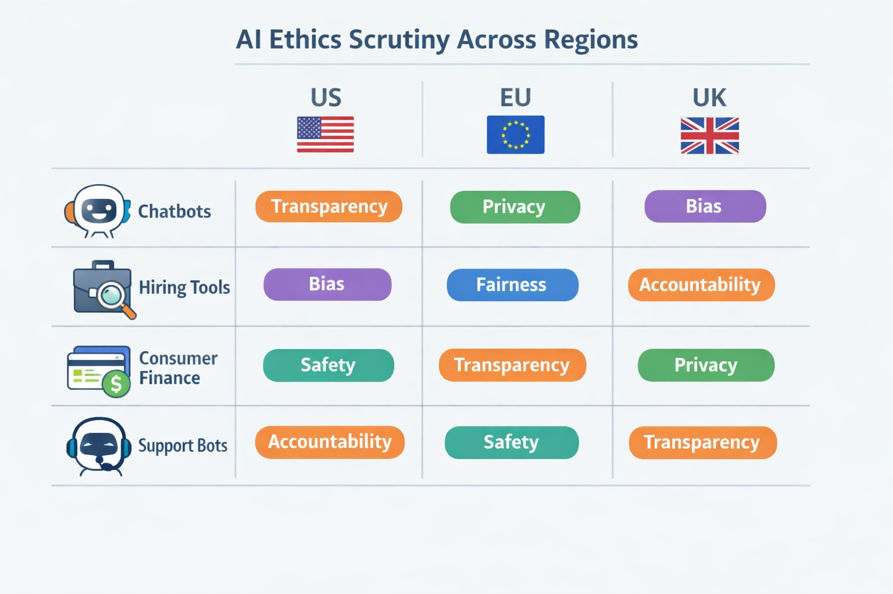

# Ethical AI Under Government Scrutiny: What Product Managers Need to Know in 2026

## Why ethical AI became a board-level product issue in 2025–2026

Think of ethical AI like **product safety testing for a new car**: you can’t just say the brakes are “well designed” and hope for the best. In 2025–2026, governments shifted AI from a **principles discussion** (high-level promises about doing the right thing) to an **enforcement discussion** (real scrutiny, penalties, and proof), which means ethics now affects launch timing, feature scope, and executive risk review. Recent legal and compliance commentary says this is the moment when AI governance moved from theory into operational reality and enforcement phase planning. ([Source](https://www.manatt.com/insights/articles/2025/ai-wrapped-2025-the-year-hypothetical-ai-risks-became-operational-reality)) ([Source](https://www.forbes.com/councils/forbestechcouncil/2026/02/20/the-enforcement-phase-of-ai-governance-is-upon-us-is-your-organization-ready/))

The **most common government concerns** are now very practical: transparency (what the AI is doing and why), bias (whether it treats groups unfairly), privacy (how user data is collected and reused), accountability (who is responsible when it fails), and training-data risk (whether the data used to build the model creates legal or reputational exposure). These are no longer abstract policy questions; they show up in product reviews, partner diligence, and regulator questions before launch. ([Source](https://www.biztechlawyers.com/legal-articles/ais-legal-wake-up-call-lessons-from-2025-actions-for-2026)) ([Source](https://www.cimplifi.com/resources/the-ai-regulation-landscape-for-2026-what-legal-and-compliance-leaders-need-to-know/))

This affects your roadmap because **product decisions are being scrutinized earlier**: feature scope, model use case (what the AI is allowed to do), data collection, and user disclosures. The business trade-off is clear: ship faster with less documentation and you may gain weeks now, but you increase the chance of delays later when legal, enterprise customers, or regulators ask for a paper trail (written evidence of how the product was designed and governed). In practice, teams are learning that **speed without proof is becoming a launch risk**. ([Source](https://www.skadden.com/insights/publications/2026/2026-insights/sector-spotlights/dont-believe-the-hype)) ([Source](https://www.whitecase.com/insight-our-thinking/ai-watch-global-regulatory-tracker-united-states))

> **💡 What this means for you as a PM**
> Ethical AI is no longer a values discussion; it now changes what you can safely ship and how quickly you can ship it.
> This means your team can’t treat governance as a post-launch cleanup task. You’ll need to align earlier with legal, compliance, and leadership on disclosures, data use, and model boundaries so you don’t create rework or blocked launches. It also means the strongest product teams will use governance as a competitive advantage when selling into enterprise or regulated customers.

## Recent government cases that show where AI ethics is being questioned

Think of this like a restaurant health inspector checking what actually came out of the kitchen, not just whether the chef promised “best practices.” **That’s the shift regulators are making with AI**: they are focusing on real-world harm, not polished launch decks or reassuring intent. Recent enforcement attention in the US, EU, and UK has centered on chatbots, hiring tools, consumer finance, and other high-stakes decision systems where bad outputs can quickly become bad outcomes. 
*Where regulators are focusing AI ethics questions in 2025–2026.* [Source](https://www.forbes.com/councils/forbestechcouncil/2026/02/20/the-enforcement-phase-of-ai-governance-is-upon-us-is-your-organization-ready/) [Source](https://www.skadden.com/insights/publications/2026/2026-insights/sector-spotlights/dont-believe-the-hype)  

In the **US**, regulators have increasingly questioned products when AI systems make misleading claims, use opaque data sources, or affect decisions without enough human oversight (a real person reviewing or overriding the output). That scrutiny has landed hardest on **chatbots and consumer-facing assistants** (tools that answer users directly), especially when they produce confident but wrong answers or blur what is AI-generated versus human-reviewed. The PM lesson is blunt: **document what the model is allowed to say, test for harmful edge cases, and disclose limitations before launch**—because “the model said so” is not a defense when customers rely on the output. [Source](https://www.biztechlawyers.com/legal-articles/ais-legal-wake-up-call-lessons-from-2025-actions-for-2026) [Source](https://www.manatt.com/insights/articles/2025/ai-wrapped-2025-the-year-hypothetical-ai-risks-became-operational-reality)  

In the **EU**, the focus has been on automated decision-making (computer-led decisions that can affect people’s lives) and whether systems are transparent enough for users to understand, challenge, or appeal them. That matters most for **hiring tools, credit decisions, and other high-stakes workflows** where a hidden scoring model can quietly shape who gets interviewed, approved, or rejected. **This affects your roadmap because** you may need appeal flows, audit logs (records of what the system did), and tighter use-case limits before you can ship in certain markets. [Source](https://www.kslaw.com/news-and-insights/eu-uk-ai-round-up-december-2025) [Source](https://www.metricstream.com/blog/ai-regulation-trends-ai-policies-us-uk-eu.html)  

In the **UK**, scrutiny has leaned toward safety claims and governance (the rules and checks around how AI is built and used), especially where companies suggest their systems are reliable without showing proof. That creates risk for **consumer finance, insurance, and support bots** that influence money, access, or trust. **When this goes wrong, you'll see it as** regulator questions, forced product changes, slower launches, or added review steps that reduce speed but protect the business from bigger reputational and legal costs. [Source](https://www.cimplifi.com/resources/the-ai-regulation-landscape-for-2026-what-legal-and-compliance-leaders-need-to-know/) [Source](https://www.whitecase.com/insight-our-thinking/ai-watch-global-regulatory-tracker-united-states)  

> **💡 What this means for you as a PM**  
> These cases show regulators are judging AI products by their real-world outcomes, not by the quality of the team’s intentions. Before launch, your team should be able to answer: What can the system do, where can it fail, who reviews it, and what can users do if it gets things wrong? If you cannot show that clearly, your biggest risk is not just compliance—it is shipping something that creates hidden support, churn, and brand damage.

## What ethical AI means in product terms: the decisions PMs actually own

Think of ethical AI like **putting guardrails on a busy highway**: users still move fast, but you reduce the chance of a costly crash. In product terms, ethics is not a philosophy deck — it is the set of choices you make about **who sees what, when automation is allowed, and what happens when the model gets it wrong**.

The clearest product knobs are **consent, disclosure, explainability, data minimization, appeal paths, and human review**. Consent means asking before using someone’s data; disclosure means telling users when AI is involved; explainability (a plain-English reason for a decision) means being able to say “why this result happened”; data minimization means collecting only what you truly need; appeal paths mean giving users a way to challenge a decision; and human review means letting a person step in when the stakes are high. This affects your roadmap because a feature that feels “small” — like AI-powered credit limits in Paytm or a hiring screen in LinkedIn — can become a trust and regulatory issue if users can’t understand or contest the outcome.

**The business trade-off is speed and personalization versus fairness and trust.** A Netflix-style recommender can optimize engagement, but if it over-personalizes in ways that systematically exclude certain users, the company takes on reputational and legal risk. When this goes wrong, you’ll see it as higher churn, customer support escalations, blocked launches, or a forced rollback after internal or government scrutiny.

Before launch, PMs should ask for **four artifacts**: a risk assessment (a structured view of what could harm users), test results (evidence the system was checked), decision logs (who approved what and why), and escalation paths (who takes over when the AI fails). **This means your team can** decide whether a feature needs a softer launch, limited geography, age gating, or a human fallback. For example, a new AI assistant in WhatsApp might ship to a small market first, while a medical or financial use case should default to human handling until the failure modes are understood.

> **💡 What this means for you as a PM**
> The PM’s job is to turn ethical principles into product requirements, launch gates, and user safeguards. In practice, that means you should not approve a high-stakes AI feature without clear ownership for review, appeals, and fallback handling. It also means your roadmap should budget for trust work — because fixing a bad AI decision after launch is always slower and more expensive than designing the guardrails up front.

## The business cost of getting ethical AI wrong

Think of a **product recall** like a bad AI launch: one flaw can force you to pull the feature, apologize to customers, and spend weeks cleaning up the mess. **Ethical AI failures** (when a model behaves in ways that feel unfair, risky, or misleading) don’t just create headlines; they create direct business costs.

The main cost buckets PMs should plan for are:

- **Rework** (redoing the feature after launch): model tuning, new guardrails, and UX changes.
- **Delayed launches** (slower time-to-market): extra review cycles from legal, privacy, security, and policy teams.
- **Incident response** (firefighting after something goes wrong): support load, comms, and executive escalation.
- **Customer churn** (customers leaving): especially when users feel misled, denied service, or treated unfairly.

**The business trade-off is simple:** spend earlier on prevention, or pay later in reversals, refunds, and reputation damage. A governance review (a structured check for risk, fairness, and compliance) may feel like overhead, but it is often cheaper than rebuilding under pressure.

> **💡 What this means for you as a PM**  
> Good AI governance is not just compliance overhead; it protects revenue and reduces expensive product reversals.  
> This affects your roadmap because risky launches can stall in enterprise procurement (buyer approval processes) or channel partnerships (distribution agreements with other companies). It also affects your budget because legal review, monitoring, and rollback planning are often cheaper than a public incident plus forced redesign.  
> When this goes wrong, you'll see it as lost deals, slower approvals, higher support costs, and a feature that never reaches full rollout.

For prioritization, **invest heavily** in systems that affect pricing, hiring, lending, healthcare, identity, or children’s experiences, because the downside is often regulatory and reputational. You can usually accept **lighter guardrails** on low-stakes features like content suggestions, as long as you keep monitoring (ongoing checks for bad behavior) and clear escalation paths. This means your team can move faster where the risk is small, while protecting the parts of the product that can trigger customer loss, partner distrust, or mandatory rollback.

## How leading products have navigated ethical AI pressure in the wild

Think of this like a restaurant changing the menu after a health inspector walks in: **the goal is not to look virtuous, it’s to keep serving customers without getting shut down**. When AI ethics questions become public, the strongest product teams usually respond by narrowing a feature, adding clearer disclosures, or delaying rollout until the risk is acceptable. That matters because the business outcome is often less about “being good” in the abstract and more about protecting trust, enterprise deals, and regulatory standing.

A common pattern is **more disclosure, fewer surprises**. In recent legal and policy commentary, companies are being pushed toward clearer notices, tighter oversight, and stronger governance as AI scrutiny moves from theory to enforcement ([BizTech Lawyers](https://www.biztechlawyers.com/legal-articles/ais-legal-wake-up-call-lessons-from-2025-actions-for-2026), [Manatt](https://www.manatt.com/insights/articles/2025/ai-wrapped-2025-the-year-hypothetical-ai-risks-became-operational-reality), [Forbes](https://www.forbes.com/councils/forbestechcouncil/2026/02/20/the-enforcement-phase-of-ai-governance-is-upon-us-is-your-organization-ready/)). **This means your team can keep a feature live while reducing the chance that users, regulators, or the press feel misled.** The trade-off is obvious: clearer warnings and tighter guardrails can slow growth, but they also lower the odds of a headline that damages adoption.

Another pattern is **launching with narrower capability instead of maximum power**. PMs in consumer products like ChatGPT-style assistants, search, and marketplace recommendation systems often face pressure to restrict sensitive outputs, limit certain use cases, or stage rollout by geography or customer segment when policy risk rises. The business trade-off is **broader capability versus tighter controls**: a more open launch can drive faster usage, but a safer launch can protect enterprise sales and keep you inside emerging rules in the US, EU, and UK ([Cimplifi](https://www.cimplifi.com/resources/the-ai-regulation-landscape-for-2026-what-legal-and-compliance-leaders-need-to-know/), [White & Case](https://www.whitecase.com/insight-our-thinking/ai-watch-global-regulatory-tracker-united-states), [K&L Gates](https://www.kslaw.com/news-and-insights/eu-uk-ai-round-up-december-2025)). **When this goes wrong, you’ll see it as blocked procurement, delayed launches, or a product that legal teams won’t approve for key accounts.**

The reusable lesson for PMs is **treat ethics pressure like a roadmap input, not a post-launch apology**. Build options for disclosure, feature gating, and staged rollout early, so you can respond without rewriting the product under pressure. That affects your roadmap because it forces you to decide in advance where speed matters most and where trust is worth the extra week, quarter, or review cycle.

## A PM checklist for launching ethically defensible AI products

Think of a launch like **opening a new store in a busy mall**: if the signs are unclear, the returns desk is hidden, and staff don’t know what to do when something goes wrong, customers will blame the brand, not the process. For AI products, the equivalent is simple: define what the system is for, what it must never do, what data it used, and who gets alerted when it misbehaves. That’s the difference between a controlled rollout and a public ethics problem.

**Start with a minimum governance checklist** before you green-light launch: intended use (what problem it is allowed to solve), prohibited use (what it must not be used for), data provenance (where the training or input data came from), user disclosure (what customers are being told about AI involvement), and escalation paths (who investigates complaints or incidents). In plain English, governance (the rules for safe and responsible use) should answer: “What’s allowed, what’s not, and who owns the fix?” This affects your roadmap because missing any one of these can force a rollback, legal review, or a costly customer apology.

> **💡 What this means for you as a PM**
> A simple launch checklist can prevent ethical blind spots from becoming public failures.  
> In review meetings, ask: “Would we be comfortable explaining this decision to a regulator, a journalist, and a customer in one sentence?” Also ask whether the product team has a clear stop/ship decision owner if risk spikes after launch. This means your team can move faster later, because you’ve already reduced the chance of surprise escalations.

Before approving rollout, **pressure-test readiness in the room, not after launch**. Ask design whether the UX (user experience, or how the product feels to use) makes AI limits obvious; ask legal whether disclosures are specific enough; ask data and engineering whether the model is being used outside its intended context; and ask support what happens when users dispute outcomes. The business trade-off is straightforward: a more careful launch may slow initial release, but it lowers the odds of churn, refunds, and trust damage.

After launch, **monitor the signals that show real-world harm early**: complaint patterns (repeated user objections), override rates (how often humans reject AI output), bias indicators (whether certain groups are treated worse), and incident volume (how many serious failures are reported). When this goes wrong, you’ll see it as rising support tickets, uneven conversion, or a spike in manual review. Finally, **communicate limits plainly** to customers: what the AI can do, where it is likely to be wrong, and when a human must step in—so expectations match actual product behavior.

---

## 📚 Further Reading

The following sources were retrieved and used during research for this blog. All links are verified — none are invented.

1. **[AI's Legal Wake-Up Call: Lessons from 2025, Actions for 2026](https://www.biztechlawyers.com/legal-articles/ais-legal-wake-up-call-lessons-from-2025-actions-for-2026)**
   > 2025 saw AI governance shift from theory to near-term compliance, with state-level regulation, court cases, and 2026 preparation now central for AI teams....

2. **[AI Wrapped 2025: The Year Hypothetical AI Risks Became Operational Reality - Manatt, Phelps & Phillips, LLP](https://www.manatt.com/insights/articles/2025/ai-wrapped-2025-the-year-hypothetical-ai-risks-became-operational-reality)**
   > 2025 moved AI regulation into a near-term compliance challenge, with recurring themes around privacy, fairness, accountability, and training data risk....

3. **[The Enforcement Phase Of AI Governance Is Upon Us - Forbes](https://www.forbes.com/councils/forbestechcouncil/2026/02/20/the-enforcement-phase-of-ai-governance-is-upon-us-is-your-organization-ready/)**
   > Argues 2026 will shift AI governance from voluntary ethics to enforcement, with agentic AI and real-world liability increasing pressure on organizations....

4. **[The AI Regulation Landscape for 2026: What Legal and Compliance ...](https://www.cimplifi.com/resources/the-ai-regulation-landscape-for-2026-what-legal-and-compliance-leaders-need-to-know/)**
   > Summarizes 2026 AI compliance trends, emphasizing documentation, risk assessments, bias testing, incident response, and human-in-the-loop controls....

5. **[Don't Believe the Hype: Government Regulation of AI Continues to ...](https://www.skadden.com/insights/publications/2026/2026-insights/sector-spotlights/dont-believe-the-hype)**
   > Covers expanding scrutiny of AI chatbots, state laws, and proposed legislation on transparency, safeguards, and impact assessments....

6. **[AI Watch: Global regulatory tracker - United States | White & Case LLP](https://www.whitecase.com/insight-our-thinking/ai-watch-global-regulatory-tracker-united-states)**
   > Tracks U.S. state AI laws including California transparency and Texas TRAIGA, highlighting evolving compliance obligations for AI products....

7. **[State AI laws under federal scrutiny: Key takeaways from the ...](https://www.whitecase.com/insight-alert/state-ai-laws-under-federal-scrutiny-key-takeaways-executive-order-establishing)**
   > Notes that state AI laws remain in force and businesses should continue complying until federal preemption becomes clearer....

8. **[AI Regulation Trends: AI Policies in US, UK, & EU | Blog](https://www.metricstream.com/blog/ai-regulation-trends-ai-policies-us-uk-eu.html)**
   > Explains current US, UK, and EU AI policy trends, including phased EU AI Act enforcement and cross-border coordination....

9. **[EU & UK AI Round-up - December 2025](https://www.kslaw.com/news-and-insights/eu-uk-ai-round-up-december-2025)**
   > Reviews EU and UK AI regulatory developments, including the EU AI Act and expected UK guidance on automated decision-making....

10. **[Top AI ethics and policy issues of 2025 and what to expect in 2026](https://aihub.org/2026/03/04/top-ai-ethics-and-policy-issues-of-2025-and-what-to-expect-in-2026/)**
   > Reviews 2025 AI ethics and policy issues, including training data disputes, transparency, workforce impacts, and 2026 outlook....

11. **[AI in February 2026: Three Critical Global Decisions—'cooperation ...](https://etcjournal.com/2026/02/05/ai-in-february-2026-three-critical-global-decisions-cooperation-or-constitutional-clash/)**
   > Discusses early-2026 AI laws in California, Texas, and Colorado, plus federal pushback against state-level AI regulation....

12. **[27 Biggest AI Controversies of 2025-2026 | The Latest Edition](https://www.crescendo.ai/blog/ai-controversies)**
   > Rounds up major AI controversies, including government action, safety disputes, and harmful or misleading AI outputs....

