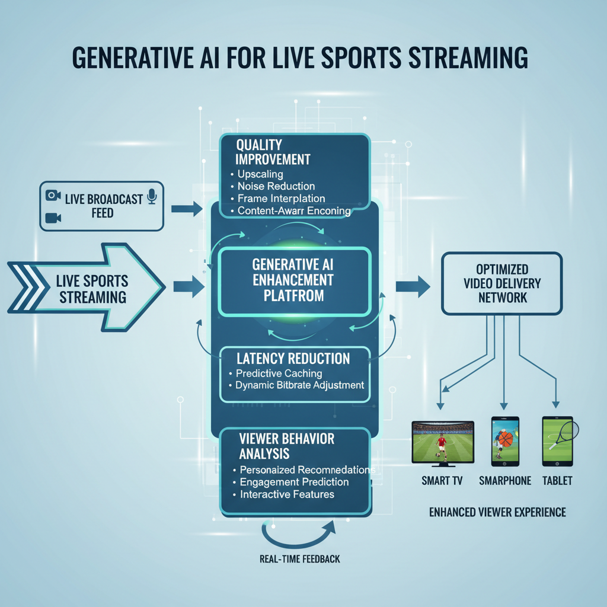
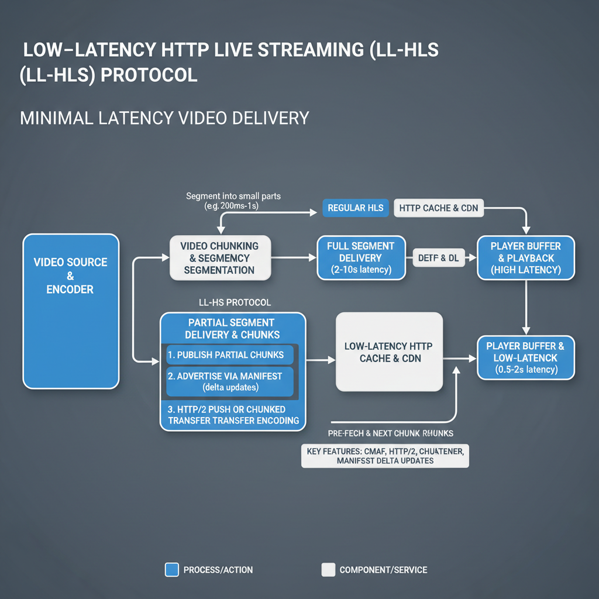

# How Millions are Watching India vs Pakistan Live Without Lag

## Introduction to Live Streaming Challenges

The demand for low-latency streaming during high-stakes sports events is unprecedented. Events like the India vs Pakistan match draw millions of viewers, all expecting seamless coverage without delays. Achieving this level of performance is crucial, as viewers increasingly desire real-time interactions and instant updates.

Historically, live sports streaming has faced significant challenges. Viewers often encountered buffering issues, reduced video quality, and delays that could disrupt the fan experience. Such problems not only frustrated fans but also diminished the excitement of live sporting events.

The significance of viewer experience cannot be overstated. High-quality broadcasts enhance engagement, making fans feel more connected to the action on the field. As technology evolves, particularly with advancements in low-latency streaming protocols, providers are now better equipped to meet these expectations, ensuring that fans enjoy their favorite sports with minimal interruptions and maximum enjoyment.

## Impact of Generative AI on Streaming

Generative AI is making significant strides in optimizing live sports streaming, particularly during high-demand events like the India vs Pakistan match. By enhancing the video delivery chains, this technology ensures that viewers experience minimal latency while enjoying high-quality broadcasts.

Key applications of AI include:

- **Quality Enhancement**: Generative AI algorithms analyze and process video streams in real-time, improving clarity and removing artifacts.
- **Latency Improvements**: Recent advancements in AI allow for the implementation of protocols such as Low-Latency HTTP Live Streaming (LL-HLS), which can achieve latency under 5 seconds, a crucial factor for live interactions during sports events ([Source](https://www.mwaretv.com/en/blog/low-latency-streaming-guide)).

*Generative AI Enhancements in Streaming Technology*

Recent developments highlight how generative AI is being integrated into sports streaming technology. For instance, major streaming platforms are utilizing AI to analyze viewer behaviors and adjust streaming parameters to optimize performance and viewer satisfaction ([Source](https://www.sportsvideo.org/2026/03/17/how-generative-ai-is-transforming-live-sports-streaming-optimization/)). This integration allows broadcasters to meet stringent quality and latency requirements, which are essential during significant live events like the Super Bowl and the Olympics.

Current examples of AI in sports streaming reflect a broadening scope of innovation, enhancing experiences for sports fans worldwide. These advancements not only keep the viewers engaged but also reflect a growing trend towards AI-driven solutions in the broadcasting industry.

## Low-Latency Streaming Techniques

Low-latency streaming has become a cornerstone for broadcasting live sports events, especially thrilling matches such as India vs Pakistan. Recent advancements in streaming protocols, particularly Low-Latency HTTP Live Streaming (LL-HLS), are critical in reducing latency to under 5 seconds, thereby enhancing viewer experience ([MwareTV](https://www.mwaretv.com/en/blog/low-latency-streaming-guide)).

- **Overview of Low-Latency Protocols**: LL-HLS is designed to minimize the latency traditionally associated with streaming protocols. By breaking down video feeds into smaller chunks that can be delivered faster, LL-HLS allows viewers to interact with live content almost in real-time.

- **Importance for Live Interactions**: These low-latency techniques are vital for live interactions, such as viewer polls or real-time reactions. The ability to stream events with minimal delay ensures that audiences can engage with the content alongside other fans, making the viewing experience more dynamic and enjoyable ([MwareTV](https://www.mwaretv.com/en/blog/low-latency-streaming-guide)).

*Overview of Low-Latency Streaming Protocols*

- **Recent Advancements**: The integration of AI technologies has sparked significant advancements in reducing streaming latency. Innovations in video delivery chains are continuously being optimized to handle the high demands during mega events like the Super Bowl and Olympics, ensuring that quality and performance meet viewer expectations for live sports ([Sports Video](https://www.sportsvideo.org/2026/03/17/how-generative-ai-is-transforming-live-sports-streaming-optimization/)).

These developments in low-latency streaming are not just technical improvements; they fundamentally enhance how millions experience live sports, fostering a sense of immediacy and presence.

## Conclusion and Future of Live Streaming

Recent advancements in low-latency techniques and the integration of AI are reshaping the way sports fans experience live events. Technologies such as Low-Latency HTTP Live Streaming (LL-HLS) have been effective in reducing delays to under 5 seconds, greatly enhancing viewer interactions during crucial moments ([MwareTV](https://www.mwaretv.com/en/blog/low-latency-streaming-guide)). Additionally, generative AI is optimizing video delivery chains, ensuring high-quality streams that meet the demands of major sporting events ([Sports Video](https://www.sportsvideo.org/2026/03/17/how-generative-ai-is-transforming-live-sports-streaming-optimization/)).

Looking ahead, we can anticipate further innovations that will push the boundaries of what's possible in sports streaming. Emerging technologies, such as advanced AI algorithms and faster data transmission methods, promise to deliver even more seamless experiences.

Stay informed on these developments, as the landscape of live streaming continues to evolve rapidly, enhancing how we connect with sports globally.