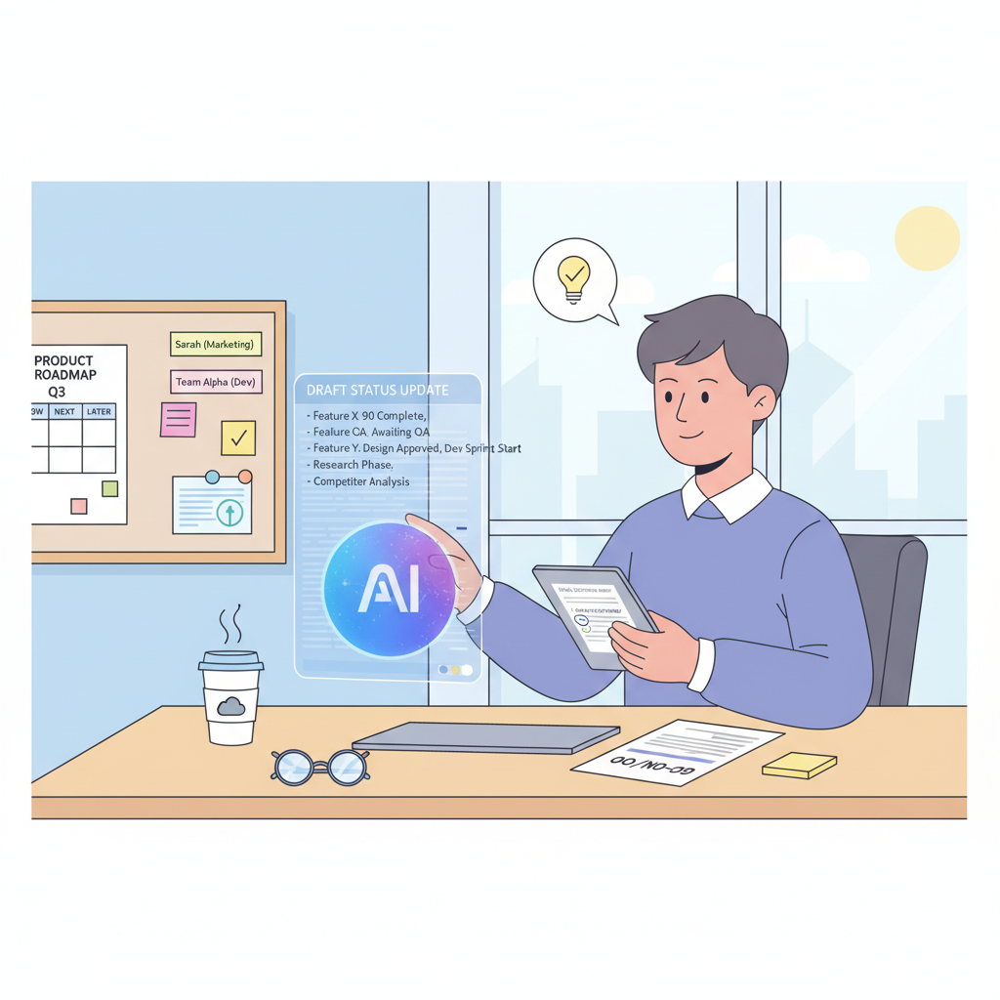
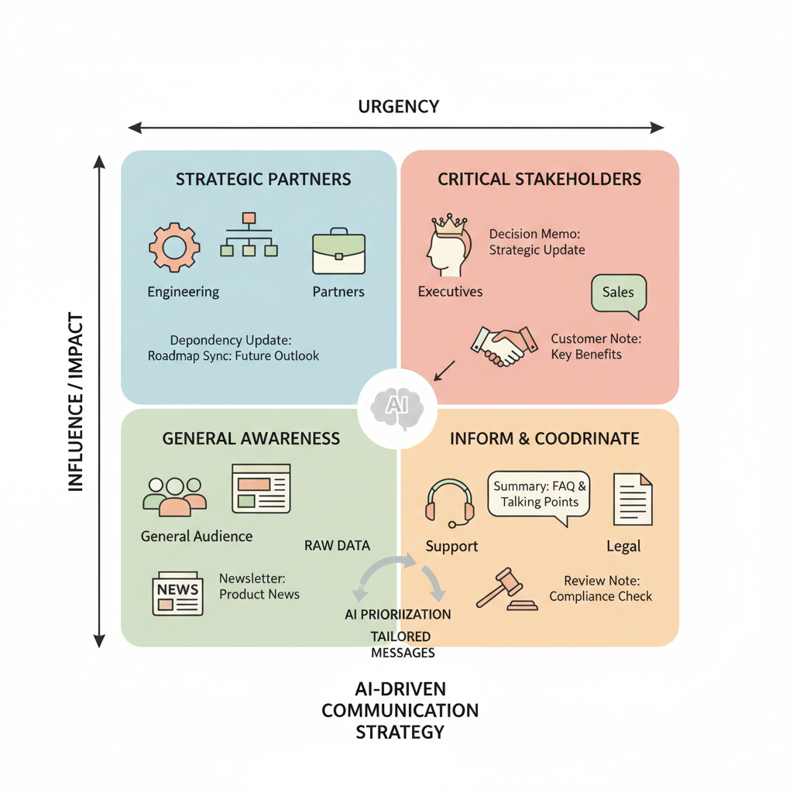
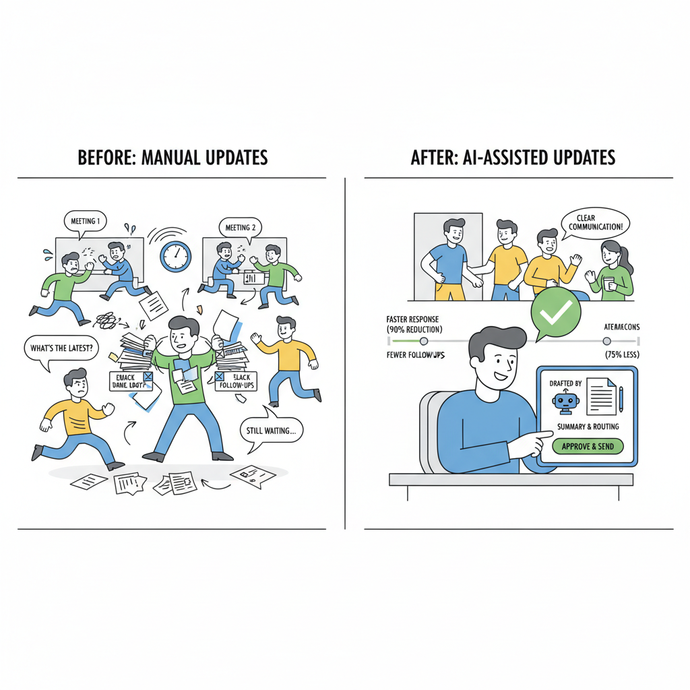

# How PMs Can Use AI to Manage Stakeholders Faster Without Losing Trust

## Why AI for stakeholder management is a leverage play, not a replacement for judgment

Think of AI in stakeholder management like a **very fast executive assistant**: it can draft the brief, summarize the meeting, and pull together the follow-up, but it cannot decide whether a launch should slip or whether a VP conflict needs a live conversation. That matters because **not all PM work has the same business value**. Status drafts, meeting prep, and follow-up synthesis are high-effort tasks, but they often create less strategic value than the judgment calls that shape alignment and trade-offs.

AI is best used where the work is repetitive and information-heavy, not where the decision is political or ambiguous. Tools for product operations and stakeholder communication are already being positioned to help teams prioritize updates, sharpen business focus, and reduce noise ([Productboard](https://www.productboard.com/blog/the-power-of-ai-agents-in-product-operations-workflows/); [Microsoft](https://www.microsoft.com/en-us/windows/business/knowledge-center/ai-productivity-tools-for-modern-business); [Datagrid](https://www.datagrid.com/blog/ai-agents-stakeholder-communication-prioritization)). **This means your team can spend less time producing updates and more time curating the signal, context, and recommendation that leaders actually need.**

The business trade-off is simple: **AI can speed up communication, but it cannot replace accountability**. When a roadmap decision affects revenue, customer trust, or cross-functional power dynamics, the PM still needs to make the call, explain the trade-off, and manage the room. Research on AI in product work emphasizes that leadership still drives innovation and shapes how AI-created productivity gets used ([University of California, Berkeley CMR](https://cmr.berkeley.edu/2026/02/when-ai-joins-the-product-team-will-leadership-still-drives-innovation/); [EY](https://www.ey.com/en_us/newsroom/2025/12/ai-driven-productivity-is-fueling-reinvestment-over-workforce-reductions)). **When this goes wrong, you'll see it as cleaner-looking updates with worse decisions underneath.**

> **💡 What this means for you as a PM**  
> AI can save PM time, but only if you use that time to improve decision quality and alignment, not just produce more updates. Set expectations with leadership that AI is a productivity lever, not a shortcut around judgment or accountability. That framing helps you protect trust: executives get faster, clearer inputs, while the PM still owns the recommendation and the trade-off.

For product leaders, the opportunity is not just efficiency; it is **ROI through better allocation of PM time**. If AI trims repetitive coordination work, your team can reinvest that capacity into sharper stakeholder prep, better scenario planning, and stronger executive narratives. That is a better use of scarce PM bandwidth than asking the team to send more status messages faster.

*AI can speed up communication, but PM judgment still owns the decision.*

## The highest-value stakeholder tasks to automate first

Think of AI here like a **really fast executive assistant** (someone who turns meetings into follow-ups and drafts emails for you), not a replacement for judgment. The best place to start is the **repetitive, low-risk communication layer**: meeting notes, status summaries, action-item tracking, and first-draft stakeholder emails. Evidence from product-operations and stakeholder-communication use cases shows teams are already using AI to speed recurring coordination work and sharpen business focus ([Productboard](https://www.productboard.com/blog/the-power-of-ai-agents-in-product-operations-workflows/), [Microsoft](https://www.microsoft.com/en-us/windows/business/knowledge-center/ai-productivity-tools-for-modern-business), [Datagrid](https://www.datagrid.com/blog/ai-agents-stakeholder-communication-prioritization)).

> **💡 What this means for you as a PM**  
> The fastest way to free up PM capacity is to automate the repetitive communication layer while keeping tough conversations manual.  
> This means your team can spend less time rewriting the same update for five audiences and more time making product calls. It also lowers the risk of missed follow-ups, which is where stakeholder trust quietly erodes.

A practical rule is to let AI handle the **same core message in different wrappers** (the same update, rewritten for executives, sales, support, or engineering). For example, a launch delay can become a concise executive note about business impact, a customer-facing note for support, and a dependency-focused update for engineering. **This affects your roadmap because** it creates a lightweight communication workflow (a repeatable process for drafting, reviewing, and sending updates) that scales without adding headcount.

The business trade-off is clear: **use automation for speed, not for conflict**. Keep AI out of sensitive narratives, trade-offs, and conversations where you need to read the room, negotiate priorities, or explain bad news. When this goes wrong, you’ll see it as polished-but-unsafe messages that sound consistent but miss the real issue.

To make this safe, build a **simple review-and-approval loop** (a human checkpoint before anything important goes out). AI can draft, summarize, and reformat, but a PM should approve tone, facts, and priority before sending. That approach gives you faster output without creating off-brand or inconsistent communication, which is especially important when leadership is watching trust as closely as delivery.

## How AI improves stakeholder prioritization and message targeting

Think of stakeholder management like **air traffic control**: not every plane needs the same instructions, and the wrong message at the wrong time creates delays. In product work, an AI agent (software that can sort, draft, and route work with some autonomy) can help you decide **who needs a heads-up, who needs a decision, and who only needs a summary**. That matters because stakeholder communication is not just “keeping people informed” — it shapes launch speed, roadmap confidence, and how much rework your team absorbs later.  

AI can rank stakeholders by **influence, urgency, and likely impact** on the roadmap or launch decision, which is especially useful when a release touches Sales, Support, Legal, and Leadership at once. For example, if a pricing change affects renewals, AI can help you identify that Finance needs risk context, Support needs customer-facing talking points, and your VP needs a decision memo (a short note that asks for a clear yes/no or trade-off choice). This means your team can spend less time broadcasting the same update to everyone and more time getting the few decisions that actually unblock progress.  

AI also helps you **reshape one update into different message formats** depending on the audience’s job. A launch update to Engineering might emphasize dependencies and timing, while the same update to GTM leaders should focus on confidence, customer impact, and what could slip; this is the practical equivalent of giving each stakeholder the version they need to act. In product-ops workflows (repeatable coordination tasks that keep product work moving), tools like Productboard’s AI agents (automated assistants for product workflows) and Datagrid’s stakeholder communication use case show the direction teams are heading: less manual chasing, more targeted routing, and faster escalation when someone is likely to be surprised later ([Productboard](https://www.productboard.com/blog/the-power-of-ai-agents-in-product-operations-workflows/), [Datagrid](https://www.datagrid.com/blog/ai-agents-stakeholder-communication-prioritization)).  

> **💡 What this means for you as a PM**  
> When PMs target the right stakeholders with the right message, they reduce rework, surprises, and late-stage resistance. The business trade-off is clear: a little time upfront to classify audiences and tailor updates can save far more time in escalations, meeting churn, and missed launch windows. This affects your roadmap because you can choose a lighter communication cadence for low-risk items and a tighter cadence for high-risk decisions, instead of treating every update like a status broadcast.  

You can also use AI to **spot communication gaps** by comparing who was informed, who needs escalation, and who is most likely to be caught off guard. That helps you catch issues like “Legal was looped in too late” or “Customer Success heard about the rollout after customers did,” which are the moments when trust gets damaged. At the business level, AI-driven productivity is increasingly being framed as a way to **reinvest time into higher-value work rather than just cut headcount**, which makes communication efficiency a real ROI lever, not a nice-to-have ([EY](https://www.ey.com/en_us/newsroom/2025/12/ai-driven-productivity-is-fueling-reinvestment-over-workforce-reductions), [Microsoft](https://www.microsoft.com/en-us/windows/business/knowledge-center/ai-productivity-tools-for-modern-business)).

*AI helps tailor the same update to the right audience, reducing rework and confusion.*

## What business value AI-driven stakeholder management can unlock

Think of stakeholder management like **air traffic control for a product team**: when the tower gets clearer signals, fewer planes circle, and everyone lands on time. In product work, AI can act as that signal booster by helping summarize updates, draft follow-ups, and surface who needs attention next. The business value is not “AI for AI’s sake” — it is less coordination drag and more time spent on discovery, roadmap validation, and customer conversations. ([Source](https://cmr.berkeley.edu/2026/02/when-ai-joins-the-product-team-will-leadership-still-drives-innovation/), [Source](https://www.microsoft.com/en-us/windows/business/knowledge-center/ai-productivity-tools-for-modern-business))

If you want to make the case internally, start by translating **time saved into capacity created**. For example, if AI removes 3 hours a week of recurring status updates, stakeholder follow-ups, and meeting recaps, that is not just a productivity gain — it is 3 more hours for a PM to validate an opportunity, prep a launch, or talk to customers. This affects your roadmap because the same headcount can support more decision-making without adding meeting load. ([Source](https://www.microsoft.com/en-us/windows/business/knowledge-center/ai-productivity-tools-for-modern-business), [Source](https://www.boreal-is.com/blog/ai-save-time-stakeholder-management/))

**Decision quality also improves when communication is clearer.** AI-assisted stakeholder communication can help keep updates consistent, reduce missed context, and shorten the back-and-forth that usually slows approvals. When this goes wrong, you see it as escalations, repeated “can you clarify?” loops, and decisions that stall because leaders are working from different versions of the truth. Teams using AI in product operations and cross-functional workflows are explicitly targeting that kind of coordination friction. ([Source](https://www.productboard.com/blog/the-power-of-ai-agents-in-product-operations-workflows/), [Source](https://www.agilebusiness.org/resource/using-ai-to-empower-cross-functional-teams.html), [Source](https://www.datagrid.com/blog/ai-agents-stakeholder-communication-prioritization))

**The ROI story gets stronger when you connect efficiency to reinvestment.** A useful lens is that productivity gains are often redirected into higher-value work such as R&D, pricing, cybersecurity, or acquisitions rather than simply cutting costs. That means stakeholder AI can become a budget enabler: if it lowers coordination overhead, leadership may be more willing to fund strategic bets instead of expanding administrative capacity. ([Source](https://www.ey.com/en_us/newsroom/2025/12/ai-driven-productivity-is-fueling-reinvestment-over-workforce-reductions), [Source](https://www.zylo.com/blog/ai-cost/))

> **💡 What this means for you as a PM**  
> If AI shortens coordination overhead, the real win is not fewer meetings—it is more product bandwidth for growth work.  
> Measure that win with metrics like cycle time (how long work takes from start to finish), stakeholder response latency (how long people take to reply), meeting volume, and decision turnaround (how fast decisions get made). Those numbers help you justify the tool, prove it is reducing risk, and show whether the team is actually moving faster or just generating more output.

*A simple review loop lets teams save time without losing trust.*

## Real-world examples of AI helping product teams work with stakeholders better

Think of AI in stakeholder management like a **smart chief of staff (a helper that gathers updates, sorts priorities, and drafts status notes)** instead of a robot that replaces the PM. In product operations tools, **agentic workflows (systems that take multi-step actions on your behalf)** are being used to pull updates from roadmaps, feedback, and analytics so teams can send weekly stakeholder notes without starting from scratch every time ([Productboard](https://www.productboard.com/blog/the-power-of-ai-agents-in-product-operations-workflows/)). That changes the PM job from “assemble the update” to “decide what matters,” which is a better use of time.

Another pattern is **stakeholder prioritization (ranking who should get which update first)**. Tools like Datagrid describe AI agents that help sort communication by urgency and influence, so a launch-risk note reaches the right exec sooner while a lower-priority reminder can wait ([Datagrid](https://www.datagrid.com/blog/ai-agents-stakeholder-communication-prioritization)). **This means your team can** reduce the manual coordination tax that often slows down cross-functional work, especially when product, sales, support, and leadership all need slightly different versions of the same story ([Datagrid](https://www.datagrid.com/blog/ai-agents-stakeholder-communication-prioritization)).

The business signal here is bigger than time saved. **AI productivity (getting more useful work done with the same team)** is increasingly being framed as a way to improve focus and reinvest effort into higher-value decisions, not just cut headcount ([Microsoft](https://www.microsoft.com/en-us/windows/business/knowledge-center/ai-productivity-tools-for-modern-business); [EY](https://www.ey.com/en_us/newsroom/2025/12/ai-driven-productivity-is-fueling-reinvestment-over-workforce-reductions)). In other words, if AI trims two hours from weekly reporting, the win is not “fewer people on the team” — it is faster escalation, cleaner decisions, and more time spent resolving customer and revenue risks.

> **💡 What this means for you as a PM**  
> Seeing how other teams apply AI helps PMs justify adoption internally and avoid building a flashy but low-value workflow. Borrow the pattern, not the buzzwords: tighten your update loop, segment audiences by what they need to know, and use AI to reduce coordination delays. If you do this well, your roadmap gets clearer faster because stakeholders spend less time debating status and more time aligning on decisions.

What PMs should borrow from these examples is simple: **shorter update cycles, clearer audience segmentation, and faster alignment**. A practical test is whether AI helps you send one crisp exec summary, one detailed team update, and one customer-facing note from the same source of truth. **When this goes wrong, you’ll see it as** generic updates, confused stakeholders, or a false sense of progress — which is why the goal is not “more automation,” but **better decisions, faster**.

## How to implement AI in stakeholder management without damaging trust

Think of AI in stakeholder management like a junior coordinator who can **draft the first version of an update, sort the inbox, and flag urgent items**—but should not be the person making promises to the CEO. The safest rollout is to use AI for **low-stakes drafting and triage first**, then compare its output to a human baseline (a side-by-side check against what a PM would normally send) before you let it touch broader communications. That matters because AI can improve focus and productivity, but product leaders are still expected to steer the narrative, not outsource it. ([Microsoft](https://www.microsoft.com/en-us/windows/business/knowledge-center/ai-productivity-tools-for-modern-business); [Berkeley CMR](https://cmr.berkeley.edu/2026/02/when-ai-joins-the-product-team-will-leadership-still-drives-innovation/))

Set **clear guardrails** before anyone uses AI on stakeholder work. In plain terms, define the rules for tone, accuracy, confidential information, and which messages need human approval before they go out; this is especially important for executive updates, launch delays, and conflict-heavy threads. Research and product-ops guidance on AI agents in stakeholder communication consistently points to the same business outcome: faster coordination only works when teams keep ownership of the final message and escalation path. ([Productboard](https://www.productboard.com/blog/the-power-of-ai-agents-in-product-operations-workflows/); [Datagrid](https://www.datagrid.com/blog/ai-agents-stakeholder-communication-prioritization); [Agile Seekers](https://agileseekers.com/blog/how-to-use-ai-prompts-for-better-stakeholder-engagement))

> **💡 What this means for you as a PM**  
> The best AI rollout is the one stakeholders barely notice—because it makes communication faster without making it feel less human.  
> This means your team can save time on status updates and meeting follow-ups, but only if you keep approval rights tight for external-facing messages. It also affects your roadmap because you may need a lightweight review policy, shared prompt templates, and a clear “do not automate” list for sensitive situations.

For example, a PM at **Spotify, Netflix, or Uber** could use AI to draft a weekly stakeholder digest, summarize a messy Slack thread, or propose a first-pass launch note—but still review it before sending. The business trade-off is simple: **more speed with more process discipline**. If you skip that discipline, stakeholders will feel the risk immediately as sloppy commitments, inconsistent tone, or “automated” messages that damage credibility. ([Boreal IS](https://www.boreal-is.com/blog/ai-save-time-stakeholder-management/); [West Monroe](https://www.westmonroe.com/client-results/generative-ai-diligence-reveals-productivity-improvement))

Treat AI as **drafting and triage support, not final authority** on narrative, commitments, or prioritization. Put escalation rules in writing for sensitive stakeholders, executive updates, launch delays, and cross-functional conflict so everyone knows when the AI can assist and when a human must step in. This keeps the upside—faster throughput, better focus, less manual reporting—without turning trust into collateral damage.

---

## 📚 Further Reading

The following sources were retrieved and used during research for this blog. All links are verified — none are invented.

1. **[When AI Joins the Product Team, Will Leadership Still Drive Innovation?](https://cmr.berkeley.edu/2026/02/when-ai-joins-the-product-team-will-leadership-still-drives-innovation/)** · *UC Berkeley CMR*
   > CEOs and CFOs hear AI can turbocharge product development; key insight is AI amplifies talent, not replaces strategic leadership....

2. **[AI-driven productivity is fueling reinvestment over workforce reductions](https://www.ey.com/en_us/newsroom/2025/12/ai-driven-productivity-is-fueling-reinvestment-over-workforce-reductions)** · *EY*
   > EY says organizations using AI productivity gains are reinvesting in AI, cybersecurity, R&D, pricing, and acquisitions....

3. **[Cutting through the noise: How AI productivity tools sharpen business focus and improve outcomes](https://www.microsoft.com/en-us/windows/business/knowledge-center/ai-productivity-tools-for-modern-business)** · *Microsoft*
   > Microsoft argues AI tools speed decisions, sharpen prioritization, and improve collaboration by turning data into real-time action....

4. **[AI Agents in Product Operations | Productboard](https://www.productboard.com/blog/the-power-of-ai-agents-in-product-operations-workflows/)** · *Productboard*
   > Productboard highlights agentic workflows that automate weekly product updates by pulling data from roadmapping, analytics, and feedback tools....

5. **[Streamline Stakeholder Communication with AI Agents - Datagrid](https://www.datagrid.com/blog/ai-agents-stakeholder-communication-prioritization)** · *Datagrid*
   > Datagrid says AI agents can automate stakeholder communication prioritization by ranking and personalizing updates by influence and urgency....

6. **[How To Use AI Prompts For Better Stakeholder Engagement](https://agileseekers.com/blog/how-to-use-ai-prompts-for-better-stakeholder-engagement)** · *Agile Seekers*
   > Agile Seekers suggests AI prompts for conflict resolution, risk communication, vision alignment, and stakeholder follow-ups....

7. **[7 Ways AI Can Save Time in Stakeholder Management (and Deliver Smarter Reporting)](https://www.boreal-is.com/blog/ai-save-time-stakeholder-management/)** · *Boreal IS*
   > Boreal IS outlines AI uses for stakeholder management, including translation, persona-based messaging, and faster reporting....

8. **[The Stakeholder Perspective in the Generative AI Scenario and the AI-Stakeholders](https://pmworldlibrary.net/wp-content/uploads/2024/08/pmwj144-Aug2024-Pirozzi-Stakeholder-Perspective-in-Generative-AI-Scenario-and-AI-Stakeholders.pdf)** · *PM World Library*
   > PM World Journal paper says AI can improve decision-making, automate reporting, and enable real-time updates and personalized engagement....

9. **[Top 10 Ways AI is Transforming Project Management in 2026](https://www.intelegain.com/top-10-ways-ai-is-transforming-project-management-in-2026/)** · *Intelegain*
   > Intelegain describes AI benefits in PM such as predictive risk management, automated reporting, and stakeholder collaboration....

10. **[Using AI to Empower Cross-Functional Teams](https://www.agilebusiness.org/resource/using-ai-to-empower-cross-functional-teams.html)** · *Agile Business*
   > Agile Business says AI can break silos, automate routine tasks, and translate complex data into clear recommendations....

11. **[7 Critical Use Cases For AI In Product Management In 2026](https://tezeract.ai/ai-in-product-management/)** · *Tezeract*
   > Tezeract reviews AI use cases in product management, including scheduling, prioritization, and bottleneck detection....

12. **[Best AI Tools for Product Managers in 2026 by Use Case](https://bagel.ai/blog/ai-tools-for-product-managers-in-2026-a-practical-guide-by-use-case/)** · *Bagel AI*
   > Bagel AI explains AI tools for PMs across research, prioritization, and communication, with emphasis on decision quality....

13. **[10 Best AI Tools for Product Managers in 2026 | Juma (Team-GPT)](https://juma.ai/blog/ai-tools-for-product-managers)** · *Juma* · 2025-12-19
   > Juma's guide lists AI tools for PMs for collaboration, research, prioritization, forecasting, and KPI tracking....

14. **[The Top 12 AI Tools for Product Management in 2026 | FeatureBot Blog](https://featurebot.com/blog/ai-tools-for-product-management)** · *FeatureBot*
   > FeatureBot compares PM tools with AI features for feedback, prioritization, roadmapping, and brief drafting....

15. **[Generative AI uncovers 30% productivity potential | West Monroe](https://www.westmonroe.com/client-results/generative-ai-diligence-reveals-productivity-improvement)** · *West Monroe*
   > West Monroe reports AI diligence found up to 30% productivity improvement and major warehouse automation gains....

16. **[AI Pricing Tool Comparison for 2026: Best Pricing Strategy Software](https://www.buynomics.com/articles/ai-pricing-tool-comparison)** · *Buynomics*
   > Buynomics cites early AI adoption in revenue growth management and benefits like better scenario planning and faster decisions....

17. **[AI Pricing: What's the True AI Cost for Businesses in 2026?](https://zylo.com/blog/ai-cost/)** · *Zylo*
   > Zylo discusses AI cost drivers, governance, and rising adoption of AI-native apps across business workflows....

18. **[Industrial Copilots: Top 10 Vendors to Watch in 2025 - Augmentir](https://www.augmentir.com/blog/top-10-genai-powered-industrial-copilot-vendors-to-watch-in-2025)** · *Augmentir*
   > Augmentir surveys industrial copilots and their use in contextual insights, maintenance, quality, and operational decision-making....

19. **[The Role of AI Copilots in Modern Manufacturing - Retrocausal](https://retrocausal.ai/blog/ai-copilots-in-manufacturing/)** · *Retrocausal*
   > Retrocausal describes AI copilots for manufacturing training, real-time feedback, quality, compliance, and productivity....

20. **[AI Assist - Stack Overflow](https://stackoverflow.com/ai-assist)** · *Stack Overflow*
   > Stack Overflow AI Assist is an AI-powered search and discovery tool to help developers get answers instantly and learn along the way....

21. **[Massachusetts Institute of Technology - MIT News](https://news.mit.edu/topic/artificial-intelligence2)** · *MIT News*
   > MIT News topic page for artificial intelligence, including recent research and applied AI coverage....

