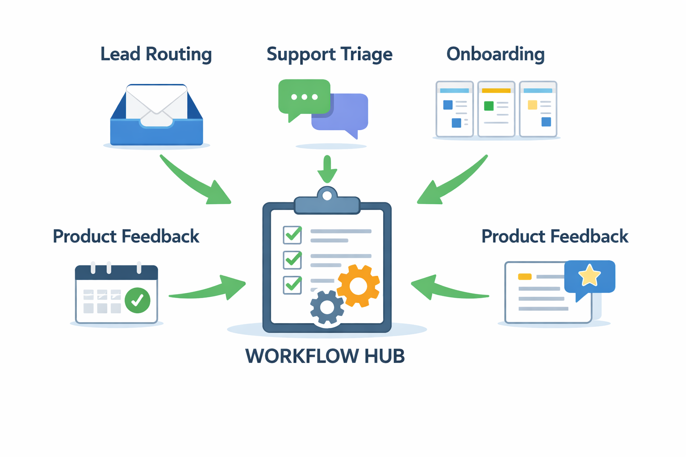
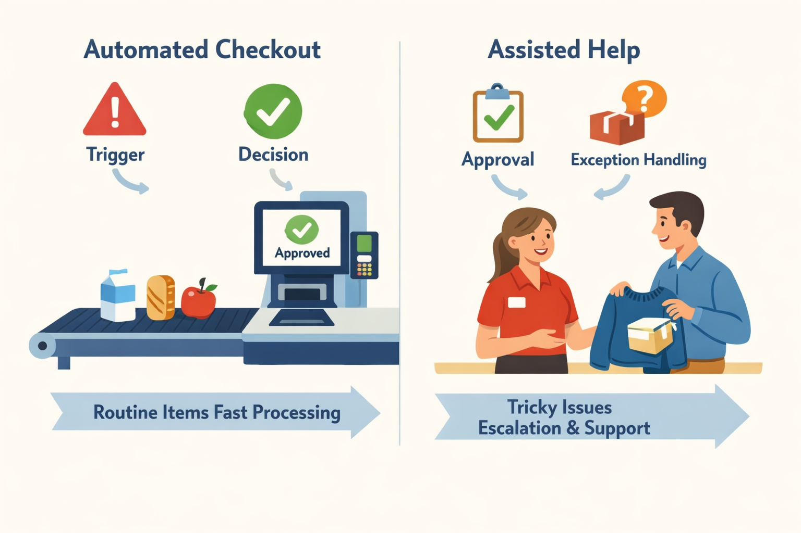
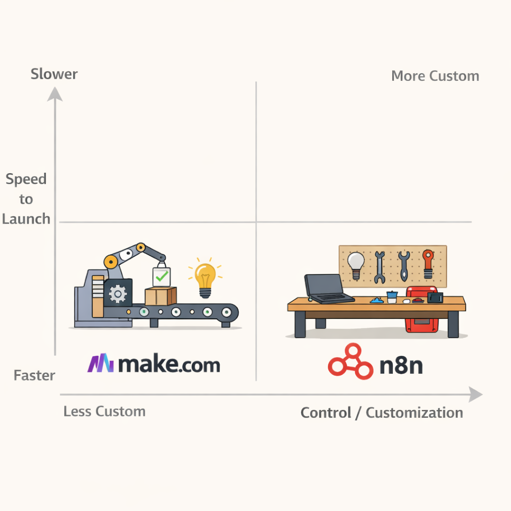

# How Product Managers Can Use Agentic Orchestration Platforms Like n8n and Make.com

## What agentic orchestration platforms are, and why PMs should care

Think of **agentic orchestration** like a smart ops coordinator (someone who routes work across people and tools without losing the thread). Instead of a PM chasing updates in Slack, Jira, and Notion, a platform like n8n or Make.com can connect a trigger (an event that starts work), tools (the apps your team already uses), and human approvals (a person checking a decision before it goes out) into one repeatable workflow.

The **“agentic” part** means the system can choose the next step on its own, rather than following only a fixed checklist. That sounds powerful, but it also means you need guardrails (rules that prevent bad outcomes), escalation rules (when to hand off to a human), and review steps for risky actions. This means your team can automate more than simple alerts — for example, triaging product feedback from Slack into Jira and Notion, or routing UAT issues (user acceptance testing problems) to the right owner — while still keeping humans in the loop where judgment matters.

**What these platforms are best at** is reducing fragmented tool work, repetitive ops tasks, slow handoffs, and inconsistent execution. If your team spends time copying data between Salesforce, Google Sheets, Slack, and Jira, orchestration can cut that drag and make delivery more predictable. **The business trade-off is** that you gain speed and consistency, but you also add a new layer to maintain, so it’s best used where the workflow is clear and repeated often.

> **💡 What this means for you as a PM**
> If you can name the workflow, you can usually decide whether orchestration will save your team time or just add another layer of process. Use it for high-volume, low-risk workflows that are currently manual and annoying, especially where handoffs slow down shipping or customer response times. Avoid it for core product logic, high-stakes decisions, or areas where differentiation depends on custom product behavior.

## Choosing between n8n and Make.com as a PM decision

Think of **Make.com as a ready-made assembly line** and **n8n as a workshop you can customize**. Both help teams connect apps and automate work, but they optimize for different kinds of product organizations. Recent comparisons consistently position n8n around **self-hosting (running it on your own infrastructure), deeper customization, and data control**, while Make.com is framed as **faster to launch with a more polished no-code experience (build flows without writing code)** ([Elementor](https://elementor.com/blog/make-com-vs-n8n-2025/), [Make vs n8n](https://www.make.com/en/compare/make-vs-n8n)).

The **buying question should start with workflow complexity**, not brand preference. If your need is simple cross-app automation (for example, copying lead data from a form into Slack and Salesforce), Make.com often fits the PM need for speed. If you need branching logic (different paths based on conditions), custom code (small bits of logic for special cases), or private infrastructure (systems kept inside your company boundary), n8n is usually the better fit because it can support more complex orchestration (coordinating multiple steps across tools) ([n8n](https://n8n.io/), [Latenode](https://latenode.com/blog/platform-comparisons-alternatives/n8n-alternatives/n8n-vs-make-com-2025-complete-platform-comparison-pricing-analysis-for-workflow-automation-for-workflow-automation)).

**Operational ownership is where PMs get surprised.** When a workflow fails at 2 a.m., someone has to decide whether Product, Operations, or Engineering owns the fix. Make.com can reduce setup friction, but your team still needs rules for monitoring, retries, and handoff; n8n can give more control, but that usually means more responsibility for maintenance and support ([n8n Pricing](https://n8n.io/pricing/), [Domo](https://www.domo.com/learn/article/best-ai-orchestration-platforms)). This affects your roadmap because a “quick automation” can become a hidden support queue if ownership is unclear.

**Procurement and compliance can decide the platform before features do.** If your company has strict security review, auditability (clear records of what happened), or data residency requirements (where data is allowed to live), n8n’s self-hosting model may be easier to approve than a fully managed cloud tool. If your team needs enterprise adoption across functions, the platform choice should be aligned with legal, security, and IT from day one, not after the first pilot succeeds ([n8n](https://n8n.io/itops/), [Elementor](https://elementor.com/blog/make-com-vs-n8n-2025/)).

> **💡 What this means for you as a PM**
> The right platform is the one your team can operate safely and sustainably, not the one with the longest feature list. Make.com is often the better choice when you need fast wins, low setup effort, and a clear no-code path for non-technical teams. n8n is often the better choice when control, compliance, and deeper workflow design matter more than launch speed.

## High-Value Use Cases PMs Can Launch First

Think of these platforms like a **well-run operations desk** that takes repetitive requests and routes them to the right person without your team having to chase every email. The best starter workflows are the ones where the same work shows up every day, and the cost of delay is easy to see. Platforms like n8n (an AI workflow automation platform that connects tools and triggers actions) and Make.com (a visual automation tool for linking apps and steps) are built for exactly these kinds of repeatable product and operations tasks ([n8n](https://n8n.io/), [Make vs n8n](https://www.make.com/en/compare/make-vs-n8n)).

**Start with workflows that are frequent, business-critical, and clean enough to automate.** Good first bets include lead routing, support triage, onboarding sequences, product feedback ingestion, and internal approvals. For example, n8n has published a workflow for triaging product UAT feedback across OpenAI, Jira, Slack, Notion, and Google Sheets, which is a good model for turning scattered feedback into a structured pipeline ([n8n workflow](https://n8n.io/workflows/12135-triage-product-uat-feedback-with-openai-jira-slack-notion-and-google-sheets/)). Use cases like these show up in the real world because they reduce manual handoffs and keep work moving.

*The best first automations are frequent, low-risk workflows with clear business value.*

> **💡 What this means for you as a PM**
> The fastest wins come from boring, high-frequency workflows where small improvements compound into measurable team capacity.
> This affects your roadmap because you can often unlock value without waiting for a full engineering project. It also changes your prioritization: the goal is not novelty, but freeing time in customer-facing or revenue-sensitive processes.

**Prioritize by frequency, impact, and data quality, not by how “cool” the automation sounds.** A support triage flow that runs 300 times a week is usually more valuable than a clever one-off demo. The business trade-off is simple: if the input data is messy, the workflow is full of exceptions, or the process itself is broken, automation will just make the pain faster. Platforms like n8n and Make.com are especially useful when the steps are stable enough to standardize and the outputs matter to conversion, SLA adherence (meeting promised response times), or customer experience ([n8n use cases](https://www.lowcode.agency/blog/n8n-use-cases), [Make.com use cases](https://www.fruitionservices.io/post/make-com-use-cases)).

**Define success in product terms, not automation terms.** Your team can measure response-time reduction, fewer manual touches, higher conversion, lower backlog, or better SLA adherence. When this goes wrong, you’ll see it as a “working” workflow that still creates rework because it automates a broken process, over-handles exceptions, or fails on edge cases like VIP customers, duplicate records, or unusual refund requests.

**A practical PM filter is simple:**
- **High frequency:** happens every day or every week
- **Clear business impact:** affects revenue, retention, or support load
- **Clean data:** fields and handoffs are consistent enough to trust
- **Low exception rate:** most cases follow the same path

This means your first automations should often feel unglamorous: routing inbound leads to the right AE, turning support tickets into triaged tasks, welcoming new users through onboarding, or collecting product feedback from multiple channels into one queue. Those are the workflows where agentic orchestration (automated multi-step coordination across tools and tasks) creates immediate operational leverage without creating a large engineering dependency.

## How to design agentic workflows with human guardrails

Think of an agentic workflow like a **self-checkout lane with a store associate nearby**: customers move faster, but someone is still there for the tricky items and payment issues. In product terms, the workflow starts with a **trigger** (an event that kicks off the process, like a refund request), then makes a **decision** (a choice about what to do next), performs a **tool action** (a task using another system, like creating a Jira ticket), and finally handles **exceptions** (the weird cases that do not fit the pattern) with **human approval** (a person signing off before the action is completed).

The business goal is **speed without surprise**. This means your team can automate repetitive work in tools like n8n (a workflow automation platform) or Make.com (a no-code automation platform) while still keeping a person in the loop when the stakes are high. A practical example is triaging product UAT feedback (user acceptance testing feedback, or tester comments before release): the workflow can collect issues, route obvious bugs to the right team, and ask a PM to review anything ambiguous before it becomes a customer-facing commitment.

*Agentic workflows should be faster, but customer-facing or risky steps still need human guardrails.*

> **💡 What this means for you as a PM**
> Good orchestration speeds up work; good guardrails prevent automation from becoming a customer trust problem.  
> Your job is to decide which actions the workflow can take on its own, and which ones require a person before the system acts. This affects your roadmap because overly aggressive automation can create rollback work, support escalations, and brand risk if it sends the wrong message to customers.

The safest place for **human-in-the-loop checks** (a person reviewing a step before execution) is anywhere the workflow touches customers, money, or sensitive information. For example, customer-facing actions like sending a cancellation notice, financial changes like issuing a refund, sensitive data handling like exposing personal details, and ambiguous escalation paths like a complaint that could be either a bug or a billing issue should not run fully automatically. When this goes wrong, you’ll see it as customer confusion, compliance headaches, or support tickets that take longer to unwind than the original task.

Your PM job is to define **clear boundaries** (the rules the workflow must follow). That means setting allowed actions, **confidence thresholds** (how sure the system must be before acting), fallback paths (what happens when it is unsure), and hard “never do this automatically” rules. For a product like Zendesk or Intercom, that might mean the agent can tag and route a ticket on its own, but it can never promise a refund or close a complaint without approval.

The customer experience trade-off is simple: **faster resolution is only a win if reliability and transparency stay high**. If the workflow is fast but opaque, users lose trust; if it is careful but too slow, the automation does not matter. The best design makes the automation feel predictable: customers get quicker responses, and your team keeps control of the decisions that could damage trust.

## Business impact, ROI, and operating model for PMs

Think of orchestration like a **back-office relay team**: if every handoff is clean, work moves faster; if one runner drops the baton, the whole race slows down. For a PM, the question is not “can we automate this?” but **“does this automation create enough business value to justify the ongoing cost?”** That value usually shows up in four places: labor hours saved, shorter cycle times, fewer errors, and better conversion or retention when follow-up gets faster.

A useful ROI model is simple: **hours saved × loaded hourly cost + revenue lift from faster response - platform and upkeep costs**. For example, automating UAT feedback triage, lead routing, or customer support escalation can cut manual sorting time and reduce lag between an event and a human response. When that lag is tied to sales follow-up, onboarding, churn recovery, or incident resolution, the business trade-off is no longer just efficiency—it becomes **revenue protection and team throughput**.

> **💡 What this means for you as a PM**
> If you cannot connect automation to a measurable business outcome, it is probably a convenience tool—not a product investment. Use metrics leadership already cares about: cost-to-serve, conversion rate, retention, SLA compliance, and cycle time. That makes the case legible to finance, ops, and engineering, and it helps you avoid automating busywork that never pays back.

The **build-versus-buy decision** should compare platform subscription cost with engineering time, maintenance overhead, and opportunity cost. A platform like n8n or Make.com can be cheaper than custom code when the workflow is stable, the inputs are predictable, and the value comes from speed to launch. But if the workflow changes often, touches sensitive data, or needs deep product logic, the hidden cost is not just the tool fee—it is the time your team spends debugging, monitoring, and updating it.

Ownership matters just as much as economics. **Someone must own monitoring, someone must own changes, and someone must approve riskier updates**. In practice, that often means product defines the business rules, operations or support monitors failures, and engineering reviews integrations that touch critical systems. If nobody owns the workflow, you do not have automation—you have a fragile shadow process.

To create an internal business case, frame the request like a product proposal: **baseline, target, and payback period**. Start with current volume, current manual effort, error rate, and response time. Then show the expected improvement in one or two metrics that leaders already track, such as more qualified leads handled per rep, fewer missed follow-ups, lower support cost per ticket, or faster launch of internal workflows. This makes the decision about **prioritization, not novelty**.

## Real-world examples: what companies and product teams are doing with n8n and Make.com

Think of these platforms like **ops teams with a clipboard and a stopwatch**: they take recurring work, route it to the right place, and keep people from doing the same task twice. In practice, that shows up in workflows for **CRM automation, onboarding, support triage, lead management, and AI-assisted operations**—the kinds of repetitive jobs that quietly consume product and go-to-market time. n8n positions itself as an **AI workflow automation platform** (a tool for connecting apps and routing work across them), while Make.com is commonly used by non-engineering teams that want to ship automations quickly ([n8n](https://n8n.io/), [Elementor](https://elementor.com/blog/make-com-vs-n8n-2025/)).

A strong PM pattern is **UAT feedback triage** (sorting user acceptance testing feedback into the right buckets). n8n shows a workflow that connects **OpenAI** (an AI model for classifying text), **Jira** (a work-tracking tool), **Slack** (a team messaging tool), **Notion** (a documentation workspace), and **Google Sheets** (a spreadsheet) to turn raw feedback into structured work items ([n8n workflow](https://n8n.io/workflows/12135-triage-product-uat-feedback-with-openai-jira-slack-notion-and-google-sheets/)). That means your team can reduce manual sorting, speed up bug intake, and make sure product, QA, and engineering are all looking at the same source of truth. The business trade-off is **faster response with less coordination overhead**, but only if you add a clear review step so bad classification does not create noisy tickets.

*Choose based on workflow complexity: fast launch with Make.com, deeper control with n8n.*

> **💡 What this means for you as a PM**
> Seeing real workflows makes it easier to choose pilots that are credible, low-risk, and likely to show value quickly. Start with a workflow where the output is easy to verify, like routing feedback or tagging leads, so you can measure cycle time, triage quality, or response speed before expanding. This also helps you decide which team should own it: product ops for feedback flows, support ops for case routing, or GTM ops for lead handling.

For **Make.com**, the most realistic adoption story is usually **GTM and operations automation** (repeatable work in sales, marketing, and back-office teams). Public examples describe teams using Make.com to automate business processes with AI, including recurring handoffs and content/workflow tasks, which is why it tends to appeal to non-engineering operators who need speed more than customization ([Technology Rivers](https://technologyrivers.com/blog/how-we-use-make-com-to-automate-business-processes-with-ai/), [Sid Bharath](https://sidbharath.com/blog/ai-automations-make-com/), [Fruition Services](https://www.fruitionservices.io/post/make-com-use-cases)). This means your team can launch small automations without waiting for a full engineering sprint, but you should keep guardrails around approvals, data access, and exception handling.

Another useful lens is **ITOps workflow automation** (automating internal IT and operational tasks). n8n explicitly frames use cases around IT operations, which is a good reminder that these tools are not just for product teams—they can also reduce internal support burden and speed up account provisioning, alerts, and repetitive admin work ([n8n ITOps](https://n8n.io/itops/)). The PM lesson is simple: **the best first owner is the team closest to the pain**, not necessarily engineering. When a workflow touches customer data or revenue decisions, add a human checkpoint so the automation stays safe as it scales.

## How to roll out orchestration safely inside a product org

Think of orchestration like **giving your team a shared operations desk instead of everyone running side quests on their own**. A rollout works best when you treat it as a product change, not a tooling experiment: start with one team, one repeated workflow, one clear metric, and one named owner. That keeps the first win legible, makes the business value visible, and prevents “automation sprawl” where nobody knows what still runs.

Pick a pilot that is frequent, painful, and easy to measure — for example, triaging UAT feedback, routing support escalations, or updating a launch checklist across Jira, Slack, and Notion. n8n is positioned as an AI workflow automation platform (a system for connecting apps and moving work between them), and its public workflow examples show the kind of cross-tool coordination PM teams often need. The business trade-off is simple: **start with low-risk internal work before touching customer-facing flows**.

> **💡 What this means for you as a PM**
> A disciplined rollout turns automation from a one-off hack into a scalable operating capability for the product team.
> This means your team can prove time savings without betting revenue on day one. It also gives you a clean go/no-go decision: expand only when the pilot shows reliable execution, measurable cycle-time improvement, and clear ownership.

Your governance basics should be boring on purpose: **naming conventions, documentation, access control, error monitoring, and a regular review cadence**. Use names that show the team, purpose, and trigger; document what the workflow does and who owns it; limit who can edit production flows; and review failures weekly so broken automations do not become invisible operational debt. When this goes wrong, you will see it as duplicate messages, missed handoffs, or “mystery automation” nobody trusts.

Define an escalation path before launch. For example: if an internal workflow fails, alert the owning PM and the ops channel; if it fails twice, pause the automation and fall back to the manual process; if it affects customers or revenue, route to the on-call owner immediately. **This protects trust** and keeps small technical issues from becoming product incidents.

Adoption should move in layers: **internal automations first, then customer-facing workflows, then revenue-impacting paths**. Once your team has proven reliability, you can expand into higher-stakes use cases like onboarding nudges, lead routing, or renewal alerts. This affects your roadmap because it lets you buy speed in the short term without creating hidden risk in the long term.

---

## 📚 Further Reading

The following sources were retrieved and used during research for this blog. All links are verified — none are invented.

1. **[Make.com vs. n8n (2025) - Elementor](https://elementor.com/blog/make-com-vs-n8n-2025/)** · *Elementor*
   > Compares Make vs n8n on pricing, hosting, data sovereignty, and flexibility; notes n8n self-hosting and Code Node customization....

2. **[N8N vs Make.com 2025: Complete Platform Comparison + Pricing ...](https://latenode.com/blog/platform-comparisons-alternatives/n8n-alternatives/n8n-vs-make-com-2025-complete-platform-comparison-pricing-analysis-for-workflow-automation)** · *Latenode*
   > Compares hosting, interface, integrations, pricing, and scalability for workflow automation buyers....

3. **[AI Workflow Automation Platform - n8n](https://n8n.io/)** · *DuckDuckGo*
   > n8n’s homepage describes it as a workflow automation platform combining AI capabilities with business process automation....

4. **[n8n Plans and Pricing - n8n.io](https://n8n.io/pricing/)** · *DuckDuckGo*
   > n8n pricing page with plan and pricing details for workflow automation....

5. **[10 Best AI Orchestration Platforms in 2025 - Domo](https://www.domo.com/learn/article/best-ai-orchestration-platforms)** · *Domo*
   > Lists and compares AI orchestration platforms, including enterprise use cases such as UiPath agentic automation....

6. **[10 Best AI Workflow Platforms in 2025: Smarter Automation, Real ...](https://www.domo.com/learn/article/ai-workflow-platforms)** · *Domo*
   > Reviews AI workflow platforms and highlights features like agentic automation, healing agents, and document understanding....

7. **[n8n Use Cases: What Can You Actually Build? - LowCode Agency](https://www.lowcode.agency/blog/n8n-use-cases)** · *LowCode Agency* · 2026-03-25
   > March 25, 2026 guide on common n8n use cases, including CRM automation, lead routing, onboarding, and AI agent pipelines....

8. **[Triage product UAT feedback with OpenAI, Jira, Slack, Notion ... - N8N](https://n8n.io/workflows/12135-triage-product-uat-feedback-with-openai-jira-slack-notion-and-google-sheets/)** · *n8n*
   > Example workflow for product teams to triage UAT feedback with AI and human-in-the-loop controls....

9. **[ITOps Workflow Automation Software & Tools - N8N](https://n8n.io/itops/)** · *n8n*
   > n8n page for ITOps automation use cases and workflow automation benefits....

10. **[How We Use Make.com To Automate Business Processes With AI](https://technologyrivers.com/blog/how-we-use-make-com-to-automate-business-processes-with-ai/)** · *Technology Rivers*
   > Shows Make.com automations for lead management, marketing, and healthcare operations....

11. **[5 Favourite Make.com Use Cases: The Unique Ways You Can ...](https://www.fruitionservices.io/post/make-com-use-cases)** · *Fruition Services* · 2025-04-10
   > Apr 10, 2025 post covering Make.com use cases in automation, invoicing, and sales workflows....

12. **[The Make.com Automation Guide for GTM and Operations](https://sidbharath.com/blog/ai-automations-make-com/)** · *Sid Bharath*
   > Guide to building Make.com automations for marketing, sales, HR, product, and support teams....

13. **[Make vs N8N in 2026 | Compare features & pricing](https://www.make.com/en/compare/make-vs-n8n)** · *Make*
   > Official Make comparison page for features, pricing, and use cases versus n8n....

