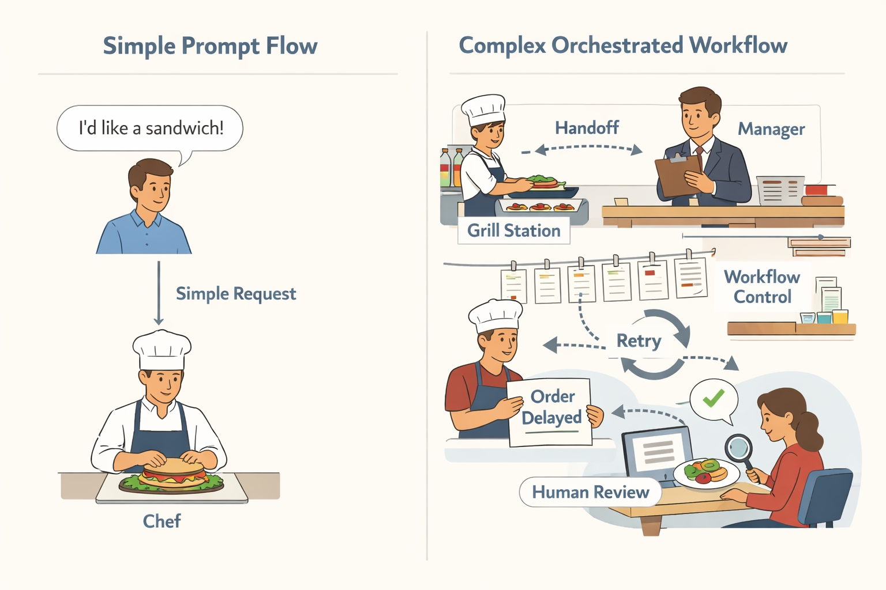
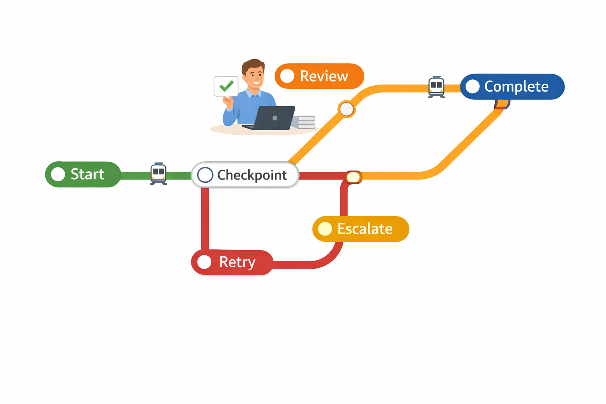
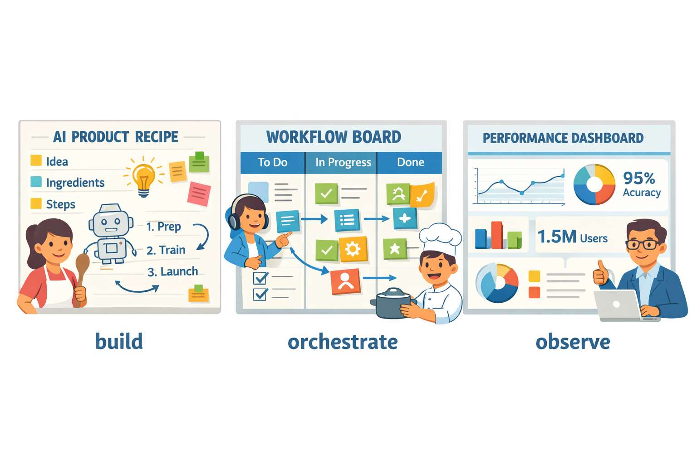

# LangGraph for Product Managers: Why It Matters, What’s New in the Lang Family, and Where to Use It

## Start with the PM question: why LangGraph exists at all

Think of it like a restaurant kitchen where one cook can handle a simple sandwich order, but a busy dinner service needs stations, handoffs, and a manager to keep everything on track. **LangGraph is for AI products that have become too complex for one straight-line prompt flow**—not just answering questions, but remembering context, retrying failed steps, routing work, and escalating to a human when needed.

For PMs, the signal is usually **product fragility**. If your AI feature works in demos but breaks when users ask follow-up questions, if your team is manually cleaning up edge cases, or if outcomes vary too much to trust in production, the problem is no longer “better prompting.” It is workflow control (a way to manage steps, decisions, and exceptions across the user journey).

**LangGraph is an orchestration choice (a way to coordinate multiple steps and agents), not a hype choice.** It becomes relevant when your roadmap includes branching paths, approvals, retries, or multiple AI agents (specialized helpers that each handle part of a task). That is why it shows up in products like conversational BI (chat-based business intelligence) or enterprise support workflows, where the system has to decide what to do next instead of just generating one answer. ([LangGraph-powered conversational BI](https://www.sigmainfo.net/case-studies/enhancing-conversational-bi-with-a-langgraph-powered-ai-agent/); [Enterprise multi-agent workflows](https://www.synechron.com/insight/lang-graph-for-enterprise-building-reliable-multi-agent-ai-workflows))

*Why LangGraph matters: simple prompts work for simple tasks, but complex products need coordination, handoffs, and fallback paths.*

> **💡 What this means for you as a PM**
> This helps you spot when AI features need workflow control, not just better prompts, to avoid shipping fragile experiences. If your user journey has approvals, fallback paths, or human review, budget for orchestration earlier because it affects reliability, support load, and launch risk. The business trade-off is speed of shipping versus control: simpler patterns are faster, but graph-based orchestration can save you from costly rework once the feature is mission-critical.

The decision boundary is practical: **stay with simpler LangChain-style patterns (a simpler way to chain AI steps)** when the task is linear, low-risk, and easy to debug. Move to LangGraph when the experience depends on branching logic, stateful memory (remembering what happened earlier), or multiple agents coordinating across steps. In PM terms, that is the point where your AI feature stops being a chatbot and starts becoming an operating system for a workflow.

## What LangGraph changes for product design and delivery

Think of **LangGraph like a train network with transfer stations**, not a single direct line. Instead of one AI prompt doing one job, you can design a product flow where the system moves through steps, pauses for review, and takes different routes when something goes wrong.

LangGraph is a framework for building **stateful workflows (flows that remember what has happened so far)**, **branching paths (different routes based on conditions)**, **checkpoints (saved stopping points you can return to)**, and **human-in-the-loop review (a person approving or correcting a step before it continues)**. For PMs, that means an AI feature can behave more like a product process — for example, a support draft that escalates to an agent when confidence is low, or a travel booking assistant that asks for confirmation before purchase. **This means your team can design AI features around outcomes, not just prompts.**

*LangGraph helps AI products move through branches, checkpoints, and reviews instead of staying on one rigid path.*

> **💡 What this means for you as a PM**
> LangGraph can turn vague AI ambition into shippable product workflows with clearer ownership and fewer launch surprises. Your PRD (product requirements document) now needs to define decision points, fallback paths, and who approves exceptions, not just the happy path. The business trade-off is **more upfront design work** in exchange for **better reliability and fewer embarrassing failures** after launch.

This changes **acceptance criteria (the conditions a feature must satisfy to be considered done)** and launch planning. Instead of saying “the assistant should answer customer questions,” you may need rules like “if confidence drops below X, route to a human,” or “if the user asks for a refund, stop automation and escalate.” **When this goes wrong, you’ll see it as** inconsistent experiences, higher support load, and more post-launch fixes.

The big PM advantage is **composability (the ability to build bigger flows from reusable pieces)**. You can start with one-step help, then add review, retries, and escalation without rewriting the whole feature. This affects your roadmap because it makes AI products easier to evolve from a demo into a durable workflow, such as moving from a basic sales copilot to a multi-step deal desk assistant.

## Business impact: reliability, cost, and ROI implications

Think of **LangGraph like a traffic controller for an airport**, not a faster airplane. When AI-driven flows need retries, handoffs, or escalation paths, the business value comes from keeping the journey moving instead of letting customers get stuck in a dead end. That matters in products like customer support copilots, onboarding assistants, or claims workflows, where a single failed step can create extra tickets, manual rework, and user frustration.

**Reliability is the first ROI lever.** A workflow that can retry, route around failures, and escalate to a human when needed reduces support burden and prevents your team from paying for the same task twice in time and effort. In plain English, that means fewer “Why didn’t it answer me?” tickets, fewer analyst cleanup hours, and fewer abandoned journeys. The business trade-off is that you spend more upfront designing the flow, but you often save more later by avoiding broken experiences and manual intervention.

> **💡 What this means for you as a PM**
> The right way to pitch LangGraph is as a margin and reliability lever, not just a nicer developer framework.  
> Before adopting it, ask which user journey gets faster, which support or analyst hours disappear, and which metric should move first: conversion, retention, resolution time, or cost per task. If you cannot point to one of those, orchestration may add complexity without enough business payoff.

**Cost savings usually show up in three places.** First, fewer failed runs means less wasted model spend (money spent on AI calls that don’t produce useful output). Second, better routing can keep expensive models for hard cases and use cheaper ones for simple steps. Third, less manual review means your team can ship more value with the same headcount.

**But orchestration is not free.** More branching logic, governance, and maintenance can raise design and operating costs, especially when multiple teams own parts of the journey. This affects your roadmap because every added path is another thing to test, monitor, and support. So the business case should be specific: use LangGraph when the workflow is valuable enough, failure-prone enough, or operationally expensive enough to justify the extra complexity.

## Recent developments in the Lang family PMs should track

Think of the Lang stack like a restaurant kitchen: **one tool helps you create the recipe, another coordinates the cooks, and a third shows you which dishes are slowing down**. In product terms, LangChain (the app-building layer), LangGraph (the workflow-orchestration layer, or the part that manages multi-step AI tasks), and LangSmith (the observability layer, or the part that lets you inspect what happened and why) are increasingly being positioned as complementary pieces of the same system ([Source](https://www.zignuts.com/blog/langchain-vs-langgraph-langsmith)).

The most important ecosystem signal is that **LangGraph is moving from “interesting framework” to “production workflow choice.”** Recent material around LangGraph Studio (a visual environment for building and debugging graph-based AI flows) and LangGraph Cloud (a hosted runtime for running those flows) suggests the ecosystem is trying to reduce the time from prototype to something teams can actually ship and monitor ([Source](https://www.zignuts.com/blog/langchain-vs-langgraph-langsmith)) ([Source](https://www.synechron.com/insight/lang-graph-for-enterprise-building-reliable-multi-agent-ai-workflows)). That matters because PMs often lose weeks when AI demos work in a notebook but fall apart once handoffs, retries, or approvals enter the product.

**This means your team can move faster on complex AI features without waiting for every edge case to be manually glued together.** It also affects your roadmap because orchestration (coordinating multiple steps or agents) can make features like support copilots, BI assistants, or workflow automation more reliable, but it can also add another layer of platform dependence. The business trade-off is clear: better iteration speed and visibility, versus more vendor and tooling commitment if the stack becomes hard to replace.

*The Lang family is increasingly a production stack: build, orchestrate, and observe.*

> **💡 What this means for you as a PM**
> Keeping up with the Lang stack helps you choose tools that shorten iteration cycles instead of creating another platform dependency. Use LangGraph when your product needs multi-step decision flows, use LangSmith when you need to prove what the system did, and treat newer pieces like LangGraph Studio or Cloud as adoption signals that may improve delivery but still need validation in your own environment.

Separate signal from noise: **what’s actionable now is the production-readiness story; what’s still strategic is the broader “agentic AI” narrative.** Enterprise case studies on LangGraph often emphasize reliability, collaboration, and faster delivery for multi-agent workflows, while broader industry pieces frame agent orchestration as a future operating model for AI products ([Source](https://www.synechron.com/insight/lang-graph-for-enterprise-building-reliable-multi-agent-ai-workflows)) ([Source](https://www.huronconsultinggroup.com/insights/agentic-ai-agent-orchestration)) ([Source](https://www.deloitte.com/us/en/insights/industry/technology/technology-media-and-telecom-predictions/2026/ai-agent-orchestration.html)). For PMs, the practical takeaway is to prioritize tools that help you ship, measure, and debug today—not just ones that sound strategic in a roadmap review.

## Real-world examples: who is using LangGraph and what they got out of it

Think of LangGraph like a **project manager for AI tasks**—it helps keep complex work from drifting off course, especially when multiple steps, tools, or “agents” (AI helpers that handle parts of a task) need to coordinate. In practice, that matters most when a product is no longer a single chatbot and starts behaving more like a workflow in a product such as **customer support, analytics, or enterprise operations**.

**Tradestack** is a good speed-to-market example: they launched an MVP in six weeks, and the story credits **LangGraph Studio** (a visual tool for building and testing agent workflows) and **LangGraph Cloud** (a hosted environment for running them) with helping the team move faster. The PM lesson is that **LangGraph can reduce the friction between idea and release** when your product team needs to test a new AI workflow quickly, then keep iterating without waiting on heavyweight infrastructure work. ([Source](https://blog.langchain.com/customers-tradestack/))

> **💡 What this means for you as a PM**
> Seeing real deployments helps you judge whether LangGraph fits your use case—or whether your product is too simple to need it. If your roadmap includes fast experiments, multiple AI steps, or frequent workflow changes, tools like LangGraph Studio and LangGraph Cloud can shorten delivery cycles. If your use case is just “answer one question well,” the business trade-off may be added complexity you do not need.  

A **conversational BI** (business intelligence, or giving users data answers in plain language) example shows the user-value side. The promise is that business users can ask questions and get insights **without SQL (the database query language)** or waiting on analysts, which directly removes a common product bottleneck in dashboards and reporting tools. For PMs, the outcome to watch is not “cool AI,” but whether the product **cuts analyst queue time, speeds decisions, and expands access to insights** for sales, ops, or finance teams. ([Source](https://www.sigmainfo.net/case-studies/enhancing-conversational-bi-with-a-langgraph-powered-ai-agent/))

Large organizations tend to care about LangGraph for a different reason: **reliable multi-agent workflows** (multiple AI helpers with clear handoffs) and faster development using visual tooling. That appeal shows up in enterprise workflow discussions, where teams want to automate processes like case triage, document handling, or internal operations without creating brittle one-off bots. This affects your roadmap because enterprise buyers usually pay for **predictability, auditability, and lower delivery risk**, not just novelty. ([Source](https://www.synechron.com/insight/lang-graph-for-enterprise-building-reliable-multi-agent-ai-workflows))

For PMs, the pattern is simple: **use LangGraph when the user pain is process complexity**. The teams most likely to benefit are those building copilots, internal workflow tools, analytics assistants, or customer operations products where the value comes from orchestrating several steps correctly. When the product is simple, the business trade-off is that a more sophisticated framework may add cost and coordination overhead; when the workflow is messy, it can unlock faster launches and more dependable outcomes.

## When PMs should recommend LangGraph—and when they shouldn’t

Think of **LangGraph** like a traffic controller at a busy airport, not a taxi app for one simple ride. It’s most useful when an AI feature needs to make **multiple decisions, call tools (external systems like search, CRM, or databases), and recover safely when something goes wrong**. In product terms, that usually means workflows where one bad answer can create support tickets, compliance risk, or wasted analyst time.

**Best fit:** use LangGraph when your product needs **multi-step workflows (a sequence of actions), conditional routing (different paths based on the situation), compliance checks, auditability (a record of what happened), or human review points**. Think of a support copilot that drafts a refund response, checks policy, routes edge cases to an agent, and logs every step for QA. This means your team can ship more ambitious AI features without turning them into fragile one-off scripts.

> **💡 What this means for you as a PM**
> A clear fit/no-fit framework keeps you from overengineering AI features that don’t need orchestration. It helps you reserve heavier coordination logic for workflows where mistakes are costly, reviewability matters, or multiple teams need shared visibility. That makes roadmap decisions cleaner: use LangGraph where reliability and traceability drive business value, not just because it sounds advanced.

**Poor fit:** skip LangGraph for **simple Q&A (one question, one answer), low-stakes automation, or anything a deterministic workflow (a fixed rule-based process) can handle cheaper and faster**. If your use case is “answer FAQs on a help page” or “send a reminder email after form submit,” a simpler approach is usually easier to maintain and easier to explain to stakeholders. The business trade-off is straightforward: more orchestration can improve control, but it also adds product and operational complexity.

Before you commit, run these **readiness checks**:
- **Data quality:** are the inputs trustworthy enough to drive decisions?
- **Fallback strategy:** what happens when the model fails or times out?
- **Human review points:** where should a person approve or override?
- **Analytics:** can you measure failure rate, cycle time, and user impact?
- **Ownership:** do product, engineering, ops, and risk teams agree on who owns what?

Start with **one high-value workflow**, measure **failure reduction and cycle time**, and expand only if the ROI is visible. When this goes wrong, you’ll see it as hidden operational load, unclear accountability, and AI features that look impressive but don’t move the business.

---

## 📚 Further Reading

The following sources were retrieved and used during research for this blog. All links are verified — none are invented.

1. **[How Tradestack launched their MVP in 6 weeks using LangGraph](https://blog.langchain.com/customers-tradestack/)** · *LangChain Blog*
   > Customer story on launching an MVP in 6 weeks with LangGraph; mentions faster iteration, LangGraph Studio, and LangGraph Cloud....

2. **[Enhancing Conversational BI with a LangGraph-Powered AI Agent](https://www.sigmainfo.net/case-studies/enhancing-conversational-bi-with-a-langgraph-powered-ai-agent/)** · *Sigma Info*
   > Case study on using a LangGraph-powered agent to let business users access BI insights without SQL or waiting on analysts....

3. **[LangGraph for Enterprise: Building Reliable Multi-Agent AI Workflows](https://www.synechron.com/insight/lang-graph-for-enterprise-building-reliable-multi-agent-ai-workflows)** · *Synechron*
   > Enterprise article on LangGraph adoption, workflow orchestration, and a visual builder to speed development without lock-in....

4. **[LangChain vs LangGraph vs LangSmith: Best AI Framework 2026](https://www.zignuts.com/blog/langchain-vs-langgraph-langsmith)** · *Zignuts* · 2026-01-13
   > Guide comparing LangChain, LangGraph, and LangSmith for production AI systems; includes a LangGraph section on workflow orchestration....

5. **[Analysis and Comparison of AI Agent Frameworks](https://addepto.com/blog/analysis-and-comparison-of-ai-agent-frameworks-from-fundamentals-to-multi-agent-systems/)** · *Addepto*
   > Compares six agent frameworks including LangGraph, focusing on orchestration, error recovery, state management, guardrails, and observability....

6. **[A practical guide to agentic AI and agent orchestration](https://www.huronconsultinggroup.com/insights/agentic-ai-agent-orchestration)** · *Huron*
   > Huron article framing orchestration as a strategic imperative and outlining workforce, ecosystem, and technical architecture considerations....

7. **[Unlocking exponential value with AI agent orchestration](https://www.deloitte.com/us/en/insights/industry/technology/technology-media-and-telecom-predictions/2026/ai-agent-orchestration.html)** · *Deloitte*
   > Deloitte insights piece on multiagent orchestration, adoption challenges, and how enterprises can scale agentic AI more quickly....

