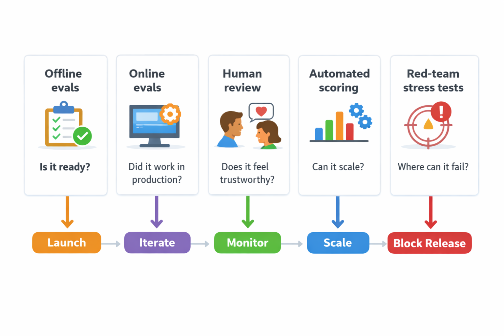
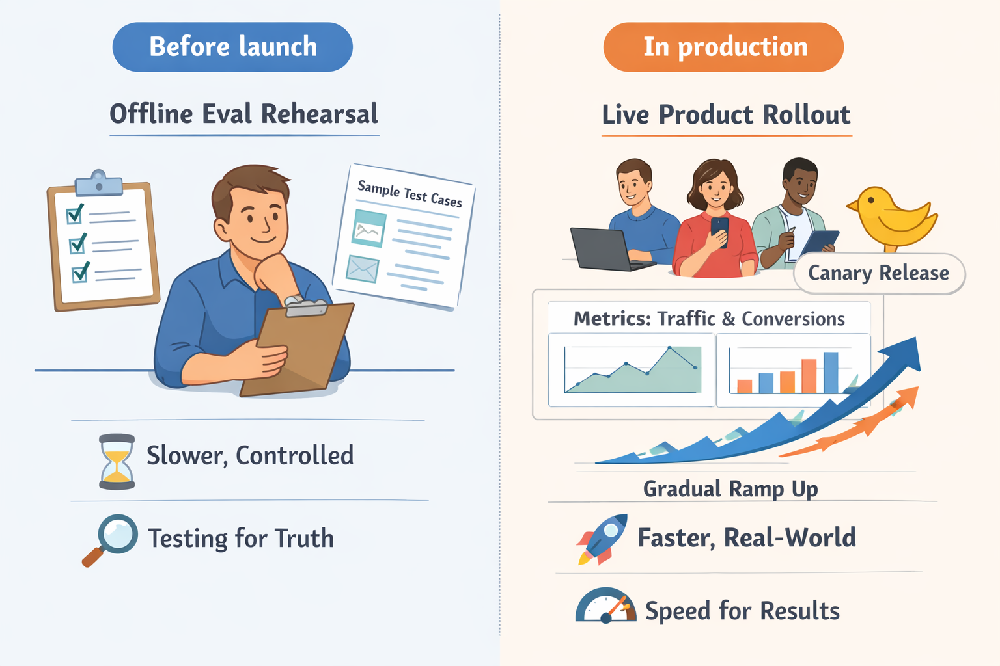
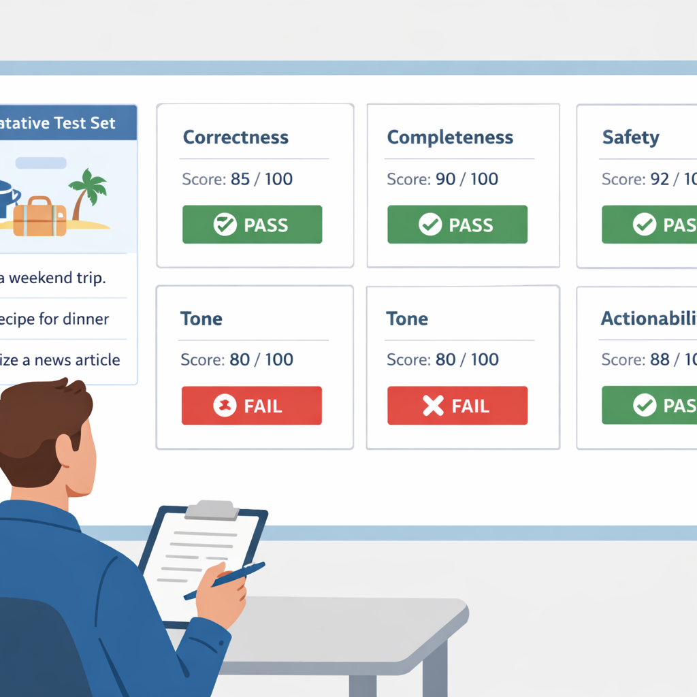

# LLM Evals for Product Managers: Types, Trade-offs, and When to Use Them

## Start with the PM question: what are you trying to prove with evals?

Think of evals like a **pre-launch dress rehearsal**: you are not asking “is the costume pretty?” but “will opening night go well?” In LLM products, that means the first question is **what decision you need to make**—should you ship, iterate, block launch, or change scope.

A strong **model evaluation (checking how well the model itself behaves)** can still hide a weak user experience if the workflow is clunky, the prompt is unclear, or the output arrives too late. That’s why PMs should separate **model competence (how smart the model looks)** from **product usefulness (whether the whole feature helps users)**, like a support bot in Intercom or a shopping assistant on Amazon.

The business trade-off is that **a metric that looks great in demos can still be worthless in production**. Instead, anchor on the user outcome that matters most: **time saved, task success, trust, retention, or revenue**. Set success criteria based on the product stage and risk: a finance copilot may need a higher bar for trust than a brainstorming tool in Notion.

> **💡 What this means for you as a PM**
> If you do not define the decision first, your evals will only create confidence theater.  
> This affects your roadmap because the “right” eval changes whether you can launch, need another iteration, or should cut scope. It also affects budget and timeline: measuring the wrong thing can lead to overbuilding a feature that never moves adoption or revenue.

## The core eval types PMs need to know

Think of LLM evaluation (a way of checking whether an AI feature is doing the right thing) like testing a new restaurant concept: you might taste the food in the kitchen, watch how real diners react, ask a chef to critique the meal, and stress-test the menu for allergies. **Each eval type answers a different business question**, so the right mix depends on whether you are trying to launch safely, improve quality, or prove ROI.

*Different eval types answer different product questions: readiness, quality, risk, and real-world impact.*

**Offline evals (tests run on a fixed set of examples before release)** are best for prototype and internal beta because they catch obvious failures early without exposing customers. **Online evals (tests using live user behavior in production)** answer whether the feature actually moves the metric you care about, like conversion, retention, or support deflection. This means your team can use offline evals to decide “is this ready to show employees?” and online evals to decide “did this ship create value?” ([Source](https://www.statsig.com/perspectives/offline-vs-online-evals))

**Human review (people judging outputs)** is strongest when nuance matters, like tone, brand voice, or whether a response feels trustworthy in a customer support copilot (an AI assistant for support agents). **Automated scoring (rules or models that assign a score automatically)** is faster and cheaper when you need to check lots of responses, but it works best when the criteria are clear. **Red-team stress tests (deliberate attempts to make the model fail)** are what you use to uncover safety and policy risks before launch, especially for agentic workflows (AI systems that can take actions on behalf of a user) like Claude Code’s permission decisions or task agents. ([Source](https://www.langfuse.com/blog/2025-03-04-llm-evaluation-101-best-practices-and-challenges), [Source](https://www.producthunt.com/products/claude?utm_campaign=producthunt-api&utm_medium=api-v2&utm_source=Application%3A+Claude+MCP+Server+%28ID%3A+234160%29))

When a feature is content-heavy, like a writing assistant or search summary, a **simple pass/fail rubric (one clear yes/no standard)** is often enough for launch gating: is it correct enough, safe enough, and on-brand? When you are evaluating decision-support tools (AI that helps users choose or act), you usually need **multi-dimensional scoring (separate scores for quality dimensions)** across correctness, helpfulness, safety, and tone because one “good enough” number hides trade-offs. This affects your roadmap because a customer-facing assistant can look great on helpfulness while still failing on safety or trust. ([Source](https://www.freeplay.ai/blog/defining-the-right-evaluation-criteria-for-your-llm-project-a-practical-guide), [Source](https://www.evidentlyai.com/llm-guide/llm-evaluation))

> **💡 What this means for you as a PM**
> Choosing the right eval type keeps your team from overbuilding measurement that does not inform launch decisions. For prototype and beta, optimize for speed with offline checks and human review; for launch, add red-team testing and online measurement; for post-launch, monitor real user impact and regressions. The common mistake is using one eval type to answer every question, which creates false confidence and can either delay launch unnecessarily or let risky behavior ship.

## Offline vs online evals: when each one earns its place

Think of **offline evals** (tests run before users see the feature) like a dress rehearsal, and **online evals** (checks using real user behavior in production) like opening night. **The business trade-off is speed versus truth**: you can move fast with lab data, but only live traffic tells you how the feature behaves when customers are tired, distracted, or using it in a messy real workflow. That’s why PMs should treat them as complementary, not competing, tools. ([Label Studio](https://labelstud.io/learningcenter/offline-evaluation-vs-online-evaluation-when-to-use-each/), [Statsig](https://www.statsig.com/perspectives/offline-vs-online-evals))

*Offline evals reduce risk before launch; online evals reveal truth in production.*

> **💡 What this means for you as a PM**
> The right timing of evals prevents you from shipping a feature that looks strong in tests but underperforms in production.
> Use offline evals to compare **prompt versions** (the instructions you give the model), **model versions** (different underlying AI systems), and **rubric changes** (the scoring rules) before you expose users to risk. This affects your roadmap because it lets you narrow options cheaply before you spend launch traffic on the wrong bet. ([Freeplay](https://freeplay.ai/blog/defining-the-right-evaluation-criteria-for-your-llm-project-a-practical-guide), [Langfuse](https://langfuse.com/blog/2025-03-04-llm-evaluation-101-best-practices-and-challenges))

Use **online evals** (measurement with real users in production) when you need to know whether people actually adopt the feature, finish the task, or escalate to support. For a product like **Google Search** or **Uber**, offline scores might look great, but live metrics such as **completion rate** (how often users finish the task), **escalation rate** (how often the AI hands off to a human), and **customer satisfaction** (how users rate the experience) are what tell you whether the feature is creating value or friction. When this goes wrong, you’ll see it as usage dropping even though your demo looked impressive. ([Evidently AI](https://www.evidentlyai.com/llm-guide/llm-evaluation), [Comet](https://www.comet.com/site/blog/llm-evaluation-guide/))

Shadow mode, canary releases, and controlled rollouts are product risk-management tools, not engineering rituals. These give your team a way to learn from live behavior without betting the whole launch on one change. This means your team can catch issues like changed user intent, long-tail edge cases, and workflow interactions that offline tests often miss—especially in products like WhatsApp support assistants or Amazon shopping helpers, where context shifts fast. ([Statsig](https://www.statsig.com/perspectives/offline-vs-online-evals), [ZenML](https://www.zenml.io/blog/llmops-in-production-457-case-studies-of-what-actually-works))

The minimum evidence to move from lab confidence to live-user confidence is simple: **the offline win should hold on representative scenarios, and the online rollout should show no regression in core business metrics**. In practice, that means you want strong offline performance on your target tasks, plus a small live test showing adoption, task completion, and satisfaction are at least flat—or better—before you scale. If the feature powers a revenue workflow, such as a sales copilot or enterprise search tool, you should also watch whether it improves conversion, reduces handoffs, or lowers support cost.

## Human, Automated, and LLM-as-Judge: How PMs Should Think About Scoring

Think of scoring like checking a restaurant meal: **a trained critic, a checklist, and a fast tasting panel** each tell you something different. In LLM evaluation (a way to judge whether an AI feature is good enough), human review (people judging outputs) is the gold standard when quality is nuanced, but it is slow and expensive to scale across thousands of responses ([Freeplay](https://freeplay.ai/blog/defining-the-right-evaluation-criteria-for-your-llm-project-a-practical-guide); [Evidently AI](https://www.evidentlyai.com/llm-guide/llm-evaluation)). This means your team can use humans for launch-critical decisions, but the business trade-off is that every extra review round costs time and annotation budget.

**Automated metrics (repeatable scoring rules)** are best when you need consistency, regression detection, and fast iteration on cases that show up again and again ([Langfuse](https://langfuse.com/blog/2025-03-04-llm-evaluation-101-best-practices-and-challenges); [Statsig](https://www.statsig.com/perspectives/offline-vs-online-evals)). For example, if you’re shipping a customer-support copilot like the ones used across enterprise SaaS workflows, automation helps you quickly spot that the model got worse at refund-policy questions after a prompt change ([Credal](https://www.credal.ai/blog/generative-ai-search-helps-sellers-close-deals-and-product-teams-understand-their-customers); [ZenML](https://www.zenml.io/blog/llmops-in-production-457-case-studies-of-what-actually-works)). **The business advantage is speed**, especially when you’re running weekly releases and need a lightweight way to block obvious regressions.

LLM-as-judge sits in the middle: **faster and cheaper than humans, but more judgment-like than a simple metric** ([Comet](https://www.comet.com/site/blog/llm-evaluation-guide/); [Label Studio](https://labelstud.io/learningcenter/offline-evaluation-vs-online-evaluation-when-to-use-each/)). It is useful for comparing two drafts, ranking answers, or screening large batches before a human spot-checks the edge cases, but it still needs calibration and spot checks ([Freeplay](https://freeplay.ai/blog/defining-the-right-evaluation-criteria-for-your-llm-project-a-practical-guide); [HAI Stanford](https://hai.stanford.edu/assets/files/2023-02/HAI%20Policy%20&%20Society%20Issue%20Brief%20-%20Improving%20Transparency%20in%20AI%20Language%20Models.pdf)). **What this means for you as a PM:** Picking the wrong scoring method can waste budget or give you a false sense of product quality. Use human review when the launch risk is high, automated scoring when you need scale and trend detection, and LLM-as-judge when you need a practical middle layer to move faster without going blind.

## How to design a rubric that matches real product value

Think of a **rubric** (a scored checklist for quality) like a restaurant review card: “food tasted great” is too vague, but “taste, portion size, speed, and cleanliness” tells the manager what to fix. In LLM evals (systematic checks of AI output quality), the same idea applies: if your team says “make it better,” you’ll get debates, not decisions. A useful rubric should translate product goals into criteria like **correctness** (is it right), **completeness** (did it answer everything needed), **safety** (does it avoid harmful output), and **actionability** (can the user do something with it) ([Freeplay](https://freeplay.ai/blog/defining-the-right-evaluation-criteria-for-your-llm-project-a-practical-guide), [Evidently AI](https://www.evidentlyai.com/llm-guide/llm-evaluation), [Langfuse](https://langfuse.com/blog/2025-03-04-llm-evaluation-101-best-practices-and-challenges)).

*A good rubric turns subjective AI quality into a repeatable product decision.*

Build the rubric around the **customer job-to-be-done** (the user’s real task), not around model behavior for its own sake. For example, a support assistant at **Zomato** should be judged on whether it helps a customer resolve a refund issue quickly, not whether its wording sounds polished; a sales copilot at **Google Search** or a B2B search tool should be judged on whether it surfaces the right answer fast enough to help the rep act. This means your team can align evaluation with revenue, retention, or trust instead of abstract AI quality.

Weight failures by business risk, because **not all mistakes are equal**. A slightly awkward tone in a travel-planning assistant is a minor issue; a factual error in a medical or financial workflow can become a launch blocker or compliance risk. The business trade-off is simple: spend more review time on high-risk failures and less on cosmetic ones, so your roadmap reflects what could actually hurt users or the business ([Comet](https://www.comet.com/site/blog/llm-evaluation-guide/), [HELM](https://snorkel.ai/blog/crfm-s-helm-and-enterprise-llm-evaluation-beyond-accuracy/)).

> **💡 What this means for you as a PM**
> A good rubric turns AI quality from a subjective debate into a repeatable product decision.
> If you define criteria around customer jobs, risk, and business value, your team can decide what “launch-ready” actually means without endless opinion wars. It also helps you avoid over-investing in nice-looking outputs while missing the failures that hurt trust, conversion, or compliance.

Use a **representative test set** (a curated set of real examples) that mirrors your highest-value and highest-risk cases, like the 20 support tickets, search queries, or checkout questions that matter most. Keep the rubric simple enough that product, design, ops, and engineering can apply it consistently; if everyone scores differently, the process becomes theater instead of signal. This affects your roadmap because a small, shared rubric is easier to maintain, cheaper to run, and far more useful than a giant scorecard nobody uses.

## Real-world examples: what product teams learned from LLM evals

Think of **LLM evals like a product pilot with a checklist**: you don’t just ask whether the feature “works,” you ask whether users trust it, whether it saves time, and whether it creates new failure modes. In a **human-centered evaluation** (testing with real people in real workflows), researchers studying an LLM-based process modeling copilot found that domain experts needed more than raw accuracy — they wanted usefulness, confidence, and control, which is exactly why mixed methods matter ([Source](http://arxiv.org/abs/2603.12895v1)). **This means product teams can avoid shipping a demo that looks smart but feels risky in production.**

A useful pattern is to combine **offline evals** (testing on recorded examples before launch) with **online monitoring** (watching live behavior after launch). Guidance from Label Studio, Statsig, and GrowthBook all points to the same product lesson: offline checks help you catch obvious issues early, while online tests and rollout monitoring tell you whether the experience actually improves outcomes in the wild ([Source](https://labelstud.io/learningcenter/offline-evaluation-vs-online-evaluation-when-to-use-each/)), ([Source](https://www.statsig.com/perspectives/offline-vs-online-evals)), ([Source](https://blog.growthbook.io/ai-evals-vs-a-b-testing-why-you-need-both-to-ship-genai/)). **The business trade-off is speed versus risk reduction** — you move faster when you gate launch with offline evals, and you gain confidence when you pair that with controlled exposure.

For example, enterprise teams using **LLM search** (AI-powered search across company knowledge) are applying these methods to customer feedback, call transcripts, and internal docs so sellers and product teams can find patterns faster and make better decisions ([Source](https://www.credal.ai/blog/generative-ai-search-helps-sellers-close-deals-and-product-teams-understand-their-customers)). In the broader ecosystem, real-world LLM use cases increasingly show teams evaluating for relevance, groundedness, and safety instead of only “answer quality” ([Source](https://www.evidentlyai.com/blog/llm-applications)), ([Source](https://www.zenml.io/blog/llmops-in-production-457-case-studies-of-what-actually-works)). **This affects your roadmap because it clarifies launch gates, stakeholder expectations, and what “good enough” means for each workflow.**

> **💡 What this means for you as a PM**
> Seeing how others evaluate AI helps you avoid guesswork and borrow proven launch patterns. Use offline evals to decide whether the feature is ready for beta, then use rollout monitoring to decide whether to expand, pause, or tighten guardrails. This also gives you a cleaner story for leadership: you can tie launch decisions to user trust, support burden, and adoption rather than vague model scores.

## The ROI view: how evals save time, reduce risk, and justify investment

Think of **LLM evals (structured checks for whether an AI output is good enough)** like pre-launch QA for a checkout flow: expensive to do, but far cheaper than discovering broken payments after customers are already stuck. In product terms, evals help you catch **bad outputs (wrong, unsafe, or unhelpful responses)** before they turn into support tickets, churn, or a rollback. That matters most when your AI feature is customer-facing, because one visible failure can create a support spike and a trust problem at the same time ([Evidently AI](https://www.evidentlyai.com/llm-guide/llm-evaluation)).

The **business trade-off** is simple: spend more on evaluation up front, or pay later in rework, manual review, and incident response. Teams that skip strong eval coverage often end up shipping, then patching prompts, model settings, and guardrails after users find the edge cases. By contrast, better evals make prompt changes and model swaps easier to trust, which shortens iteration cycles and reduces the cost of each release ([Langfuse](https://langfuse.com/blog/2025-03-04-llm-evaluation-101-best-practices-and-challenges), [Statsig](https://www.statsig.com/perspectives/offline-vs-online-evals)).

> **💡 What this means for you as a PM**
> Evals are not overhead when they prevent costly launches, support churn, and rebuilds. Put more evaluation budget behind **high-risk workflows (user actions where mistakes are expensive)** like enterprise features, regulated domains, and agentic actions (AI taking steps on a user’s behalf), because those are the places where one defect can become a legal, revenue, or brand problem. If you need to explain ROI to leaders, frame it as fewer incidents, faster launch confidence, and fewer escalations—not as “better model quality” ([GrowthBook](https://blog.growthbook.io/ai-evals-vs-a-b-testing-why-you-need-both-to-ship-genai), [Product Hunt: Auto Mode by Claude Code](https://www.producthunt.com/products/claude?utm_campaign=producthunt-api&utm_medium=api-v2&utm_source=Application%3A+Claude+MCP+Server+%28ID%3A+234160%29)).

A practical way to justify the investment is to compare the **cost of eval coverage (the time and tooling needed to test before launch)** against the cost of a rollback, manual review, or customer-facing mistake. For example, if an AI sales assistant is helping reps summarize accounts or draft next-step emails, a few bad summaries can waste rep time and hurt deal confidence, while stronger evals protect pipeline velocity and reduce hand-holding ([Credal](https://www.credal.ai/blog/generative-ai-search-helps-sellers-close-deals-and-product-teams-understand-their-customers)). In other words, **better measurement pays for itself when it prevents expensive confusion**.

## A practical PM checklist for choosing the right eval mix

Think of LLM evals like a **pre-launch safety checklist for a new airline route**: you do not use the same checks for a test flight, a regional route, and a regulated international service. The same is true for AI products — the **product risk profile** (how bad it is if the model is wrong) should decide how much evaluation you need before launch.

For a prototype, start with a **small eval set** (the minimum set of test cases that answers your launch question): does the assistant feel useful, safe, and on-brand? For a pilot or scale phase, add **offline evals** (testing on saved examples before users see it) plus **online monitoring** (tracking live behavior after release), because **A/B testing** (comparing two versions with real users) tells you what wins in the market, while evals tell you *why* and *where* it breaks ([GrowthBook](https://blog.growthbook.io/ai-evals-vs-a-b-testing-why-you-need-both-to-ship-genai); [Statsig](https://www.statsig.com/perspectives/offline-vs-online-evals); [Label Studio](https://labelstud.io/learningcenter/offline-evaluation-vs-online-evaluation-when-to-use-each/)). For regulated or high-stakes use cases like healthcare, finance, or permissioning flows, the bar should be stricter and more explicit, because **when this goes wrong, you are buying risk, not just bad UX**.

**This means your team can move faster without being reckless.** Put ownership in writing: one person creates the eval set, one reviews it, and one updates it after each launch so the process does not die in a spreadsheet. Tie eval dashboards to product KPIs (the business numbers you already run the company on) like activation, task success, deflection, conversion, or support escalation rate, and review them on a fixed cadence — weekly for fast-moving products, monthly for stable ones. Before approving a release, ask engineering, data, and design: What user failure are we trying to prevent? What are the top 10 examples that prove it? What metric will we watch in production? What is the rollback plan if quality drops?

---

## 📚 Further Reading

The following sources were retrieved and used during research for this blog. All links are verified — none are invented.

1. **[Defining the right evaluation criteria for your LLM project - Freeplay.ai](https://freeplay.ai/blog/defining-the-right-evaluation-criteria-for-your-llm-project-a-practical-guide)** · *Freeplay.ai*
   > Guide on defining custom LLM evaluation criteria for a specific product or use case, including rubrics, scoring methods, and practical rollout....

2. **[LLM evaluation: a beginner's guide - Evidently AI](https://www.evidentlyai.com/llm-guide/llm-evaluation)** · *Evidently AI*
   > Explains LLM product vs model evaluations, manual and automated methods, and why product teams should define what success means....

3. **[LLM Evaluation 101: Best Practices, Challenges & Proven Techniques](https://langfuse.com/blog/2025-03-04-llm-evaluation-101-best-practices-and-challenges)** · *Langfuse* · 2025-03-04
   > Covers practical LLM evaluation setup: collect traces, try human and automated methods, set baselines, and close the loop....

4. **[LLM Evaluation: The Ultimate Guide to Metrics, Methods & Best ...](https://www.comet.com/site/blog/llm-evaluation-guide/)** · *Comet*
   > Guide to blending automated scores with human judgment for reliable LLM evaluation and product improvement....

5. **[Human-Centered Evaluation of an LLM-Based Process Modeling Copilot: A Mixed-Methods Study with Domain Experts](http://arxiv.org/abs/2603.12895v1)** · *Arxiv* · 2026-03-13
   > Mixed-methods evaluation of an LLM-powered BPMN copilot with domain experts, highlighting trust, usability, and professional alignment....

6. **[[Product Hunt] Agentplace AI Agents - Create specialized AI agents for real tasks and workflows](https://www.producthunt.com/products/agentplace?utm_campaign=producthunt-api&utm_medium=api-v2&utm_source=Application%3A+Claude+MCP+Server+%28ID%3A+234160%29)** · *Product Hunt* · 2026-03-25
   > Agent builder for specialized workflows like lead routing, research, document analysis, scheduling, and internal support....

7. **[[Product Hunt] Auto Mode by Claude Code - Let Claude make permission decisions on your behalf](https://www.producthunt.com/products/claude?utm_campaign=producthunt-api&utm_medium=api-v2&utm_source=Application%3A+Claude+MCP+Server+%28ID%3A+234160%29)** · *Product Hunt* · 2026-03-25
   > Claude Code auto mode uses a classifier to approve safe file writes and bash commands automatically, blocking risky actions....

8. **[LLMOps in Production: 457 Case Studies of What Actually ...](https://www.zenml.io/blog/llmops-in-production-457-case-studies-of-what-actually-works)** · *ZenML*
   > Roundup of LLM production case studies, including rapid prototyping, prompt engineering, AI-assisted evaluation, and deployment lessons....

9. **[How LLMs are helping Enterprise SaaS teams close more ...](https://www.credal.ai/blog/generative-ai-search-helps-sellers-close-deals-and-product-teams-understand-their-customers)** · *Credal*
   > Case study on product teams using LLM search to analyze customer feedback, sales calls, and roadmap commitments....

10. **[55 real-world LLM applications and use cases from top companies](https://www.evidentlyai.com/blog/llm-applications)** · *Evidently AI*
   > Collection of real-world LLM use cases across product, support, search, and incident management from major companies....

11. **[Offline vs Online AI Evaluation: When to Use Each | Label Studio](https://labelstud.io/learningcenter/offline-evaluation-vs-online-evaluation-when-to-use-each/)** · *Label Studio*
   > Explains when to use offline vs online evaluation, including shadow mode, controlled rollouts, and production monitoring....

12. **[AI Evals vs. A/B Testing: Why You Need Both to Ship GenAI](https://blog.growthbook.io/ai-evals-vs-a-b-testing-why-you-need-both-to-ship-genai/)** · *GrowthBook*
   > Compares evals and A/B tests for GenAI shipping, emphasizing that evals measure competence while experiments measure value....

13. **[Offline vs online evals: Choosing evaluation timing - Statsig](https://www.statsig.com/perspectives/offline-vs-online-evals)** · *Statsig*
   > Discusses when to switch from offline to online evals, with guidance on shadowing live traffic and tracking business impact....

14. **[Evaluating AI Tools for Your Team - AI Primer](https://www.aiprimer.net/library/ai-in-practice/evaluating-ai-tools-for-your-team)** · *AI Primer*
   > Framework for evaluating AI tools, combining strategic, user, operational, and technical assessment for non-data-science leaders....

15. **[[PDF] Improving Transparency in AI Language Models: A Holistic Evaluation](https://hai.stanford.edu/assets/files/2023-02/HAI%20Policy%20&%20Society%20Issue%20Brief%20-%20Improving%20Transparency%20in%20AI%20Language%20Models.pdf)** · *Stanford HAI*
   > Stanford issue brief on HELM, covering transparency and multi-metric evaluation beyond accuracy for language models....

16. **[CRFM's HELM and enterprise LLM evaluation beyond accuracy](https://snorkel.ai/blog/crfm-s-helm-and-enterprise-llm-evaluation-beyond-accuracy/)** · *Snorkel AI*
   > Explains HELM principles and how enterprise LLM evaluation should go beyond accuracy to include alignment, quality, bias, and toxicity....

