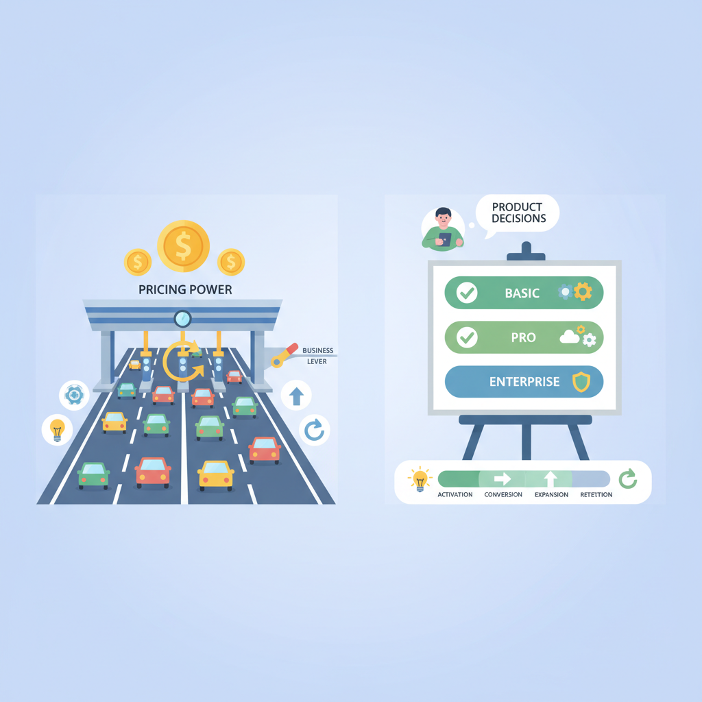
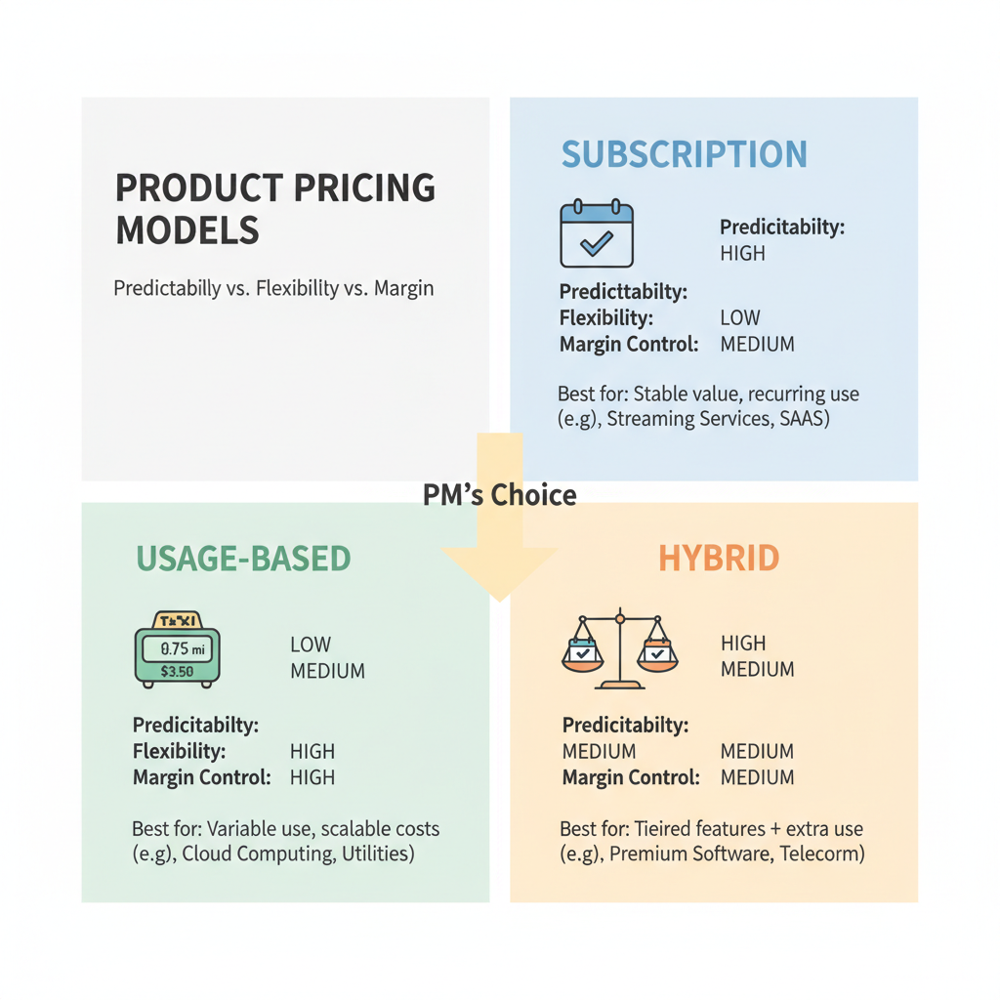
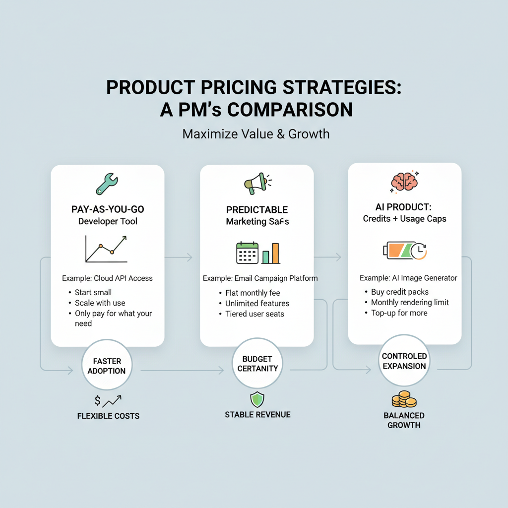

# Pricing and Monetization Strategies PMs Should Rethink in 2026

## Why pricing and packaging are now a core product lever

*Pricing and packaging influence the whole funnel, not just revenue.*

Think of pricing like **the toll gate on a highway**: if it’s in the wrong place, the road can be busy but the business still collects too little. Pricing and packaging (how you bundle features and set plan tiers) shape activation (getting to first value), conversion (free to paid), expansion (more spend over time), and retention (staying subscribed) across the full funnel. That’s why this is no longer just a finance decision; it’s a product decision.

When growth stalls, **changing the monetization model** (how you charge) can be faster than building a major new feature. A team can often test seats, usage, outcomes, or hybrid bundles (a mix of pricing styles) with less engineering effort than launching a whole new product line. The business trade-off is clear: you can unlock revenue faster, but a bad pricing change can also slow adoption or confuse customers.

Think of pricing as a **signal of what customers value**. Seat-based pricing (pay per user) rewards collaboration tools like Notion or Slack; usage-based pricing (pay for consumption) fits products like AI APIs or cloud tooling; outcome-based pricing (pay for results) makes sense when the value is tied to measurable business impact. This affects your roadmap because you must decide **who pays, what gets metered (tracked for billing), when upgrades happen, and which segment gets which plan**.

> **💡 What this means for you as a PM**
> Your pricing model can unlock growth faster than adding another feature if it matches how customers actually get value.  
> That means monetization belongs in roadmap reviews, not just in finance meetings, because it changes activation, expansion, and retention. If you get it wrong, you’ll see it as poor conversion, slow enterprise sales cycles, or customers churning because the plan doesn’t match their usage pattern.

## Subscription, usage-based, or hybrid: how to choose the right monetization model

*Choosing between subscription, usage-based, and hybrid models depends on customer behavior and business trade-offs.*

Think of pricing like a gym membership versus paying for parking: **one is predictable, the other matches how much you actually use**. In product terms, a **subscription** (a fixed recurring fee) is best when customers want certainty, while **usage-based pricing** (charging for consumption, like API calls or messages sent) fits when value rises with activity. A **hybrid model** (a mix of fixed fee plus usage charges) is often the safest middle ground for SaaS and AI products as companies try to balance growth, margin, and customer trust. ([Stripe](https://stripe.com/resources/more/usage-based-pricing-strategy-for-saas), [Orb](https://www.withorb.com/blog/usage-based-revenue-vs-subscription-revenue), [Monetizely](https://www.getmonetizely.com/blogs/the-2026-guide-to-saas-ai-and-agentic-pricing-models))

**The model should match customer behavior, not just finance preferences.** If users follow predictable workflows (for example, a CRM like Salesforce or a team tool like Slack), subscription pricing makes budgeting easy and shortens purchase debates. If demand is bursty consumption (for example, cloud storage, AI image generation, or API-heavy products), usage-based pricing helps you capture more revenue when customers get more value. If value scales with outcomes but the usage itself is hard to predict, hybrid pricing can reduce adoption friction while still capturing upside. ([BillingPlatform](https://billingplatform.com/blog/usage-based-pricing-examples), [Lago](https://getlago.com/blog/usage-based-pricing-examples), [Stripe](https://stripe.com/resources/more/usage-based-pricing-strategy-for-saas))

**Each model has a different business trade-off.** Subscription pricing usually drives easier sales cycles and more stable revenue, but it can undercharge power users and create margin pressure when compute costs rise. Usage-based pricing can improve expansion revenue (growth from existing customers) and align revenue with cost, but it can also create revenue volatility and surprise at bill time when customers do not understand what they are buying. Hybrid pricing often gives the best of both, but it adds billing complexity and requires tighter metering (tracking usage in plain terms) and clearer packaging. ([WithOrb](https://www.withorb.com/blog/usage-based-revenue-vs-subscription-revenue), [BillingPlatform](https://billingplatform.com/blog/ubb-vs-subscription-billing), [Finout](https://www.finout.io/blog/top-6-ai-cost-drivers-and-genai-cost-examples-in-2026))

> **💡 What this means for you as a PM**
> The best model is the one that makes revenue grow in step with customer value, without creating billing friction or margin risk. If you sell into enterprise teams with long sales cycles, subscription or hybrid usually protects adoption and forecasting; if you sell AI, APIs, or high-volume workflows, usage or hybrid can better defend gross margin and capture expansion. This affects your roadmap because pricing choice changes what you instrument, what finance needs to bill accurately, and where customer confusion will show up in support tickets and churn.

**The decision should be guided by a few metrics, not gut feel.** Watch ARPA (average revenue per account, the typical revenue per customer), expansion revenue, gross margin, retention, and sales cycle length. If ARPA is flat but customers keep getting more value, your subscription may be leaving money on the table. If gross margin drops as usage rises, your usage pricing may be too generous or too vague. If sales cycles stretch because buyers cannot forecast spend, the business trade-off is often to add a subscription floor or a hybrid cap. ([Revenera](https://www.revenera.com/about-us/press-center/reveneras-monetization-monitor-2025-outlook-highlights-opportunities-to-drive-profitability), [Monetizely](https://www.getmonetizely.com/blogs/the-2026-guide-to-saas-ai-and-agentic-pricing-models), [Valueships](https://www.valueships.com/post/ai-pricing-in-2026))

**Current market evidence points toward more usage and hybrid pricing in SaaS and AI.** Recent industry guidance shows more software teams adopting consumption-linked pricing as AI costs, inference demand, and variable infrastructure spend make flat pricing riskier. That does not mean “usage wins” everywhere; it means PMs need to choose a model that reflects how value is created and how cost is incurred. When this goes wrong, you’ll see it as churn after a surprise invoice, stalled enterprise deals, or margin erosion from heavy users. ([Monetizely](https://www.getmonetizely.com/blogs/the-2026-guide-to-saas-ai-and-agentic-pricing-models), [Valueships](https://www.valueships.com/post/ai-pricing-in-2026), [Stripe](https://stripe.com/resources/more/usage-based-pricing-strategy-for-saas))

## How usage-based pricing works in practice for product teams

Think of usage-based pricing like a **taxi meter with a dashboard display**: the meter tracks what you’ve used, but the dashboard is what the customer trusts while the ride is happening. In product terms, that means you need three things to line up: **what counts as usage, how it’s measured, and how customers can see it**. Stripe frames usage-based pricing as a model where customers pay for what they consume, which makes the definition of “consumption” a product decision, not just a billing detail ([Stripe](https://stripe.com/resources/more/usage-based-pricing-strategy-for-saas)).

For PMs, the key building blocks are **metering, thresholds, and presentation**. Metering (counting the activity you bill for) has to be tied to clear product events like API calls, seats, messages, or transactions; if the event design is sloppy, your revenue reports and customer dashboards will disagree. This is especially important in AI products, where cost drivers like model calls, tokens, and retrieval steps can vary sharply by user behavior and can distort margins if they are not tracked cleanly ([Finout](https://www.finout.io/blog/top-6-ai-cost-drivers-and-genai-cost-examples-in-2026), [Valueships](https://www.valueships.com/post/ai-pricing-in-2026))

> **💡 What this means for you as a PM**  
> Getting usage definitions wrong can create customer trust problems, revenue leakage, and launch delays. You need early alignment with finance and engineering on the exact events that count, how they roll up into invoices, and what customers will see in-product before they get billed. If your usage dashboard and invoice do not match, enterprise buyers will treat that as a contract risk, not a rounding error.

The business trade-off is **simplicity versus billing precision**. Simple pricing is easier to sell—think “$0.10 per action” or “1,000 units included”—but enterprise buyers often want precise rules for allowances, overages, and caps so they can forecast spend and approve procurement. Stripe and BillingPlatform both note that usage models usually combine base fees, included usage, and overage charges, which helps reduce bill shock while still letting revenue scale with customer demand ([Stripe](https://stripe.com/resources/more/usage-based-pricing-strategy-for-saas), [BillingPlatform](https://billingplatform.com/blog/usage-based-pricing-examples)).

This affects your roadmap because **thresholds shape behavior**. A generous allowance can encourage adoption, while a hard cap can protect customers from surprise bills but also block growth if they hit limits at the worst possible moment. Teams using hybrid models often pair usage with subscriptions to smooth revenue and make upgrades feel like a value step-up instead of a penalty ([Orb](https://www.withorb.com/blog/usage-based-revenue-vs-subscription-revenue), [BillingPlatform](https://billingplatform.com/blog/ubb-vs-subscription-billing)).

PMs also need to collaborate tightly with **finance and engineering**. Finance cares about revenue recognition, invoice disputes, and margin control; engineering cares about event integrity, data latency, and whether the system can produce auditable usage records at launch scale. When this goes wrong, you’ll see it as delayed launches, manual invoice corrections, and customer success teams spending time explaining charges instead of driving expansion ([Revenera](https://www.revenera.com/about-us/press-center/reveneras-monetization-monitor-2025-outlook-highlights-opportunities-to-drive-profitability), [Simon-Kucher](https://www.simon-kucher.com/en/insights/how-do-leading-software-execs-unlock-better-recurring-revenue-growth-2025)).

Real-world examples show why this matters. Usage-based pricing works best when customers can connect the meter to value, like usage-linked cloud and AI products where more activity usually means more value delivered—but also more cost and more scrutiny from the buyer. **The product lesson is simple:** if customers cannot understand what they are paying for in one glance, churn risk rises and expansion gets harder ([Lago](https://getlago.com/blog/usage-based-pricing-examples), [Stripe](https://stripe.com/resources/more/usage-based-pricing-strategy-for-saas)).

## Real-world pricing examples PMs can learn from

*Real-world pricing patterns are easier to understand when you connect the model to customer behavior and business outcomes.*

Think of pricing like a taxi meter versus a flat fare: **the better the meter matches the trip, the easier it is to explain the bill**. That is why usage-based pricing (charging customers based on how much they actually use) has shown up so often in products where value scales with activity. Stripe’s guide notes that usage-based pricing is a common fit when customers can directly connect usage to value, while hybrid models (a base subscription plus usage charges) help reduce volatility for both sides ([Source](https://stripe.com/resources/more/usage-based-pricing-strategy-for-saas); [Source](https://www.withorb.com/blog/usage-based-revenue-vs-subscription-revenue)).

Twilio is the classic example: **pay-as-you-go pricing (charging for each unit consumed)** made it easy for developers to start small and expand as their apps sent more messages or calls. BillingPlatform and Lago both highlight Twilio as a usage-based model where the commercial win was low-friction entry plus natural expansion revenue as customer traffic grew ([Source](https://billingplatform.com/blog/usage-based-pricing-examples); [Source](https://getlago.com/blog/usage-based-pricing-examples)). The product lesson is not “copy Twilio’s rates”; it is that **onboarding simplicity and clear usage visibility** matter as much as the price itself. This means your team can reduce sales friction by letting customers try before they commit, then grow accounts when the product proves its worth.

Mailchimp is a useful contrast because **hybrid pricing (a fixed base plus usage or tiered limits)** often works better when customers want predictability. For a marketing tool, a pure meter can create anxiety if a customer’s bill jumps after a successful campaign, so a base plan with clear upgrade paths can feel safer ([Source](https://www.billingplatform.com/blog/ubb-vs-subscription-billing); [Source](https://www.getmonetizely.com/blogs/the-2026-guide-to-saas-ai-and-agentic-pricing-models)). The business trade-off is straightforward: **pure usage pricing maximizes alignment, but hybrid pricing protects trust and budgeting**. This affects your roadmap because billing transparency, usage alerts, and in-product plan guidance become product features, not finance afterthoughts.

Cloud and API products show where usage pricing is strongest: **when cost-to-serve moves with each request, query, or compute cycle**. That model can improve margin discipline because heavy users pay more, and lighter users can enter at a lower price point ([Source](https://stripe.com/resources/more/usage-based-pricing-strategy-for-saas); [Source](https://www.wallstreetprep.com/knowledge/usage-based-pricing-ubp/)). But in AI products, the risk rises when inference costs spike unpredictably, which is why more vendors are blending subscriptions, credits, and usage caps in 2026 ([Source](https://www.valueships.com/post/ai-pricing-in-2026); [Source](https://www.finout.io/blog/top-6-ai-cost-drivers-and-genai-cost-examples-in-2026)). When this goes wrong, you will see it as surprise bills, churn, and finance-team pushback.

> **💡 What this means for you as a PM**
> Studying real pricing moves helps you design a model that customers accept and finance can scale. The best teams do not just choose a pricing structure; they build the product experience around it, including usage dashboards, alerts, and upgrade prompts. If your product value scales with activity, benchmark usage pricing first; if customers need budget certainty, consider a hybrid model that limits risk without killing expansion.

## Pricing for AI and other high-cost products: protecting margin without killing adoption

Think of AI pricing like a ride-hailing fare during rush hour: if every extra mile costs you more, **you can’t charge as if the trip is flat-rate**. For AI, data, and other compute-heavy products, the business trade-off is that usage can create real variable costs (costs that rise as customers use more), so pricing has to track those cost drivers more closely than in traditional SaaS (software as a service). That is why usage-based pricing (charging by how much people use) is showing up more often in AI and agentic products, where the wrong price can quietly turn growth into margin erosion ([Stripe](https://stripe.com/resources/more/usage-based-pricing-strategy-for-saas), [Valueships](https://www.valueships.com/post/ai-pricing-in-2026), [Finout](https://www.finout.io/blog/top-6-ai-cost-drivers-and-genai-cost-examples-in-2026)).

**The most practical answer is usually not pure usage pricing, but a hybrid plan.** Token-based pricing (charging by units of AI output or processing), credits-based pricing (a prepaid pool customers spend down), and subscription-plus-usage hybrids (a base fee plus metered overage) all let you keep the entry barrier low while protecting margin on heavy users ([BillingPlatform](https://billingplatform.com/blog/usage-based-pricing-examples), [Orb](https://www.withorb.com/blog/usage-based-revenue-vs-subscription-revenue), [Monetizely](https://www.getmonetizely.com/blogs/the-2026-guide-to-saas-ai-and-agentic-pricing-models)). This means your team can make the first-time experience feel simple for a casual user, while still charging more when a power user starts sending thousands of prompts or running expensive workflows. It also creates a cleaner value exchange for enterprise buyers, who usually expect predictable budgets and clearer accountability for usage.

> **💡 What this means for you as a PM**  
> If your variable costs rise with usage, pricing is a margin-control tool as much as a growth tool.  
> Underpricing experimentation-heavy use cases is a common trap: a feature that looks cheap in pilot can become expensive when it scales across thousands of users or repeated AI calls.  
> Your roadmap should separate casual users, power users, and enterprise buyers so each segment sees a fair price for the value it gets, while still leaving room for sales incentives and profitable expansion.

**The ROI case is straightforward:** pricing has to cover variable costs, fund support and model improvements, and still leave enough margin to pay for sales incentives, channel fees, and future experimentation. When this goes wrong, you’ll see it as strong adoption but weak gross margin, or a sales team that has to discount aggressively just to close deals ([Simon-Kucher](https://www.simon-kucher.com/en/insights/how-do-leading-software-execs-unlock-better-recurring-revenue-growth-2025), [Revenera](https://www.revenera.com/about-us/press-center/reveneras-monetization-monitor-2025-outlook-highlights-opportunities-to-drive-profitability)). For PMs, that means pricing is not just a monetization decision; it is a product decision about which behaviors to encourage, which users to subsidize, and where the business can safely scale.

## How to test and launch pricing changes without losing trust

Think of a pricing change like **renovating a popular restaurant while it stays open**: if you block the entrance or surprise regulars with a new menu overnight, people get frustrated fast. A safer approach is to test the new “menu” with a small group first, then expand only when you see the reaction you want. This means your team can improve monetization without turning a revenue win into a trust problem.

Use **segment-based rollouts** (releasing changes to one customer group at a time), **grandfathering** (letting existing customers keep old terms), **feature gates** (switches that control who sees a change), and **limited experiments** (small controlled tests) to reduce risk. For example, you might test a higher-tier package for new SMB customers while leaving enterprise contracts untouched, or add usage-based overages (charging more when customers consume more) only for new sign-ups. The business trade-off is simple: you gain learning speed, but only if you keep rollback fast and the affected audience small.

Success should go beyond revenue. **Watch conversion rate** (how many prospects buy), **expansion** (customers spending more over time), **churn** (customers leaving), support tickets, and sales cycle impact (how long deals take to close). When this goes wrong, you’ll see it as more “Why did my bill change?” tickets, stalled renewals, or sales teams discounting harder to undo confusion.

Launch communication matters as much as the price itself. Frame the change as **value-based packaging** (matching price to what customers get) rather than a surprise hike: explain what’s new, who benefits, and what stays the same. **Sales, support, finance, and leadership need one shared story** before launch, or customers will hear mixed messages and lose confidence.

> **💡 What this means for you as a PM**
> A well-managed pricing rollout can grow revenue without damaging trust if you treat it like a product launch, not a finance memo.
> Before shipping, answer three governance questions: who is affected, what exactly is changing, and how quickly can we roll it back? This affects your roadmap because pricing work needs design, QA, comms, and enablement time—not just a spreadsheet.

---

## 📚 Further Reading

The following sources were retrieved and used during research for this blog. All links are verified — none are invented.

1. **[Usage-Based Pricing Strategy for SaaS - Stripe](https://stripe.com/resources/more/usage-based-pricing-strategy-for-saas)** · *Stripe*
   > Usage-based pricing is now common in cloud software; Stripe explains metering, rating, invoicing, and pricing tradeoffs for SaaS teams....

2. **[6 Usage-Based Pricing Examples in SaaS | BillingPlatform](https://billingplatform.com/blog/usage-based-pricing-examples)** · *BillingPlatform*
   > Examples include Mailchimp and Twilio, showing hybrid and consumption pricing patterns in SaaS....

3. **[Lago Blog | 8 SaaS usage-based pricing examples from successful SaaS companies](https://getlago.com/blog/usage-based-pricing-examples)** · *Lago*
   > Discusses usage-based pricing examples and where consumption pricing works best across SaaS, APIs, and infrastructure....

4. **[Subscription vs. Usage-based revenue models: Pros & cons](https://www.withorb.com/blog/usage-based-revenue-vs-subscription-revenue)** · *Orb*
   > Compares usage-based and subscription pricing, with guidance on when each model fits customer behavior and product complexity....

5. **[Usage-Based Billing vs. Subscription Billing: How to Choose the ...](https://billingplatform.com/blog/ubb-vs-subscription-billing)** · *BillingPlatform*
   > Explains hybrid pricing, revenue expansion, and when subscription or usage-based billing is the better fit....

6. **[Usage-Based Pricing (UBP) | Strategy Definition + Examples](https://www.wallstreetprep.com/knowledge/usage-based-pricing-ubp/)** · *Wall Street Prep*
   > Defines usage-based pricing and gives SaaS examples tied to metrics like data stored, users, and transactions....

7. **[The 2026 Guide to SaaS, AI, and Agentic Pricing Models](https://www.getmonetizely.com/blogs/the-2026-guide-to-saas-ai-and-agentic-pricing-models)** · *Monetizely*
   > Frames the shift from seat-based to usage and outcome pricing, with 2026 implications for SaaS monetization....

8. **[AI Pricing in 2026: SaaS pricing models that actually work - Valueships](https://www.valueships.com/post/ai-pricing-in-2026)** · *Valueships*
   > Argues hybrid pricing is becoming dominant in enterprise AI and highlights risks of pure usage-based pricing....

9. **[Top 6 AI Cost Drivers and GenAI Cost Examples in 2026 - Finout](https://www.finout.io/blog/top-6-ai-cost-drivers-and-genai-cost-examples-in-2026)** · *Finout*
   > Shows token-based API pricing from OpenAI, Google, Anthropic, and xAI as a usage-based cost pattern....

10. **[Better revenue growth strategies: Software Study 2025](https://www.simon-kucher.com/en/insights/how-do-leading-software-execs-unlock-better-recurring-revenue-growth-2025)** · *Simon-Kucher*
   > Highlights pricing and packaging changes as a key lever for software growth and monetization....

11. **[Revenera’s Monetization Monitor 2025 Outlook Highlights Opportunities to Drive Profitability](https://www.revenera.com/about-us/press-center/reveneras-monetization-monitor-2025-outlook-highlights-opportunities-to-drive-profitability)** · *Revenera* · 2024-09-26
   > Survey-based outlook says usage-based pricing is more prevalent and cloud/AI costs are pushing pricing and packaging changes....

