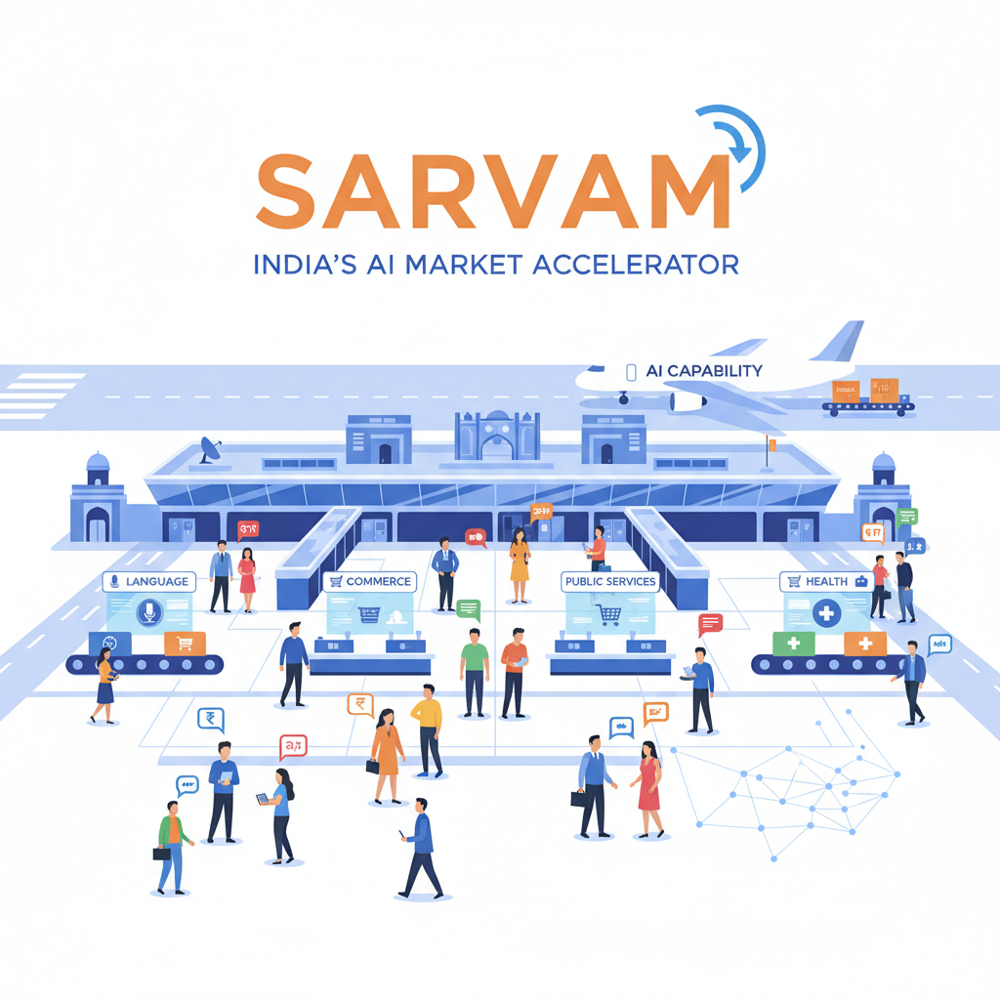
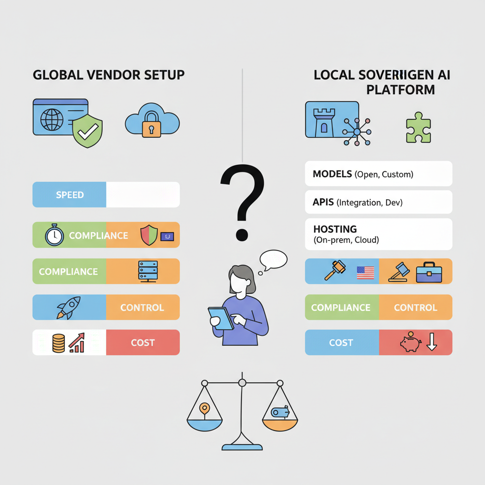

# Sarvam AI and India’s AI Capability: What Product Leaders Need to Know

## Why Sarvam matters as a signal for India’s AI market

Think of **Sarvam as a new airport being built for India’s digital traffic**: it does not just move one airline, it reveals whether the whole region is ready for larger flows of people, language, and commerce. Sarvam’s positioning as a “full-stack sovereign AI platform” and its India-focused models suggest the market is shifting from **AI consumption to AI capability**—meaning India is no longer only buying global AI products, but trying to build and deploy them locally ([Source](https://www.sarvam.ai/), [Source](https://www.fortuneindia.com/business-news/sarvam-ai-launches-30b-and-105b-models-tailored-for-india-focused-deployment/130517)). That matters because product strategy in India changes when the market can support local language, local control, and local deployment at scale.

For PMs, the opportunity is **not just model quality; it’s product reach**. India’s AI opening is strongest where products need multilingual experiences (many languages in one product), voice-first interactions (talking instead of typing), public-sector workflows (government-style service delivery), and low-cost distribution across feature phones, cars, and smart glasses ([Source](https://techcrunch.com/2026/02/18/indias-sarvam-wants-to-bring-its-ai-models-to-feature-phones-cars-and-smart-glasses/), [Source](https://www.sarvam.ai/blogs/partnerships-with-indian-states)). This means your team can think beyond “can we ship in India?” to “can India become the blueprint for cheaper, broader, more localized adoption?”

*Sarvam as a signal that India’s AI market is moving from consumption to capability.*

> **💡 What this means for you as a PM**
> This helps PMs decide whether India is a test market, a growth market, or a strategic AI build location. If Sarvam and similar players can reliably serve multilingual and state-level use cases, India becomes more attractive for launching products that need distribution at scale and tight cost control. But the business trade-off is clear: teams may overestimate readiness for enterprise-grade, high-accuracy, or safety-sensitive use cases if local capability matures unevenly ([Source](https://www.theasiagroup.com/the-big-picture-indias-ai-trajectory-from-consensus-to-capability/), [Source](https://www.pib.gov.in/PressReleasePage.aspx?PRID=2227612)).

## What Sarvam is building and why it matters for product design

Think of Sarvam like **an enterprise-grade utility closet for AI**: instead of renting one tool for one job, you get models, APIs, and deployment options that can power different products in different environments. Sarvam positions itself as a **full-stack sovereign AI platform** (a locally controlled AI stack that includes models, application interfaces, and hosting choices), which matters because PMs are not just buying “AI,” they are choosing a packaging model for speed, compliance, and long-term dependency risk ([Source](https://www.sarvam.ai/)).

Sarvam’s launch of **30B and 105B models** (smaller and larger AI models suited for different cost and quality needs) is strategically interesting because it signals a menu of trade-offs, not a one-size-fits-all chatbot. For a PM, that means you can imagine **cheaper, lower-latency** (faster response time) experiences for high-volume use cases, while still reserving the larger model for more complex workflows or premium tiers; Fortune India reports these models are tailored for India-focused deployment ([Source](https://www.fortuneindia.com/business-news/sarvam-ai-launches-30b-and-105b-models-tailored-for-india-focused-deployment/130517)). **This affects your roadmap because** it can change whether AI features belong in core onboarding, customer support, or a premium enterprise add-on.

*A full-stack sovereign AI platform changes the product and dependency trade-offs for PMs.*

> **💡 What this means for you as a PM**
> Understanding Sarvam’s product stack helps PMs spot when a local AI platform can lower launch friction and when it adds dependency risk. If your product needs Indian languages, onshore hosting, or public-sector trust, Sarvam could unlock faster distribution and easier enterprise sales. But if your experience depends on global model portability or best-in-class multimodal quality (handling text, voice, images, and more together), you may need to hedge with a multi-vendor plan.

Sarvam has also said it is moving beyond chat into **speech, vision, and enterprise tools** (voice, image understanding, and workflow software for businesses). That matters because many real products are not “ask a question, get an answer”; they are **end-to-end workflows** like a bank customer speaking to support in Hindi, or a field agent scanning a document and triggering a case update. In product terms, this expands the addressable surface area, but it also raises integration complexity and rollout risk when you need reliability across channels ([Source](https://techcrunch.com/2026/02/18/indias-sarvam-wants-to-bring-its-ai-models-to-feature-phones-cars-and-smart-glasses/)).

The **open-source angle** (making model code or weights available for others to inspect and build on) is especially important for India’s ecosystem. It can improve vendor trust, accelerate partner-led distribution, and reduce adoption friction for system integrators building for banks, states, or telecoms; TechCrunch described Sarvam’s new models as a major bet on open source AI ([Source](https://techcrunch.com/2026/02/18/indian-ai-lab-sarvams-new-models-are-a-major-bet-on-the-viability-of-open-source-ai/)). When this goes right, your team can piggyback on a broader ecosystem; when it goes wrong, you may inherit support fragmentation and unclear accountability.

## India-specific deployment: multilingual, voice-first, and device-constrained use cases

Think of this like building a **shop that has to work in a crowded bazaar, not just a mall**: customers may arrive on low-end phones, speak different languages, and expect quick answers without typing. Sarvam’s push toward feature phones, cars, and smart glasses is a sign that **India-specific deployment** (designing AI to work across devices, languages, and bandwidth limits) can expand who can actually use your product ([TechCrunch](https://techcrunch.com/2026/02/18/indias-sarvam-wants-to-bring-its-ai-models-to-feature-phones-cars-and-smart-glasses/), [Sarvam AI](https://www.sarvam.ai/)). The company’s India-focused model strategy also suggests that **deployment constraints are becoming a product strategy**, not just an engineering constraint ([Fortune India](https://www.fortuneindia.com/business-news/sarvam-ai-launches-30b-and-105b-models-tailored-for-india-focused-deployment/130517)).

For PMs, **voice AI** (systems that understand and respond to spoken language) and **multilingual interfaces** (products that work across multiple languages) matter because they reduce friction in adoption and support. A payments app like Paytm, a delivery app like Zomato, or a government service portal becomes much more usable when users can speak naturally instead of typing in English. This means your team can reach users who are less comfortable with keyboards, while also lowering support costs by handling more journeys through conversation rather than call centers. Sarvam’s customer and state-partnership focus points to exactly these kinds of public-service and mass-market workflows ([Sarvam AI Partnerships](https://www.sarvam.ai/blogs/partnerships-with-indian-states), [Sarvam Stories](https://www.sarvam.ai/stories)).

> **💡 What this means for you as a PM**
> If your product depends on reaching the next hundred million users, India-style deployment constraints can become a growth advantage instead of a limitation.
> The business trade-off is **reach versus depth**: smaller models (lighter AI systems) and lower compute (less processing power needed) can unlock cheaper distribution on weak devices, but they may not handle the longest, most complex tasks as well. This affects your roadmap because you may choose a “good enough everywhere” experience for onboarding, support, or field operations, while reserving richer AI for premium or connected-device tiers. It also opens new categories—citizen services, field-force tools, banking assistants, and in-vehicle copilots—where **availability in the user’s language and device matters more than raw model size** ([TechCrunch](https://techcrunch.com/2026/02/18/indian-ai-lab-sarvams-new-models-are-a-major-bet-on-the-viability-of-open-source-ai/), [Sarvam AI](https://www.sarvam.ai/), [PIB](https://www.pib.gov.in/PressReleasePage.aspx?PRID=2227612)).

## Business impact: cost, ROI, and operating model implications for PMs

Think of AI spend like **renting office space vs. buying a building**: the monthly bill looks manageable until usage scales and the rent starts shaping every product decision. Sarvam’s India-focused models (models built and tuned for Indian use cases) matter because they can change the **unit economics (cost per successful customer action)** of high-volume products, especially where local languages and domestic deployment matter ([Sarvam](https://www.sarvam.ai/), [Fortune India](https://www.fortuneindia.com/business-news/sarvam-ai-launches-30b-and-105b-models-tailored-for-india-focused-deployment/130517), [TechCrunch](https://techcrunch.com/2026/02/18/indian-ai-lab-sarvams-new-models-are-a-major-bet-on-the-viability-of-open-source-ai/)).

**The biggest cost levers** PMs should watch are inference efficiency (the cost to generate each answer), support burden (extra human help when AI misses the mark), localization effort (time and money to make the product work in Indian languages and contexts), and channel-specific deployment costs (the cost of serving AI on voice, feature phones, cars, or smart glasses) ([TechCrunch](https://techcrunch.com/2026/02/18/indias-sarvam-wants-to-bring-its-ai-models-to-feature-phones-cars-and-smart-glasses/), [Sarvam](https://www.sarvam.ai/)). This means your team can improve ROI not just by getting a smarter model, but by lowering the cost of every successful WhatsApp-style support flow, vernacular search query, or voice-based transaction.

**The business trade-off is speed now versus economics later.** Global model providers (large external AI vendors) can get you to market fast, but they can also create vendor lock-in (dependence on one supplier) and rising costs as usage grows. A sovereign AI platform (an India-controlled AI stack) can be slower to adopt upfront, but it may reduce long-term risk, improve compliance comfort, and give you more control over pricing and distribution in India-specific channels ([Sarvam](https://www.sarvam.ai/), [PIB](https://www.pib.gov.in/PressReleasePage.aspx?PRID=2227612), [Asia Group](https://theasiagroup.com/the-big-picture-indias-ai-trajectory-from-consensus-to-capability/)).

**What to track:**  
- **Cost per successful task**  
- **Activation in local languages**  
- **Containment rate** (how often AI resolves without human support)  
- **Quality-by-segment** (performance by language, region, and device class)

> **💡 What this means for you as a PM**  
> This section helps PMs justify AI investments using unit economics, not hype. If local-language usage is high or support costs are ballooning, an India-native platform can materially improve ROI by cutting repeated interactions and reducing escalation to agents. It also changes roadmap sequencing: you may prioritize vernacular onboarding, voice experiences, or India-first channels sooner because the cost curve improves.

## Real-world examples: where Sarvam is already showing up

Think of this like watching where a new payment rail gets adopted first: **the real signal is not the launch announcement, it’s who is already moving money through it**. In Sarvam’s case, the earliest proof points appear in **customer stories and public-sector partnerships** that point to practical demand, not just AI curiosity ([Customer Stories | Sarvam AI](https://www.sarvam.ai/stories), [Sarvam Announces Sovereign AI Partnerships with Indian States](https://www.sarvam.ai/blogs/partnerships-with-indian-states)).

Sarvam says its work is showing up in **multilingual voice AI (spoken AI that handles multiple Indian languages)** across sectors where language access matters: financial services, education, and government workflows ([Customer Stories | Sarvam AI](https://www.sarvam.ai/stories)). That matters because these are exactly the use cases where **better reach, lower agent load, and more accessible service** can justify spending. When a bank, edtech company, or public agency buys this kind of system, they are usually funding a specific business outcome, not experimentation.

The public-sector partnerships with **Odisha and Tamil Nadu** are especially important trust signals ([Sarvam Announces Sovereign AI Partnerships with Indian States](https://www.sarvam.ai/blogs/partnerships-with-indian-states)). In government, procurement is slow and risk-sensitive, so these deals suggest **implementation readiness (the product can actually be deployed), buyer sophistication (the customer knows what outcome they want), and compliance pressure (the need to handle data, language, and auditability carefully)**. This affects your roadmap because public buyers often reward reliability, language coverage, and policy alignment before they reward flashy features.

## What India’s broader AI capability means for PM roadmaps

Think of India’s AI ecosystem like a **new highway network**: once the roads, fuel stations, and toll rules are in place, local businesses can move faster and with less risk. IndiaAI Mission activity, expanding compute availability (shared access to the chips and servers needed to train and run models), and indigenous foundation-model work (general-purpose AI models built locally) are making AI feel more buildable for Indian product teams ([Source](https://www.pib.gov.in/PressReleasePage.aspx?PRID=2227612)) ([Source](https://www.sarvam.ai/)).

That changes the build-vs-buy equation. **You can now consider more India-specific bets**—language support, voice flows, and state- or sector-specific workflows—without assuming every capability must come from a US-first model. Sarvam’s India-focused model launches and its sovereign AI positioning suggest the market is moving toward local deployment and local control, which matters for products in regulated or public-sector-adjacent contexts ([Source](https://www.fortuneindia.com/business-news/sarvam-ai-launches-30b-and-105b-models-tailored-for-india-focused-deployment/130517)) ([Source](https://www.sarvam.ai/)) ([Source](https://www.techcrunch.com/2026/02/18/indian-ai-lab-sarvams-new-models-are-a-major-bet-on-the-viability-of-open-source-ai/)).

The talent reality is still the bottleneck. India may have a deep AI talent pool, but product teams often find a smaller pool of people who can turn demos into reliable production systems, especially across data quality, evaluation, and rollout discipline ([Source](https://indianexpress.com/article/technology/artificial-intelligence/india-talent-adoption-stanford-ai-index-2026-key-findings-10636268/)). This means your team can move faster on pilots, but should budget extra time for hardening, monitoring, and change management.

Governance is also becoming a product design issue, not just a legal one. Sarvam’s partnerships with Indian states show how **sector-led or state-led adoption** can create different approval paths, audit requirements, and rollout controls ([Source](https://www.sarvam.ai/blogs/partnerships-with-indian-states)). When this goes wrong, you’ll see it as stalled launches, compliance rework, or a model that works in one geography but cannot scale to the next.

> **💡 What this means for you as a PM**
> This gives PMs a framework for timing investments so they don’t overbuild ahead of the ecosystem. Bet now on use cases where localization, cost control, and trust are core to adoption; run pilots where the policy environment is still settling; and wait where you need mature vendor reliability, strong evaluation tooling, or broad enterprise proof. The business trade-off is speed versus lock-in: moving early can create category advantage, but only if your roadmap includes governance and talent capacity, not just feature ambition.

---

## 📚 Further Reading

The following sources were retrieved and used during research for this blog. All links are verified — none are invented.

1. **[India's Sarvam wants to bring its AI models to feature phones, cars, and smart glasses | TechCrunch](https://techcrunch.com/2026/02/18/indias-sarvam-wants-to-bring-its-ai-models-to-feature-phones-cars-and-smart-glasses/)** · *TechCrunch*
   > Sarvam plans edge-AI assistants for feature phones, cars, and smart glasses; demo showed a dedicated AI button on a Nokia/HMD feature phone....

2. **[Sarvam AI launches 30B and 105B models tailored for India-focused deployment](https://www.fortuneindia.com/business-news/sarvam-ai-launches-30b-and-105b-models-tailored-for-india-focused-deployment/130517)** · *Fortune India*
   > Sarvam launched 30B and 105B models for India-focused deployment, emphasizing efficient inference and multilingual use across devices....

3. **[Indian AI lab Sarvam's new models are a major bet on the viability of open source AI | TechCrunch](https://techcrunch.com/2026/02/18/indian-ai-lab-sarvams-new-models-are-a-major-bet-on-the-viability-of-open-source-ai/)** · *TechCrunch*
   > Sarvam’s new 30B and 105B models include speech, vision, and enterprise tools; the company plans to open source the models....

4. **[Sarvam | India's Full-Stack Sovereign AI Platform](https://www.sarvam.ai/)** · *Sarvam AI*
   > Sarvam positions itself as a sovereign AI platform for India, offering models, APIs, enterprise deployment, and customer stories....

5. **[Sarvam Announces Sovereign AI Partnerships with Indian States | Sarvam AI](https://www.sarvam.ai/blogs/partnerships-with-indian-states)** · *Sarvam AI*
   > Sarvam announced partnerships with Odisha and Tamil Nadu to build sovereign AI capacity, models, and public-sector applications....

6. **[Customer Stories | Sarvam AI](https://www.sarvam.ai/stories)** · *Sarvam AI*
   > Sarvam’s customer stories highlight multilingual voice AI use cases across Tata Capital, EkStep, government, and other sectors....

7. **[In less than 24 months, India AI Mission has Set up a Foundation for ...](https://www.pib.gov.in/PressReleasePage.aspx?PRID=2227612)** · *Press Information Bureau*
   > PIB says IndiaAI Mission has onboarded 38k+ GPUs and shortlisted 12 teams for indigenous foundation models, including Sarvam....

8. **[The Big Picture: India’s AI Trajectory — From Consensus to Capability | The Asia Group](https://theasiagroup.com/the-big-picture-indias-ai-trajectory-from-consensus-to-capability/)** · *The Asia Group*
   > The Asia Group summarizes India’s sovereign AI push, data-center expansion, and large-scale investments across the AI stack....

9. **[[PDF] Artificial Intelligence (AI) for Bharat: Innovation and inclusion at scale](https://assets.kpmg.com/content/dam/kpmgsites/in/pdf/2026/02/artificial-intelligence-for-bharat-innovation-and-inclusion-at-scale.pdf)** · *KPMG*
   > KPMG report on India AI infrastructure, compute capacity, talent, and deployment for inclusive, population-scale AI....

10. **[India has 50K-strong AI talent pool but leads world in net outflows: Stanford University report | Technology News - The Indian Express](https://indianexpress.com/article/technology/artificial-intelligence/india-talent-adoption-stanford-ai-index-2026-key-findings-10636268/)** · *The Indian Express*
   > Indian Express summarizes Stanford AI Index 2026 findings on India’s AI talent, open-source activity, and model transparency....

11. **[The 2025 Foundation Model Transparency Index](http://arxiv.org/abs/2512.10169v1)** · *Arxiv* · 2025-12-11
   > Annual index comparing transparency practices of foundation model developers, including data acquisition and monitoring disclosures....

12. **[A federated architecture for sector-led AI governance: lessons from India](http://arxiv.org/abs/2603.26865v1)** · *Arxiv* · 2026-03-27
   > Paper proposes a whole-of-government architecture for India’s sector-led AI governance to reduce fragmentation and improve implementation....

13. **[[Product Hunt] FocuSee 2.0 - Record screen to get polished demos & tutorials](https://www.producthunt.com/products/focusee?utm_campaign=producthunt-api&utm_medium=api-v2&utm_source=Application%3A+Claude+MCP+Server+%28ID%3A+234160%29)** · *Product Hunt* · 2026-04-23
   > FocuSee 2.0 helps create polished product demos and tutorials with AI editing, subtitles, background removal, and voice enhancement....

14. **[[Product Hunt] Kollab - Shared workspace where teams work with agents together](https://www.producthunt.com/products/kollab-2?utm_campaign=producthunt-api&utm_medium=api-v2&utm_source=Application%3A+Claude+MCP+Server+%28ID%3A+234160%29)** · *Product Hunt* · 2026-04-23
   > Kollab is a shared workspace where AI agents join team workflows through bots, connectors, skills, and memory....

