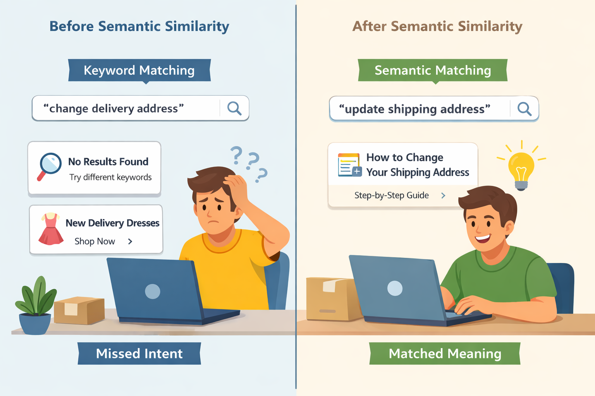
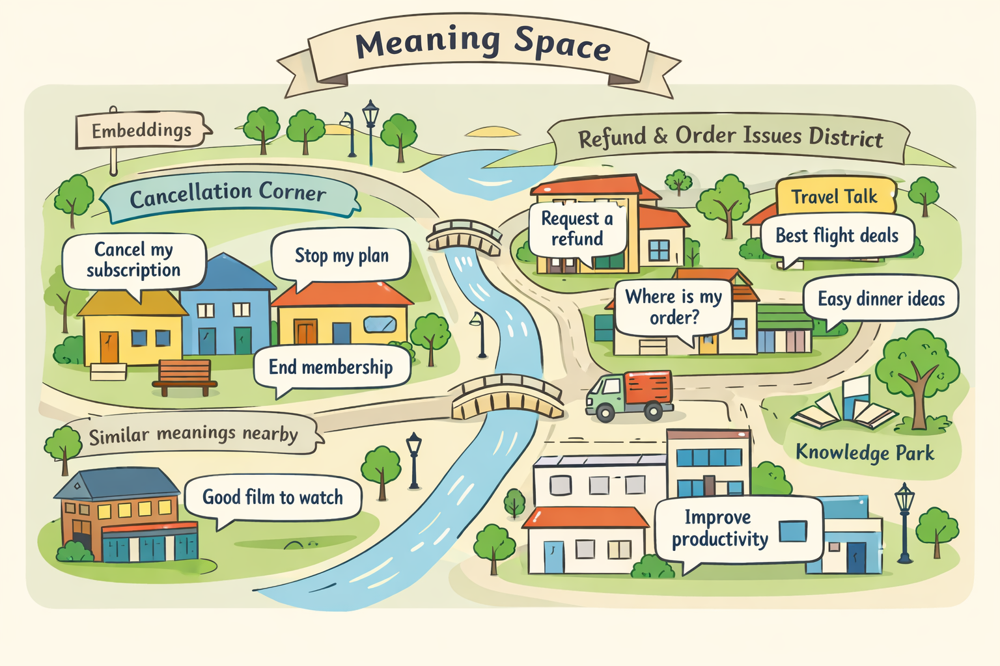
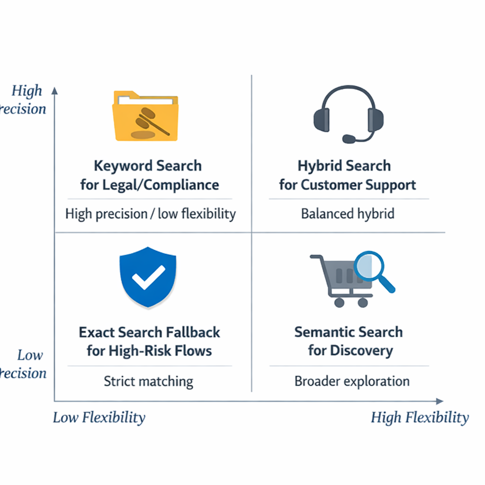

# Semantic Similarity and How LLMs Understand Meaning: A PM’s Guide

## Why semantic similarity matters for product teams

Think of **semantic similarity** like a smart librarian who knows that “refund on my last order” and “money back for yesterday’s purchase” are asking for the same thing. In plain English, it means **matching meaning, not just matching words**. For a PM, that shows up in search, help-center discovery, duplicate detection, support routing, personalization, and summarization — basically anywhere users ask for something in their own messy language.

This creates a **product trade-off**: keyword matching (literal word matching) is fast and predictable, but it misses phrasing variations; meaning-based matching (understanding intent) is more flexible, but it can sometimes feel less exact. Think about Amazon search or a support portal: if users type “change delivery address” and the system only looks for those exact words, it may fail; if it understands intent, it can surface the right workflow faster.

*Keyword matching finds exact words; semantic matching finds the user’s intent.*

> **💡 What this means for you as a PM**  
> If your product can match meaning instead of exact words, users find answers faster and abandon less often. That changes your roadmap because search quality, support deflection, and recommendation relevance become core growth levers, not just UX polish. The business value is lower friction, better conversion, and fewer failed searches — which usually means less load on support and more trust in the product.

This also changes **user expectations**: people start expecting search to “get them” on the first try, the way they expect Netflix or Spotify to understand what they want even if they describe it differently. When semantic matching goes wrong, you’ll see it as irrelevant results, frustrated retries, and lower confidence in the product. In other words, **meaning is now part of the user experience**, not just a backend detail.

## How LLMs represent meaning without reading like humans

Think of an LLM’s view of language like a **map with neighborhoods**, not a dictionary with definitions. The model does not “understand” meaning the way a person does; instead, it learns **patterns** (repeatable relationships in text) that help it place related ideas near each other. For example, “cancel my subscription” and “stop my plan” can land in a similar part of this **meaning space** (a space where similar texts sit close together), even though the words are different.

The main tool here is **embeddings** (numbers that represent the meaning of text), also called **latent representations** (hidden summaries the model learns internally). This means your team can compare two pieces of text by checking how close they are in that space, much like comparing two products by whether they live in the same customer need category. A support chatbot, for instance, may match “Where is my refund?” with “I haven’t received my money back” even if the exact phrasing changes.

*LLMs place related phrases near each other in a meaning space, even when the words differ.*

**Why this matters for product teams is that semantic similarity can feel smarter than it is.** A model can surface the right intent from very different wording, but it can also get confused by **context dependence** (meaning that changes with surrounding words), **ambiguity** (when a phrase has more than one meaning), **sarcasm** (language that says the opposite of what it means), **domain jargon** (specialized industry terms), and **short prompts** (brief inputs with too little detail). When this goes wrong, you’ll see it as brittle matches, surprising recommendations, or confident but off-base answers.

> **💡 What this means for you as a PM**  
> Understanding the representation layer helps you judge when an LLM feature is genuinely intelligent versus just pattern-matching well. That affects your roadmap because some use cases, like search and support routing, are forgiving of near matches, while others, like compliance or medical guidance, need much tighter control. The business trade-off is speed versus risk: broad semantic matching can improve UX fast, but it can also create hidden failure modes that only show up in edge cases.

## What semantic similarity changes in product design decisions

Think of semantic similarity like a **smart librarian** who can find “books about employee burnout” even if the exact phrase never appears on the page. In product terms, it helps systems match on **meaning** (what the user wants) instead of only **words** (the exact terms they typed). That changes UX, ranking (the order results appear in), moderation (filtering unsafe or irrelevant content), and retrieval (finding the right information) decisions across the product.

**The big design choice is exactness versus flexibility.** Legal search and compliance tools usually need keyword search (matching exact terms) because missing one clause can be costly. Commerce search, customer support, and internal knowledge tools often benefit from semantic search (meaning-based search) because users phrase the same intent in many ways, like “Where is my refund?” versus “I need my money back.” In many products, a hybrid approach (mixing exact-word and meaning-based matching) gives the best balance of precision (being correct) and recall (finding enough relevant results).

*PMs should choose the right search approach based on risk, precision, and flexibility.*

> **💡 What this means for you as a PM**  
> The right similarity strategy can improve task completion, but the wrong one can quietly damage trust and precision. This affects your roadmap because you may need different search behavior for different surfaces: strict matching for policy-heavy flows, broader matching for discovery, and a fallback when confidence is low. It also changes your risk plan, since over-broad results can make users feel the product is “making things up.”

**Confidence thresholds, fallback states, and clarification prompts matter a lot.** A confidence threshold (a cutoff for “we’re sure enough to act”) can decide whether the system shows a result, asks a follow-up question, or falls back to exact search. This means your team can reduce bad answers in high-stakes moments, like a support agent searching for the right policy or a shopper trying to find a specific product variant. When this goes wrong, you’ll see it as false positives (wrong but plausible results), over-generalization (too broad matching), and missed niche terminology (specialized words the system doesn’t recognize).

**Evaluate this like a product leader, not a model researcher.** The most useful measures are relevance (are the results useful?), task completion (did the user finish?), trust (do users believe the system?), and time saved (did it help faster than the old flow?). For example, in a customer support tool, a result that is “technically related” but not actionable is a failure if it forces the agent to search again. The business trade-off is simple: broader semantic matching can increase discovery, but tighter controls are usually worth it in high-risk workflows where precision protects the brand.

## Business impact, ROI, and cost trade-offs

Think of semantic similarity like a **smart matching clerk** in a store who can tell when a customer is asking for “the blue running shoe” even if they say “lightweight trainers for jogging.” In product terms, **meaning-aware matching** helps your product connect users to the right result, reply, or next step even when their wording is messy or incomplete.

A semantic similarity layer can lift **conversion, self-serve resolution, and retention** by reducing dead ends. For example, in an e-commerce app like Amazon, it can improve search results; in a support flow like WhatsApp Business or a help center, it can route people to the right article or agent faster. **This means your team can turn vague intent into a measurable product win** instead of treating “better AI” as a vague goal.

The business trade-off is that **better meaning matching is not free**. Costs usually come from model usage (paying each time the system makes a prediction), retrieval infrastructure (the system that finds likely matches), latency (how long users wait), tuning (adjusting for your use case), and evaluation effort (testing whether it actually works). **The best model is not always the most economical model**, especially if a simpler keyword search or rules-based flow already solves 80% of cases.

When should you invest? If the journey is high-value, high-volume, or failure is expensive: checkout search, customer support deflection, sales lead routing, or upsell recommendations. If the problem is narrow and predictable, **simpler rules or classic search may be good enough** and faster to ship. **This affects your roadmap because** you should reserve semantic features for places where small accuracy gains create real revenue or cost savings.

To estimate ROI, compare the cost of the feature against gains from:
- **Fewer failed journeys** — more users find what they need
- **Reduced handle time** — support agents spend less time per case
- **Higher retention or upsell** — users stay longer or buy more
- **Lower support load** — more issues resolved through self-serve

**💡 What this means for you as a PM**  
A strong ROI case turns semantic similarity from a cool capability into a measurable growth or efficiency lever. Your job is to define the one or two journeys where better meaning matching changes business outcomes, then compare that upside against ongoing model and evaluation costs. If you don’t set those boundaries, teams can overbuild expensive AI where simpler product logic would have been enough.

## Real-world product examples and what PMs can learn

Think of semantic similarity like a **smart librarian** who doesn’t just look for the same words, but for the same *idea*. In a knowledge base (a searchable library of company information), that means a search for “reset my password” can still surface an article titled “can’t log in,” because the meaning is close even if the wording differs.

In a support workflow (how customer requests get routed and handled), **intent matching** helps a team classify “where is my refund?” and “money not returned yet” as the same issue. This means your team can reduce manual triage, speed up time to answer, and keep customers from repeating themselves. In recommendation systems (tools that suggest the next best item), related meaning can power suggestions like pairing a “project planning” article with “team goals” content, which can lift engagement without needing exact keyword overlap.

> **💡 What this means for you as a PM**  
> Seeing how semantic similarity shows up in real products helps you design for outcomes instead of chasing model novelty. Your roadmap should be tied to measurable product goals like fewer zero-result searches, faster resolution time, and better personalization. The business trade-off is that more flexibility can improve recall (finding more relevant results) but also increases the risk of irrelevant matches.

The hard part is **trust calibration** (how much users should rely on a suggestion). A shopping app can tolerate more ambiguity than a healthcare or banking product, where the stakes are higher and wrong suggestions create real risk. When this goes wrong, you’ll see it as users over-trusting AI-generated suggestions, ignoring good results because of one bad match, or losing confidence in the product altogether.

The lesson is simple: **outcomes matter more than the technique name**. Whether the team calls it embeddings, semantic search, or AI matching, PMs should ask the same question: does it help users finish the job faster, with less friction, and at an acceptable level of risk?

## How PMs should evaluate and ship semantic features

Think of a semantic feature like a **smart concierge at a hotel**: it can point people to the right room, but only if you know what “right” means for each guest. Before launch, define the **user problem** (the friction you’re removing) in plain terms: are you helping people find the right item faster, reduce search dead ends, or get to an answer without extra support?

Your **success metrics** (the numbers that prove value) should map to business outcomes, not just model quality. For example, a marketplace like Amazon might track task completion (did the shopper find the product?), while a support tool might watch deflection rate (how many tickets never needed an agent?). This means your team can avoid “accurate but useless” launches that look good in demos but don’t move retention or conversion.

**Trust guardrails** matter as much as relevance. Build explainability (a simple reason the system made a match), fallback paths (a backup when confidence is low), and correction flows (a way for users to say “wrong result”). When this goes wrong, you’ll see it as user confusion, support burden, and slower adoption.

A good rollout is **small, measurable, and reversible**. Start with a narrow scope, use human review (people checking outputs) on edge cases, and run A/B testing (comparing two versions with real users) before broad release.

> **💡 What this means for you as a PM**  
> A disciplined launch process keeps semantic features useful, measurable, and safe to scale.  
> Align early on quality thresholds, cost ceilings, and who owns ongoing monitoring, because semantic systems can drift in value even when they still “work.” The business trade-off is speed versus trust: shipping fast can unlock learning, but shipping carelessly can create user skepticism that is hard to win back.

**PM checklist:**
- Define the user job to be done and the friction you’re removing
- Pick one primary business metric and two guardrails
- Set a quality threshold for launch and a rollback condition
- Agree on budget limits for inference cost (the cost of each model use)
- Assign ownership for monitoring, feedback triage, and model updates

---

## 📚 Further Reading

*This blog was written from the model's training knowledge. No external sources were retrieved during generation. For further reading, search for the topic on [Lenny's Newsletter](https://www.lennysnewsletter.com), [Reforge](https://www.reforge.com/blog), or [Mind the Product](https://www.mindtheproduct.com).*
