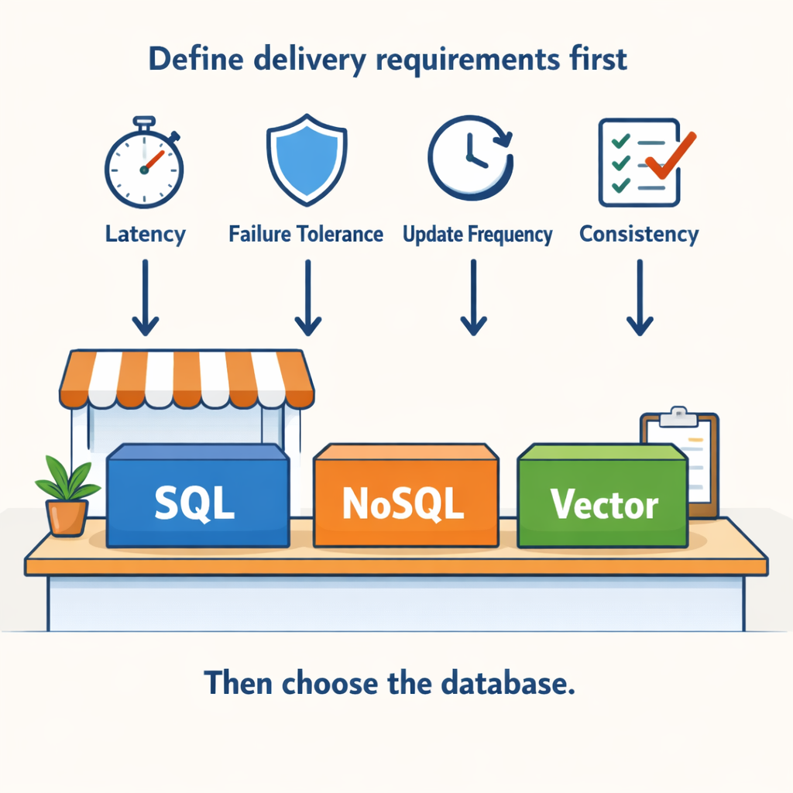
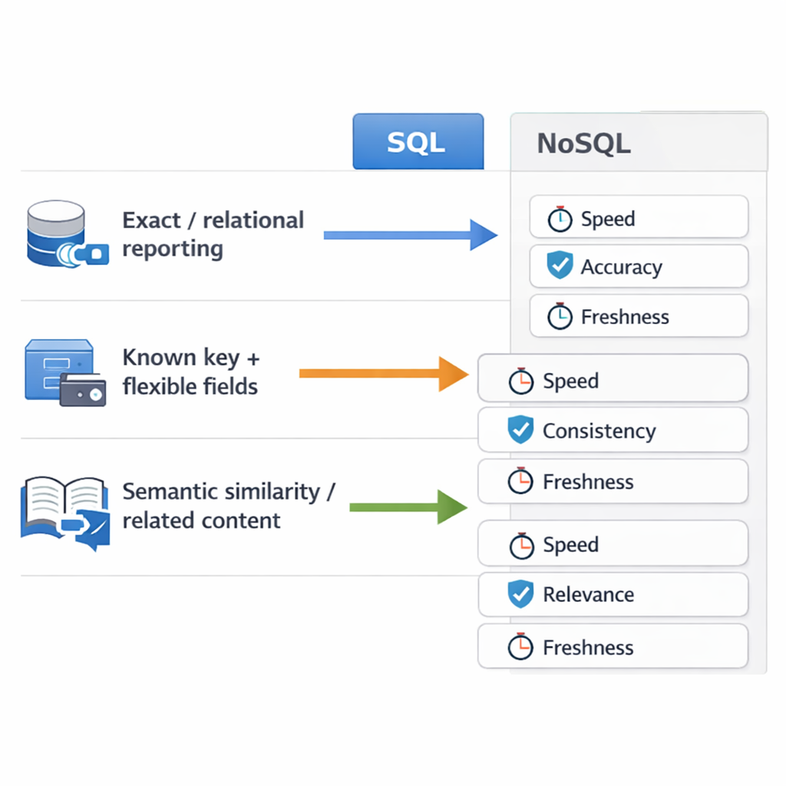
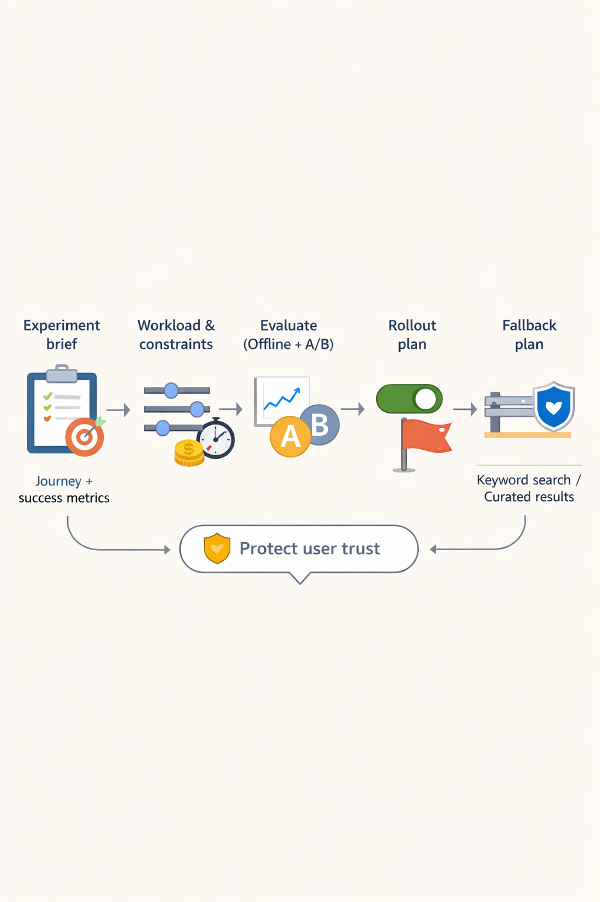

# SQL vs NoSQL vs Vector Databases: A PM Decision Guide

*Treat database selection like choosing a courier: define delivery requirements first (latency, freshness, failure tolerance), then pick the “delivery system.”*

## Start with the product problem, not the database category

Think of database choice like picking a courier service: if you need “same-day, no mistakes” you wouldn’t send everything by overnight mail, and if you can tolerate “best-effort” you shouldn’t pay for guarantees you don’t need. **Your database is just the delivery system for your data and queries.** Before you compare SQL, NoSQL, and vector databases (which store different “shapes” of information), **write down the delivery requirements in product language**.

Start with a one-page **decision inputs doc**:
- **Primary user journeys** (what users do end-to-end)
- **Latency expectations** (e.g., “p95 under 200ms” vs “seconds ok”)
- **Update frequency** (how often data changes)
- **Failure tolerance** (what breaks if it’s delayed or wrong?)

Then **separate read patterns from write patterns**, because the business trade-off is often hidden there. For example, an e-commerce **checkout** can have **bursty writes** (orders, inventory reservations), while **dashboards** have steady **read-heavy traffic** (sales charts, cohort views). If you choose one system for both without modeling both workloads, you’ll see it as **slow dashboards** or **riskier checkout reliability**.

Next, define **consistency expectation** in business terms:
- **“User balance must never go backwards”** (strong correctness)
- **“Recommendations can be stale for a few minutes”** (eventual correctness)

Finally, list the **core query shapes you truly need** (not the ones you hope to add later): exact lookups, range queries, aggregations, full-text search, filtering, and similarity search (finding “most similar” items). Use these to build a shortlist of success metrics—**time-to-ship, cost per request, data freshness, and user-perceived relevance**—and map each metric to the database constraints you’re accepting.

> **💡 What this means for you as a PM**  
> If you can’t clearly define workload and consistency needs, you can’t credibly pick between SQL, NoSQL, or vector databases. This affects your roadmap because it determines what “fast iteration” really costs—sometimes the cheapest-looking choice later becomes expensive to maintain or too risky for critical flows. The fastest path is to treat database selection as a response to requirements you can test, not a preference you choose.

This means your team can make a **defensible decision criteria** and avoid “technology-first” mistakes—**the business trade-off becomes explicit** before you spend months integrating.

## SQL databases: when structured truth and transactional integrity matter

Think of a **SQL database like the accounting ledger behind a bank**: every number ties out, relationships are explicit, and there’s a strong expectation that “what happened” matches “what we report.” That’s what SQL (Structured Query Language) databases are built for—**structured data (data with fixed fields and types)**, **relationships (how records link together)**, and **transactions (all-or-nothing updates)**.

**Choose SQL when your product centers on entities with strong relationships**—for example **orders → order items → customers** in an e-commerce app—because you need **revenue-impacting transactional integrity (no partial, inconsistent writes)**. **Prefer SQL when stakeholders expect predictable reporting and analytics** with consistent semantics, so **the finance dashboard matches what the app actually did**. This affects your roadmap because analytics, compliance, and trust become easier to reason about early.

You also need to align **schema evolution (how you change data structure over time)** with release discipline: can you tolerate migrations and governance overhead, or do you need rapid schema-less experimentation? **The business trade-off is speed of iteration vs auditability and correctness**, and when this goes wrong, teams feel it as mismatched numbers, failed reconciliation, or expensive data fixes later.

> **💡 What this means for you as a PM**  
> SQL is usually the safest bet when your product promise depends on **correctness** (e.g., billing, inventory, payouts) and when **relationships** between entities drive core user flows. This affects your roadmap because you’ll likely invest in **data-model governance** and planned schema changes. The upside: fewer “mysterious” reporting discrepancies and lower risk for audit/compliance—often worth the slower pace of some experiments.

**Finally, evaluate performance guarantees for your key queries (how fast joins and aggregations run)** because user-facing SLAs (Service Level Agreements) often depend on query predictability, not just average speed. In practice, that means asking how the system handles **joins (combining related tables)**, **aggregations (summaries like totals and counts)**, and **index-based filtering (fast lookups using pre-defined structures)** under peak load.

## NoSQL databases: choosing flexibility for scale, patterns, and data models

Think of a NoSQL database like a **set of pre-labeled drawers** in a filing cabinet: if you already know what you’ll look up (drawer name + time), you can retrieve things extremely fast. But if you keep asking new, unpredictable questions, you’ll end up filing and searching in awkward ways.

NoSQL databases (data stores with flexible, non-relational structures) are most useful when your product has **clear access patterns** (what queries you run most) and you want to optimize storage and reads around them. For example, a social app like **Instagram** could fetch a “user feed by userId + time window” efficiently—because the pattern is known and repeats at scale. If you’re building a **tenant-based** product like a B2B SaaS, NoSQL can also handle **evolving schemas** (attributes that change over time) without heavy migrations.

The business trade-off is that teams often avoid **cross-entity joins** (asking for related data in one query) to keep reads fast—so you must confirm the product can tolerate:
- **Denormalized data** (duplicating fields for speed) and eventual synchronization
- **More complex consistency thinking** (what data must be instantly correct vs “good enough” shortly after)

Operationally, NoSQL isn’t “set and forget.” You’ll want a clear plan for **re-indexing/repartitioning** (how data gets reorganized) and **failure handling** (what happens during partial outages), because these directly affect incident response speed and roadmap risk. Also assess **multi-region availability** (keeping the service working across regions) early—if your login flow needs “**five nines**” reliability, ensure NoSQL’s operational model matches that requirement.

> **💡 What this means for you as a PM**  
> NoSQL can dramatically improve **latency** and **scale**—but only if your team can define stable “top queries” (like feed loads, status pages, or search-by-ID) and is comfortable designing around **weaker cross-entity querying**. This affects your roadmap because new features that require lots of flexible joins may either slow down or require re-modeling. Plan an operational ownership mindset: data migrations and reorganizations can become recurring roadmap and incident-management work.

## Vector databases: powering semantic search and recommendations (with guardrails)

Think of a **vector database** like a **smart librarian** who doesn’t match books by exact title, but by *meaning*: if two books are about the same topic, they’ll sit “nearby,” even if the wording differs. In product terms, **vector search** (finding similar items by meaning) helps you **retrieve the right content faster for user intent**—not exact string matches.

A **vector** (a numeric representation of meaning) typically represents *semantic similarity* between content—like a support article, product listing, or FAQ. When users search in **meaning**, the system returns “close” items that can be **relevant but not exact**, which affects **trust** and **expectations**.

This makes vectors a great fit when “**find the right item by meaning**” is a core journey—e.g.:
- **Support search** in WhatsApp Business / Zendesk-like flows (reduce time-to-resolution)
- **Product discovery** in Amazon/Swiggy (recommend the next best item)
- **Matching** in dating/marketplaces (map intent to candidates)
- **Agent-like assistance** in tools that answer from your knowledge base

> **💡 What this means for you as a PM**  
> Vector databases are a **relevance engine**, so your **ROI depends on relevance metrics and operational freshness**, not just choosing “embeddings.” Make early product decisions about **how wrong answers affect trust** (and how much missing coverage you can tolerate). Plan roadmap work for **content update + quality monitoring**, otherwise recommendations and answers will quietly degrade.

The business trade-off is usually **precision vs. recall** (how often answers are truly relevant vs. how completely you cover possible needs). If users see too many “almost-right” results, **complaints and churn** can spike faster than the benefit of higher coverage—so set guardrails based on your risk tolerance. This affects your roadmap because you’ll need **evaluation loops** (offline tests + live A/B) before full rollout.

Finally, treat the vector system as a pipeline, not a switch: you must decide **ingestion/update cadence** (how often content changes), **re-embedding strategy** (when you re-generate meaning representations), and **latency budgets** (how quickly you return results). In practice, that determines whether “semantic relevance” stays fresh for recommendations and search—especially in fast-moving catalogs or customer issues.

Request KPIs that map to outcomes:
- **CTR** (click-through rate) or **conversion** for discovery
- **Time-to-resolution** and **deflection rate** for support
- **Answer usefulness** and **complaint rate** for assistants
- **Repeat search rate** (are users forced to recover from misses?)

This is how you avoid adopting vectors by default—and instead ship a relevance experience your users actually trust.

## A practical selection matrix: map product requirements to SQL vs NoSQL vs Vector

*A repeatable PM matrix: map workload (access patterns) and constraints (latency, consistency, freshness) to SQL vs NoSQL vs Vector.*

Think of your data like a library. **SQL is a card catalog for exact, structured searches**, **NoSQL is a set of shelf tags for flexible items**, and **a vector database is a “find similar books” recommendation aisle**.

Use a repeatable checklist:

- **Start with the “primary access pattern” filter (how your app actually reads data):**
  - **Exact entity reads and relational reporting → SQL (structured queries + joins).**
  - **Known key-based access with flexible fields → NoSQL (document/key-value style lookups).**
  - **Semantic similarity and “related content” retrieval → Vector (meaning-based nearest-neighbor search).**

- **Score each option against your non-negotiables (what you can’t compromise):**
  - **Latency SLA (how fast results must be).**
  - **Consistency tolerance (whether users can see temporary mismatches).**
  - **Data freshness window (how recently data must be correct).**
  - **Incident impact (what users experience when it degrades).**

- **Decide on integration scope (single system vs hybrid):**
  - If you need **transactional writes (SQL) plus semantic retrieval (Vector)**, your roadmap may require **two systems** or a carefully planned hybrid.

- **Plan for cost-controlled learning:**
  - Prototype on a smaller dataset, validate thresholds, then scale—so **experimentation reduces risk before you pay for full throughput**.

**Business trade-off example:** **You may accept eventual consistency in feed ordering** to get **higher availability** (users rarely wait, even if ordering shifts slightly).

## Cost, ROI, and risk: the business case for database choices

Think of SQL, NoSQL, and vector databases like choosing **different warehouse layouts** for your inventory. Some layouts are great for fast, structured “find the exact item” retrieval; others are better when you need “find similar items” and your inventory keeps changing in meaning. The “best” choice depends on how often you search, how fast inventory grows, and how expensive it is when the warehouse layout breaks.

For your **TCO (Total Cost of Ownership)**, model it around your workload first: **query volume** (how many requests/day), **peak concurrency** (how many simultaneous users), **storage growth** (how fast data expands), and **re-index/re-embedding frequency** (how often you must rebuild representations because logic or models improve). Costs usually scale with usage patterns—not just today’s scale—so plan for growth from day 30 to day 365.  

Your **ROI** should be tied to product metrics, not “tech wins.” Use leading indicators like:  
- **Discovery/conversion lift** (e.g., better browse results in ecommerce)  
- **Support ticket reduction** (e.g., fewer “can’t find this” complaints after search relevance improves)  
- **Onboarding speed** (e.g., faster personalization in fintech or media apps)

The business trade-off is **velocity vs certainty**. Operational complexity raises incident likelihood and increases the cost of slow iteration (e.g., expensive migrations in SQL, schema drift risks in NoSQL, and relevance tuning/re-embedding cycles in vector systems). When this goes wrong, you’ll see it as **ranking regressions**, **higher latency**, or **failed rollouts** that interrupt user trust.

Finally, quantify **vendor/tooling lock-in**. Ask: how hard is it to change your embedding model (vector representation), reformat data, or switch providers without derailing the roadmap? The more you rely on a provider’s proprietary tooling for indexing/search, the higher your “option cost” becomes—especially if your roadmap expects experimentation.

**Practical risk controls:** define **kill-switches** and rollout strategies for relevance features (feature flags, A/B tests, and fallbacks to simpler keyword search or curated results). This lets your team experiment aggressively while containing user-impact risk if quality drops.

> **💡 What this means for you as a PM**  
> Database choice is a business economics decision—when you quantify **TCO (Total Cost of Ownership)** and **user-impact risk**, the “best” option becomes obvious. This directly affects your roadmap timing (how quickly you can iterate), your operational budget (how often things break or need rebuilding), and how safe experimentation is when relevance or search quality changes. Build ROI cases around measurable product outcomes and require rollback plans before you commit.

> **Decision checklist (fast):**  
> - If your value is “exact filters + predictable queries,” SQL often wins on cost predictability.  
> - If your value is “scale-flexible data + variable structures,” NoSQL may reduce delivery risk.  
> - If your value is “semantic search / recommendations,” vector databases can unlock bigger user impact—but cost and rebuild cycles must be budgeted.

## Real-world patterns PMs see: common architectures and outcomes

Think of your data stack like running a restaurant: **SQL** is your reservation ledger (who’s coming and what they ordered), **NoSQL** is the kitchen’s fast-moving prep boards (changing constantly), and **vector databases** are your sommelier’s recommendations (finding similar flavors, even if the customer describes them differently).

In practice, many teams don’t pick just one database—they **combine layers**:
- **System-of-record (SQL or NoSQL):** stores what’s “true” for billing, state, and audit.
- **Retrieval/relevance layer (vectors):** finds the right items to show or discuss, even with messy language.
- **Experimentation loop (A/B tests):** validates whether the experience change actually moves **business KPIs**.

Here are common PM-ready patterns and what outcomes to expect:

- **E-commerce semantic search (illustrative):** Use **SQL** for orders and catalog truth (billing correctness), **NoSQL** for sessions/clickstreams and feeds (fast updates), and **vectors** for “semantic product search” (better matching than keyword-only). Teams typically see **higher product discovery** and fewer “wrong results” complaints.
- **Support knowledge retrieval for faster resolutions (illustrative):** Store ticket state in **SQL/NoSQL** for **auditability**, then use **vectors** to fetch the most relevant help articles so agents move faster. Success often shows up as **reduced time-to-resolution** and improved deflection.
- **Personalization with safe validation (illustrative):** Keep user profiles/feature flags in **NoSQL**, use **vectors** for similarity-based recommendations, and rely on **A/B tests** (experiments) to confirm retention lift before rolling out widely.
- **Fintech guardrails (illustrative):** Use **SQL** for balances and ledger-like transactions (account integrity), while **vectors** power “document search” over uploads. The business trade-off: relevance might be imperfect, but **account correctness** stays protected.

**PM Pattern Rules (what to standardize in roadmaps):**
- Keep **system-of-record (transactional truth)** in SQL/NoSQL.
- Add **retrieval/relevance** with vectors for discovery, search, and assistance.
- Measure **business outcomes** (conversion, time-to-resolution, retention lift) before expanding scope.

> **💡 What this means for you as a PM**  
> The most successful teams treat database types as **complementary layers**—**system-of-record** plus **retrieval**—and validate impact with metrics. This affects your roadmap because “adding vectors” is rarely a full replacement; it’s usually a feature layer that must be guarded by A/B tests and clear failure modes. The risk to plan for: if teams let relevance layers touch critical truth (billing, balances), you can get customer-impacting incidents.

## How to run the decision with engineering: scoping, POCs, and stakeholder alignment

*Run database decisions like product experiments: brief → evaluation → rollout with fallbacks.*

Think of choosing a database like choosing a delivery route for a new feature launch: the “best” route depends on traffic patterns, package types, and how you’ll measure on-time delivery. **You reduce risk by running a structured trial before you commit engineering effort.**

Start with a **one-page experiment brief** that makes the workload explicit: target journey (e.g., search, recommendations, order lookup), data sources, success metrics (latency, success rate, relevance quality), constraints (cost per query, timeouts), and what “good enough” means to move forward. Then **align on evaluation methodology** so offline measures (if you use them) connect to business outcomes: e.g., a relevance metric should map to click-through, conversion, retention, or reduced customer support. The business trade-off is simple: **fewer false positives means trust holds during rollout**, even if initial iteration is slower.

Next, define an **interface contract** with engineering: what the app will send (filters, ranking signals, pagination/sorting needs) and what it expects back (stable fields, explainability hooks, failure behavior). This prevents the database choice from forcing late product changes.

Finally, require a **fallback plan**—especially for vectors and relevance (ranking) features: keyword search (keyword matching), curated lists (human-approved ranking), or an older ranking model (existing logic) during tuning. When this goes wrong, you’ll see it as **users losing trust** (bad results) rather than just a technical defect.

During the **decision review**, make trade-offs explicit: **operational overhead vs iteration speed**, **correctness vs recall** (how often you include the right items), and **roadmap impact vs measurable lift**. This means your team can land on a recommendation that survives both engineering reality and product expectations.

> **💡 What this means for you as a PM**  
> When you run database decisions like product experiments, you get faster alignment and reduce the chance of shipping the wrong system for the wrong workload. It also creates a clear rollout path (including fallbacks), so you can protect user trust while still moving quickly. Finally, the interface contract reduces the risk that “database constraints” derail your roadmap late in the cycle.

---

## 📚 Further Reading

*This blog was written from the model's training knowledge. No external sources were retrieved during generation. For further reading, search for the topic on [Lenny's Newsletter](https://www.lennysnewsletter.com), [Reforge](https://www.reforge.com/blog), or [Mind the Product](https://www.mindtheproduct.com).*
