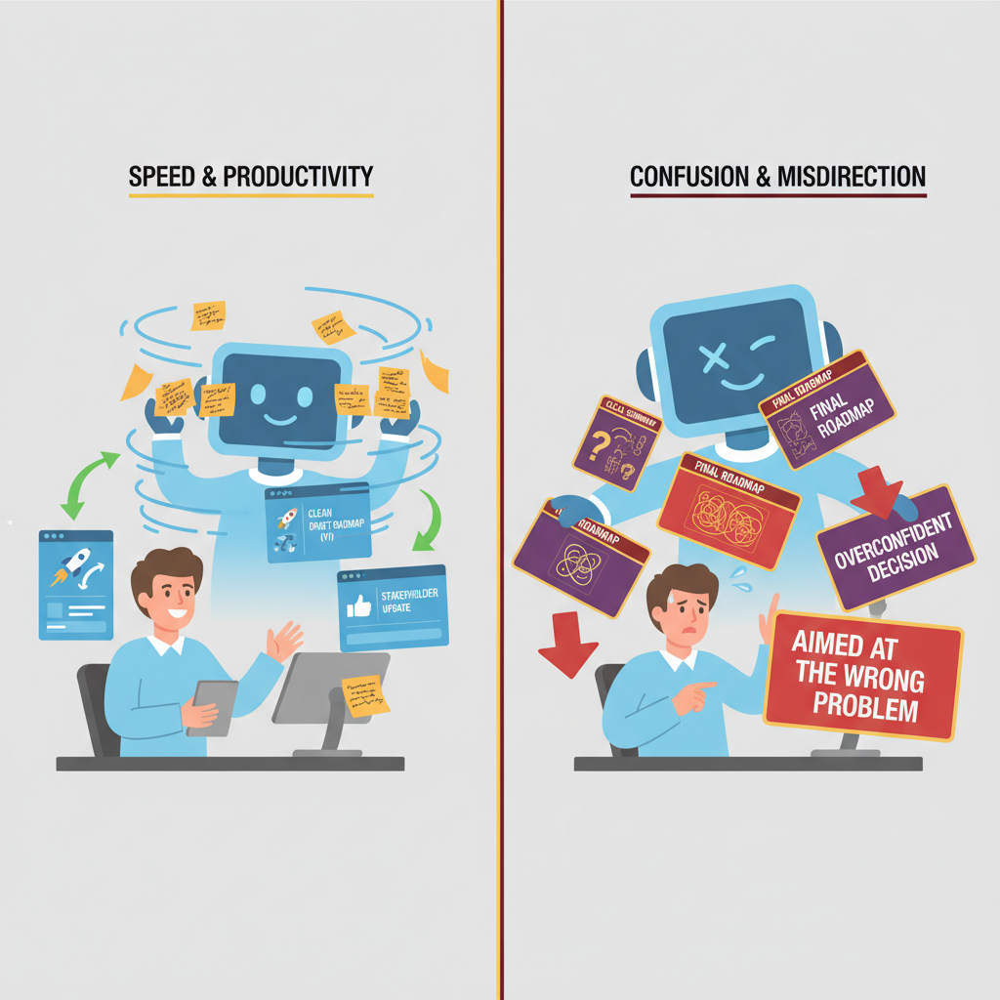
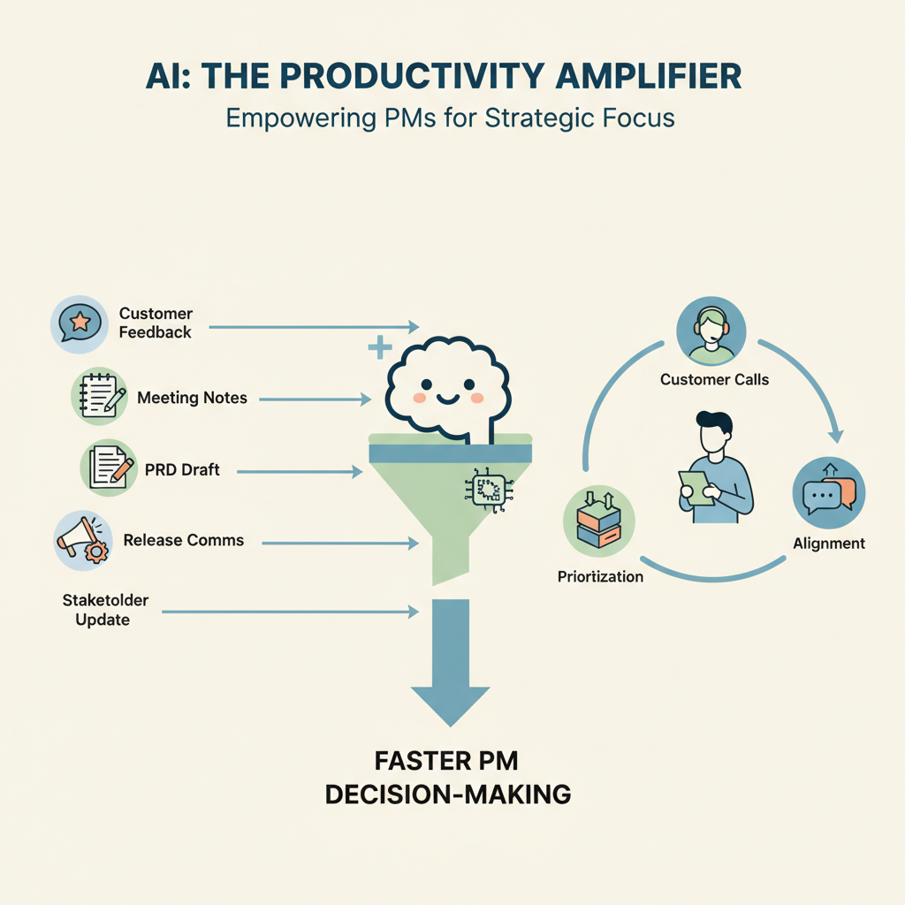

# The Duality of AI in a PM’s Life: Superpower and Trap

## Why AI Feels Like a PM Superpower and a PM Risk

Think of AI like a **very fast junior analyst with a great draft quality but no product judgment**. It can synthesize meeting notes, compare options, and generate a clean first pass in minutes, which means your team can move faster on discovery, specs, and stakeholder updates. But when PMs start trusting that output too quickly, the business trade-off is that speed can hide weak thinking, fuzzy framing, and confident-sounding mistakes.

AI is best treated as a **decision accelerator, not a decision-maker**. That means it can shorten the time between problem statement and recommendation, but it should not replace the PM’s job of deciding what matters, what to ignore, and what risk is acceptable. In practice, this affects your roadmap because AI can make it tempting to ship more ideas faster; the PM’s real leverage is in **problem framing, prioritization, and alignment**—the parts that keep the team from building the wrong thing.

**AI also changes what “good PM work” looks like.** When drafts, summaries, and competitor scans get easier, stakeholders may expect more output, faster polish, and near-instant answers. When that goes wrong, you’ll see it as overconfidence in mediocre ideas, rushed decisions, and a PM who sounds productive but isn’t actually moving the business forward.

> **💡 What this means for you as a PM**
> AI can make you faster, but only strong PM judgment keeps speed from turning into bad product decisions.  
> Your credibility now depends less on producing every artifact yourself and more on showing sharp framing, clear trade-offs, and visible decision quality. If you use AI well, your team can spend more time on strategy and less on busywork; if you use it poorly, you risk creating a culture of shallow thinking dressed up as productivity.

*AI can speed up PM work — but it can also hide weak judgment.*

## Where AI Speeds Up PM Work Today

Think of AI like a **very fast junior analyst** who can read piles of notes, summarize the noise, and draft the first pass — but still needs you to decide what matters. In product management, the biggest wins show up in repetitive, pattern-based work such as feedback synthesis, meeting notes, sprint planning support, draft PRDs, and release communications. That’s why many PM teams are using AI tools (software that helps with language-heavy tasks) to move faster on the weekly operating rhythm, not to replace product judgment ([Refonte Learning](https://www.refontelearning.com/blog/product-management-in-2025), [Monday.com](https://monday.com/blog/rnd/ai-for-product-managers), [HBS Online](https://online.hbs.edu/blog/post/ai-in-leadership)).

When teams use AI for feedback analysis (grouping customer comments into themes), sprint planning (deciding what the team will build next), and delay prediction (spotting likely schedule slips before they happen), the weekly cadence changes. **This means your team can spend less time assembling information and more time making decisions.** Instead of manually reading 200 support tickets, a PM can start Monday with a theme map, a risk list, and a draft release note — then use the saved time for customer calls, trade-offs, and stakeholder alignment ([The Product Folks](https://www.theproductfolks.com/product-management-blog/case-studies-for-product-management-a-deep-dive), [McKinsey](https://www.mckinsey.com/capabilities/tech-and-ai/our-insights/superagency-in-the-workplace-empowering-people-to-unlock-ais-full-potential-at-work), [OpenAI](https://cdn.openai.com/pdf/7ef17d82-96bf-4dd1-9df2-228f7f377a29/the-state-of-enterprise-ai_2025-report.pdf)).

**The business trade-off is speed versus context.** AI is strongest when the work is repetitive, high-volume, and easy to pattern-match; it is weaker when the decision depends on company strategy, customer nuance, or competing constraints. A good example is drafting a PRD (product requirements document, a written plan for what the team should build): AI can produce the first draft, but only the PM can decide which users matter most, which metric moves the business, and what not to build.

> **💡 What this means for you as a PM**  
> The biggest immediate win from AI is reclaiming PM time for strategy, customer insight, and cross-functional decisions. If you set up AI to handle summaries, first drafts, and routine status work, your team can shorten cycle time, respond faster to customers, and reduce meeting overhead. That creates room for the work only humans can do well: prioritization, nuance, and saying no.

In practice, the best AI-enabled PM teams use it like a **throughput amplifier**. They let it draft release communications, summarize meetings, and organize sprint inputs, while keeping roadmap calls, customer trade-offs, and launch decisions firmly human-led. When this goes wrong, you’ll see it as polished but shallow docs, faster meetings with weaker decisions, and a team that looks busy without moving outcomes.

*AI is most useful when it clears repetitive work and frees PM time for strategy.*

## Where AI Can Make PMs Worse, Not Better

Think of AI like a **very confident junior analyst**: it can draft a great-looking memo fast, but if you don’t check the sources, it may simply reinforce what you already wanted to believe. That is why AI can become a trap in product work, especially when teams use it for discovery, planning, and exec communication without enough human judgment ([HBS](https://online.hbs.edu/blog/post/ai-in-leadership), [McKinsey](https://www.mckinsey.com/capabilities/tech-and-ai/our-insights/superagency-in-the-workplace-empowering-people-to-unlock-ais-full-potential-at-work)).

**Confirmation bias gets louder when the output looks polished.** AI can produce a clean answer that sounds decisive even when the underlying assumptions are weak or incomplete, which makes it easier to approve a roadmap you already favored. In practice, this can lead teams to overfit to the first narrative that “sounds right” instead of testing alternatives, a risk product leaders are already being warned about as AI use expands in decision-making ([HBS](https://online.hbs.edu/blog/post/ai-in-leadership), [Egon Zehnder](https://www.egonzehnder.com/functions/technology-officers/insights/how-ai-is-redefining-the-product-managers-role)).

**Customer understanding gets fragile when AI summaries replace raw evidence.** A summary of interview notes, support tickets, or usage data can be useful, but it is not the same as hearing the customer voice directly or seeing the actual pattern in the data. This means your team can accidentally lose the nuance that explains *why* users churn, complain, or convert, and that weakens prioritization decisions ([The Product Folks](https://www.theproductfolks.com/product-management-blog/case-studies-for-product-management-a-deep-dive), [Monday.com](https://monday.com/blog/rnd/ai-for-product-managers)).

> **💡 What this means for you as a PM**  
> AI becomes dangerous when it replaces PM judgment instead of sharpening it. If your team only reads summaries, you may miss the edge cases that change the roadmap, the pricing model, or the go-to-market message. The business trade-off is speed now versus expensive rework later.

**Roadmaps can look more certain than they really are.** When AI generates plans, timelines, or “best practices,” it can create false confidence that dependencies, resourcing, and delivery risk are already understood. When this goes wrong, you’ll see it as missed launch dates, overstated commitments to sales, or a roadmap that is optimized for neatness instead of uncertainty ([California Management Review](https://cmr.berkeley.edu/2026/02/when-ai-joins-the-product-team-will-leadership-still-drives-innovation), [OpenAI enterprise report](https://cdn.openai.com/pdf/7ef17d82-96bf-4dd1-9df2-228f7f377a29/the-state-of-enterprise-ai_2025-report.pdf)).

**Trust and ethics risks are the most expensive failure mode.** AI can hallucinate claims (confidently invent details), expose privacy-sensitive inputs, or justify a decision that was never grounded in reality. For PMs, the reputational cost is not just a bad feature—it can be shipping something customers do not trust, legal teams do not like, or leadership cannot defend ([OpenAI ethical AI case study](http://arxiv.org/abs/2601.16513v1), [McKinsey](https://www.mckinsey.com/capabilities/tech-and-ai/our-insights/superagency-in-the-workplace-empowering-people-to-unlock-ais-full-potential-at-work)).

## The ROI Question: When AI Is Worth the Investment for Product Teams

Think of **AI like hiring a sharp intern who can draft, summarize, and sort at speed**—but still needs onboarding, supervision, and guardrails. The business case is not the subscription fee alone; it is whether that intern frees your team to make better product calls faster. Recent product-management guidance points to AI improving workflow automation, faster development, and decision support, which means the ROI can show up in time saved, better prioritization, and less operational drag ([Refonte Learning](https://www.refontelearning.com/blog/product-management-in-2025), [Egon Zehnder](https://www.egonzehnder.com/functions/technology-officers/insights/how-ai-is-redefining-the-product-managers-role), [McKinsey](https://www.mckinsey.com/capabilities/tech-and-ai/our-insights/superagency-in-the-workplace-empowering-people-to-unlock-ais-full-potential-at-work)).

The **right ROI lens is broader than licenses**. For a PM team, value can come from:
- **Time saved** on PRDs, meeting notes, competitive scans, and support-ticket synthesis
- **Faster decisions** because AI (software that helps analyze and generate content) surfaces patterns sooner
- **Improved conversion or retention** when insights lead to better experiments and sharper prioritization
- **Reduced operational load** when repetitive work moves out of the critical path

This affects your roadmap because the business trade-off is not “AI or no AI,” but **where AI creates leverage versus overhead**. If the tool saves three hours a week but adds security review time, workflow change management (helping people adopt a new process), and governance overhead (policy and approval work), the net gain may be small. That matters in PM budgeting because you are paying in three currencies: cash, attention, and change risk.

> **💡 What this means for you as a PM**
> AI should earn its place by improving product outcomes, not by adding another subscription to the stack. Budget for the hidden costs too: enablement, privacy review, and the time managers spend changing habits. If the use case does not free high-value time or improve decision quality, it is probably a nice-to-have, not a priority.

A simple decision rule is this: **adopt AI when it removes low-value work or improves judgment on a meaningful product decision**. For example, if an AI assistant helps your team turn customer feedback from five channels into one usable weekly insight memo, that can accelerate roadmap decisions. But if it only makes your decks look polished, the business impact is cosmetic—not strategic.

## Real-World Examples: How Teams Are Turning AI Into Product Advantage

Think of **AI products like a great assistant who already knows your desk, your calendar, and your last five conversations**. The biggest winners are not selling “smartness” in the abstract; they’re removing friction from a specific workflow that people already do every day. That’s why products like **Google Antigravity CLI** (a terminal-based way to run coding agents) and **Memdex** (a local memory layer for AI conversations) are interesting: they package AI as workflow leverage and persistent context, not just novelty ([Product Hunt: Google Antigravity CLI](https://www.producthunt.com/products/google-antigravity?utm_campaign=producthunt-api&utm_medium=api-v2&utm_source=Application%3A+Claude+MCP+Server+%28ID%3A+234160%29), [Product Hunt: Memdex](https://www.producthunt.com/products/memdex?utm_campaign=producthunt-api&utm_medium=api-v2&utm_source=Application%3A+Claude+MCP+Server+%28ID%3A+234160%29)).

This matters because **speed, memory, and multi-step help** are what change adoption and retention. A PM using Antigravity-style tools can move from “ask a model once” to “delegate a chain of tasks,” which reduces context switching and makes AI feel embedded in the job, not bolted on ([Product Hunt: Google Antigravity CLI](https://www.producthunt.com/products/google-antigravity?utm_campaign=producthunt-api&utm_medium=api-v2&utm_source=Application%3A+Claude+MCP+Server+%28ID%3A+234160%29)). Likewise, Memdex points to a bigger product lesson: **memory is product value**, because repeating yourself is a hidden tax on productivity and trust ([Product Hunt: Memdex](https://www.producthunt.com/products/memdex?utm_campaign=producthunt-api&utm_medium=api-v2&utm_source=Application%3A+Claude+MCP+Server+%28ID%3A+234160%29)).

> **💡 What this means for you as a PM**
> The best AI products win by removing friction in a specific workflow, not by being broadly impressive. This affects your roadmap because you should optimize for one high-frequency job-to-be-done, not a generic “AI assistant” checkbox. The business trade-off is clear: narrower scope often ships faster, drives clearer ROI (return on investment, or business value compared to cost), and lowers the risk of users trying it once and never coming back.

The cautionary lesson is just as important: **generic intelligence is not a strategy**. If the AI doesn’t fit naturally into tools like terminals, inboxes, or workspaces teams already use, it becomes a demo instead of a habit. When this goes wrong, you’ll see it as low repeat usage, weak retention, and a roadmap full of expensive features that don’t change outcomes.

## How PMs Should Decide When to Use AI and When to Stay Human

Think of AI like a **junior chief of staff**: great for clearing paperwork, dangerous if you let it make board-level calls. In product work, AI can speed up synthesis, draft options, and surface patterns, but it should not quietly take ownership of choices that affect customers, revenue, or trust.

A simple decision rule is to ask four questions: **How high are the stakes, how reversible is the decision, how sensitive is the data, and how much customer impact is involved?** If the answer is “high” on any of those, keep a human in the loop. This means your team can use AI for low-risk work like summarizing research notes, drafting release updates, or organizing backlog themes, while a PM still owns pricing changes, launch timing, or policy decisions.

> **💡 What this means for you as a PM**
> The most effective PMs will not use AI everywhere—they will use it selectively where it raises the quality of decisions.  
> Set norms that AI can draft in discovery (early customer learning), planning (roadmap shaping), and communication (status and launch copy), but humans must approve anything that changes customer experience or business risk. This affects your roadmap because it forces clearer accountability: AI expands capacity, but it does not dilute responsibility.

The business trade-off is **speed versus confidence**. AI can help a PM team move faster on repetitive work, but when the decision is consequential, speed without judgment becomes expensive. When this goes wrong, you’ll see it as inconsistent messaging, privacy risk, or a roadmap that looks efficient on paper but weakens the product in market.

Treat this as a leadership norm, not a personal preference. Teams that define where AI is allowed, where it is advisory, and where humans decide are more consistent and easier to trust. In practice, that makes your organization faster **and** more accountable.

## What This Means for the PM Role Over the Next 12–24 Months

Think of AI like a **junior analyst that works at machine speed**: it can draft, summarize, and brainstorm quickly, but it still needs a human to decide what matters. In the next 12–24 months, that changes the PM job from **producing artifacts** to **orchestrating decisions, alignment, and product strategy**. Reports on product management and AI leadership point to this shift: the PM is becoming less of a document factory and more of a decision leader ([Refonte Learning](https://www.refontelearning.com/blog/product-management-in-2025), [Egon Zehnder](https://www.egonzehnder.com/functions/technology-officers/insights/how-ai-is-redefining-the-product-managers-role), [HBS Online](https://online.hbs.edu/blog/post/ai-in-leadership)).

The capabilities that will matter most are **problem framing, experimentation judgment, ethical trade-off thinking, and stakeholder trust**. AI can help your team move faster, but it does not tell you whether you’re solving the right customer problem or making the right bet for the business. That affects your roadmap because the best PMs will spend more time choosing, testing, and defending priorities, and less time manually assembling updates or meeting notes ([McKinsey](https://www.mckinsey.com/capabilities/tech-and-ai/our-insights/superagency-in-the-workplace-empowering-people-to-unlock-ais-full-potential-at-work), [The Product Folks](https://www.theproductfolks.com/product-management-blog/case-studies-for-product-management-a-deep-dive)).

> **💡 What this means for you as a PM**  
> AI will shrink the value of output alone and raise the value of judgment, which is exactly where great PMs win. You should hire and coach for people who can frame ambiguity, run smart experiments, and explain trade-offs clearly to design, engineering, legal, and GTM teams. Performance expectations will shift too: the bar is no longer “who wrote the best doc,” but “who made the best decisions with the least wasted motion.”

For PM leaders, the business trade-off is clear: **speed goes up, but accountability matters more**. When AI is embedded in everyday workflows, strong teams will need sharper standards for quality, review, and escalation—especially in areas like trust, bias, and customer impact ([OpenAI enterprise AI report](https://cdn.openai.com/pdf/7ef17d82-96bf-4dd1-9df2-228f7f377a29/the-state-of-enterprise-ai_2025-report.pdf), [OpenAI case study on ethical AI](http://arxiv.org/abs/2601.16513v1)). The practical future is not “AI replaces PMs”; it is **AI compresses execution tasks while increasing the premium on taste, judgment, and accountability**.

---

## 📚 Further Reading

The following sources were retrieved and used during research for this blog. All links are verified — none are invented.

1. **[Product Management in 2025 - Refonte Learning](https://www.refontelearning.com/blog/product-management-in-2025)** · *Refonte Learning*
   > AI-driven user research tools and ethics reviews are becoming core PM expectations in 2025....

2. **[2025 Trends in Product Management - by Amy Mitchell](https://amycmitchell.substack.com/p/2025-trends-in-product-management)** · *Substack*
   > PMs are balancing AI, privacy, security, accessibility, and sustainability tradeoffs....

3. **[Case Studies for Product Management: A Deep Dive | The Product Folks](https://www.theproductfolks.com/product-management-blog/case-studies-for-product-management-a-deep-dive)** · *The Product Folks*
   > Product case studies and AI-PM co-intelligence playbook for PM learning....

4. **[AI for product managers: essential tools and strategies [2026]](https://monday.com/blog/rnd/ai-for-product-managers)** · *monday.com*
   > AI can automate feedback analysis, sprint planning, and delay prediction for PM teams....

5. **[Competing Visions of Ethical AI: A Case Study of OpenAI](http://arxiv.org/abs/2601.16513v1)** · *Arxiv* · 2026-01-23
   > Case study examines how OpenAI frames ethics, safety, and alignment in public discourse....

6. **[[Product Hunt] Google Antigravity CLI - Run coding agents directly from your terminal](https://www.producthunt.com/products/google-antigravity?utm_campaign=producthunt-api&utm_medium=api-v2&utm_source=Application%3A+Claude+MCP+Server+%28ID%3A+234160%29)** · *Product Hunt* · 2026-05-23
   > CLI for coding agents with multi-step reasoning, multi-file editing, and persistent history....

7. **[[Product Hunt] Memdex - Turn every AI conversation into reusable local memory](https://www.producthunt.com/products/memdex?utm_campaign=producthunt-api&utm_medium=api-v2&utm_source=Application%3A+Claude+MCP+Server+%28ID%3A+234160%29)** · *Product Hunt* · 2026-05-23
   > Chrome extension captures AI chats locally and reuses context in future prompts....

8. **[How Managers Are Using AI to Make Smarter Decisions](https://online.hbs.edu/blog/post/ai-in-leadership)** · *Harvard Business School Online*
   > Leaders need decision frameworks for when to rely on AI versus human judgment....

9. **[When AI Joins the Product Team, Will Leadership Still Drive Innovation? | California Management Review](https://cmr.berkeley.edu/2026/02/when-ai-joins-the-product-team-will-leadership-still-drives-innovation)** · *California Management Review*
   > Human accountability remains central as AI automates experimentation and routine tests....

10. **[AI in Product Management: Understanding the Skills and Tools Needed for the Future - Egon Zehnder](https://www.egonzehnder.com/functions/technology-officers/insights/how-ai-is-redefining-the-product-managers-role)** · *Egon Zehnder*
   > AI is reshaping PM strategy, discovery, and roadmap planning with predictive analytics....

11. **[[PDF] state of enterprise AI - OpenAI](https://cdn.openai.com/pdf/7ef17d82-96bf-4dd1-9df2-228f7f377a29/the-state-of-enterprise-ai_2025-report.pdf)** · *OpenAI*
   > Report cites measurable AI impact, including faster product development and workflow automation....

12. **[2025 Product Marketing AI Trends Report: Why Adoption Is Rising—But Strategy Still Lags — Fluvio](https://www.fluviomarketing.com/blog-summary/2025-product-marketing-ai-trends-report-why-adoption-is-risingbut-strategy-still-lags)** · *Fluvio*
   > Survey finds AI use rising in PMM, but strategy, workflow, and security challenges remain....

13. **[AI in the workplace: A report for 2025 - McKinsey](https://www.mckinsey.com/capabilities/tech-and-ai/our-insights/superagency-in-the-workplace-empowering-people-to-unlock-ais-full-potential-at-work)** · *McKinsey*
   > McKinsey discusses gen AI adoption, risk management, and executive perspectives at work....

14. **[AI SaaS in 2025: The Best Platforms and Solutions to Watch](https://www.lastingdynamics.com/blog/ai-saas)** · *Lasting Dynamics*
   > AI SaaS adoption is rising, with industry-specific compliance and sustainability themes....

15. **[AI product strategy: key steps, examples, and best practices](https://www.merge.dev/blog/ai-product-strategy)** · *Merge*
   > Guide covers AI product strategy, integrations, secure data, and product examples....

