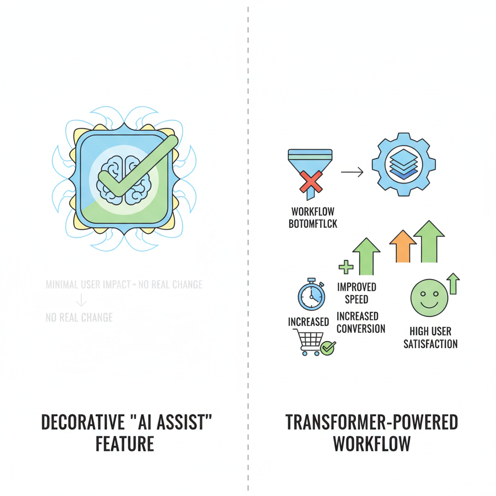
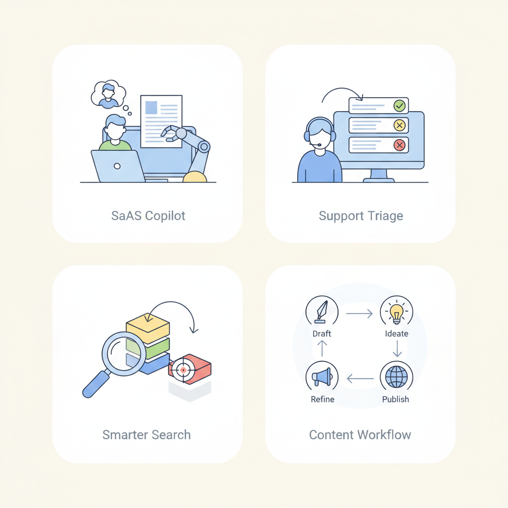

# Transformer Architecture for Product Managers: What It Enables, What It Costs, and How to Evaluate It

## Why transformers matter to product strategy

Think of transformers like **a very capable team of generalist assistants** who can read a lot at once, spot patterns across messy inputs, and help users move faster. Before this, many AI products felt like a row of brittle vending machines: if you pressed the exact right button, you got value, but any variation broke the experience. Transformers changed the product game by making **language, image, and multimodal experiences** feel more flexible, more natural, and much easier to adapt to real user behavior.

This matters because **the product shift is bigger than “better AI.”** It moved teams from narrow machine learning (systems trained for one specific task) and hard-coded rules (fixed if/then logic) toward experiences that can summarize support tickets, improve enterprise search, draft emails, classify documents, and assist users inside workflows. In a product like Google Workspace, that might mean turning a blank page into a first draft; in a support tool, it might mean turning hundreds of tickets into a few actionable themes.

The business question is **where this becomes a moat versus a checkbox**. If transformers help you solve a high-frequency, high-pain workflow better than competitors—like reducing analyst time on research, making customer support faster, or improving discovery in a marketplace—then they can create real differentiation. If they only add a generic “AI assist” button that any competitor can copy, they are table stakes.

A useful framing is **user pain, time saved, and revenue impact**. Instead of asking, “Can we ship a transformer feature?”, ask:
- **Which user job is slow or frustrating today?**
- **How many minutes or dollars does this save per session, per user, or per team?**
- **Does this increase conversion, retention, or expansion revenue?**
- **What happens if a competitor ships the same capability next quarter?**

That lens keeps the roadmap honest. **The best transformer opportunities are not the flashiest ones—they are the ones that remove a bottleneck in a critical workflow.** When that goes right, you get faster task completion, happier users, and stronger monetization. When it goes wrong, you get an expensive feature that sounds impressive in demos but doesn’t move business metrics.

*Where transformers become differentiation versus table stakes.*

## How transformers work in plain English

Think of a **transformer** like a busy meeting facilitator who can scan the whole conversation at once and decide which comments matter most to the current question. A transformer is a **model architecture** (the basic design of a machine learning system) that powers tools like ChatGPT, Google’s AI summaries, and many recommendation and support systems.

At the heart of it is **self-attention** (a way for the model to weigh which words or pieces of text are most relevant to each other). If a user asks, “Can I return this order if it was opened?”, the model doesn’t read the sentence one word at a time like a person reading a long email thread; it looks across the whole prompt and gives more weight to words like “return,” “opened,” and “order.” This means the model can connect far-apart details, which is why it handles **long-range context** (information spread across a long passage) better than older sequence models (models that process text step by step).

Because transformers can process many pieces of text in parallel (at the same time), they’re usually faster to train and more scalable than older approaches that had to move through text in a strict order. For product teams, that shows up as **latency** (how long the user waits for a response), **context limits** (how much text the model can consider at once), and **consistency** (whether the model gives similar answers in similar situations). A customer support copilot might be great at summarizing a 10-message chat, but once you stuff in an entire legal contract, you may hit the context limit and see important details fall out of view.

**The business trade-off is that transformers are powerful, but not magically accurate.** They can infer patterns from context, but if the prompt is vague, too long, or overloaded with competing instructions, the model may still produce a confident but wrong answer — what teams often call **hallucination** (when the model generates something that sounds plausible but isn’t true). This affects your roadmap because prompt length, document size, and UX patterns all shape quality. For example, a multi-step tax-filing flow may work better if you break it into smaller screens and summarize between steps, instead of dumping everything into one giant prompt.

> **💡 What this means for you as a PM**
> Knowing the basic mechanics helps you set realistic expectations for what the model can remember, do quickly, and do reliably. That means you can make better calls about whether to use one big prompt, chunk content into smaller steps, or redesign the UX to reduce errors. It also helps you push back when someone expects “just add AI” to work on huge documents, messy workflows, or high-stakes tasks without guardrails.

This also changes how you evaluate scope. **If the task needs precise recall across many pages**, you may need retrieval (fetching only the most relevant information) or a step-by-step workflow instead of one-shot generation. If the task is short and repetitive, you can optimize for speed and simplicity. In practice, the architecture should influence your product design: **smaller inputs, clearer prompts, and staged interactions** usually lead to better results and lower risk.

## Where transformers create user value in real products

Think of a **transformer-powered feature** like a highly trained store associate who can stand next to a customer, read the situation quickly, and help at the exact moment of hesitation. In product terms, a transformer (a model that turns language, images, or other inputs into useful predictions or drafts) is valuable when it reduces friction in a flow people already care about.

A **copilot in a SaaS product** is the clearest example. In tools like Notion, Gmail, or Salesforce, the copilot (an AI helper embedded in the workflow) can draft a message, summarize a thread, or suggest the next action. The business outcome is usually **faster task completion** and sometimes higher conversion, because users get to “done” with less effort. The key product decision is where to place it: inside the blank editor, beside the inbox, or in a side panel. If you surface it too early, it feels intrusive; too late, and it becomes decorative.

A **customer support assistant** works like a smart front desk agent. It can answer repetitive questions, triage tickets, or draft replies for an agent to review. This improves **deflection** (cases solved without a human) and lowers support load, but only if you decide how much autonomy to allow. Many teams get better results by starting with “suggest, don’t send,” then widening automation only after they trust the quality. When this goes wrong, you’ll see it as bad replies, escalations, and brand damage.

A **search upgrade** is another high-value use case. In e-commerce or media products, a transformer can make search understand intent instead of just matching keywords, which helps users find the right product, video, or answer faster. The business upside is often **better conversion** or **higher retention**, because users hit fewer dead ends. The roadmap question is whether AI should rank results, rewrite queries, or explain why something was recommended. Each choice changes both user trust and engineering complexity.

A **content generation workflow** is valuable when users need a first draft, not a final answer. Examples include marketing copy in Shopify, job descriptions in Greenhouse, or report summaries in analytics tools. The product trade-off is automation versus control: more automation raises speed, but also raises the risk of off-brand or inaccurate output. This means your team should design for **edit rate** (how often users change the draft) as well as completion rate, because heavy editing can signal weak usefulness.

*Common transformer use cases in products PMs know well.*

> **💡 What this means for you as a PM**
> Clear use-case mapping helps you prioritize AI features that move core product metrics instead of adding novelty. Start by tying each transformer-powered experience to one primary outcome: faster completion, better conversion, lower support load, or higher retention. Then decide how much automation to expose, where human review is required, and which trust signals users need before they rely on it.

## The trade-offs PMs need to manage

Think of a transformer like a **very capable concierge**: it can answer more questions, remember more details from the current conversation, and sound more fluent than a simpler assistant — but the fancier the concierge, the more you pay for staffing, and the longer guests may wait during busy hours. In product terms, **better output quality usually comes with higher cost, slower responses, or more complex workflows**.

A transformer (a model that weighs different parts of input text to generate output) often improves the user experience in products like a support copilot, a search assistant, or an email writer. But **context length** (how much text the model can consider at once) changes the bill and the latency (how long users wait): a customer service tool that reads an entire account history can feel smarter, but it also consumes more compute and can slow down replies. **Model size** (how large the model is) has a similar trade-off: bigger models usually handle nuance better, but they cost more per request, which affects margins if usage scales.

The business trade-off is often not “can we build it?” but **“where do we place the intelligence?”** If you use a single model for every step, you may get a simpler product but pay for expensive reasoning on routine tasks. If you add **orchestration** (coordinating multiple steps or models), you can route easy requests to cheaper paths and reserve the best model for hard cases — but now you’ve introduced more moving parts, more failure points, and more testing overhead.

> **💡 What this means for you as a PM**
> This helps you avoid shipping an impressive demo that fails on cost, speed, or trust in production.  
> Your roadmap should make room for decisions about which use cases deserve premium quality and which can tolerate a simpler experience. It also means you need to align engineering, design, and support on when the product should answer automatically, when it should ask for clarification, and when it should hand off to a human.

When this goes wrong, you’ll see it as **hallucinations** (made-up but confident answers), overconfidence (the model sounds sure even when it is wrong), inconsistent outputs (different answers to similar prompts), and prompt sensitivity (small wording changes causing big behavior changes). For a PM, that means user trust can drop fast — especially in high-stakes flows like finance, health, or enterprise support. A chatbot that sometimes invents a policy may not just create bad UX; it can create escalation, churn, or legal risk.

The safest launch strategy is to **reduce the blast radius**. Start with beta access (a limited rollout to a small group), use human-in-the-loop review (a person checks the output before the user sees it) for risky cases, and constrain the use case (limit the model to one job, like summarizing support tickets instead of giving policy advice). This means your team can learn where the model is strong, measure cost per successful task, and expand only after quality, latency, and trust are all inside acceptable bounds.

## Business impact, cost, and ROI of transformer features

Think of a transformer feature like adding a **high-powered assistant** to a team: it can save hours, boost output, or reduce mistakes, but it also comes with a subscription bill and a setup cost. For PMs, the real question is not whether the feature sounds impressive — it’s whether **the business value exceeds the ongoing cost**.

The simplest ROI frame is: **value created minus total cost**. Value usually comes from three places: **time saved** (for example, a support agent resolves tickets faster), **revenue uplift** (for example, a sales rep books more meetings because drafting takes less time), and **churn reduction** (for example, customers stick around because they find answers faster). Cost includes the model’s usage cost (the fee for each request or response), integration effort (the work needed to wire it into your product), and operating overhead (monitoring, human review, and support). This means your team can compare an AI feature to any other investment: if it doesn’t clearly improve margin, growth, or retention, it’s probably a nice demo rather than a roadmap priority.

What matters most for unit economics is **usage pattern, not model hype**. A flashy feature with low usage may be cheap in absolute terms but irrelevant to the business; a modest feature used in a high-frequency workflow can become expensive fast. Pay attention to **frequency** (how often people use it), **token volume** (how much text the model processes each time), and **workflow depth** (whether the feature is a one-off helper or embedded in a multi-step task). For example, an internal knowledge assistant used 50 times a day by a small team may look harmless, while the same assistant in a customer-facing app could generate a large bill because every query runs at scale.

A practical business case should be built from **scenarios**, not abstractions. For support deflection, estimate how many tickets the feature can answer without human help, then multiply by cost per ticket and expected adoption. For sales productivity, estimate time saved on research, follow-up drafting, or account prep, then translate that into more seller capacity or higher close rates. For internal knowledge access, measure whether employees finish tasks faster and make fewer interruptions to subject-matter experts. The business trade-off is that each scenario has different upside and risk: support automation can save money quickly, while sales tools may take longer to prove revenue impact.

Before scaling, ask leaders for **gross margin impact** (how much profit remains after AI costs), **adoption** (how many target users actually use it), **retention lift** (whether it keeps customers or employees engaged), and **cost per successful task** (what you pay for each useful outcome, not each request). **That metric mix keeps the discussion honest.**

> **💡 What this means for you as a PM**  
> A clear ROI frame keeps your AI roadmap tied to margin, growth, and operational efficiency instead of experimentation for its own sake. It gives you a common language for Finance, Sales, Support, and Engineering so you can prioritize the use cases with the highest payoff and the lowest ongoing cost. It also helps you spot dangerous ideas early: features that look exciting but only work if usage stays tiny or review costs stay magically low.

## Roadmap and operating model implications

Think of a transformer rollout like adding a **powerful new engine to a delivery fleet**: it can speed up many trips, but only if dispatch, maintenance, and safety checks are redesigned too. **Transformers change backlog prioritization** because you’re no longer choosing only between “new user feature” and “bug fix”; you’re often deciding between a **foundational platform bet** (shared model access, logging, evaluation, and guardrails) and a **visible product feature** (summaries, drafting, search, or support automation). The business trade-off is simple: platform work compounds across multiple teams, while feature work proves customer value faster.

This affects your roadmap because **AI features create cross-functional dependencies earlier than traditional features**. A chatbot in support, for example, touches PM for scope, design for conversation flow, legal for disclosure and data use, support for escalation handling, and engineering for model integration and monitoring. This means your team can’t treat launch as one-team decision; you need a shared operating rhythm for review, approval, and incident response so surprises don’t land on launch day.

**Governance is the difference between a useful pilot and a risky experiment.** Set guardrails for:
- **Data use**: what customer data the model can see, store, or reuse
- **Evaluation**: what “good enough” means, including accuracy, helpfulness, and refusal behavior
- **Escalation paths**: when the system hands off to a human or blocks an action
- **User communication**: how clearly you explain that AI is involved, what it can do, and where it may fail

When this goes wrong, you’ll see it as **support load, trust issues, or legal friction**, not just a model problem. For example, a shopping assistant that confidently recommends the wrong plan can create refunds, complaints, and brand damage even if the underlying technology is impressive.

Use this checklist to decide whether a transformer feature is ready:
- **Pilot**: clear use case, narrow scope, human fallback, and baseline metrics
- **Rollout**: stable quality across key scenarios, reviewed policies, and support readiness
- **Deeper investment**: repeated user value, manageable unit economics, and reusable platform components

---

## 📚 Further Reading

*This blog was written from the model's training knowledge. No external sources were retrieved during generation. For further reading, search for the topic on [Lenny's Newsletter](https://www.lennysnewsletter.com), [Reforge](https://www.reforge.com/blog), or [Mind the Product](https://www.mindtheproduct.com).*
