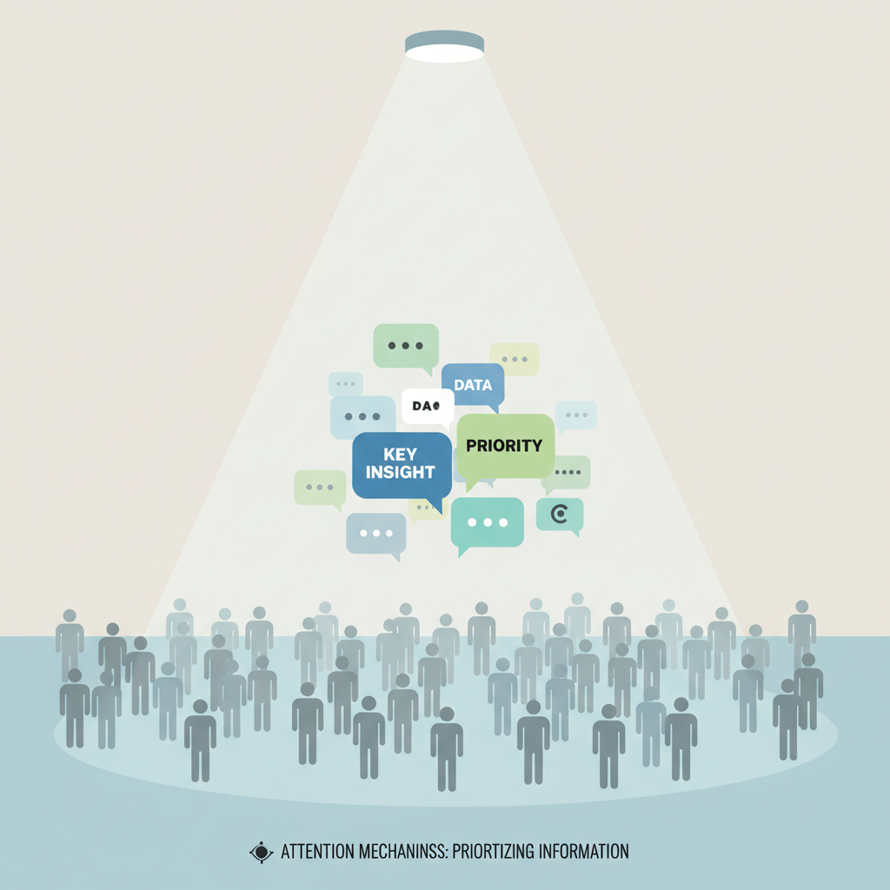
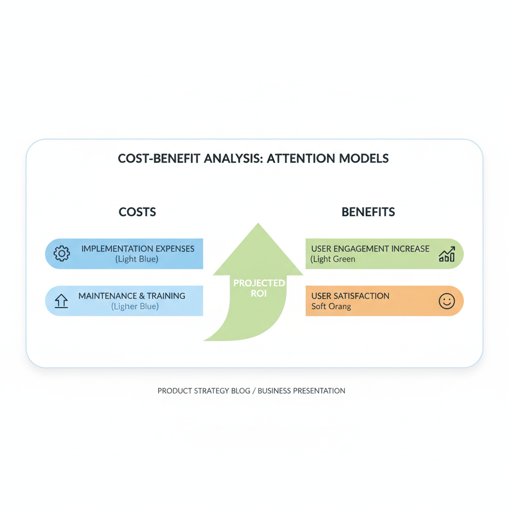
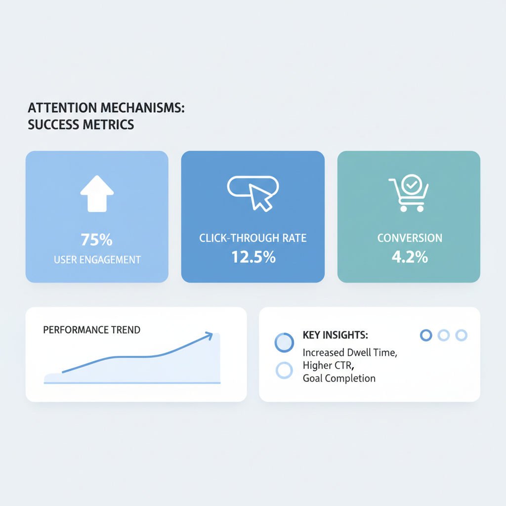

# Understanding Attention Mechanisms: A Product Manager's Guide

## Introduction to Attention Mechanisms

Imagine you're at a party trying to focus on a conversation in a noisy room. You naturally tune out less relevant sounds to concentrate on the person talking to you. **Attention mechanisms** work similarly in artificial intelligence, allowing models to prioritize certain pieces of information over others in complex data sets. 

**This is crucial in natural language processing (NLP)**, where understanding context can make or break user interactions. For example, when a user types a question into Google, the system uses attention to identify key words that influence search relevance. 

By **grasping attention mechanisms**, you can leverage AI innovations to enhance product usability. This technology leads to more intuitive features, better user experiences, and ultimately drives engagement. Embracing these capabilities allows your team to adapt quickly to user needs, making your product more competitive in a rapidly evolving landscape.

## How Attention Mechanisms Improve Product Relevance

*Attention mechanisms act like a spotlight, helping focus on the most relevant data in a crowded room.*

Think of attention mechanisms like a spotlight in a crowded room — it helps you focus on the most important voices. In the context of product development, attention mechanisms help your systems identify and prioritize significant elements in large datasets. This means your product can deliver **highly relevant content** to users, enhancing engagement and satisfaction.

By applying attention mechanisms, you can **personalize content** for your users based on their preferences and behaviors. For instance, Netflix uses this technology to recommend shows that align closely with users' viewing habits, leading to **increased watch time and user retention**. This capability allows you to tailor experiences that speak directly to individual needs, resulting in **higher engagement**.

However, there's a trade-off: as you enable more sophisticated personalization through attention, you may face **increased model complexity**. Striking the right balance is crucial. While a more complex model could yield better insights, it may also increase costs and extend development timelines. Your team will need to consider the **business trade-off** between potential gains in user relevance and the resources spent on implementation.

Lastly, attention mechanisms facilitate **real-time responses** to user actions. Imagine an e-commerce platform that adjusts recommendations as users browse — this agility in user experience keeps customers engaged and more likely to convert. Being able to quickly adapt to user needs enhances the overall product experience, leading to improved satisfaction.

> **💡 What this means for you as a PM**  
> Understanding attention allows you to prioritize features that directly increase user satisfaction. This knowledge can guide discussions around development resource allocation and feature roadmaps, ensuring your team focuses on functionality that boosts user engagement.

## Real-World Applications of Attention Mechanisms

**Several leading companies utilize attention mechanisms** to enhance their product offerings and user experiences. For instance, **Google** implements attention mechanisms in its search algorithms to better understand user queries. By focusing more on significant words within a search, Google delivers more relevant results, which leads to increased user satisfaction. Similarly, **Netflix** uses attention in their recommendation system to analyze viewing patterns, ensuring users see personalized content that keeps them engaged with the platform.

The **outcomes** from these implementations are impressive. Google’s search improvements have led to a significant increase in user retention rates, as users find what they’re looking for more quickly and efficiently. Netflix's use of attention has improved user satisfaction metrics, as viewers discover more shows and movies aligned with their interests. These improvements can translate directly into higher subscription numbers and lower churn rates.

However, these companies did encounter **challenges** during implementation. For instance, Google initially struggled with the volume of data and how to prioritize which information to focus on. By continuously iterating on their algorithms and incorporating feedback loops, they refined their attention mechanisms to meet evolving user needs. Netflix faced similar hurdles, needing to ensure that their recommendation system was not only effective but also scalable. By leveraging cloud infrastructure and advanced data analytics, they successfully scaled their systems without compromising performance.

> **💡 What this means for you as a PM**  
> Learning from industry leaders helps you adopt proven strategies for your product development. Consider how attention mechanisms could improve your product’s personalization features, leading to enhanced user engagement. Additionally, being aware of potential challenges lets you prepare better for your implementation phases and avoid common pitfalls seen in large-scale applications.

## Cost and Resource Implications of Implementing Attention Models

*A visual representation of comparing costs versus potential user engagement benefits when implementing attention mechanisms.*

**Think of implementing attention models like adding a new supplier to your product line.** Just as you’d weigh the costs of onboarding against the potential increase in sales, integrating attention mechanisms into your products requires careful financial consideration. **The initial investment** involves both technology and talent. These models often rely on sophisticated tools and skilled personnel, which can lead to higher upfront costs.

- **Technology investment** includes software licenses, cloud infrastructure, and possibly new hardware to handle the demands of these advanced models.
- **Talent acquisition** may require hiring data scientists or engineers experienced in machine learning and natural language processing, adding to your payroll.

However, **the potential ROI (return on investment)** can be substantial. By improving how well your product understands user needs—leading to better user interaction and more relevant features—you can drive engagement and satisfaction. For companies like Netflix, utilizing attention mechanisms allows for personalized content recommendations that keep viewers glued to their screens.

Moreover, **consider the trade-off between short-term costs and long-term user retention benefits.** While the initial spend may strain budgets, the enhanced user experience can help in reducing churn, solidifying your user base over time. 

> **💡 What this means for you as a PM**  
> Understanding the cost-benefit ratio empowers you to make informed financial decisions for product enhancements. By balancing immediate investment against long-term user retention, you can better position your product for sustained success while managing your team's resources effectively.

## Measuring Success: KPIs for Attention-Driven Features

*An illustrative dashboard mockup showcasing key KPIs for attention-driven product features.*

To measure the effectiveness of features that use attention mechanisms (which help determine the most important elements to focus on), you need to focus on **key performance indicators (KPIs)**. Think of these as the scorecards for your product's performance, just like sales figures indicate how well a store is doing.

Here are some vital KPIs to track:

- **User Engagement Rates:** This measures how much time users spend interacting with your product and can reveal how well your features capture attention.
- **Click-Through Rates (CTR):** A higher CTR indicates that your attention-driven features are successfully guiding users to the most valuable content or actions.
- **Conversion Metrics:** This tells you how many users completed a desired action, such as signing up or making a purchase, which reflects the effectiveness of your attention strategies.

**Setting realistic benchmarks** is crucial. For instance, if implementing a new feature yields a 20% increase in user engagement, that should be your new target for future iterations. 

**Continuous monitoring** of these KPIs allows you to iterate and refine your features based on real user data. Acting on this information can lead your team to make informed decisions that align with business goals, ensuring that attention-based innovations resonate with your users and drive the expected outcomes. 

> **💡 What this means for you as a PM**  
> Establishing clear KPIs helps ensure that your product features achieve intended business goals. By tracking engagement and conversion metrics, you can identify which attention-driven capabilities are most effective, allowing you to optimize resources and focus on high-impact areas.

## Future Trends in Attention Mechanisms

**Advancements in attention-based technologies** are progressing rapidly, painting a compelling picture of the next few years. Companies like Google and Microsoft are already leveraging these models to enhance features in their AI systems, improving everything from search results to recommendations. This trend suggests that future attention models may become even more adept at understanding context, allowing for a more tailored user experience.

**User expectations are set to evolve** significantly as these technologies become more integrated into everyday products. As users become accustomed to personalized content that feels truly relevant, your product will need to keep pace. If your team fails to incorporate advanced attention capabilities, you might face dissatisfaction from users who expect a seamless, relevant interaction with your product.

**The competitive landscape will see major shifts** as businesses that adopt these models gain a distinct advantage. For instance, in sectors like e-commerce and media streaming, having an advanced attention mechanism can lead to higher user engagement and retention rates. This means that if your rivals leverage these technologies effectively, you may lose market share unless you act swiftly to enhance your offerings.

> **💡 What this means for you as a PM**  
> Staying ahead of trends ensures your products remain competitive and aligned with user expectations. Prioritize research and development around attention mechanisms now so your product can evolve concurrently with user demands, enhancing functionality and driving engagement.

---

## 📚 Further Reading

*This blog was written from the model's training knowledge. No external sources were retrieved during generation. For further reading, search for the topic on [Lenny's Newsletter](https://www.lennysnewsletter.com), [Reforge](https://www.reforge.com/blog), or [Mind the Product](https://www.mindtheproduct.com).*
