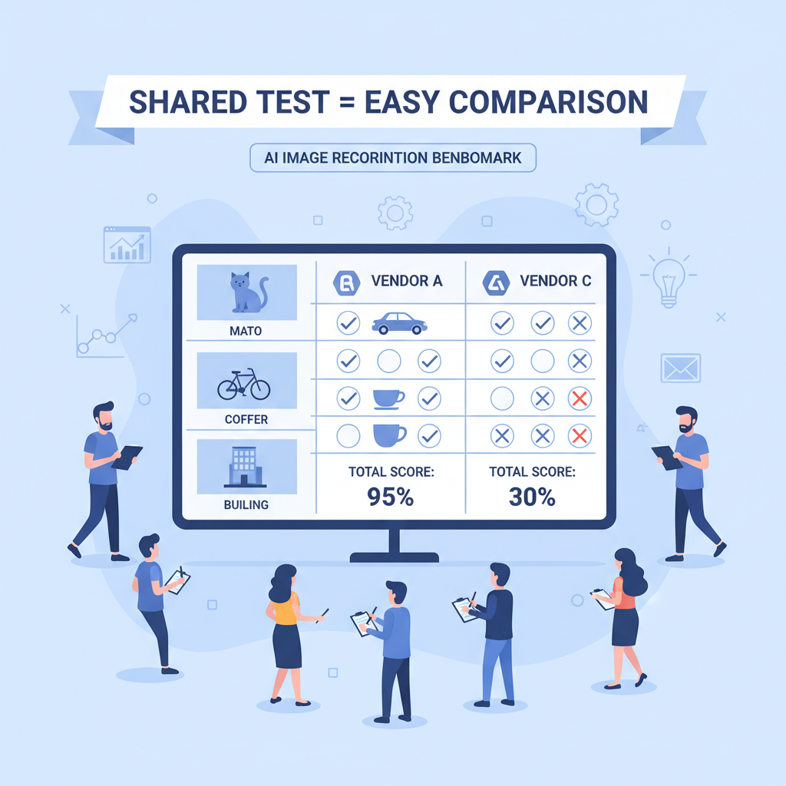
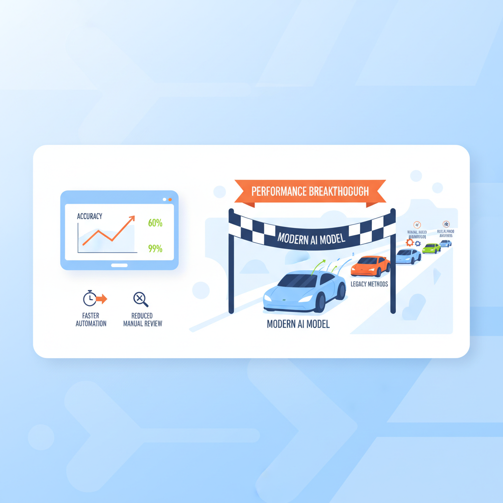
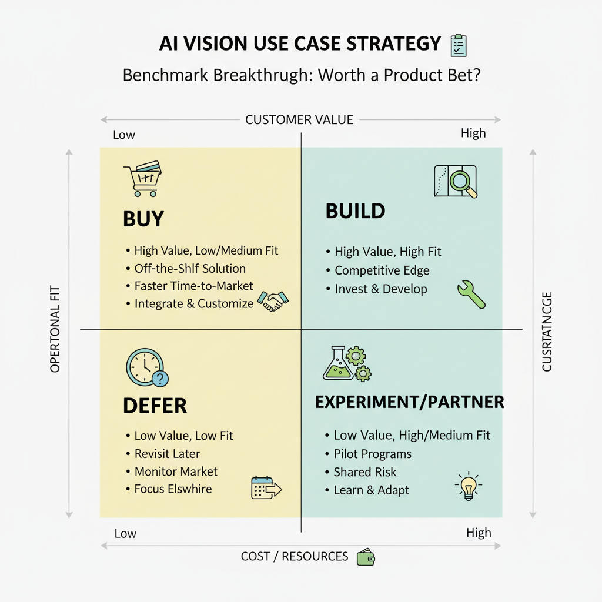

# What ImageNet and AlexNet Mean for Product Managers: The Breakthrough That Made Modern AI Visible

## Why ImageNet mattered to product strategy

Think of ImageNet like a **standardized tasting panel for AI** — instead of every team arguing over their own favorite recipe, everyone judges the same dish by the same rules. ImageNet was a **large labeled image dataset (a big collection of pictures with the correct answer attached)** that made visual AI measurable and comparable.

That shift mattered because product conversations changed from **“does it work?”** to **“how much better is it than the alternative?”** When a benchmark (a shared test that compares systems) exists, your roadmap debate becomes more concrete: should we build, buy, or wait for the next model? It also helps with vendor selection, because two computer vision tools that both say “accurate” can now be compared on the same yardstick.

**This means your team can make faster, less political decisions.** If a model wins on the benchmark but fails on your use case, you know the gap is your product context, not vague AI hype. The business trade-off is that benchmarks can steer investment toward measurable progress, but they can also tempt teams to optimize for the test instead of the customer.

Scale and label quality matter here. A huge dataset with noisy labels is like training a sales team on bad CRM data: the numbers look real, but the decisions get shaky. **Shared metrics can accelerate category maturity**, because they give the whole market a common language for quality, cost, and prioritization.

*ImageNet gave teams a common yardstick for comparing computer vision systems.*

## What AlexNet changed, in product terms

Think of **AlexNet like a car suddenly winning a race by a huge margin** after years of everyone assuming the field was already near its limit. It beat older image-recognition approaches by a wide margin, which signaled that **deep learning (machine learning with many stacked layers)** could deliver a step-change in quality, not just small incremental gains. For PMs, the important part was not the math — it was the message: **AI could improve fast enough to change product strategy, not just support experiments**.

AlexNet’s breakthrough mattered because higher accuracy changes the product surface area. **When models make fewer mistakes**, teams can remove manual review steps, automate more workflows, and ship features that would have felt too risky before. Think of **Google Photos** getting better at sorting people and places, or **Netflix-style recommendation systems** becoming more useful because the system can recognize patterns more reliably. That means your team can move from “AI as a demo” to **AI as a feature users depend on**.

> **💡 What this means for you as a PM**
> AlexNet showed that a big jump in model quality can unlock entirely new product bets. That affects roadmap planning because you may be able to replace a human-heavy workflow with software, or launch a premium AI feature that was previously too error-prone. It also changes investment decisions: better accuracy can justify a bigger bet, but only if the business value outweighs the extra compute cost (the extra processing power and infrastructure spend).

The trade-off is that **better accuracy often requires more compute (more expensive machine processing)**. In product terms, that affects launch plans, margins, and speed to market: a model that is 10% better but 10x more expensive may be a bad default for a free consumer product, but a great fit for a high-value enterprise workflow. The business question is not “Can we build it?” but **“Where does the quality gain pay for the cost?”**

*AlexNet represented a step-change in model quality, not just a small improvement.*

AlexNet was the moment many teams realized machine learning could move from **“nice demo” to core capability**. That shift changes how you think about roadmap sequencing: not just adding AI to impress users, but using AI to make the product meaningfully faster, smarter, and harder to copy.

## The business case: ROI, cost, and operating trade-offs

Think of computer vision like adding a very sharp new employee to a retail or logistics team: **it can spot things faster than humans, but only if the training, supervision, and payroll make sense**. In the ImageNet and AlexNet era, the big lesson was not just that machines got better at seeing; it was that better vision could unlock real business value in places like product tagging, quality checks, and search if the economics worked.

The first ROI question is simple: **where does accuracy turn into money or time saved?** For example, a marketplace like Amazon or Etsy can use vision to auto-tag products, which reduces manual catalog work and improves search relevance. A delivery app like Uber Eats or Instacart can use vision to verify item counts or packaging issues, which lowers support tickets and refund costs. If a model saves ten minutes per case but the volume is low, the win is modest; if it saves one minute across millions of cases, the payoff can be large.

The business trade-off is that **a “better” model can still be a bad product decision**. You pay for data labeling (people manually marking examples), training compute (the processing power needed to teach the model), inference latency (how long it takes to make a prediction), and ongoing maintenance (the work to keep it accurate as products and user behavior change). If a model is accurate but slow, it may hurt checkout flow or driver workflows. If it needs constant retraining, it can become a hidden operating expense that eats the margin.

> **💡 What this means for you as a PM**
> A great model only matters if the business can afford to ship, run, and scale it profitably. This affects your roadmap because you should prioritize vision use cases with clear economic levers: fewer refunds, faster ops, higher conversion, or premium features. It also means leadership needs to see both the experiment cost and the long-term operating cost before greenlighting a rollout.

When deciding whether to **build, buy, or defer**, use the following lens:
- **Build** when the use case is strategic and your data is unique.
- **Buy** when the capability is generic and speed matters more than differentiation.
- **Defer** when the workflow is not high volume, the error cost is unclear, or the team cannot support ongoing model upkeep.

Set expectations early that **experimentation is a learning expense, not a one-time feature cost**. A small pilot may be cheap, but production support, edge cases, and model drift can raise the total cost of ownership over time. The right conversation with leadership is not “Can we make it work?” but “Can we make it work at a unit cost the business can live with?”

## Real-world product examples and what PMs can learn from them

Think of the ImageNet breakthrough like adding **a much better librarian to a messy photo archive** — suddenly, pictures of beaches, dogs, receipts, and screenshots become easier to find, label, and act on. In consumer photo apps, better image recognition (software that identifies what is in a picture) made features like automatic tagging, album grouping, and smart search feel magical instead of manual. A user who could search “birthday cake” or “yellow taxi” and actually get useful results was much more likely to trust the product and keep using it.

A similar pattern showed up in **accessibility, moderation, and search**. For accessibility (helping people use products more easily), stronger vision models (software that understands images) could generate better descriptions for screen readers, making photo sharing more inclusive. For moderation (reviewing content to keep it safe), faster and more accurate detection of unwanted images reduced manual review load and improved response time. In search experiences, image tagging made it easier to index visual content, which helped users find the right item faster in products like retail catalogs or photo libraries.

> **💡 What this means for you as a PM**  
> The winners were usually teams that turned model gains into one narrow, valuable workflow first. That means your roadmap should start with a single high-frequency user pain point — like “find this photo,” “flag this image,” or “describe this screen” — before trying to redesign the whole experience. It also means you can use a clear accuracy lift to justify investment, but you should measure the product outcome, not just the model score.

The business trade-off is that **early adopters captured value by automating one step before expanding**. A team that improved photo tagging could prove retention gains, then broaden into search, recommendations, or sharing. This helped them differentiate against slower competitors because the feature felt concrete, not experimental.

The risk is **overpromising on benchmarks**. Better model performance in a lab does not guarantee end-to-end product success if the UI is clumsy, the labels are wrong, or users do not trust the output. When this goes wrong, you’ll see it as low adoption, repeated corrections, and a feature that looks impressive in demos but fails in real usage.

## What PMs should ask before betting on a vision model

Think of a vision model like a new camera lens: **sharper images only matter if they help someone take better pictures, not just prettier test shots**. A benchmark breakthrough like ImageNet plus AlexNet (a famous image-recognition leap that proved deep learning could outperform older methods) is a signal, not a product plan. The real PM question is whether better accuracy changes a user outcome you care about.

Before you invest, ask **what problem gets better if accuracy rises**. Does it improve discovery, automation, safety, speed, or trust? For example, a retail app like Amazon may use image recognition to help users search by photo, while a rideshare app like Uber might care more about safety checks than fancy classification.

> **The best PMs use benchmark breakthroughs as input, not as permission to skip product validation.**
> **💡 What this means for you as a PM**
> A model can be impressive in a lab and still miss the customer problem in production. Your roadmap should only shift if the improvement moves a real KPI, like conversion, review time, or error reduction. Otherwise, you risk funding a science project instead of a product win.

Next, check **whether the dataset reflects your customer reality**. A model trained on clean benchmark images may struggle with blurry storefront photos, low-light restaurant menus, or messy user uploads. This affects your roadmap because the business trade-off is not just accuracy versus speed; it is also relevance versus false confidence.

Then test the **operational fit**. Can the model meet latency (response speed), cost (compute spend), and reliability (how often it fails) needs for the actual product surface? A feature inside a chat assistant can tolerate more delay than a live fraud screen, and that changes the investment case.

Finally, define **launch criteria** and cross-team dependencies early. What is “good enough” for a limited rollout versus general release? Make sure product, design, legal, support, and go-to-market all agree, because when this goes wrong, you will see it as user confusion, compliance risk, or support load—not just lower model scores.

## Why ImageNet and AlexNet still matter today

Think of **ImageNet plus AlexNet** like a new highway opening between “what AI could see” and “what products could do.” **ImageNet** was a large labeled image dataset (a big set of images with human-provided answers), and **AlexNet** was a breakthrough deep learning model (a pattern-finding system that learned from data in a much stronger way than earlier methods). Together, they showed that **better data plus better models can turn AI from a demo into a product platform**.

This history still matters because **competitive advantage often appears when a technical leap changes cost, speed, or scope**. When a model gets much better, teams can serve more users with less manual work, unlock new use cases, and build features that were previously too expensive or unreliable. That affects your roadmap because the right timing is not “use AI everywhere,” but “adopt it where it creates leverage.”

*PMs should evaluate AI bets by customer value, cost, and operational fit — not benchmark score alone.*

> **💡 What this means for you as a PM**
> Historical AI breakthroughs matter because they change what becomes economically and strategically possible for products.  
> Watch for shifts that make a feature cheaper to run, easier to scale, or reliable enough for mainstream users. The business trade-off is to move early when the upside is large, but stay disciplined by tying every AI bet to clear customer value and a repeatable outcome.

A simple rule for future AI shifts: **benchmark gains only matter when they translate into repeatable product outcomes**. If a model is 20% better in a lab but does not improve conversion, retention, support cost, or launch speed, it is not a real product advantage. PMs should look for the moment when a technical leap turns into something customers feel and the business can measure.

---

## 📚 Further Reading

*This blog was written from the model's training knowledge. No external sources were retrieved during generation. For further reading, search for the topic on [Lenny's Newsletter](https://www.lennysnewsletter.com), [Reforge](https://www.reforge.com/blog), or [Mind the Product](https://www.mindtheproduct.com).*
