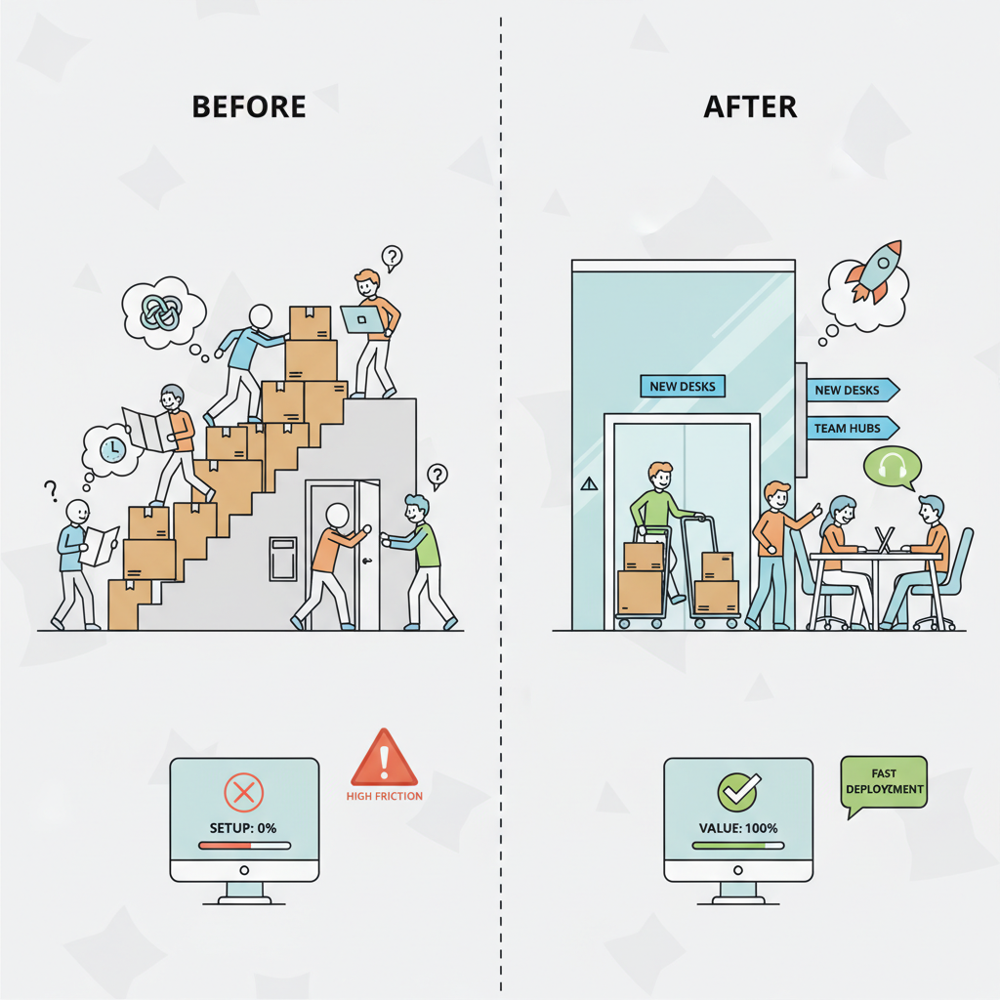
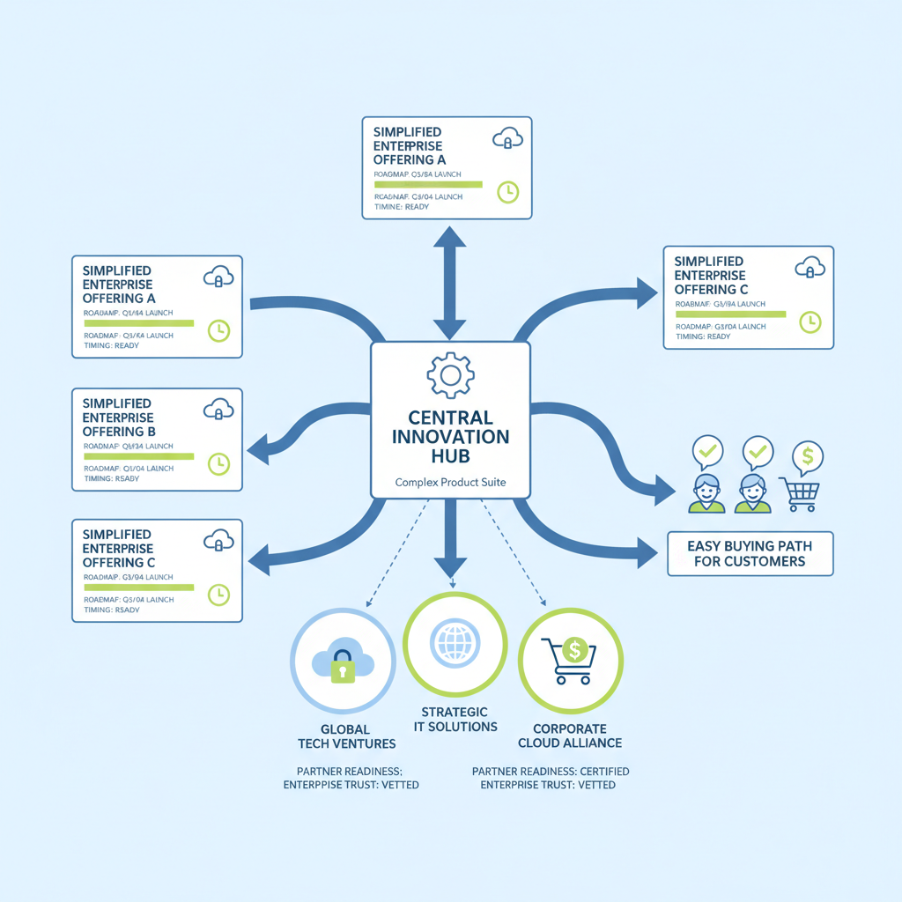
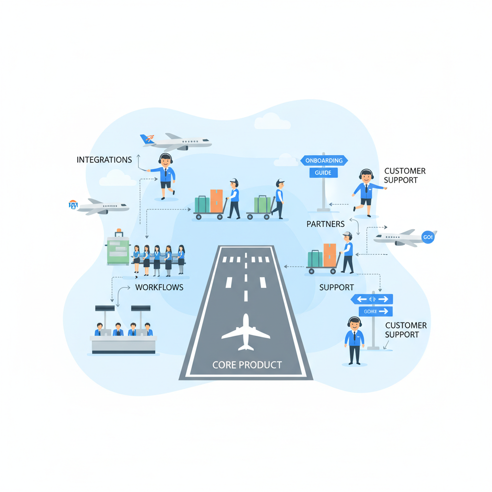

# What Product Managers Can Learn from NVIDIA’s Proactive Playbook

## Why NVIDIA’s Proactive Strategy Matters for PMs

Think of **proactive product strategy** like widening a highway before rush hour, not after the traffic jam has already formed. NVIDIA’s edge is that it often builds for the next bottleneck first, so when demand shows up, the market can move faster because the friction is already gone.

In product terms, **proactive** means investing in the next wave of demand instead of only reacting to today’s feature requests. That changes roadmap prioritization because customers may not ask for the full solution yet; they usually ask for the symptom, not the scaling problem underneath it. For a platform company like NVIDIA, this is how you **shape the market** (influence what becomes possible and standard) rather than just serve it.

When this goes right, **your team can remove future friction early** — like making AI systems easier to deploy before enterprise buyers fully understand the operational burden. That affects your roadmap because you may fund boring-sounding infrastructure, integrations, or tooling before they look urgent.

> **💡 What this means for you as a PM**
> PMs who anticipate the next bottleneck can shape demand instead of chasing it.  
> This means your roadmap should include the pain that will matter at scale, not just the pain that is visible today. The business trade-off is spending earlier on capabilities customers haven’t fully named yet, in exchange for stronger adoption, lower churn, and a position that competitors have to catch up to later.

## How NVIDIA Turns Foresight into Product Bets

Think of NVIDIA’s strategy like **a retailer announcing next season’s collection early**: customers, suppliers, and store teams all adjust because they trust the signal. NVIDIA uses the same playbook with **roadmap cadence (a predictable schedule for what’s coming next)**, especially around launches like Blackwell and its annual GTC updates, to show that the next wave is already in motion. That reduces buyer uncertainty, helps partners prepare, and makes the market feel less like a gamble and more like a plan.  

**Roadmap messaging is not just marketing; it is product strategy.** When NVIDIA signals a clear sequence of upgrades, it gives enterprise buyers a reason to keep investing, gives ecosystem partners time to align their offerings, and gives internal teams a shared target. This affects your roadmap because cadence itself becomes part of the product promise: if you miss it, trust erodes; if you hit it consistently, adoption gets easier.  

> **💡 What this means for you as a PM**  
> Clear roadmaps and ecosystem signals can de-risk adoption before a product even ships. If you’re launching a platform or a major feature, your job is not only to define the product—it’s to package the adoption path, prepare partners, and reduce the customer’s “what happens next?” anxiety. The business trade-off is **commitment versus flexibility**: publish too early and you may lock yourself in; wait too long and buyers may not plan around you.  

The most important lesson is that **the platform is part of the product**. In PM terms, packaging, migration paths, partner readiness, and integration support are not afterthoughts—they are what make the core offer usable at scale. When this goes wrong, you’ll see it as stalled pilots, confused partners, and customers choosing a more predictable competitor like AWS or Microsoft instead.

## The Business Impact: Why Proactive Platforms Win on ROI

Think of **adoption friction** like moving into a new office building: if the elevators, wiring, and meeting rooms are already in place, tenants sign faster and stay longer. In enterprise products, NVIDIA’s proactive platform strategy does the same thing by reducing the hidden setup work customers must do before they see value. That matters because buyers rarely pay for features in isolation — they pay for **time to value** (how quickly the product starts delivering results) and lower total cost of adoption.

When a platform includes tooling, reference architectures (prebuilt blueprints for deployment), and partner support, your team can shrink integration effort (the time and money needed to connect a product to the rest of the customer’s stack). NVIDIA has been pushing easier enterprise AI adoption through more complete packaging and ecosystem support, which is exactly the kind of move that helps large accounts standardize faster ([Source](https://www.channelinsider.com/news-and-trends/nvidia-powers-easier-enterprise-ai-adoption)). This means your roadmap should optimize for “first successful rollout,” not just feature count.

**The ROI logic is straightforward:** investing ahead of demand can look expensive early, but it can pay back through platform lock-in (customers building their workflows around you), recurring usage (repeat consumption over time), and expansion revenue (more spend as adoption spreads). NVIDIA’s enterprise positioning has been discussed in the context of AI becoming infrastructure, not a one-off experiment, which is why platform breadth can justify upfront investment ([Source](https://www.bain.com/insights/nvidia-gtc-2025-ai-matures-into-enterprise-infrastructure)).

*Reducing adoption friction is what turns a strong product into a scalable platform.*

> **💡 What this means for you as a PM**
> If you can cut adoption friction, you can often win bigger deals and defend pricing power. The business trade-off is real: subsidizing onboarding with tooling, integrations, or reference designs can ضغط margins in the short term, but it can also raise switching costs and accelerate standardization. For roadmap planning, that means measuring success by deployment speed, expansion rate, and renewal risk — not just launch velocity.

When this goes wrong, you’ll see it as stalled pilots, long sales cycles, and “great demo, no rollout” outcomes. The best PMs use proactive platform investments to make the customer’s first win easy, then convert that easy win into a company-wide standard.

## Real-World Examples: What NVIDIA’s Partnerships and Products Signal

Think of NVIDIA less like a component supplier and more like a **market organizer**: instead of waiting for enterprise buyers to stitch everything together, it keeps packaging the path to adoption into something easier to trust and purchase. At GTC 2025, NVIDIA used the event to shape expectations around its annual roadmap and said Blackwell had entered full production, which is a strong signal that customers can plan around a clear delivery timeline rather than a moving target ([NVIDIA Blog](https://blogs.nvidia.com/blog/nvidia-keynote-at-gtc-2025-ai-news-live-updates)). **This matters because predictable roadmaps reduce buyer hesitation** in categories where delay is expensive and switching later is even harder.

Bain’s read on GTC 2025 is that NVIDIA is turning AI into **enterprise infrastructure** (something companies can buy, deploy, and govern like cloud software instead of a science project), especially through DGX Cloud and NIM ([Bain & Company](https://www.bain.com/insights/nvidia-gtc-2025-ai-matures-into-enterprise-infrastructure)). DGX Cloud and NIM are examples of **packaging complexity into simpler products** (bundling hard-to-manage infrastructure into easier-to-consume offerings), which lowers the barrier for teams that want outcomes without building everything themselves. **This means your team can learn to sell the outcome, not the machinery**: enterprises often do not want “AI infrastructure,” they want faster support, better search, or lower operational toil.

*Platforms win when complexity is packaged into an easier buying path.*

> **💡 What this means for you as a PM**
> Partnerships and simplified packaging can turn a complex technology into something enterprises are ready to buy.
> Your roadmap should include not just features, but the buying path: procurement, deployment, compliance, and support. If you remove those fears, you shorten sales cycles and expand your addressable market.

Channel Insider also highlights NVIDIA’s distribution strategy through partners like Dell, HPE, IBM, and RTX Pro Servers, showing how incumbents can become trusted routes to market for complex enterprise offerings ([Channel Insider](https://www.channelinsider.com/news-and-trends/nvidia-powers-easier-enterprise-ai-adoption)). **The business trade-off is clear**: you may give up some control and margin to partners, but you gain reach, credibility, and faster adoption inside large organizations. For PMs, the lesson is to think beyond direct demand generation and ask: **which partner already owns the customer relationship, the budget, or the deployment muscle?**

## The PM Lesson: Build the Ecosystem, Not Just the Feature

Think of it like opening a new airport: **a great runway is useless if airlines, baggage handlers, and traffic routes aren’t ready**. That’s the NVIDIA lesson for PMs—winning products rarely win on core capability alone; they win when the surrounding ecosystem is ready to adopt them.

Great PMs design for **ecosystem fit** by asking whether integrations, partners, and everyday workflows are in place. For example, a new AI workflow in a tool like Google Workspace or Salesforce is easier to adopt if it plugs into existing admin controls, data sources, and support processes. That affects your roadmap because the business trade-off is often between shipping one more feature and shipping the connectors, templates, or partner support that make the feature actually usable.

*Great products need the surrounding ecosystem to be ready, not just the core feature.*

> **💡 What this means for you as a PM**  
> Winning products often succeed because the surrounding ecosystem is ready, not just the core feature. This means your team should decide earlier whether to build, partner, or standardize around a new category, instead of treating launch as the finish line. It also means investing in documentation, reference designs (ready-made examples), and predictable launch timing so customers and operators feel safe adopting the product.  

The strongest proactive PMs align **engineering, sales, finance, and partners** around a shared market thesis (a belief about where the market is heading). When NVIDIA moves, it is not just shipping a product—it is helping the market understand what the next standard should look like. That’s how you turn customer trust into a platform advantage: **make adoption feel less risky than standing still**.

## Where PMs Can Go Wrong When Copying NVIDIA’s Playbook

Think of **building like NVIDIA as planting a forest before the rain comes**: the winners are the teams that are ready when the market finally shifts, not the ones that built the biggest barn too early. **The trap is overcommitting** to a future scenario before customers, budgets, and adoption curves are actually there.

> **💡 What this means for you as a PM**
> Being proactive only works when you balance conviction with evidence and stage-gated investment.
> This means your team can absolutely lead the market—but only if each bigger bet earns its right to exist. If you scale too early, you risk burning roadmap capacity on features nobody can adopt yet, or building a platform that looks impressive but doesn’t convert into usage, revenue, or retention.

A common mistake is confusing **brand strength with product-market fit** (real customer demand in a specific category). A company like NVIDIA can sometimes pull attention into a new space, but **attention is not the same as repeatable demand**. For PMs, this affects your roadmap because a strong brand may get early trials, but it does not guarantee that a new product will survive once novelty wears off.

The better move is **small bets, staged commitments, and clear leading indicators** (early signals like activation, repeat use, partner pull, or conversion). This means your team can test whether the market is actually moving before you lock in headcount, launch scope, or platform investment. **The business trade-off is speed versus waste**: be early on category-shaping moves, but only scale what proves it can carry real customer and business outcomes.

---

## 📚 Further Reading

The following sources were retrieved and used during research for this blog. All links are verified — none are invented.

1. **[[Product Hunt] Google Antigravity CLI - Run coding agents directly from your terminal](https://www.producthunt.com/products/google-antigravity?utm_campaign=producthunt-api&utm_medium=api-v2&utm_source=Application%3A+Claude+MCP+Server+%28ID%3A+234160%29)** · *Product Hunt* · 2026-05-23
   > Antigravity CLI brings multi-step reasoning, multi-file editing, tool calling, and persistent history to the terminal....

2. **[[Product Hunt] Memdex - Turn every AI conversation into reusable local memory](https://www.producthunt.com/products/memdex?utm_campaign=producthunt-api&utm_medium=api-v2&utm_source=Application%3A+Claude+MCP+Server+%28ID%3A+234160%29)** · *Product Hunt* · 2026-05-23
   > Chrome extension that captures AI chats locally and lets you reuse context in later prompts....

3. **[NVIDIA Announces Financial Results for Second Quarter Fiscal 2026](https://nvidianews.nvidia.com/news/nvidia-announces-financial-results-for-second-quarter-fiscal-2026)** · *NVIDIA Newsroom*
   > NVIDIA reported Q2 FY26 revenue of $46.7B, up 56% year over year; Blackwell Data Center revenue grew 17% sequentially....

4. **[GTC 2025 – Announcements and Live Updates - NVIDIA Blog](https://blogs.nvidia.com/blog/nvidia-keynote-at-gtc-2025-ai-news-live-updates)** · *NVIDIA Blog*
   > NVIDIA said Blackwell is in full production and highlighted annual roadmaps, AI factory infrastructure, and new partnerships....

5. **[Nvidia GTC 2025: AI Matures into Enterprise Infrastructure | Bain & Company](https://www.bain.com/insights/nvidia-gtc-2025-ai-matures-into-enterprise-infrastructure)** · *Bain & Company*
   > Bain says off-the-shelf tools like DGX Cloud and NIM are lowering barriers to enterprise AI adoption....

6. **[NVIDIA Powers Easier Enterprise AI Adoption](https://www.channelinsider.com/news-and-trends/nvidia-powers-easier-enterprise-ai-adoption)** · *Channel Insider* · 2025-05-22
   > NVIDIA is partnering with Dell, HPE, IBM and others to simplify enterprise AI adoption with RTX Pro Servers....

7. **[Considering Nvidia’s Partnerships Push in Bid for Dominance](https://techpolicy.press/considering-nvidias-partnerships-push-in-bid-for-dominance)** · *Tech Policy Press* · 2025-12-16
   > Analysis of NVIDIA's GTC 2025 partnerships across Google DeepMind, Disney Research, EPRI, Oracle, Yum Brands and automakers....

8. **[NVIDIA Product Manager Interview Guide 2026 - Dataford](https://dataford.io/interview-guides/nvidia/product-manager)** · *Dataford*
   > PM interview guide covering scenario questions, product sense, strategy, leadership, and technical screens at NVIDIA....

